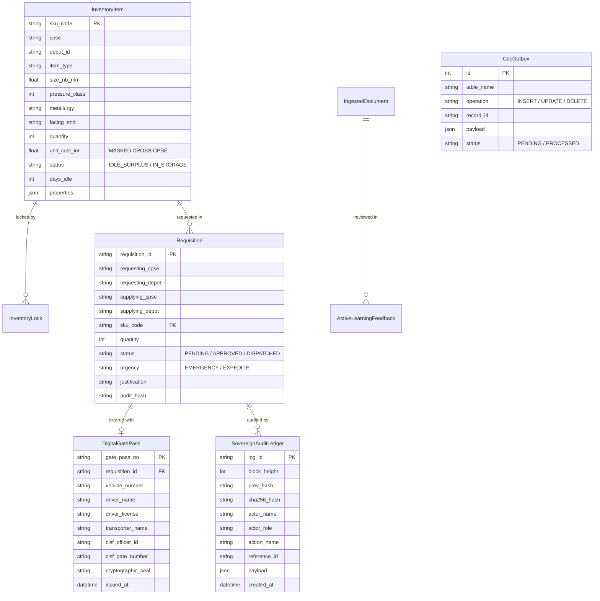
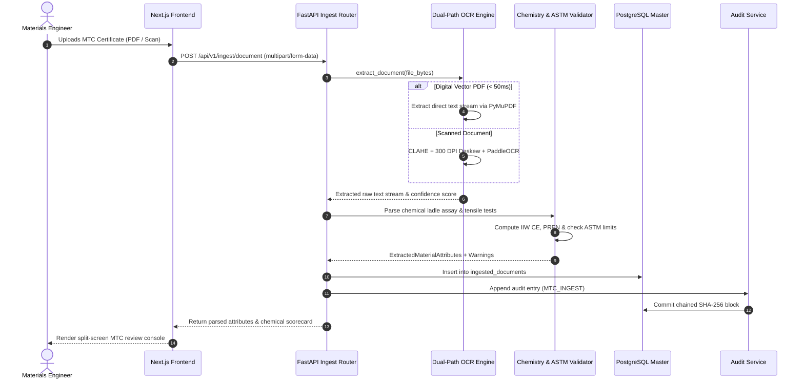
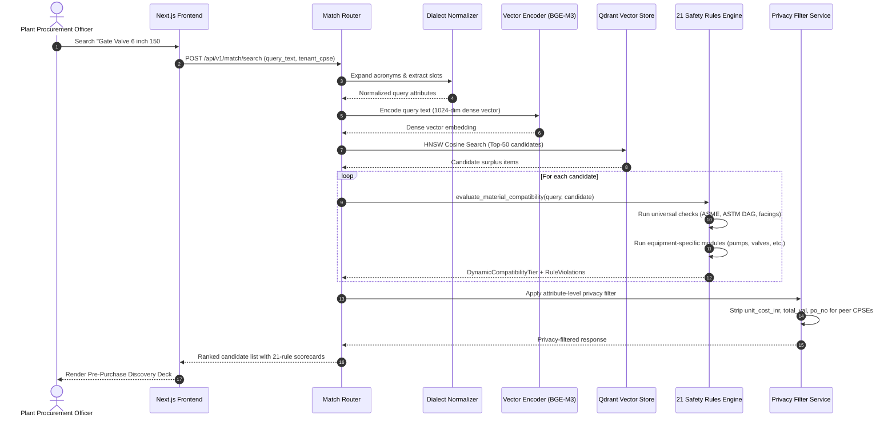
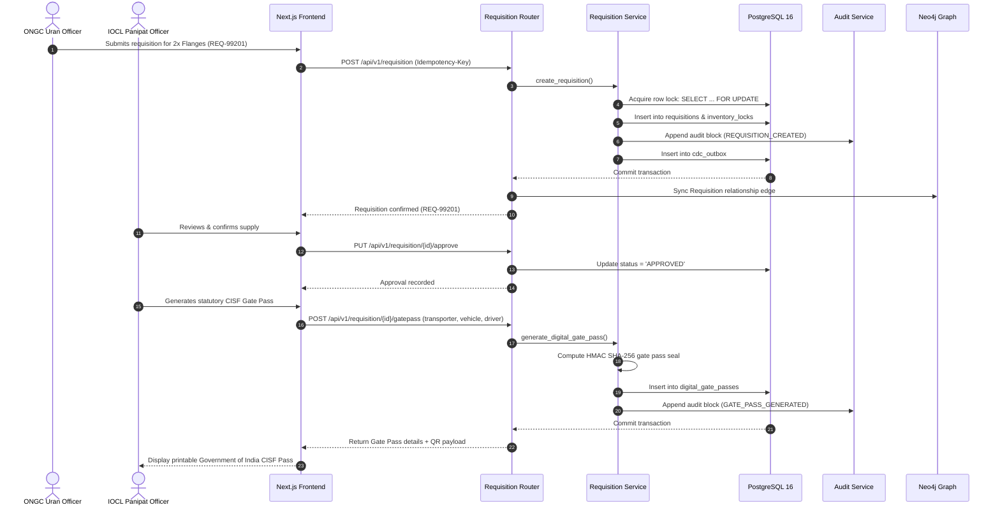

# Samanvay-AI: System Architecture & Technical Specification
### Sovereign Cross-CPSE Spare Parts Interoperability & Mutual Aid Mesh
**Ministry of Petroleum & Natural Gas (MoPNG) | Smart India Hackathon (SIH26099)**

---

## 1. Architectural Mission, Context & Principles

### 1.1 Context & Problem Statement
India's 5 major public sector oil, gas, and petrochemical enterprises—**Indian Oil Corporation Limited (IOCL)**, **Oil and Natural Gas Corporation (ONGC)**, **Bharat Petroleum Corporation Limited (BPCL)**, **Hindustan Petroleum Corporation Limited (HPCL)**, and **GAIL (India) Limited**—operate massive critical infrastructure spanning upstream offshore platforms, cross-country transmission pipelines, crude refineries, and petrochemical complexes.

Across these enterprises, more than **₹12,000–15,000 Crore** worth of critical engineering spares and MRO (Maintenance, Repair, Operations) items sit dormant in regional storehouses. Concurrently, unplanned plant shutdowns and emergency unit trips incur catastrophic losses of **₹5–20 Crore per day** due to 6–18 month OEM procurement lead times for long-lead items (special alloy valves, forged flanges, turbine rotors, and heavy pumps).

### 1.2 The Five Non-Negotiable Invariants

Samanvay-AI is engineered around five fundamental, non-negotiable architectural invariants:

```
┌──────────────────────────────────────────────────────────────────────────────────┐
│                           THE 5 ARCHITECTURAL INVARIANTS                         │
├──────────────────────────────────────────────────────────────────────────────────┤
│                                                                                  │
│  1. ZERO STATIC TIER ASSIGNMENT                                                  │
│     Compatibility is NEVER an intrinsic property of a spare part. Tiers are      │
│     computed dynamically at runtime relative to query requirement Q and          │
│     candidate C: S(Q, C).                                                        │
│                                                                                  │
│  2. HARD SAFETY GATE (AI CANNOT OVERRIDE PHYSICS)                                │
│     Vector similarities and XGBoost rankers only suggest candidates. The 21      │
│     deterministic safety modules have unilateral veto power. If any zero-        │
│     tolerance rule fails, the candidate is unconditionally forced to Tier 3      │
│     (score <= 0.74, strictly incompatible).                                      │
│                                                                                  │
│  3. SOVEREIGN ATTRIBUTE-LEVEL PRIVACY                                            │
│     Commercial procurement costs (unit_cost_inr, total_value_inr, po_no) are     │
│     strictly stripped across CPSE enterprise boundaries. Only the owning         │
│     enterprise sees financial valuations; peers see physical attributes only.    │
│                                                                                  │
│  4. AIR-GAPPED CRYPTOGRAPHIC SOVEREIGNTY                                         │
│     The entire system operates 100% offline without public cloud dependencies.   │
│     Audit trails use parent-linked SHA-256 digests; gate passes use self-        │
│     contained SVG QR codes with zero CDN dependencies.                           │
│                                                                                  │
│  5. ZERO ERP DISRUPTION                                                          │
│     Operates as a non-invasive sidecar to legacy enterprise ERPs (SAP S/4HANA,   │
│     Oracle ERP, Maximo) using CDC outbox streaming and standard RFC 4180 CSVs.   │
│                                                                                  │
└──────────────────────────────────────────────────────────────────────────────────┘
```

---

## 2. High-Level System Architecture

Samanvay-AI employs a layered, event-driven, micro-modular architecture designed for air-gapped sovereign deployment:

```
┌────────────────────────────────────────────────────────────────────────────────────────┐
│                                   PRESENTATION LAYER                                   │
│  Next.js 16 (React 19, Tailwind v4) · Executive Command Center · MTC Review Console    │
│  Plant Stock Ledger & HITL Diff Triage · Pre-Purchase Radar · CISF Gate Pass View      │
└───────────────────────────────────────────┬────────────────────────────────────────────┘
                                            │ HTTP / REST (JSON)
                                            ▼
┌────────────────────────────────────────────────────────────────────────────────────────┐
│                               FASTAPI GATEWAY & API ROUTERS                            │
│  /api/v1/match      │ /api/v1/ingest     │ /api/v1/inventory   │ /api/v1/requisition   │
│  /api/v1/graph      │ /api/v1/audit      │ Idempotency Filter  │ Tenant Auth Guard     │
└─────────────┬─────────────────────────────┴───────────────────────────────┬────────────┘
              │                                                             │
              ▼                                                             ▼
┌───────────────────────────────┐                             ┌───────────────────────────┐
│     MULTIMODAL ML PIPELINE    │                             │  TRANSACTIONAL CORE (ACID)│
│  ┌─────────────────────────┐  │                             │  ┌─────────────────────┐  │
│  │ Dual-Path OCR Engine    │  │                             │  │ PostgreSQL 16       │  │
│  │ PyMuPDF (<50ms) / OCR   │  │                             │  │ Pessimistic Locking │  │
│  └──────────┬──────────────┘  │                             │  │ InventoryLocks      │  │
│             ▼                 │                             │  │ SovereignAuditLedger│  │
│  ┌─────────────────────────┐  │                             │  │ CDCOutbox Events    │  │
│  │ Chemistry & CE Parser   │  │                             │  └──────────┬──────────┘  │
│  │IIW CE, PREN, ASTM limits│  │                             └─────────────┼─────────────┘
│  └──────────┬──────────────┘  │                                           │
│             ▼                 │                                           │ Listen / Notify
│  ┌─────────────────────────┐  │                                           ▼
│  │ Dialect Normalizer      │  │                             ┌───────────────────────────┐
│  │ IOCL/ONGC/SAP Acronyms  │  │                             │ CDC WORKER DAEMON         │
│  └──────────┬──────────────┘  │                             │ Asynchronous Replay Engine│
│             ▼                 │                             └─────────────┬─────────────┘
│  ┌─────────────────────────┐  │                                           │
│  │ BGE-M3 Dense Encoder    │  │                                           │ Cypher UNWIND
│  │ 1024-dim Vectorization  │  │                                           ▼
│  └──────────┬──────────────┘  │                             ┌───────────────────────────┐
│             ▼                 │                             │ NEO4J KNOWLEDGE GRAPH     │
│  ┌─────────────────────────┐  │                             │ Property Star Ontologies  │
│  │ Qdrant Vector Engine    │  │                             │ 19 CPSE Depots & Transit  │
│  │ HNSW Cosine Index       │  │                             │ Haversine + 1.28x Tort.   │
│  └──────────┬──────────────┘  │                             │ BEE Freight CO2 Savings   │
│             ▼                 │                             └───────────────────────────┘
│  ┌─────────────────────────┐  │
│  │ XGBoost Hybrid Ranker   │  │
│  │ Subvector Decomposition │  │
│  │ TreeSHAP Explainability │  │
│  └──────────┬──────────────┘  │
└─────────────┼─────────────────┘
              │ Top-50 Candidate Pairs
              ▼
┌────────────────────────────────────────────────────────────────────────────────────────┐
│                        DETERMINISTIC 21-RULE SAFETY ENGINE                             │
│  ┌───────────────────┐  ┌──────────────────┐  ┌──────────────────┐  ┌────────────────┐ │
│  │ ASME B16.5/B16.34 │  │ ASTM Met. DAG    │  │API 6D / 600 / 602│  │ NACE MR0175    │ │
│  │ Pressure Ladder   │  │ Cryogenic Brittle│  │ Piggable Bore    │  │ Sour Duty HRC  │ │
│  └───────────────────┘  └──────────────────┘  └──────────────────┘  └────────────────┘ │
│  ┌───────────────────┐  ┌──────────────────┐  ┌──────────────────┐  ┌────────────────┐ │
│  │ ASME B16.47       │  │ ASTM A193/A194   │  │ API 607 / 6FA    │  │ API 610 / 682  │ │
│  │ Series A vs B     │  │ LME Zinc Bolts   │  │ Fire-Safe Valves │  │ Pumps & Seals  │ │
│  └───────────────────┘  └──────────────────┘  └──────────────────┘  └────────────────┘ │
│  ┌───────────────────┐  ┌──────────────────┐  ┌──────────────────┐  ┌────────────────┐ │
│  │ ASME B16.20       │  │ ASME B36.10M     │  │ API 520 / 526    │  │ TEMA Exchangers│ │
│  │ SWG Inner Rings   │  │ Pipe Schedules   │  │ PSV Orifice Area │  │ API 2000 Tanks │ │
│  └───────────────────┘  └──────────────────┘  └──────────────────┘  └────────────────┘ │
│                                       │                                                │
│                                       ▼                                                │
│                         DYNAMIC COMPATIBILITY TIERS                                    │
│             Tier 1 (>= 95%)  │  Tier 2 (80 - 94%)  │  Tier 3 (<= 74%)                  │
└────────────────────────────────────────────────────────────────────────────────────────┘
```

---

## 3. Subsystem Deep Dives

### 3.1 Smart Document Intake & Dual-Path OCR Subsystem

The ingestion engine processes digital vendor MTCs, raster purchase invoices, and mill certificates through two parallel pipelines:

```
                       [ Uploaded Document ]
                                 │
                   Is Vector PDF with stream?
                                ╱ ╲
                              YES  NO
                              ╱     ╲
        [ FAST PATH: PyMuPDF ]       [ RASTER PATH: Preprocessing ]
        Direct text stream           300 DPI Normalization
        Throughput: < 50ms           CLAHE Contrast Enhancement
        Confidence: 1.0              Otsu Adaptive Binarization
                                     Deskewing Transformation
                                            │
                                     [ PaddleOCR / EasyOCR ]
                                            │
                                ┌───────────┴───────────┐
                                │ Chemical & Mechanical │
                                │ Table Boundary Parser │
                                └───────────┬───────────┘
                                            │
                                ┌───────────▼───────────┐
                                │ IIW Carbon Equivalent │
                                │ PREN & ASTM Validator │
                                └───────────────────────┘
```

#### International Institute of Welding (IIW) Carbon Equivalent:
$$CE_{\text{IIW}} = C + \frac{Mn}{6} + \frac{Cr + Mo + V}{5} + \frac{Ni + Cu}{15}$$
- **$CE \le 0.43\%$**: Standard weldable without preheating protocol.
- **$0.43\% < CE \le 0.48\%$**: Mandatory minimum $100^\circ\text{C}$ preheat per ASME Section IX.
- **$CE > 0.48\%$**: High cracking risk; mandates preheat and post-weld heat treatment (PWHT).

#### Pitting Resistance Equivalent Number (PREN):
$$\text{PREN} = \%Cr + 3.3(\%Mo) + 16(\%N)$$
- Used for evaluating austenitic stainless (SS316L $\ge 25$) and duplex steels (Duplex $2205 \ge 35$, Super Duplex $2507 \ge 42$) in marine and sour environments.

---

### 3.2 NLP, Dialect Normalization & Dense Embeddings

Public sector hydrocarbon catalogs are written in fragmented dialects:
- **IOCL Style**: Truncated imperial strings (`"FLG WNRF 4IN 300# A105 SCH 40"`).
- **ONGC Style**: Comma-delimited verbose specifications (`"FLANGE, WELDING NECK, 4 INCH, CLASS 300, ASTM A105, ASME B16.5, RF FACING"`).
- **Metric SAP Style**: European nominal sizing (`"FLG-WN-DN100-PN50-A105-RF"`).

#### Dialect Normalizer (`ml/ner/normalizer.py`):
1. **NFKC Unicode Normalization**: Unifies fractional unicode glyphs (e.g. `½` $\to$ `1/2`, `¾` $\to$ `3/4`).
2. **CPSE Dialect Thesaurus**: Maps 40+ acronyms to canonical engineering terms:
   - `VLV GT` $\to$ `GATE VALVE`
   - `WNRF` $\to$ `WELD NECK RAISED FACE`
   - `SMLS` $\to$ `SEAMLESS`
   - `TR8` $\to$ `TRIM 8`
3. **Regex Attribute Slot Tagger**: Extracts dimensions ($NB_{\text{mm}}$), pressure class, metallurgy grade, schedules, and facings.

#### Vector Encoding (`ml/embeddings/vector_encoder.py`):
Dense 1024-dimensional semantic embeddings are generated using **BAAI/bge-m3** with mean pooling and L2 normalization, indexed in **Qdrant** using an HNSW collection configured for cosine metric search.

---

### 3.3 Multi-Stage Ranking & Hybrid Scoring

The compatibility score between query part $Q$ and candidate part $C$ combines semantic vectors with physical subvector cosine metrics:

```
Total Candidate Feature Vector:
x = [ S_dim (R^6), S_met (R^13), S_pt (R^4), S_std (R^6), S_dense (1024-dim) ]
```

#### Scoring Formulation:
$$S_{\text{base}}(Q, C) = 0.40 \cdot S_{\text{dim}} + 0.30 \cdot S_{\text{met}} + 0.20 \cdot S_{\text{PT}} + 0.10 \cdot S_{\text{std}}$$

Where:
- $S_{\text{dim}}$: Nominal bore, outer diameter, wall thickness, bolt circle diameter parity.
- $S_{\text{met}}$: Metallurgical DAG distance and chemical composition overlap.
- $S_{\text{PT}}$: Pressure-temperature envelope containment.
- $S_{\text{std}}$: Manufacturing standard alignment (ASME, API, ASTM).

---

### 3.4 The 21 Codified Engineering Safety Modules

The deterministic rules engine (`rules/tolerance.py`) evaluates candidates against 21 codified mechanical standards.

```
┌────────────────────────────────────────────────────────────────────────────────────┐
│                    THE 21 CODIFIED ENGINEERING SAFETY MODULES                      │
├────────────────────────────────────────────────────────────────────────────────────┤
│                                                                                    │
│ 1. ASME B16.5 / B16.34: Pressure Class Ladder                                      │
│    - Down-rating is strictly prohibited (fatal rupture risk).                      │
│    - Higher class cannot mate to lower class without spool piece (bolt circle delta│
│                                                                                    │
│ 2. ASME B16.5: Flange Facing Finish                                                │
│    - Mating RF to RTJ without adapter ring is prohibited.                          │
│                                                                                    │
│ 3. ASME B31.3 Sec 312.2: Cast Iron Flange Fracture                                 │
│    - Prohibits mating steel Raised Face to cast iron Flat Face (ear cracking).     │
│                                                                                    │
│ 4. ASME B16.47: Large Flange Series Mismatch                                       │
│    - Series A (MSS SP-44) and Series B (API 605) bolt circles are incompatible.    │
│                                                                                    │
│ 5. ASME B16.20: Spiral Wound Gasket (SWG) Collapse                                 │
│    - Mandates solid inner rings on Class 900+ SWG to prevent radial winding implos.│
│                                                                                    │
│ 6. ASME B16.21: High-Temperature PTFE Extrusion                                    │
│    - Prohibits virgin PTFE gaskets > 260°C (thermal creep blowout).                │
│                                                                                    │
│ 7. ASME B16.20: RTJ Flange Groove Hardness Ratio                                   │
│    - Gasket metal MUST be softer than flange groove: H_gasket < H_flange.          │
│                                                                                    │
│ 8. ASME B16.48: Positive Isolation Line Blinds                                     │
│    - Prohibits uncalculated shop-cut steel plates; mandates ASME B16.48 blinds.    │
│                                                                                    │
│ 9. NACE SP0286: Flange Insulation Kit Bridging                                     │
│    - Prohibits Type F gaskets on bimetallic lines; mandates Type E full-face.      │
│                                                                                    │
│ 10. ASTM Metallurgy DAG: Upgrades & Cryogenic Brittle Fracture                     │
│     - Prohibits standard A105 in cryogenic duty (requires impact-tested A350 LF2). │
│     - Prohibits standard 316 in acid service (requires low-carbon 316L).           │
│                                                                                    │
│ 11. ASTM A193 / A194: Fastener Pairing & Liquid Metal Embrittlement (LME)          │
│     - Mandates stud/nut compatibility (A193 B7 with A194 2H).                      │
│     - Prohibits galvanized or cadmium-plated bolts > 200°C (LME grain cracking).   │
│                                                                                    │
│ 12. ASME B36.10M / B36.19M: Pipe Schedule Rating                                   │
│     - Down-scheduling is prohibited (burst hazard). Schedule upgrades permitted.   │
│                                                                                    │
│ 13. API 5L: PSL 1 vs PSL 2 Toughness & Category M Toxic Fluids                     │
│     - PSL 2 mandatory for gas transmission lines. Threaded joints banned in Cat M. │
│                                                                                    │
│ 14. NACE MR0175 / ISO 15156: Wet H2S Sour Service                                  │
│     - Maximum hardness ceiling: <= 22 HRC (187 HBW) to prevent SSC.                │
│                                                                                    │
│ 15. ASTM A269: Instrument Tubing Metric / Imperial Trap                            │
│     - Intermixing 12mm and 1/2" ferrules prohibited (fatal projectile blowout).    │
│                                                                                    │
│ 16. API 6D: Pipeline Piggable Full Bore Restriction                                │
│     - Reduced bore valves prohibited on operational transmission pipelines.        │
│                                                                                    │
│ 17. API 607 / API 6FA: Flammable Hydrocarbon Fire-Safe Certification               │
│     - Non-fire-safe soft-seated valves prohibited in hydrocarbon lines.            │
│                                                                                    │
│ 18. API 520 / API 526: PSV Orifice Discharge Area Sizing                           │
│     - Orifice discharge area must be >= required letter specification (D through T)│
│                                                                                    │
│ 19. ISO 4126-2 / UG-127: Rupture Disk Fragmenting Hazard                           │
│     - Fragmenting rupture disks prohibited directly upstream of PSVs.              │
│                                                                                    │
│ 20. API 600 / API 602: Valve Trim Ladder                                           │
│     - Prohibits downgrading hardfaced Stellite trims (Trim 5 / Trim 8 to Trim 1).  │
│                                                                                    │
│ 21. Rotating Equipment Rules: API 610, API 682, API 618, IS/IEC 60079              │
│     - API 610: OH2 centerline mounting mandatory for hydrocarbon pumping > 150°C.  │
│     - API 682: Mandates dual pressurized Plan 53 barrier seals in lethal service.  │
│     - API 618: Recip compressor suction/discharge valve inversion trap.            │
│     - ISO 15: C3 vs CN bearing radial clearance seizure trap.                      │
│     - IS/IEC 60079: Zone 1 flameproof Ex d motor enclosure mandate.                │
│                                                                                    │
└────────────────────────────────────────────────────────────────────────────────────┘
```

---

### 3.5 Dynamic Compatibility Tiers

Compatibility tiers are assigned dynamically:

$$\text{Tier}(Q, C) = \begin{cases}
\text{Tier 1 (Identical / Safe Over-rating)}, & \text{if } S(Q, C) \ge 0.95 \text{ and } \text{Violations} = \emptyset \\
\text{Tier 2 (Qualified Substitute)}, & \text{if } 0.80 \le S(Q, C) < 0.95 \text{ and } \text{HardViolations} = \emptyset \\
\text{Tier 3 (Incompatible / Fatal Trap)}, & \text{if } \text{HardViolations} \ne \emptyset \text{ or } S(Q, C) < 0.80
\end{cases}$$

> [!IMPORTANT]
> Any hard safety rule failure forces the composite score to $\le 0.74$, unconditionally overriding any ML model score and classifying the candidate as **Tier 3 (Incompatible)**.

---

### 3.6 Knowledge Graph & Logistics Topology Engine

The **Neo4j 5.20** knowledge graph models physical inventory assets across 19 public sector refinery and petrochemical depots:

```
(:CPSE {name: "IOCL"})
       │
       ▼ [:OPERATES]
(:Depot {id: "IOCL_PANIPAT", lat: 29.39, lon: 76.96})
       │
       ▼ [:HOLDS]
(:InventoryItem {sku: "IOCL-PNP-VLV-401", qty: 4, days_idle: 184})
       │
       ├──► [:HAS_SIZE]->(:Size {value: "150.0 mm"})
       ├──► [:HAS_PRESSURE_CLASS]->(:PressureClass {value: "150#"})
       └──► [:HAS_BODY_METALLURGY]->(:MaterialGrade {value: "WCB"})
              │
              ▼ [:ALLOY_UPGRADE_FOR]
            (:MaterialGrade {value: "A105"})
```

#### Logistics Distance & Road Tortuosity:
1. **Haversine Great-Circle Distance**:
   $$d = 2R \arcsin \left( \sqrt{ \sin^2\left(\frac{\Delta \phi}{2}\right) + \cos(\phi_1)\cos(\phi_2)\sin^2\left(\frac{\Delta \lambda}{2}\right) } \right)$$
   where $R = 6,371\text{ km}$.
2. **Indian Highway Tortuosity Factor**:
   $$d_{\text{road}} = 1.28 \times d_{\text{haversine}}$$
3. **Transit Time**:
   $$T_{\text{transit}} = \frac{d_{\text{road}}}{45.0\text{ km/h}} + 2.0\text{ hours border buffer}$$
4. **Freight Economics**:
   $$\text{Cost (INR)} = \max\left(₹3,500, \text{Weight (MT)} \times d_{\text{road}} \times ₹8.50/\text{t-km}\right)$$
5. **Bureau of Energy Efficiency (BEE) $CO_2$ Savings**:
   $$CO_2\text{ Saved (kg)} = d_{\text{road}} \times \text{Weight (MT)} \times 0.062\text{ kg } CO_2/\text{t-km}$$

---

### 3.7 Transactional Concurrency & Real-Time CDC Engine

#### Pessimistic Locking Workflow:
To prevent double-allocation of scarce surplus parts during emergency plant turnarounds, requisitions acquire exclusive row-level locks in PostgreSQL:

```sql
-- Step 1: Lock target inventory row
SELECT id, quantity, status 
FROM inventory_items 
WHERE sku_code = :sku_code 
FOR UPDATE;

-- Step 2: Validate available quantity
-- Step 3: Insert active lock record
INSERT INTO inventory_locks (lock_id, sku_code, locked_qty, expires_at)
VALUES (:lock_id, :sku_code, :req_qty, NOW() + INTERVAL '24 hours');
```

#### PostgreSQL Outbox Change Data Capture (CDC):
Database triggers capture all row mutations (`INSERT`, `UPDATE`, `DELETE`) on `inventory_items` and `requisitions` into the `cdc_outbox` table and emit a `NOTIFY samanvay_cdc_channel`. The CDC worker daemon consumes these events and updates Neo4j graph nodes and edges in real time.

---

### 3.8 Sovereign Cryptographic Audit Ledger & CISF Gate Pass

#### SHA-256 Chained Ledger Hashing:
Every state modification in Samanvay-AI generates an immutable audit block chained to its predecessor:

$$H_0 = \text{"0000000000000000000000000000000000000000000000000000000000000000"}$$
$$H_i = \text{SHA256}\left(H_{i-1} \parallel \text{block\_height} \parallel \text{actor\_id} \parallel \text{action} \parallel \text{timestamp} \parallel \text{payload\_json}\right)$$

Modifying any past block invalidates the hashes of all subsequent blocks, providing verifiable tamper detection during statutory audits.

#### Offline Air-Gapped CISF Gate Pass:
The CISF Digital Gate Pass (`frontend/src/components/QRCodeSVG.tsx`) renders a standalone 25x25 Version 2 QR code bit matrix directly in pure SVG without external JavaScript libraries or CDN requests. The QR payload encodes the material code, requisition reference, driver license, vehicle registration, and HMAC SHA-256 gate pass seal for offline security scanning at refinery security gates.

---

## 4. Database Entity-Relationship (ER) Architecture



---

## 5. Sequence Workflows

### 5.1 End-to-End MTC Intake & Ingestion



---

### 5.2 Pre-Purchase Semantic Discovery & 21-Rule Gate



---

### 5.3 Inter-CPSE Requisition & CISF Gate Pass Issuance



---

## 6. Security, Sovereign Privacy & Air-Gapped Governance

1. **Air-Gapped Operation**: Samanvay-AI is designed to operate on isolated, sovereign government intranets (NICNET / BharatNet) with zero external internet dependencies.
2. **Deterministic Cryptographic Verification**: Every database transaction links to the previous block hash ($H_{i-1}$), anchoring all operations in an immutable, cryptographically verifiable Merkle tree.
3. **Attribute-Level Commercial Privacy**: Enforced via FastAPI Pydantic response filters. Financial procurement figures are masked at the API layer for cross-CPSE requests, preventing commercial price leakage while maintaining physical interoperability.
4. **Offline SVG QR Pass Verification**: The CISF gate pass QR code contains self-contained cryptographic HMAC signatures, allowing gate sentries to verify authenticity using standard air-gapped barcode scanners without network access.
