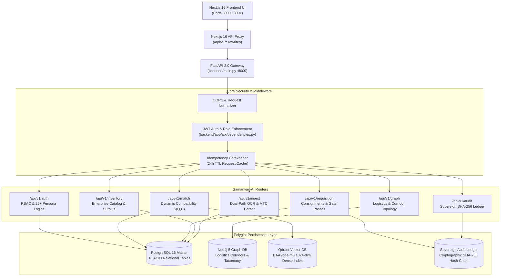
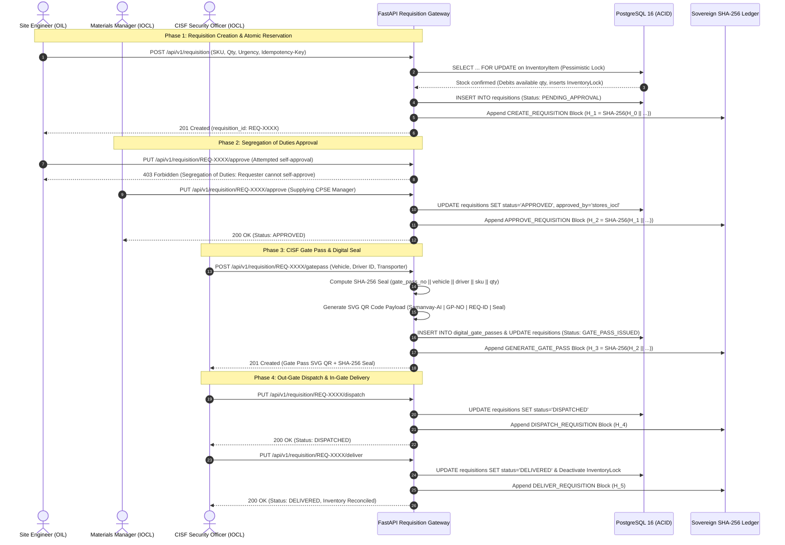

# Samanvay-AI Backend Service (`backend/`)

The `backend/` directory houses the core RESTful microservice API gateway powering **Samanvay-AI** (MoPNG SIH26099) — India's Sovereign AI-Powered Cross-CPSE Spare Parts Discovery, Compatibility Evaluation, and Inter-Enterprise Mutual Aid Transfer Platform.

Built with **FastAPI**, **SQLAlchemy 2.0 ORM**, **Pydantic v2**, and **PostgreSQL 16**, the backend operates as the central nervous system coordinating the air-gapped Machine Learning pipeline, the deterministic 21-rule engineering safety core, the Neo4j Knowledge Graph, real-time Change Data Capture (CDC), and the sovereign SHA-256 audit ledger.

---

## 1. System Architecture & Gateway Integration

In production and demo environments, the platform runs with a **Next.js 16 Standalone Reverse Proxy** fronting the FastAPI application:
- Next.js 16 (`frontend/`) listens on port `3000` (or `3001`).
- All requests targeting `/api/v1/*` are transparently rewritten to the high-performance FastAPI ASGI server on port `8000` (`http://localhost:8000/api/v1/*` or `http://samanvay-ai-backend:8000/api/v1/*`).
- FastAPI enforces CORS policies, parses multi-tenant enterprise headers, validates JWT bearer tokens, checks idempotency keys, and coordinates database transactions.



---

## 2. 7-CPSE Federation & Sovereign MoPNG Governance

The platform federates 7 major Indian Oil & Gas Central Public Sector Enterprises (CPSEs) under sovereign Ministry of Petroleum and Natural Gas (MoPNG) oversight:

| CPSE Code | Enterprise Name | Primary Hub / Depot Node | Geographical Focus |
|---|---|---|---|
| **OIL** | Oil India Limited | `DEPOT-OIL-DLJ` (Duliajan, Assam) | Exploration & Production, Northeast |
| **IOCL** | Indian Oil Corporation Limited | `DEPOT-IOCL-PNP` (Panipat Refinery, Haryana) | Refining & Petrochemicals, North |
| **ONGC** | Oil & Natural Gas Corporation | `DEPOT-ONGC-URN` (Uran Gas Plant, Maharashtra) | Offshore & Gas Processing, West |
| **BPCL** | Bharat Petroleum Corporation Limited | `DEPOT-BPCL-MUM` (Mumbai Mahul Refinery) | Refining & Distribution, Central/West |
| **HPCL** | Hindustan Petroleum Corporation Limited | `DEPOT-HPCL-VSK` (Visakh Refinery, Andhra Pradesh) | Coastal Refining, South/East |
| **GAIL** | GAIL (India) Limited | `DEPOT-GAIL-PAT` (Pata Petrochemical, Uttar Pradesh) | Natural Gas Grid & Petrochemicals |
| **NRL** | Numaligarh Refinery Limited | `DEPOT-NRL-NUM` (Numaligarh, Assam) | High-Wax Refining, Northeast |
| **MoPNG** | Ministry of Petroleum & Natural Gas | `CENTRAL` (Shastri Bhawan, New Delhi) | Sovereign Oversight, CVC/CAG Audit |

---

## 3. RBAC Persona Matrix: 25+ Pre-Configured Demo Accounts

Samanvay-AI implements strict Role-Based Access Control ([UserRole](file:///C:/Users/mayan/Development/Hackathons/Samanvay-AI/backend/app/schemas/auth.py#L10-L17)) backed by bcrypt password hashing and 24-hour JWT bearer tokens. All 25 seed accounts share the default master credential:

> **Default Seed Password:** `Samanvay@2026`

| Persona Username | Full Name | Enterprise | Assigned Role | Depot Identifier | Functional Role |
|---|---|---|---|---|---|
| `engineer_oil` | Er. Arindam Phukan | **OIL** | `SITE_ENGINEER` | `DEPOT-OIL-DLJ` | Requisition creation, emergency shutdown triage |
| `stores_oil` | Debojit Barua | **OIL** | `MATERIALS_MANAGER` | `DEPOT-OIL-DLJ` | Surplus declaration, requisition approval |
| `cisf_oil` | Insp. K. S. Rathore | **OIL** | `CISF_SECURITY` | `DEPOT-OIL-DLJ` | Out-gate/in-gate verification, digital gate pass |
| `engineer_iocl` | Er. Rajesh Sharma | **IOCL** | `SITE_ENGINEER` | `DEPOT-IOCL-PNP` | Refinery piping & valve requirements |
| `stores_iocl` | Vikramaditya Rao | **IOCL** | `MATERIALS_MANAGER` | `DEPOT-IOCL-PNP` | Panipat warehouse stock release |
| `cisf_iocl` | Insp. Devendra Malik | **IOCL** | `CISF_SECURITY` | `DEPOT-IOCL-PNP` | Panipat gate pass issuance & seal verification |
| `engineer_ongc` | Er. Pradeep Kulkarni | **ONGC** | `SITE_ENGINEER` | `DEPOT-ONGC-URN` | Offshore sour gas piping procurement |
| `stores_ongc` | Mahesh Tendulkar | **ONGC** | `MATERIALS_MANAGER` | `DEPOT-ONGC-URN` | Uran terminal inventory release |
| `cisf_ongc` | Insp. S. P. Gaikwad | **ONGC** | `CISF_SECURITY` | `DEPOT-ONGC-URN` | Uran perimeter security commander |
| `engineer_gail` | Er. Alok Srivastava | **GAIL** | `SITE_ENGINEER` | `DEPOT-GAIL-PAT` | Gas transmission grid line pipe orders |
| `stores_gail` | Rameshwar Dixit | **GAIL** | `MATERIALS_MANAGER` | `DEPOT-GAIL-PAT` | Pata petrochemical stores controller |
| `cisf_gail` | Insp. Harish Tewari | **GAIL** | `CISF_SECURITY` | `DEPOT-GAIL-PAT` | Dispatch gate inspector |
| `engineer_bpcl` | Er. Nitin Sawant | **BPCL** | `SITE_ENGINEER` | `DEPOT-BPCL-MUM` | Refinery turnaround maintenance lead |
| `stores_bpcl` | Sanjay Deshmukh | **BPCL** | `MATERIALS_MANAGER` | `DEPOT-BPCL-MUM` | Mumbai Mahul materials executive |
| `cisf_bpcl` | Insp. V. B. Jadhav | **BPCL** | `CISF_SECURITY` | `DEPOT-BPCL-MUM` | Mahul gate pass verification officer |
| `engineer_hpcl` | Er. K. V. Ramana | **HPCL** | `SITE_ENGINEER` | `DEPOT-HPCL-VSK` | Visakh process plant equipment lead |
| `stores_hpcl` | B. Satyanarayana | **HPCL** | `MATERIALS_MANAGER` | `DEPOT-HPCL-VSK` | Visakh stock ledger manager |
| `cisf_hpcl` | Insp. Ch. Appa Rao | **HPCL** | `CISF_SECURITY` | `DEPOT-HPCL-VSK` | Digital gate pass officer |
| `engineer_nrl` | Er. Bhaskar Gogoi | **NRL** | `SITE_ENGINEER` | `DEPOT-NRL-NUM` | Refinery expansion piping lead |
| `stores_nrl` | Monojit Saikia | **NRL** | `MATERIALS_MANAGER` | `DEPOT-NRL-NUM` | Numaligarh inventory controller |
| `cisf_nrl` | Insp. T. K. Bora | **NRL** | `CISF_SECURITY` | `DEPOT-NRL-NUM` | Main gate security inspector |
| `tech_authority` | Dr. Ananya Sen | **OIL** | `TECHNICAL_AUTHORITY` | `DEPOT-OIL-DLJ` | Chief Metallurgist & HITL Triage Authority |
| `cisf_officer` | Insp. K. S. Rathore | **OIL** | `CISF_SECURITY` | `DEPOT-OIL-DLJ` | CISF Out-Gate Dispatch Inspector (Alias) |
| `auditor` | Sunil K. Verma | **MoPNG** | `VIGILANCE_AUDITOR` | `CENTRAL` | Chief Vigilance Officer & CAG Statutory Auditor |
| `admin` | Samanvay Admin | **MoPNG** | `SUPER_ADMIN` | `CENTRAL` | Sovereign Ministry System Administrator |

---

## 4. Core Engineering & Governance Mandates

### A. Multi-Tenant Consignment Isolation
Implemented via [`list_requisitions_for_user(db, user)`](file:///C:/Users/mayan/Development/Hackathons/Samanvay-AI/backend/app/services/requisition_service.py#L33-L59):
- Regular users (`SITE_ENGINEER`, `MATERIALS_MANAGER`, `CISF_SECURITY`) can inspect **only** consignments where:
  1. The user is the author (`requested_by == current_user.username`), OR
  2. The requisition targets their specific depot (`source_depot == current_user.depot_id`), OR
  3. The requisition targets their owning enterprise (`source_cpse == current_user.cpse`).
- Cross-tenant requisitions between unrelated CPSEs are completely shielded and invisible.
- Only sovereign officers (`SUPER_ADMIN`, `VIGILANCE_AUDITOR`) possess unrestricted multi-enterprise visibility.

### B. Strict Segregation of Duties (SoD)
Enforced in [`approve_req`](file:///C:/Users/mayan/Development/Hackathons/Samanvay-AI/backend/app/api/routers/requisition.py#L87-L124):
- **No Self-Approval:** Requesters attempting to approve their own transfer order receive an immediate `HTTP 403 Forbidden` (`Segregation of duties violation: Requester cannot approve their own requisition`).
- **Supplying Authority Only:** Only Materials Managers belonging to the **supplying CPSE** holding the surplus item can authorize stock release.
- **CISF Gate Pass Generation:** Only CISF security personnel can generate the Non-Returnable Material Gate Pass containing the cryptographic SHA-256 seal and SVG QR code.

### C. Sovereign Cryptographic Audit Ledger
Maintained by [`sovereign_audit_ledger`](file:///C:/Users/mayan/Development/Hackathons/Samanvay-AI/backend/app/models/tables.py#L182-L200):
- Chained SHA-256 blocks where every entry computes:
  $$H_i = \text{SHA-256}(H_{i-1} \parallel \text{log\_id} \parallel \text{timestamp} \parallel \text{actor} \parallel \text{action} \parallel \text{reference\_id} \parallel \text{details})$$
- The Genesis block links to $64$ hex zeros (`"0" * 64`).
- Any retroactive tampering, row deletion, or ledger modification breaks downstream hashes and is flagged during automated verification ([`verify_chain`](file:///C:/Users/mayan/Development/Hackathons/Samanvay-AI/backend/app/services/audit_service.py#L125-L165)).

### D. Multi-Property Engineering Discovery & Invariant #1
Implemented across [`/api/v1/match/search`](file:///C:/Users/mayan/Development/Hackathons/Samanvay-AI/backend/app/api/routers/match.py#L29-L357) and [`/api/v1/graph/discover`](file:///C:/Users/mayan/Development/Hackathons/Samanvay-AI/backend/app/api/routers/graph.py#L17-L92):
- **Candidate Specifications Evaluated:** `size_nb_mm`, `pressure_class`, `schedule`, `metallurgy`, `weldability_class`, `sour_service`, `facing_end`, `trim_no`, severe cyclic duty, and Indian BIS/IS standards.
- **IIW Carbon Equivalent Formula:**
  $$CE = C + \frac{Mn}{6} + \frac{Cr + Mo + V}{5} + \frac{Ni + Cu}{15}$$
  Carbon steel weldability ceiling is strictly capped at $CE \le 0.43$.
- **NACE MR0175 / ISO 15156 Sour Hydrocarbon Invariant:** Maximum allowable hardness $\le 22\text{ HRC}$ with mandatory HIC/SSC resistance. Non-NACE materials in wet $\text{H}_2\text{S}$ duty trigger immediate Tier 3 rejection.
- **Invariant #1 (Zero Static Tiers):** Compatibility tiers are never stored as static properties on inventory rows. Compatibility $S(Q, C)$ is dynamically computed relative to query requirements. Any single safety gate violation triggers an immediate, unoverrideable **Tier 3 hard safety veto**.

---

## 5. End-to-End Consignment & Gate Pass Lifecycle



---

## 6. Directory Layout & Submodule Navigation

```
backend/
├── main.py                     # [main.py](file:///C:/Users/mayan/Development/Hackathons/Samanvay-AI/backend/main.py) Application lifespan, CORS, router mounting, CDC thread startup
├── README.md                   # Master backend documentation (this file)
└── app/                        # [app/README.md](file:///C:/Users/mayan/Development/Hackathons/Samanvay-AI/backend/app/README.md) Core application module
    ├── api/                    # [api/README.md](file:///C:/Users/mayan/Development/Hackathons/Samanvay-AI/backend/app/api/README.md) HTTP Presentation layer
    │   ├── dependencies.py     # Auth Bearer token, RBAC role guard, Idempotency-Key validator
    │   └── routers/            # [routers/README.md](file:///C:/Users/mayan/Development/Hackathons/Samanvay-AI/backend/app/api/routers/README.md) Endpoint controllers
    │       ├── auth.py         # Login, signup, seed personas, admin approval
    │       ├── match.py        # Semantic matching, dynamic compatibility ranker, golden benchmark
    │       ├── requisition.py  # Requisitions, SoD approvals, CISF gate passes, dispatch/delivery
    │       ├── inventory.py    # Master catalog, surplus radar, HITL triage, status transitions
    │       ├── graph.py        # Regional discovery, logistics routing, network topology
    │       ├── audit.py        # Sovereign ledger verification, RFC 4180 CSV export
    │       └── ingest.py       # Dual-path PDF/OCR MTC document extraction
    ├── core/                   # [core/README.md](file:///C:/Users/mayan/Development/Hackathons/Samanvay-AI/backend/app/core/README.md) Foundational services & security
    │   ├── config.py           # Pydantic BaseSettings, database URLs, SLAs, thresholds
    │   ├── security.py         # SHA-256 audit chain, digital seals, JWT tokens, bcrypt
    │   └── exceptions.py       # Zero-mock HTTP 404/422/409/503 exception contracts
    ├── models/                 # [models/README.md](file:///C:/Users/mayan/Development/Hackathons/Samanvay-AI/backend/app/models/README.md) SQLAlchemy 2.0 ORM tables
    │   ├── base.py             # Engine, declarative base, sessionmaker, init_db()
    │   └── tables.py           # 10 PostgreSQL tables (Inventory, Requisitions, GatePass, Audit, User, etc.)
    ├── schemas/                # [schemas/README.md](file:///C:/Users/mayan/Development/Hackathons/Samanvay-AI/backend/app/schemas/README.md) Pydantic v2 data contracts
    │   ├── auth.py             # Roles, logins, signups, seed user persona definitions
    │   ├── material.py         # DynamicCompatibilityTier, ExtractedMaterialAttributes, RuleViolation
    │   ├── inventory.py        # InventoryStatus, public/private item views
    │   ├── requisition.py      # RequisitionStatus, UrgencyLevel, GatePass schemas
    │   └── audit.py            # AuditActionCategory, AuditLogEntry, Verification reports
    └── services/               # [services/README.md](file:///C:/Users/mayan/Development/Hackathons/Samanvay-AI/backend/app/services/README.md) Transactional business logic
        ├── requisition_service.py # Row locks, multi-tenant scoped consignments, SoD checks
        ├── inventory_service.py   # Catalog queries, surplus radar, privacy stripping
        ├── audit_service.py       # SHA-256 block creation, chain verification, CSV export
        ├── cdc_manager.py         # PostgreSQL triggers + LISTEN/NOTIFY -> Neo4j sync worker
        └── seeder.py              # 5,000-item inventory seeder & 25-user persona seeder
```

---

## 7. Running the Backend Service

### Local Development:
```bash
# 1. Activate Python virtual environment
.venv\Scripts\activate

# 2. Start Uvicorn ASGI server on port 8000
uvicorn backend.main:app --host 0.0.0.0 --port 8000 --reload
```

### Verification & Documentation Endpoints:
- **Interactive Swagger UI:** `http://localhost:8000/docs`
- **ReDoc Technical Reference:** `http://localhost:8000/redoc`
- **System Health Check:** `http://localhost:8000/health`
- **Audit Chain Integrity Check:** `http://localhost:8000/api/v1/audit/verify`

### Running the Test Suite:
```bash
# Run unit and API router tests
pytest tests/api/ -v

# Run deterministic engineering tolerance test suite
pytest tests/rules/ -v

# Run full integration tests with active database
pytest tests/integration/ -v
```
