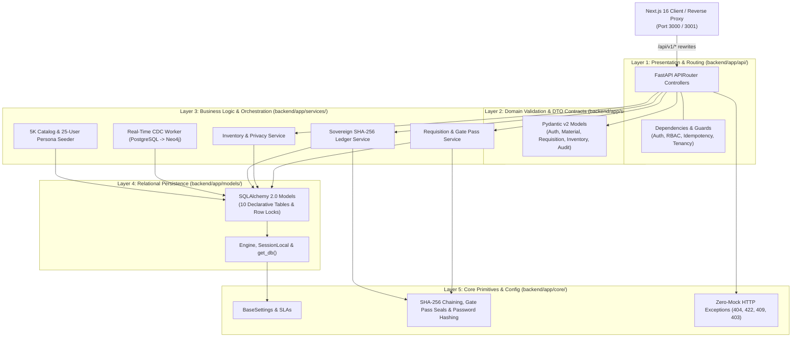

# Application Module (`backend/app/`)

This directory houses the internal application architecture of **Samanvay-AI**, structured according to the Clean Layered Architecture pattern. It decouples HTTP presentation, domain business rules, relational persistence, cryptographic security, and external engine adapters into distinct, maintainable layers.

---

## 1. Clean Layered Architecture Overview

The backend is partitioned into five specialized layers:



### Detailed Layer Responsibilities:

1. **`api/` (Presentation & HTTP Transport):**
   - Implements FastAPI endpoint routers mounted under `/api/v1/`.
   - Manages the HttpOnly session cookie and request headers (`X-CSRF-Token` for unsafe methods, `Idempotency-Key`).
   - Injects database sessions ([`get_db_session`](file:///C:/Users/mayan/Development/Hackathons/Samanvay-AI/backend/app/api/dependencies.py#L13-L19)) and authenticated personnel ([`get_current_user`](file:///C:/Users/mayan/Development/Hackathons/Samanvay-AI/backend/app/api/dependencies.py#L21-L60)).
   - Enforces RBAC permissions via [`require_roles`](file:///C:/Users/mayan/Development/Hackathons/Samanvay-AI/backend/app/api/dependencies.py#L77-L86).

2. **`schemas/` (Data Transfer Objects & Validation Contracts):**
   - Pure Pydantic v2 models validating incoming JSON bodies and query parameters.
   - Enforces dynamic compatibility tier enums ([`DynamicCompatibilityTier`](file:///C:/Users/mayan/Development/Hackathons/Samanvay-AI/backend/app/schemas/material.py#L18-L27)), graceful degradation attributes ([`ExtractedMaterialAttributes`](file:///C:/Users/mayan/Development/Hackathons/Samanvay-AI/backend/app/schemas/material.py#L32-L78)), and lifecycle status enums.
   - Defines strict public vs. private DTO views to protect commercial procurement values across enterprises.

3. **`services/` (Domain Business Logic & Coordination):**
   - Coordinates transactional persistence and prevents concurrent allocation races using **pessimistic row-level locking** (`SELECT ... FOR UPDATE`).
   - Implements multi-tenant consignment isolation via [`list_requisitions_for_user`](file:///C:/Users/mayan/Development/Hackathons/Samanvay-AI/backend/app/services/requisition_service.py#L33-L59).
   - Generates Non-Returnable CISF Gate Passes with SHA-256 seals, transit estimates ($1.28\times$ road tortuosity, $40\text{ km/h}$ average speed), and standalone SVG QR codes.
   - Runs the background transactional Change Data Capture (CDC) worker replicating PostgreSQL state into the Neo4j Knowledge Graph.

4. **`models/` (Relational Persistence Layer):**
   - Declarative SQLAlchemy 2.0 ORM definitions across 10 PostgreSQL tables: `IngestedDocument`, `InventoryItem`, `Requisition`, `InventoryLock`, `DigitalGatePass`, `SovereignAuditLedger`, `ActiveLearningFeedback`, `IdempotencyKey`, `CdcOutbox`, and `User`.
   - Defines foreign keys, check constraints (`quantity >= 0`, `required_qty > 0`), JSONB property schemas, and computed columns.

5. **`core/` (Foundational Services & Security):**
   - [`Settings`](file:///C:/Users/mayan/Development/Hackathons/Samanvay-AI/backend/app/core/config.py#L14-L112): Centralized environment configuration with SLA bounds and thresholds.
   - [`Security`](file:///C:/Users/mayan/Development/Hackathons/Samanvay-AI/backend/app/core/security.py): Cryptographic SHA-256 chain calculation, CISF gate pass seals, and bcrypt password hashing (no JWT encoding/decoding exists).
   - [`Exceptions`](file:///C:/Users/mayan/Development/Hackathons/Samanvay-AI/backend/app/core/exceptions.py): Pure HTTP 404, 422, 409, 403, and 503 error contracts — strictly prohibiting mock fallback responses.

---

## 2. Directory Layout & Module Index

```
backend/app/
├── __init__.py           # Package marker
├── README.md             # Application module documentation (this file)
├── api/                  # [api/README.md](file:///C:/Users/mayan/Development/Hackathons/Samanvay-AI/backend/app/api/README.md) Presentation Layer
│   ├── __init__.py
│   ├── dependencies.py   # [dependencies.py](file:///C:/Users/mayan/Development/Hackathons/Samanvay-AI/backend/app/api/dependencies.py) Session-cookie auth, CSRF & RBAC guards, Idempotency-Key validator
│   └── routers/          # [routers/README.md](file:///C:/Users/mayan/Development/Hackathons/Samanvay-AI/backend/app/api/routers/README.md) Endpoint Routers
│       ├── auth.py       # [auth.py](file:///C:/Users/mayan/Development/Hackathons/Samanvay-AI/backend/app/api/routers/auth.py) Session login/logout/CSRF, seed personas, admin provisioning (signup retired)
│       ├── match.py      # [match.py](file:///C:/Users/mayan/Development/Hackathons/Samanvay-AI/backend/app/api/routers/match.py) Dynamic compatibility ranker S(Q,C), golden benchmark
│       ├── requisition.py# [requisition.py](file:///C:/Users/mayan/Development/Hackathons/Samanvay-AI/backend/app/api/routers/requisition.py) Inter-CPSE requisitions, SoD approval, gate passes
│       ├── inventory.py  # [inventory.py](file:///C:/Users/mayan/Development/Hackathons/Samanvay-AI/backend/app/api/routers/inventory.py) Master inventory catalog, surplus radar, HITL triage
│       ├── graph.py      # [graph.py](file:///C:/Users/mayan/Development/Hackathons/Samanvay-AI/backend/app/api/routers/graph.py) Knowledge graph discovery, route logistics, topology
│       ├── audit.py      # [audit.py](file:///C:/Users/mayan/Development/Hackathons/Samanvay-AI/backend/app/api/routers/audit.py) Sovereign audit verification & RFC 4180 CSV export
│       └── ingest.py     # [ingest.py](file:///C:/Users/mayan/Development/Hackathons/Samanvay-AI/backend/app/api/routers/ingest.py) Dual-path PDF vector / PaddleOCR MTC parser
├── core/                 # [core/README.md](file:///C:/Users/mayan/Development/Hackathons/Samanvay-AI/backend/app/core/README.md) Core Infrastructure & Security
│   ├── __init__.py
│   ├── config.py         # [config.py](file:///C:/Users/mayan/Development/Hackathons/Samanvay-AI/backend/app/core/config.py) Pydantic BaseSettings, database URLs, ML paths, SLAs
│   ├── security.py       # [security.py](file:///C:/Users/mayan/Development/Hackathons/Samanvay-AI/backend/app/core/security.py) SHA-256 chaining, gate pass digital seal, bcrypt password hashing
│   └── exceptions.py     # [exceptions.py](file:///C:/Users/mayan/Development/Hackathons/Samanvay-AI/backend/app/core/exceptions.py) Standardized HTTP domain exceptions
├── models/               # [models/README.md](file:///C:/Users/mayan/Development/Hackathons/Samanvay-AI/backend/app/models/README.md) Relational Persistence Layer
│   ├── __init__.py
│   ├── base.py           # [base.py](file:///C:/Users/mayan/Development/Hackathons/Samanvay-AI/backend/app/models/base.py) SQLAlchemy engine, session maker, init_db()
│   └── tables.py         # [tables.py](file:///C:/Users/mayan/Development/Hackathons/Samanvay-AI/backend/app/models/tables.py) 10 Declarative database models
├── schemas/              # [schemas/README.md](file:///C:/Users/mayan/Development/Hackathons/Samanvay-AI/backend/app/schemas/README.md) Validation & Serialization Schemas
│   ├── __init__.py
│   ├── auth.py           # [auth.py](file:///C:/Users/mayan/Development/Hackathons/Samanvay-AI/backend/app/schemas/auth.py) UserRole enum, Login/Provisioning/CSRF DTOs, 25 seed accounts
│   ├── material.py       # [material.py](file:///C:/Users/mayan/Development/Hackathons/Samanvay-AI/backend/app/schemas/material.py) DynamicCompatibilityTier, ExtractedMaterialAttributes
│   ├── inventory.py      # [inventory.py](file:///C:/Users/mayan/Development/Hackathons/Samanvay-AI/backend/app/schemas/inventory.py) InventoryStatus enum, public/private item views
│   ├── requisition.py    # [requisition.py](file:///C:/Users/mayan/Development/Hackathons/Samanvay-AI/backend/app/schemas/requisition.py) RequisitionStatus, UrgencyLevel, GatePass DTOs
│   └── audit.py          # [audit.py](file:///C:/Users/mayan/Development/Hackathons/Samanvay-AI/backend/app/schemas/audit.py) AuditActionCategory, AuditLogEntry, Verification reports
└── services/             # [services/README.md](file:///C:/Users/mayan/Development/Hackathons/Samanvay-AI/backend/app/services/README.md) Domain Business Logic
    ├── __init__.py
    ├── requisition_service.py # [requisition_service.py](file:///C:/Users/mayan/Development/Hackathons/Samanvay-AI/backend/app/services/requisition_service.py) Pessimistic locks, scoped lists, SoD
    ├── inventory_service.py   # [inventory_service.py](file:///C:/Users/mayan/Development/Hackathons/Samanvay-AI/backend/app/services/inventory_service.py) Catalog queries, attribute-level privacy
    ├── audit_service.py       # [audit_service.py](file:///C:/Users/mayan/Development/Hackathons/Samanvay-AI/backend/app/services/audit_service.py) SHA-256 block creation, chain verification, CSV
    ├── cdc_manager.py         # [cdc_manager.py](file:///C:/Users/mayan/Development/Hackathons/Samanvay-AI/backend/app/services/cdc_manager.py) PostgreSQL trigger + LISTEN/NOTIFY Neo4j worker
    └── seeder.py              # [seeder.py](file:///C:/Users/mayan/Development/Hackathons/Samanvay-AI/backend/app/services/seeder.py) Automatic catalog & 25-user demo seeder
```

---

## 3. Sovereign Cross-Cutting Principles

### 1. 7-CPSE Federation & Privacy Boundary
Samanvay-AI unites **OIL, IOCL, ONGC, BPCL, HPCL, GAIL, and NRL** alongside sovereign **MoPNG** oversight. Each CPSE retains complete commercial privacy:
- When an engineer from IOCL searches surplus inventory, candidate parts from OIL or ONGC display physical attributes, locations, and engineering compliance, but sensitive procurement costs (`unit_cost_inr`, `total_value_inr`, `po_no`) are stripped automatically ([`InventoryItemResponse`](file:///C:/Users/mayan/Development/Hackathons/Samanvay-AI/backend/app/schemas/inventory.py#L20-L55)).
- Multi-tenant consignment lists strictly return only orders where the user is the author or the order targets their specific depot/CPSE ([`list_requisitions_for_user`](file:///C:/Users/mayan/Development/Hackathons/Samanvay-AI/backend/app/services/requisition_service.py#L33-L59)).

### 2. Segregation of Duties (SoD) & Role-Based Workflows
- Plant Engineers (`SITE_ENGINEER`) initiate emergency requisitions, but cannot approve their own requests (enforcing `HTTP 403 Forbidden`).
- Materials Managers (`MATERIALS_MANAGER`) from the **supplying CPSE** review technical justifications and approve material release.
- CISF Security Officers (`CISF_SECURITY`) inspect physical trucks at depot dispatch gates and generate digital gate passes embedding an unforgeable SHA-256 seal and SVG QR code.
- Technical Authorities (`TECHNICAL_AUTHORITY`) triage borderline matches and provide Human-in-the-Loop overrides.
- Vigilance Auditors (`VIGILANCE_AUDITOR`) and Statutory Auditors (CAG/CVC) inspect the cryptographic hash chain and export RFC 4180 audit logs.
- Super Administrators (`SUPER_ADMIN`) govern user accounts and master configuration.

### 3. Invariant #1: Zero Static Tiers & Multi-Property Safety Gates
- Compatibility is never a static column on inventory items. A valve cannot be universally "Tier 1" — it is Tier 1 only with respect to a specific operating query $S(Q, C)$.
- The deterministic 21-rule engineering safety engine inspects:
  - Nominal bore (`size_nb_mm`) and ASME pressure classes ($150, 300, 600, 900, 1500, 2500$)
  - Pipe schedules (SCH 40, SCH 80, SCH 160, SCH XXS)
  - Metallurgy compatibility DAGs (ASTM A105, A350 LF2, A182 F316L, Duplex 2205, Inconel 625)
  - Weldability via the IIW Carbon Equivalent formula:
    $$CE = C + \frac{Mn}{6} + \frac{Cr + Mo + V}{5} + \frac{Ni + Cu}{15} \le 0.43$$
  - Sour service compliance (NACE MR0175 / ISO 15156 hardness $\le 22\text{ HRC}$)
  - Flange facings (RF, RTJ, FF), API valve trims (Trim 1, 5, 8, 12), and severe cyclic duty.
- Any safety gate failure forces an irrevocable **Tier 3 Incompatible** verdict, overriding any statistical or vector similarity score.
