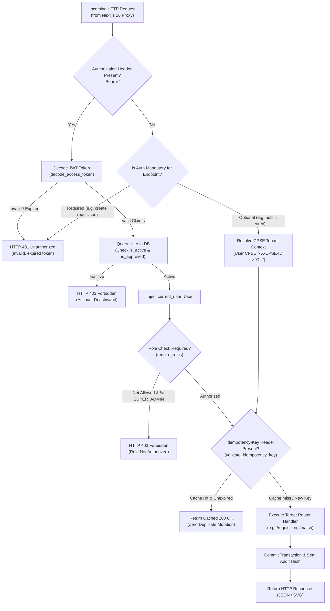

# API Layer & Dependencies (`backend/app/api/`)

The `backend/app/api/` directory implements the HTTP presentation layer for **Samanvay-AI**. It handles incoming HTTP requests, extracts headers, validates authentication tokens, enforces Role-Based Access Control (RBAC), guarantees request idempotency, and routes execution to domain services.

All endpoints are mounted under the prefix `/api/v1` and are fronted in production by the **Next.js 16 standalone reverse proxy** running on port `3000` (rewriting `/api/v1/*` to FastAPI port `8000`).

---

## 1. Request Lifecycle & Dependency Pipeline

Every incoming request passes through an automated pipeline managed by FastAPI dependencies defined in [`dependencies.py`](file:///C:/Users/mayan/Development/Hackathons/Samanvay-AI/backend/app/api/dependencies.py):



---

## 2. Dependency Providers (`dependencies.py`)

The file [`dependencies.py`](file:///C:/Users/mayan/Development/Hackathons/Samanvay-AI/backend/app/api/dependencies.py) exports production dependency functions injected via FastAPI's `Depends()`:

### A. Database Session Injection
```python
async def get_db_session() -> Generator[Session, None, None]
```
- **Description:** Contextual generator acquiring a scoped connection from `SessionLocal()` (SQLAlchemy 2.0 connection pool: 10 connections, max overflow 20).
- **Guarantees:** Automatic cleanup via `finally: db.close()`, preventing connection leakage under load.

### B. Authentication & Identity Extraction
```python
def get_current_user(
    credentials: Optional[HTTPAuthorizationCredentials] = Depends(security_bearer),
    db: Session = Depends(get_db_session),
) -> User
```
- **Description:** Extracts and verifies the HTTP Bearer JWT token from `Authorization: Bearer <token>`.
- **Validation Steps:**
  1. Decodes token with `jwt_secret_key` and `HS256` algorithm.
  2. Extracts username subject (`sub`).
  3. Queries PostgreSQL [`User`](file:///C:/Users/mayan/Development/Hackathons/Samanvay-AI/backend/app/models/tables.py#L249-L270) record.
  4. Verifies account status: raises `HTTP 403 Forbidden` if `not user.is_active`.
  5. Returns fully hydrated [`User`](file:///C:/Users/mayan/Development/Hackathons/Samanvay-AI/backend/app/models/tables.py#L249-L270) object containing `role`, `cpse`, and `depot_id`.

```python
def get_optional_user(
    credentials: Optional[HTTPAuthorizationCredentials] = Depends(security_bearer),
    db: Session = Depends(get_db_session),
) -> Optional[User]
```
- **Description:** Non-blocking variant used on semi-public discovery endpoints (e.g. `/api/v1/inventory`, `/api/v1/match/search`). Returns authenticated `User` if a valid Bearer token is provided, or `None` if unauthenticated.

### C. Role-Based Access Control (RBAC) Guard
```python
def require_roles(allowed_roles: List[str])
```
- **Description:** Higher-order parameterized dependency that blocks unauthorized roles.
- **Behavior:**
  - Evaluates `current_user.role` against `allowed_roles`.
  - Grants immediate bypass to `SUPER_ADMIN`.
  - Rejects unauthorized roles with `HTTP 403 Forbidden` (`Access forbidden: endpoint requires one of [...]. Your role is '...'`).

### D. Idempotency Key Gatekeeper
```python
def validate_idempotency_key(
    request: Request,
    idempotency_key: Optional[str] = Header(default=None, alias="Idempotency-Key"),
    db: Session = Depends(get_db_session),
)
```
- **Description:** Prevents duplicate state mutations, double inventory debits, or duplicate requisitions caused by network retries or double-clicks.
- **Mechanism:**
  - Inspects the `Idempotency-Key` HTTP header.
  - Queries [`IdempotencyKey`](file:///C:/Users/mayan/Development/Hackathons/Samanvay-AI/backend/app/models/tables.py#L220-L231) table in PostgreSQL.
  - If a cached response exists within the 24-hour TTL, returns `{"status": "CACHED", "data": key_record.response_body}` immediately.
  - Otherwise, passes the raw key string to the service layer for transaction registration.

### E. Multi-Tenant Enterprise Context Resolution
```python
def verify_cpse_access(
    request: Request,
    x_cpse: Optional[str] = Header(default=None, alias="X-CPSE-ID"),
    current_user: Optional[User] = Depends(get_optional_user),
) -> str
```
- **Description:** Determines the caller's active enterprise for Attribute-Level Privacy filtering.
- **Resolution Priority:**
  1. `current_user.cpse` (if authenticated via JWT).
  2. `X-CPSE-ID` HTTP header (e.g. `"OIL"`, `"IOCL"`, `"ONGC"`).
  3. Default fallback: `"OIL"`.

### F. Query Parameter Dependency Models
- [`PaginationParams`](file:///C:/Users/mayan/Development/Hackathons/Samanvay-AI/backend/app/api/dependencies.py#L130-L134): Standard pagination query parameters (`skip: int = 0`, `limit: int = 100`).
- [`InventoryFilterParams`](file:///C:/Users/mayan/Development/Hackathons/Samanvay-AI/backend/app/api/dependencies.py#L136-L148): Query filters (`cpse`, `depot`, `status`, `item_type`).

---

## 3. Sub-Router Index (`routers/`)

The presentation layer delegates execution to 7 specialized sub-routers in [`backend/app/api/routers/`](file:///C:/Users/mayan/Development/Hackathons/Samanvay-AI/backend/app/api/routers/README.md):

| Router Module | Mount Prefix | Key Endpoints | Operational Function |
|---|---|---|---|
| [`auth.py`](file:///C:/Users/mayan/Development/Hackathons/Samanvay-AI/backend/app/api/routers/auth.py) | `/api/v1/auth` | `/login`, `/signup`, `/me`, `/seed-users`, `/users` | JWT token authentication, registration, and 25 demo personas across 7 CPSEs. |
| [`requisition.py`](file:///C:/Users/mayan/Development/Hackathons/Samanvay-AI/backend/app/api/routers/requisition.py) | `/api/v1/requisition` | `/`, `/{id}/approve`, `/{id}/gatepass`, `/dispatch` | Multi-tenant scoped consignments, Segregation of Duties approvals, and CISF digital gate passes. |
| [`match.py`](file:///C:/Users/mayan/Development/Hackathons/Samanvay-AI/backend/app/api/routers/match.py) | `/api/v1/match` | `/search`, `/benchmark` | Multi-property compatibility evaluation $S(Q, C)$, 21 deterministic safety rules, IIW Carbon Equivalent, and NACE hardness checks. |
| [`inventory.py`](file:///C:/Users/mayan/Development/Hackathons/Samanvay-AI/backend/app/api/routers/inventory.py) | `/api/v1/inventory` | `/`, `/stats`, `/surplus`, `/hitl-queue`, `/{sku}/status` | Enterprise master stock catalog, surplus declarations, and HITL quality triage. |
| [`graph.py`](file:///C:/Users/mayan/Development/Hackathons/Samanvay-AI/backend/app/api/routers/graph.py) | `/api/v1/graph` | `/discover`, `/topology`, `/logistics/{src}/{tgt}` | Regional surplus clustering, GIS road distance, transit hours, and inter-CPSE corridor network topology. |
| [`audit.py`](file:///C:/Users/mayan/Development/Hackathons/Samanvay-AI/backend/app/api/routers/audit.py) | `/api/v1/audit` | `/`, `/verify`, `/export`, `/{log_id}` | Sovereign SHA-256 blockchain-style audit ledger verification and RFC 4180 CSV export for CVC/CAG statutory compliance. |
| [`ingest.py`](file:///C:/Users/mayan/Development/Hackathons/Samanvay-AI/backend/app/api/routers/ingest.py) | `/api/v1/ingest` | `/document`, `/catalog`, `/documents` | Dual-path PDF vector stream and PaddleOCR document ingestion, EN 10204 3.1 MTC metallurgy extraction. |

---

## 4. Usage Example: Authenticated Endpoint with RBAC & Tenancy

```python
from fastapi import APIRouter, Depends, Header
from sqlalchemy.orm import Session
from typing import Dict, Any

from backend.app.api.dependencies import (
    get_db_session,
    get_current_user,
    require_roles,
    validate_idempotency_key,
)
from backend.app.models.tables import User

router = APIRouter(prefix="/example", tags=["Example"])

@router.post("/dispatch-material")
def dispatch_material_handler(
    payload: Dict[str, Any],
    # 1. Require Materials Manager or CISF role
    current_user: User = Depends(require_roles(["MATERIALS_MANAGER", "CISF_SECURITY"])),
    # 2. Enforce idempotency key to prevent double dispatch
    idempotency_key: str = Depends(validate_idempotency_key),
    # 3. Inject active database session
    db: Session = Depends(get_db_session),
):
    if isinstance(idempotency_key, dict) and idempotency_key.get("status") == "CACHED":
        return idempotency_key["data"]

    return {
        "status": "DISPATCH_AUTHORIZED",
        "actor": current_user.username,
        "role": current_user.role,
        "enterprise": current_user.cpse,
        "depot": current_user.depot_id,
        "consignment": payload.get("consignment_id"),
    }
```
