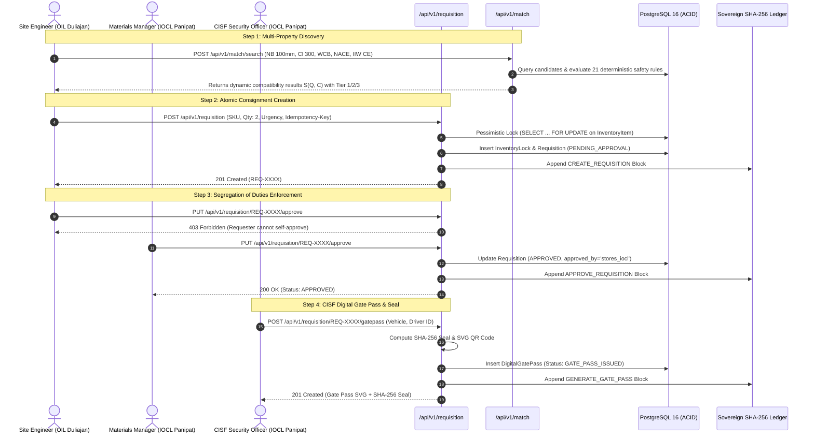

# API Routers (`backend/app/api/routers/`)

This directory houses the 7 endpoint router controllers comprising the **Samanvay-AI** REST API gateway. Each router is registered with the FastAPI application in [`backend/main.py`](file:///C:/Users/mayan/Development/Hackathons/Samanvay-AI/backend/main.py#L72-L78) under the versioned prefix `/api/v1/`.

---

## 1. Complete Router-by-Router Specification



---

### A. [`auth.py`](file:///C:/Users/mayan/Development/Hackathons/Samanvay-AI/backend/app/api/routers/auth.py) — Session Authentication & Account Governance
Coordinates organizational username/password sign-in, server-side session lifecycle, CSRF token issue, and administrative account provisioning. Login sets an HttpOnly session cookie and returns the user profile only — no JWT, access token, or bearer credential is ever issued or accepted. Public signup is retired.

- **Endpoints:**
  - `POST /api/v1/auth/login`: Authenticates username/password (bcrypt), enforces `is_active` and `is_approved`, creates a revocable server-side session, and sets the HttpOnly session cookie. Returns a generic `401` for unknown, incorrect, inactive, or unapproved credentials and is rate-limited per client.
  - `POST /api/v1/auth/logout`: Revokes the server-side session and clears the cookie. CSRF-protected (strict `Origin` allowlist plus session-bound `X-CSRF-Token`); idempotent — a missing or already-dead session still returns `204` with the cookie cleared.
  - `GET /api/v1/auth/me`: Returns the profile resolved exclusively from the session cookie (`401` without a live session; no Bearer fallback).
  - `GET /api/v1/auth/csrf`: Issues the session-bound synchronizer CSRF token (session required; `Cache-Control: no-store`; never persisted server-side).
  - `GET /api/v1/auth/seed-users`: Lists the pre-configured demo personas without disclosing any password; returns `404` in production.
  - `GET /api/v1/auth/users`: Lists all system users (requires the `SYSTEM_ADMIN` permission).
  - `POST /api/v1/auth/users`: Provisions a new account (requires the `ACCOUNT_PROVISION` permission and CSRF). The account starts unapproved; no session is created for it until approval.
  - `POST /api/v1/auth/users/{user_id}/approve`: Approves a pending account (`ACCOUNT_APPROVE` + CSRF).
  - `POST /api/v1/auth/users/{user_id}/reject`: Rejects and removes a pending account (`ACCOUNT_REJECT` + CSRF).
  - The legacy public self-registration route (`POST /api/v1/auth/signup`) and the old `POST /api/v1/auth/seed` route do not exist (`404`).

---

### B. [`requisition.py`](file:///C:/Users/mayan/Development/Hackathons/Samanvay-AI/backend/app/api/routers/requisition.py) — Consignments, SoD & Gate Passes
Coordinates the full requisition lifecycle with multi-tenant consignment isolation, atomic pessimistic locks, Segregation of Duties, and CISF security gate pass generation.

- **Endpoints:**
  - `POST /api/v1/requisition/`: Creates a new transfer order. Automatically binds `requested_by`, `target_cpse`, and `target_depot` from the authenticated user. Executes pessimistic locking (`SELECT ... FOR UPDATE`) on [`InventoryItem`](file:///C:/Users/mayan/Development/Hackathons/Samanvay-AI/backend/app/models/tables.py#L41-L97), inserts an active [`InventoryLock`](file:///C:/Users/mayan/Development/Hackathons/Samanvay-AI/backend/app/models/tables.py#L134-L152), and records a cryptographically sealed block in the audit ledger.
  - `GET /api/v1/requisition/`: **Multi-Tenant Consignment Isolation.** If the user is a `SUPER_ADMIN` or `AUDITOR`, lists all orders. For regular users, calls [`list_requisitions_for_user(db, current_user)`](file:///C:/Users/mayan/Development/Hackathons/Samanvay-AI/backend/app/services/requisition_service.py#L33-L59), completely shielding unrelated cross-tenant consignments.
  - `GET /api/v1/requisition/{req_id}`: Retrieves complete requisition details including associated CISF gate pass data.
  - `PUT /api/v1/requisition/{req_id}/approve`: **Segregation of Duties.** Enforces two hard checks:
    1. *Self-Approval Block:* Requesters cannot approve their own requisition (`HTTP 403 Forbidden`).
    2. *Supplying CPSE Only:* Only Materials Managers from the supplying CPSE holding the material can authorize release.
  - `PUT /api/v1/requisition/{req_id}/reject`: Declines requisition and restores locked inventory.
  - `POST /api/v1/requisition/{req_id}/gatepass`: Generates a Non-Returnable Material Gate Pass ([`DigitalGatePass`](file:///C:/Users/mayan/Development/Hackathons/Samanvay-AI/backend/app/models/tables.py#L154-L180)). Calculates GIS road distance ($1.28\times$ road tortuosity), transit hours at $40\text{ km/h}$, $CO_2$ emission savings, computes an unforgeable SHA-256 digital seal, and renders an SVG QR code.
  - `PUT /api/v1/requisition/{req_id}/dispatch`: CISF Out-Gate officer dispatches consignment, updating status to `DISPATCHED`.
  - `PUT /api/v1/requisition/{req_id}/deliver`: CISF In-Gate officer confirms arrival, updates status to `DELIVERED`, and permanently releases the inventory lock.

---

### C. [`match.py`](file:///C:/Users/mayan/Development/Hackathons/Samanvay-AI/backend/app/api/routers/match.py) — Dynamic Compatibility & Safety Evaluation
Thin HTTP controller delegating all multi-stage matching and ranking to [`backend/app/services/match_service.py`](file:///C:/Users/mayan/Development/Hackathons/Samanvay-AI/backend/app/services/match_service.py).

- **Endpoints:**
  - `POST /api/v1/match/search`:
    - Accepts typed [`MatchRequest`](file:///C:/Users/mayan/Development/Hackathons/Samanvay-AI/backend/app/schemas/material.py) with technical attributes: `size_nb_mm`, `pressure_class`, `pressure_rating_bar`, `schedule`, `metallurgy`, `facing_end`, `trim_no`, `port_bore`, `severe_cyclic`, `weldability_class`, `sour_service`, `oil_std_spec`, and `max_distance_km`.
    - Normalizes unstructured queries via [`DialectNormalizer`](file:///C:/Users/mayan/Development/Hackathons/Samanvay-AI/ml/ner/normalizer.py).
    - Enforces the **IIW Carbon Equivalent Formula**:
      $$CE = C + \frac{Mn}{6} + \frac{Cr + Mo + V}{5} + \frac{Ni + Cu}{15}$$
      Capping high weldability at $CE \le 0.40$ and standard at $CE \le 0.43$.
    - Enforces **NACE MR0175 / ISO 15156 Sour Hydrocarbon Invariant**: Hardness $\le 22\text{ HRC}$ ceiling with certified SSC/HIC resistance. Non-NACE material in sour duty triggers an immediate safety veto.
    - Evaluates 21 codified deterministic engineering rules via [`evaluate_pair`](file:///C:/Users/mayan/Development/Hackathons/Samanvay-AI/rules/tolerance.py).
    - Computes continuous ML compatibility score:
      $$S(Q, C) = 0.70 \cdot S_{\text{rules}} + 0.30 \cdot S_{\text{ML}}$$
    - Applies **Indian Cross-Standard Equivalence Bonus** (BIS/IS $\leftrightarrow$ ASTM/ASME/API) and **Make in India (PPP-MII)** $+3\%$ soft scoring boost for Class-I suppliers ($\ge 50\%$ local content).
    - **Invariant #1 (Hard Safety Gate):** Critical rule violations trigger an immediate zero score ($0.0$) and Tier 3 safety rejection.
    - **Attribute-Level Privacy:** Proprietary unit purchase costs (`unit_cost_inr`, `total_value_inr`, `po_no`) are stripped for cross-CPSE candidates.
    - Returns structured [`MatchSearchResponse`](file:///C:/Users/mayan/Development/Hackathons/Samanvay-AI/backend/app/schemas/material.py) containing candidates, rule breakdowns, and logistics metrics.
  - `GET /api/v1/match/benchmark`: Evaluates all 150 Golden Benchmark paired cases in `datasets/golden_benchmarks.json`, validating 100% zero-tolerance precision (zero hazardous false positives).

---

### D. [`inventory.py`](file:///C:/Users/mayan/Development/Hackathons/Samanvay-AI/backend/app/api/routers/inventory.py) — Master Stock & Surplus Radar
Provides full catalog visibility, surplus tracking, direct item creation, and status transitions.

- **Endpoints:**
  - `GET /api/v1/inventory/`: Paginated catalog browsing with multi-field filtering (`cpse`, `depot`, `status`, `item_type`). Strips sensitive purchase prices for cross-CPSE callers.
  - `GET /api/v1/inventory/stats`: Returns live enterprise aggregates: total catalog items, surplus counts, HITL triage count, active requisitions, and unlocked capital (₹ Cr).
  - `GET /api/v1/inventory/surplus`: Pre-Purchase Radar endpoint returning items declared as surplus across all CPSEs.
  - `GET /api/v1/inventory/hitl-queue`: Fetches parts requiring Human-In-The-Loop engineering triage (stained/unreadable MTCs or $>90$ days idle).
  - `GET /api/v1/inventory/{sku_code}`: Detailed SKU view including Indian standards (IS 14846, IS 1239, IS 2062), OIL MESC material code, GeM product ID, CPPP tender ref, and Make-in-India percentage.
  - `POST /api/v1/inventory/`: Creates a new inventory item in PostgreSQL (used by direct MTC ingestion reviews and manual catalog entries) and immediately appends a cryptographically sealed `CREATE_INVENTORY` block to [`SovereignAuditLedger`](file:///C:/Users/mayan/Development/Hackathons/Samanvay-AI/backend/app/models/tables.py#L182-L200).
  - `PUT /api/v1/inventory/{sku_code}/status`: Transitions inventory lifecycle status (`TO_BE_CONSUMED`, `IN_STORAGE`, `IDLE_SURPLUS`, `CONSUMED`) with audit ledger anchoring. Supports `Idempotency-Key` header.

---

### E. [`graph.py`](file:///C:/Users/mayan/Development/Hackathons/Samanvay-AI/backend/app/api/routers/graph.py) — Knowledge Graph & Logistics Topology
Interfaces with the logistics engine and Neo4j Knowledge Graph.

- **Endpoints:**
  - `GET /api/v1/graph/discover`: Regional surplus discovery with GIS logistics calculation (road distance with $1.28\times$ tortuosity, transit hours, and $CO_2$ savings). Protects commercial prices cross-enterprise.
  - `GET /api/v1/graph/item/{sku_code}/properties`: Retrieves full property graph hierarchy for an item.
  - `GET /api/v1/graph/depot/{depot_id}/surplus`: Retrieves all surplus items stationed at a specific depot node.
  - `GET /api/v1/graph/logistics/{source_depot}/{target_depot}`: Computes GIS road distance, transit hours, $CO_2$ saved, and estimated freight cost (₹) between any two CPSE depots.
  - `GET /api/v1/graph/topology`: Returns the nationwide sovereign logistics topology across 19 depots, active transit corridors, total items, and unlocked surplus value (₹ Cr).

---

### F. [`audit.py`](file:///C:/Users/mayan/Development/Hackathons/Samanvay-AI/backend/app/api/routers/audit.py) — Sovereign SHA-256 Audit Ledger
Statutory audit verification and CVC/CAG compliance reporting.

- **Endpoints:**
  - `GET /api/v1/audit/`: Paginated chronological audit entries with action category and CPSE filters.
  - `GET /api/v1/audit/verify` (and `POST`): **Automated Chain Verification.** Traverses every block from Genesis ($H_0 = \text{"0"*64}$) to the latest entry, re-computing SHA-256 digests. Mathematically proves ledger immutability and returns first broken block index if tampered.
  - `GET /api/v1/audit/export`: Exports compliance audit logs in strict RFC 4180 CSV format with SHA-256 seal headers for submission to CVC or CAG statutory auditors.
  - `GET /api/v1/audit/{log_id}`: Retrieves individual audit block details and cryptographic seals.
  - `POST /api/v1/audit/feedback`: Submits Human-In-The-Loop engineering feedback and seals it in the audit trail.

---

### G. [`ingest.py`](file:///C:/Users/mayan/Development/Hackathons/Samanvay-AI/backend/app/api/routers/ingest.py) — Document Vision & MTC Ingestion
Handles procurement document ingestion, PDF vector parsing, and raster OCR.

- **Endpoints:**
  - `POST /api/v1/ingest/document`: Multipart PDF / image file upload.
    - Dual-Path extraction: High-speed PyMuPDF digital vector stream parser ($<50\text{ ms}$) or PaddleOCR raster engine.
    - Extracts EN 10204 3.1 Mill Test Certificate (MTC) chemistry ($\%C, \%Mn, \%Si, \%P, \%S, \%Cr, \%Mo, \%Ni$), IIW Carbon Equivalent ($CE$), PREN, and mechanical tensile/yield properties.
    - Graceful degradation: Sparse or stained scans automatically set `requires_hitl = True` and route to the HITL triage queue rather than failing.
  - `POST /api/v1/ingest/catalog`: Batch streaming CSV / Excel ingestion of ERP stock catalogs.
  - `GET /api/v1/ingest/documents`: Retrieves ingested document history and extraction confidence scores.
  - `GET /api/v1/ingest/documents/{doc_id}`: Retrieves parsed metadata and raw text for a specific ingested document.

---

## 2. API Router Registration

In [`backend/main.py`](file:///C:/Users/mayan/Development/Hackathons/Samanvay-AI/backend/main.py#L72-L78), routers are registered with clean separation of concerns:

```python
# API Router Registration in backend/main.py
app.include_router(auth.router, prefix=settings.api_v1_prefix, tags=["Authentication"])
app.include_router(ingest.router, prefix=settings.api_v1_prefix, tags=["Ingestion"])
app.include_router(match.router, prefix=settings.api_v1_prefix, tags=["Matching"])
app.include_router(inventory.router, prefix=settings.api_v1_prefix, tags=["Inventory"])
app.include_router(requisition.router, prefix=settings.api_v1_prefix, tags=["Requisition"])
app.include_router(graph.router, prefix=settings.api_v1_prefix, tags=["Graph"])
app.include_router(audit.router, prefix=settings.api_v1_prefix, tags=["Audit"])
```
