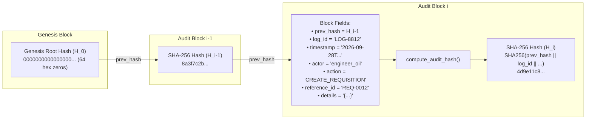

# Core Infrastructure, Configuration & Security (`backend/app/core/`)

This directory houses the foundational cross-cutting components of **Samanvay-AI**: centralized Pydantic settings, standardized zero-mock HTTP domain exceptions, and sovereign cryptographic primitives.

---

## 1. File-by-File Breakdown

### A. [`config.py`](file:///C:/Users/mayan/Development/Hackathons/Samanvay-AI/backend/app/core/config.py) — Pydantic BaseSettings & Operational Parameters
Centralizes all runtime parameters, database connection strings, machine learning model paths, SLA limits, and engineering limits loaded type-safely from `.env` or system environment variables.

| Parameter Group | Attribute Name | Default Value | Description |
|---|---|---|---|
| **Application** | `app_name` | `"Samanvay-AI"` | Application display name. |
| | `app_version` | `"2.0.0-PROD"` | Production release version. |
| | `debug` | `False` | Debug mode toggle. |
| | `api_v1_prefix` | `"/api/v1"` | API version prefix. |
| **PostgreSQL 16** | `postgres_host` | `"localhost"` | Database server hostname. |
| | `postgres_port` | `5432` | PostgreSQL listening port. |
| | `postgres_user` | `"samanvay"` | Database master role username. |
| | `postgres_password` | `"samanvay_secure"` | Master password. |
| | `postgres_db` | `"samanvay_db"` | Relational database name. |
| | `postgres_url` | Property | Sync connection URL (`postgresql+psycopg2://...`). |
| | `postgres_async_url` | Property | Async connection URL (`postgresql+asyncpg://...`). |
| **Qdrant Vector DB** | `qdrant_host` | `"localhost"` | Qdrant host. |
| | `qdrant_port` | `6333` | REST port for vector storage. |
| | `qdrant_collection` | `"samanvay_inventory"` | Master collection name. |
| | `qdrant_vector_size`| `1024` | Dense vector dimension for `BAAI/bge-m3`. |
| | `qdrant_hnsw_m` | `16` | HNSW graph edge connectivity. |
| | `qdrant_hnsw_ef_construct` | `100` | Index build beam width. |
| **Neo4j 5 Graph DB** | `neo4j_uri` | `"bolt://localhost:7687"` | Bolt protocol URI. |
| | `neo4j_user` | `"neo4j"` | Graph database user. |
| | `neo4j_password` | `"samanvay_graph"` | Graph database password. |
| **Air-Gapped ML Models** | `deberta_model_path` | `"ml/ner/models/deberta-v3-small-ner"` | Local NER weights. |
| | `bge_m3_model_path` | `"ml/embeddings/models/bge-m3-onnx"` | ONNX dense/sparse vector model. |
| | `xgboost_model_path`| `"ml/ranking/models/compatibility_ranker.json"` | Trained XGBoost ranker model. |
| **OCR & Vision** | `ocr_dpi` | `300` | Raster scan DPI resolution. |
| | `ocr_confidence_threshold` | `0.85` | Confidence ceiling $\tau_{\text{OCR}}$ for HITL triage. |
| | `ocr_max_concurrency` | `4` | Bound for simultaneous GPU OCR jobs. |
| **Inference SLAs** | `vector_search_sla_ms` | `15.0 ms` | Maximum allowable vector search latency. |
| | `pymupdf_sla_ms` | `50.0 ms` | Digital vector stream extraction ceiling. |
| | `paddleocr_sla_ms` | `250.0 ms` | CUDA raster scan processing ceiling. |
| **Compatibility Thresholds** | `tier_1_threshold` | `0.95` ($\ge 95\%$) | Threshold for Tier 1 Identical match. |
| | `tier_2_threshold` | `0.80` ($\ge 80\%$) | Threshold for Tier 2 Substitute match. |
| **Weldability Limit** | `ce_weldability_limit` | `0.43` | IIW Carbon Equivalent ($CE_{\text{IIW}}$) safe ceiling. |
| **GIS Logistics** | `road_tortuosity_factor` | `1.28` | Indian national highway winding multiplier. |
| | `avg_freight_speed_kmh` | `40.0 km/h` | Average heavy cargo transit speed. |
| **Audit Ledger** | `genesis_root_hash` | `"0" * 64` | 64-character hex zero string ($H_0$). |
| **Idempotency** | `idempotency_ttl_hours` | `24` | Cache expiration window for idempotency keys. |
| **JWT & RBAC** | `jwt_secret_key` | Secret String | HMAC key for signing JWT tokens. |
| | `jwt_algorithm` | `"HS256"` | Signing algorithm. |
| | `jwt_access_token_expire_minutes` | `1440` (24 Hours) | Access token validity window. |

---

### B. [`security.py`](file:///C:/Users/mayan/Development/Hackathons/Samanvay-AI/backend/app/core/security.py) — Sovereign Cryptographic Engine & Authentication
Implements cryptographic verification, tamper-evident hash chaining, digital gate pass seals, and JWT token management.



- **Core Functions:**
  - `compute_sha256(data: str) -> str`: Standard UTF-8 SHA-256 digest computation.
  - `compute_audit_hash(prev_hash, log_id, timestamp, actor, action, reference_id, details) -> str`:
    Computes the cryptographic chained hash:
    $$H_i = \text{SHA-256}(\text{prev\_hash}_{i-1} \parallel \text{log\_id} \parallel \text{timestamp} \parallel \text{actor} \parallel \text{action} \parallel \text{reference\_id} \parallel \text{details})$$
    Because each block seals the hash of its predecessor, altering, deleting, or re-ordering any historical row breaks all subsequent hash seals in the chain.
  - `compute_gate_pass_seal(gate_pass_no, vehicle_no, driver_id, sku_code, quantity, issuing_officer, timestamp) -> str`:
    Computes an unforgeable SHA-256 digital signature embedded in the CISF Material Gate Pass SVG QR code:
    $$\text{Seal} = \text{SHA-256}(\text{gp\_no} \parallel \text{vehicle} \parallel \text{driver\_id} \parallel \text{sku} \parallel \text{qty} \parallel \text{officer} \parallel \text{timestamp})$$
  - `compute_request_hash(body: dict[str, Any]) -> str`:
    Computes deterministic SHA-256 hash of JSON request bodies (sorting keys) to verify idempotency consistency.
  - `verify_audit_chain(entries: list[dict[str, Any]]) -> tuple[bool, int | None]`:
    Traverses the full audit log from Genesis block to the latest entry, recomputing each block's hash. Returns `(True, None)` if intact, or `(False, broken_index)` identifying the exact compromised block.
  - `get_password_hash(password: str) -> str`: Generates secure bcrypt hash with salt.
  - `verify_password(plain_password: str, hashed_password: str) -> bool`: Validates plain password against stored bcrypt hash.
  - `create_access_token(data: dict, expires_delta: Optional[timedelta]) -> str`: Encodes user identity, role, and CPSE tenant claims into an `HS256` signed JWT token.
  - `decode_access_token(token: str) -> Optional[dict]`: Decodes and validates JWT bearer tokens, rejecting expired or tampered signatures.

---

### C. [`exceptions.py`](file:///C:/Users/mayan/Development/Hackathons/Samanvay-AI/backend/app/core/exceptions.py) — Zero-Mock HTTP Domain Exceptions
Implements strict HTTP error contracts. The platform strictly rejects mock fallbacks — all system failures produce deterministic HTTP status codes:

```python
class ResourceNotFoundError(HTTPException):
    # HTTP 404 NOT FOUND: Raised when SKU, Requisition, Document, or User is not in DB.
    status_code = 404
    detail = {"error": "RESOURCE_NOT_FOUND", "resource": "...", "identifier": "...", "message": "..."}

class ValidationError(HTTPException):
    # HTTP 422 UNPROCESSABLE ENTITY: Raised on schema or dimensional mismatch.
    status_code = 422
    detail = {"error": "VALIDATION_ERROR", "message": "...", "field": "..."}

class IdempotencyConflictError(HTTPException):
    # HTTP 409 CONFLICT: Raised when a concurrent mutation with the same idempotency key is active.
    status_code = 409
    detail = {"error": "IDEMPOTENCY_CONFLICT", "idempotency_key": "...", "message": "..."}

class InsufficientInventoryError(HTTPException):
    # HTTP 422 UNPROCESSABLE ENTITY: Raised when requested quantity exceeds available warehouse stock.
    status_code = 422
    detail = {"error": "INSUFFICIENT_INVENTORY", "sku_code": "...", "available_qty": 0, "requested_qty": 5}

class ServiceUnavailableError(HTTPException):
    # HTTP 503 SERVICE UNAVAILABLE: Raised when downstream vector (Qdrant) or graph (Neo4j) is offline.
    status_code = 503
    detail = {"error": "SERVICE_UNAVAILABLE", "service": "...", "message": "..."}

class PrivacyViolationError(HTTPException):
    # HTTP 403 FORBIDDEN: Raised if a code path attempts to leak commercial purchase prices cross-CPSE.
    status_code = 403
    detail = {"error": "PRIVACY_VIOLATION", "field": "unit_cost_inr", "message": "..."}
```

---

## 2. Usage Examples

### Computing Chained Audit Block Hash:
```python
from backend.app.core.security import compute_audit_hash, GENESIS_ROOT_64_HEX

# 1. Sealing Genesis Entry
genesis_hash = compute_audit_hash(
    prev_hash=GENESIS_ROOT_64_HEX,
    log_id="LOG-0001",
    timestamp="2026-09-28T06:00:00Z",
    actor="SYSTEM_INIT",
    action="INITIALIZATION",
    reference_id="GENESIS-01",
    details='{"event": "MASTER_LEDGER_BOOT"}',
)

# 2. Sealing Next Consecutive Block
second_hash = compute_audit_hash(
    prev_hash=genesis_hash,
    log_id="LOG-0002",
    timestamp="2026-09-28T06:01:00Z",
    actor="engineer_oil",
    action="CREATE_REQUISITION",
    reference_id="REQ-OIL-001",
    details='{"sku_code": "OIL-VLV-100", "qty": 2}',
)
```

### Password Hashing & JWT Token Issuance:
```python
from backend.app.core.security import get_password_hash, verify_password, create_access_token

# Bcrypt Hash
hashed = get_password_hash("Samanvay@2026")
assert verify_password("Samanvay@2026", hashed) is True

# JWT Token
token = create_access_token({
    "sub": "engineer_oil",
    "role": "SITE_ENGINEER",
    "cpse": "OIL",
    "depot_id": "DEPOT-OIL-DLJ",
})
```
