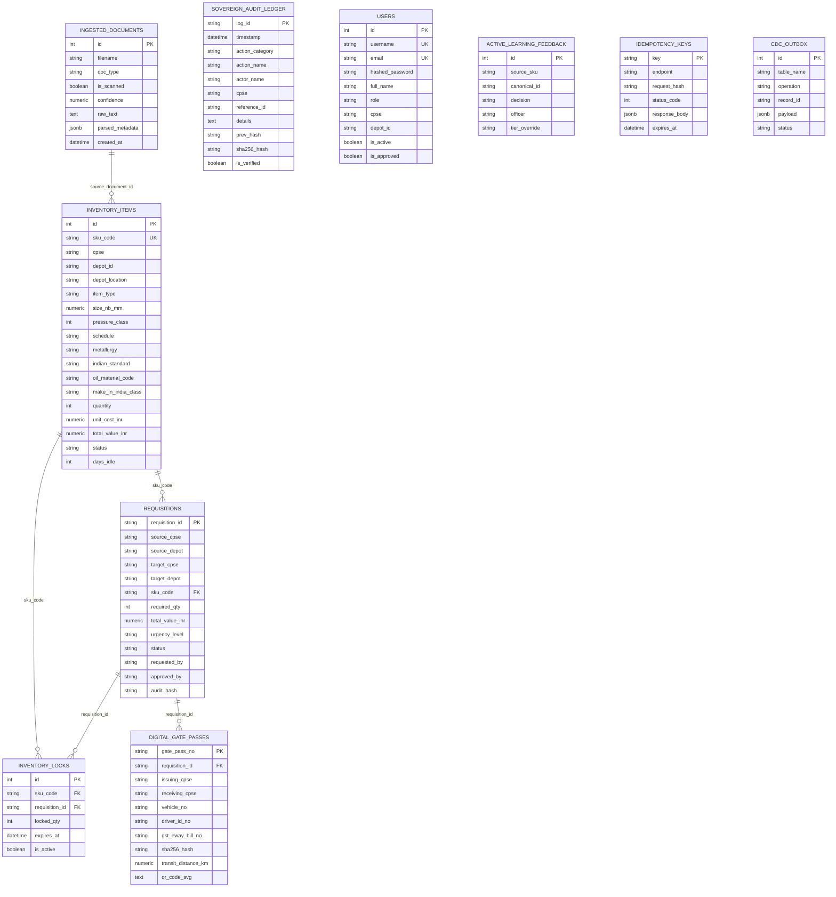

# Relational Database Models (`backend/app/models/`)

This directory defines the **SQLAlchemy 2.0 Declarative ORM** schema persisting the state of **Samanvay-AI** in PostgreSQL 16. It codifies all 10 relational tables, foreign key constraints, table-level check constraints, JSONB property bags, generated computed columns, and row-level pessimistic locking mechanics.

---

## 1. Entity-Relationship (ER) Architecture



---

## 2. Database Connection & Engine Setup (`base.py`)

In [`base.py`](file:///C:/Users/mayan/Development/Hackathons/Samanvay-AI/backend/app/models/base.py), the database session manager initializes:
- `Base`: SQLAlchemy 2.0 `DeclarativeBase` subclass inherited by all models.
- `engine`: PostgreSQL connection pool configured with:
  - `pool_size = 10`: Retains 10 persistent connections.
  - `max_overflow = 20`: Allows up to 20 temporary burst connections.
  - `pool_pre_ping = True`: Emits a lightweight `SELECT 1` ping before hand-off, avoiding stale socket timeouts.
- `SessionLocal`: Contextual factory bound to `engine`.
- `get_db()`: Generator yielding scoped `Session` objects with automatic `db.close()` cleanup in a `finally` block.
- `init_db()`: Creates all tables on cold-start via `Base.metadata.create_all(bind=engine)`.

---

## 3. Exhaustive Model Definitions (`tables.py`)

The file [`tables.py`](file:///C:/Users/mayan/Development/Hackathons/Samanvay-AI/backend/app/models/tables.py) defines the 10 production tables:

### 1. `IngestedDocument` (`ingested_documents`)
Persists procurement documents, MTC certificates, delivery challans, and PO invoices parsed via the dual-path ingestion engine.
- `id`: Primary key (`Integer`, autoincrement).
- `filename`: Uploaded file name (`String(255)`).
- `doc_type`: Classification (`String(64)`: `MTC_CERTIFICATE`, `DELIVERY_CHALLAN`, `PO_INVOICE`).
- `is_scanned`: Boolean indicating raster image or scanned PDF vs digital vector PDF.
- `confidence`: Extraction confidence score (`Numeric(5, 4)`).
- `raw_text`: Extracted OCR/vector text (`Text`).
- `parsed_metadata`: Deep JSONB document structure containing chemical composition ($\%C, \%Mn, \%Si, \%P, \%S, \%Cr, \%Ni, \%Mo$), IIW Carbon Equivalent ($CE$), PREN, mechanical tensile properties, and ASTM conformance flags.
- `created_at`: Ingestion UTC timestamp.

### 2. `InventoryItem` (`inventory_items`)
The master inventory ledger representing physical stock across all 7 CPSEs (OIL, IOCL, ONGC, BPCL, HPCL, GAIL, NRL).
- `id`: Internal sequence ID (`Integer`, autoincrement).
- `sku_code`: Unique part identifier (`String(64)`, indexed, unique).
- `cpse`: Owning enterprise (`String(32)`, indexed: `OIL`, `IOCL`, `ONGC`, `BPCL`, `HPCL`, `GAIL`, `NRL`).
- `depot_id`: Specific depot node (`String(64)`, indexed: e.g. `DEPOT-OIL-DLJ`, `DEPOT-IOCL-PNP`).
- `depot_location`: Human-readable location (`String(255)`).
- `po_no`: Purchase order number (`String(128)`).
- `heat_no`: Steel mill heat melt number (`String(128)`).
- `description`: Complete technical description (`Text`).
- `canonical_id`: Dialect-normalized cross-catalog identifier (`String(64)`).
- `item_type`: Equipment family (`String(64)`: `VALVE`, `FLANGE`, `PIPE`, `GASKET`, `FITTING`, `PUMP_SPARE`, `STUD_BOLT`, `EQUIPMENT`).
- `size_nb_mm`: Nominal bore in millimeters (`Numeric(8, 2)`).
- `pressure_class`: ASME pressure rating (`Integer`: `150`, `300`, `600`, `900`, `1500`, `2500`).
- `pressure_rating_psi`: Operating pressure rating (`Numeric(10, 2)`).
- `pressure_rating_bar`: Metric PN pressure in Bar (`Numeric(8, 2)`).
- `schedule`: Pipe wall thickness schedule (`String(32)`: `SCH 40`, `SCH 80`, etc.).
- `metallurgy`: Material specification (`String(64)`: `ASTM A105`, `A350 LF2`, `A182 F316L`, etc.).
- `facing_end`: Flange end or facing (`String(32)`: `RF`, `RTJ`, `FF`, `BW`, `SW`).
- `standard`: International standard (`String(64)`: `ASME B16.5`, `API 600`, `ASTM A269`).
- `indian_standard`: BIS / Indian Standard (`String(100)`: `IS 14846`, `IS 1239`, `IS 2062`, `IS 3589`).
- `oil_std_spec`: Oil industry technical spec (`String(100)`: `OISD-RP-126`, `EIL 6-44-0012`).
- `oil_material_code`: OIL SAP 8-digit MESC code (`String(32)`: e.g. `02.14.05.21`).
- `gem_category_id`: Government e-Marketplace category (`String(100)`).
- `gem_product_id`: GeM catalog product identifier (`String(64)`).
- `cppp_tender_ref`: Central Public Procurement Portal tender reference (`String(100)`).
- `make_in_india_class`: Class under PPP-MII order (`String(32)`: `Class-I`, `Class-II`, `Non-Local`).
- `local_content_percentage`: Assessed Make-in-India percentage (`Numeric(5, 2)`).
- `properties`: Flexible JSONB bag storing trim numbers (`trim_no`), port bore types (`port_bore`), seal plans (`seal_plan`), and weldability limits (`ce_max`).
- `quantity`: Physical stock on hand (`Integer`, constraint: `quantity >= 0`).
- `unit_cost_inr`: Commercial procurement cost (`Numeric(14, 2)`).
- `total_value_inr`: Generated column computed dynamically as `quantity * unit_cost_inr`.
- `status`: Lifecycle status (`String(32)`: `TO_BE_CONSUMED`, `IN_STORAGE`, `IDLE_SURPLUS`, `POTENTIAL_SURPLUS`, `SURPLUS_DECLARED`, `RESERVED_TRANSFER`, `CONSUMED`).
- `days_idle`: Inactivity duration in days (`Integer`).
- `is_broadcasted_surplus`: Boolean toggle broadcasting availability to other CPSEs.

### 3. `Requisition` (`requisitions`)
Inter-CPSE transfer and mutual aid requisitions.
- `requisition_id`: Unique requisition identifier (`String(64)`, primary key).
- `source_cpse`: Supplying CPSE holding surplus (`String(32)`).
- `source_depot`: Supplying warehouse facility (`String(255)`).
- `source_unit`: Operational plant unit (`String(128)`).
- `target_cpse`: Demanding / requesting CPSE (`String(32)`).
- `target_depot`: Destination receiving depot (`String(255)`).
- `sku_code`: Target item foreign key (`String(64)` $\rightarrow$ `inventory_items.sku_code`).
- `required_qty`: Requested quantity (`Integer`, constraint: `required_qty > 0`).
- `unit_cost_inr`, `total_value_inr`: Financial accounting valuation.
- `justification`: Engineering operational justification (`Text`).
- `urgency_level`: Priority (`EMERGENCY_SHUTDOWN`, `PLANNED_MAINTENANCE`, `ROUTINE`).
- `status`: Transfer status (`PENDING_APPROVAL`, `APPROVED`, `GATE_PASS_ISSUED`, `DISPATCHED`, `DELIVERED`, `REJECTED`).
- `requested_by`: Authoring engineer's username (`String(128)`).
- `approved_by`: Materials manager authorizer (`String(128)`).
- `approved_at`: Authorization timestamp (`DateTime(timezone=True)`).
- `rejection_reason`: Reason if rejected (`Text`).
- `dispatch_timestamp`, `delivery_timestamp`: Logistics milestone timestamps.
- `audit_hash`: Cryptographic SHA-256 seal anchoring creation.

### 4. `InventoryLock` (`inventory_locks`)
Atomic multi-depot reservation locks preventing race conditions and double allocation under concurrent demand.
- `id`: Primary key (`Integer`, autoincrement).
- `sku_code`: Foreign key to `inventory_items.sku_code`.
- `requisition_id`: Foreign key to `requisitions.requisition_id`.
- `locked_qty`: Number of units reserved (`Integer`, constraint: `locked_qty > 0`).
- `locked_at`: Lock creation timestamp.
- `expires_at`: Automatic expiration deadline (7-day default TTL).
- `is_active`: Boolean flag active until consignment delivery or rejection.

### 5. `DigitalGatePass` (`digital_gate_passes`)
Non-Returnable Material Gate Pass issued by Central Industrial Security Force (CISF) units.
- `gate_pass_no`: Unique pass number (`String(64)`, primary key: e.g. `MoPNG/CISF/GP-NR/2026/XXXX`).
- `requisition_id`: Linked requisition foreign key.
- `issuing_cpse`, `issuing_depot`: Origin facility.
- `receiving_cpse`, `receiving_depot`: Destination plant.
- `transporter_name`: Logistics carrier (`String(128)`).
- `vehicle_no`: Commercial freight truck registration (`String(32)`).
- `driver_name`, `driver_id_no`: Driver credentials.
- `gst_eway_bill_no`: GST E-Way Bill identifier.
- `cisf_verification_seal`: CISF physical outpost seal code.
- `sha256_hash`: Cryptographic digital signature sealing consignment parameters.
- `transit_distance_km`: Computed highway transit distance ($1.28\times$ road tortuosity).
- `co2_saved_kg`: Greenhouse gas emission savings computed against fresh manufacturing.
- `estimated_transit_hours`: Freight duration based on $40\text{ km/h}$ average speed.
- `qr_code_svg`: Standalone vector SVG payload scanned at perimeter checkpoints.

### 6. `SovereignAuditLedger` (`sovereign_audit_ledger`)
Statutory audit ledger maintaining the immutable SHA-256 blockchain-style hash chain for CVC and CAG oversight.
- `log_id`: Unique audit block identifier (`String(64)`, primary key).
- `timestamp`: UTC timestamp of event.
- `action_category`: Classification (`ACCESS_CONTROL`, `REQUISITION`, `GATE_PASS`, `DISPATCH`, `STATUS_CHANGE`, `GOVERNANCE`).
- `action_name`: Action performed (`CREATE_REQUISITION`, `APPROVE_REQUISITION`, `GENERATE_GATE_PASS`, etc.).
- `actor_name`: Identity of user or daemon.
- `actor_role`: Sovereign functional role (`SITE_ENGINEER`, `MATERIALS_MANAGER`, `CISF_SECURITY`, etc.).
- `cpse`, `depot`: Origin enterprise and depot.
- `reference_id`: Target entity ID (`requisition_id`, `sku_code`, `gate_pass_no`).
- `details`: Canonical JSON string of state payload.
- `prev_hash`: SHA-256 hash of previous audit block ($H_{i-1}$).
- `sha256_hash`: Chained SHA-256 hash of this entry ($H_i$).
- `is_verified`: Boolean verification flag.

### 7. `ActiveLearningFeedback` (`active_learning_feedback`)
Caches human engineer override decisions on border cases for active learning and XGBoost ranker fine-tuning.
- `id`: Primary key (`Integer`, autoincrement).
- `source_description`: Input requisition text.
- `source_sku`: Candidate item SKU (`String(64)`, indexed).
- `canonical_id`: Normalized component identifier (`String(64)`, indexed).
- `decision`: Engineer action (`APPROVE`, `REJECT`, `RECLASSIFY`).
- `officer`: Technical authority identifier.
- `action_note`: Engineering justification note.
- `tier_override`: Overridden tier (`Tier 1`, `Tier 2`, `Tier 3`).
- `confidence_override`: Adjusted confidence score.

### 8. `IdempotencyKey` (`idempotency_keys`)
Guarantees at-most-once semantics for high-value asset transfers and inventory mutations.
- `key`: Idempotency key from client header (`String(128)`, primary key).
- `endpoint`: API path (`String(255)`).
- `request_hash`: Deterministic SHA-256 hash of incoming JSON body.
- `status_code`: Returned HTTP status code (`Integer`).
- `response_body`: Cached JSONB response payload.
- `expires_at`: Expiration timestamp (24-hour TTL).

### 9. `CdcOutbox` (`cdc_outbox`)
Transactional outbox table supporting Change Data Capture triggers for real-time Neo4j synchronization.
- `id`: Sequential event ID (`Integer`, autoincrement).
- `table_name`: Mutated table (`inventory_items`, `requisitions`).
- `operation`: Transaction type (`INSERT`, `UPDATE`, `DELETE`).
- `record_id`: Mutated primary key (`sku_code` or `requisition_id`).
- `payload`: Full JSONB row snapshot.
- `status`: Outbox delivery state (`PENDING`, `PROCESSED`, `FAILED`).
- `processed_at`: Synchronization timestamp.

### 10. `User` (`users`)
Enterprise personnel accounts enforcing Role-Based Access Control and multi-tenant boundaries.
- `id`: Primary key (`Integer`, autoincrement).
- `username`: Unique username (`String(64)`, indexed, unique).
- `email`: Official CPSE email address (`String(128)`, unique).
- `hashed_password`: Secure bcrypt password hash (`String(255)`).
- `full_name`: Personnel full name (`String(128)`).
- `role`: Functional role (`String(64)`: `SITE_ENGINEER`, `MATERIALS_MANAGER`, `TECHNICAL_AUTHORITY`, `CISF_SECURITY`, `VIGILANCE_AUDITOR`, `SUPER_ADMIN`).
- `cpse`: Enterprise organization code (`String(32)`, indexed: `OIL`, `IOCL`, `ONGC`, `BPCL`, `HPCL`, `GAIL`, `NRL`, `MoPNG`).
- `depot_id`: Assigned warehouse / depot facility code (`String(64)`, indexed).
- `is_active`: Boolean flag (inactive accounts cannot log in).
- `is_approved`: Approval status (new signups require Super Admin approval).

---

## 4. Concurrency & Pessimistic Locking Semantics

To prevent race conditions where two simultaneous engineers attempt to requisition the same remaining surplus valve:

```python
# Atomic Pessimistic Locking in requisition_service.py:
item = db.query(InventoryItem)\
    .filter(InventoryItem.sku_code == sku_code)\
    .with_for_update()\
    .first()

if item.quantity < quantity:
    raise ValueError(f"Insufficient stock: requested {quantity} EA, available {item.quantity} EA")

# Debit stock immediately within transaction
item.quantity -= quantity

# Record active reservation lock
lock = InventoryLock(
    sku_code=sku_code,
    requisition_id=req.requisition_id,
    locked_qty=quantity,
    expires_at=datetime.now(timezone.utc) + timedelta(days=7),
    is_active=True
)
db.add(lock)
db.commit()
```
