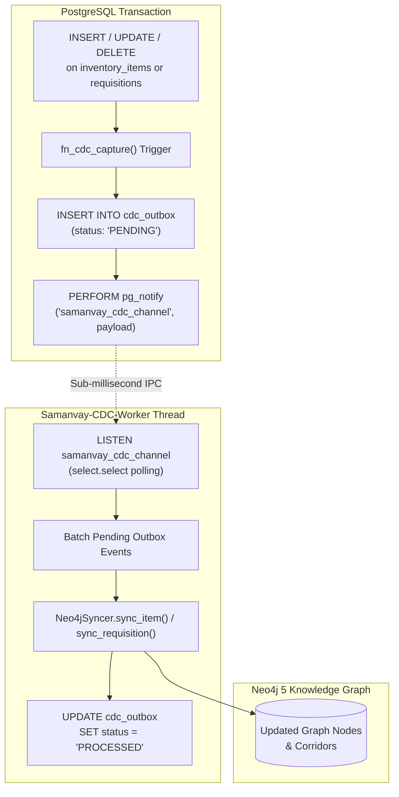

# Domain Business Logic & Services (`backend/app/services/`)

This directory houses the core business logic layer of **Samanvay-AI**. It coordinates ACID database transactions, pessimistic row-level locking, multi-tenant consignment isolation, Segregation of Duties (SoD), cryptographic audit chain computation, real-time Change Data Capture (CDC), and cold-start database seeding.

---

## 1. Concurrency Architecture & Pessimistic Locking

To guarantee that concurrent requests from different CPSEs cannot simultaneously reserve or over-allocate the same surplus part, the requisition service employs **Pessimistic Row-Level Locking (`SELECT ... FOR UPDATE`)**:

```mermaid
sequenceDiagram
    autonumber
    actor Engineer1 as Site Engineer (OIL)
    actor Engineer2 as Site Engineer (ONGC)
    participant RequisitionSvc as Requisition Service
    participant DB as PostgreSQL (inventory_items)
    participant Locks as inventory_locks Table

    Note over Engineer1,Engineer2: Both engineers attempt to reserve the same 1 remaining Gate Valve
    Engineer1->>RequisitionSvc: create_requisition(SKU: OIL-VLV-100, Qty: 1)
    Engineer2->>RequisitionSvc: create_requisition(SKU: OIL-VLV-100, Qty: 1)

    activate RequisitionSvc
    RequisitionSvc->>DB: SELECT * FROM inventory_items WHERE sku_code='...' FOR UPDATE
    Note over DB: Transaction 1 acquires exclusive row lock on SKU
    DB-->>RequisitionSvc: Return Item (Qty: 1 available)
    
    RequisitionSvc->>DB: UPDATE inventory_items SET quantity = quantity - 1 (Qty -> 0)
    RequisitionSvc->>Locks: INSERT INTO inventory_locks (locked_qty: 1, active: true)
    RequisitionSvc->>DB: COMMIT Transaction 1
    deactivate RequisitionSvc
    Note over DB: Exclusive lock released; Transaction 2 acquires row lock

    activate RequisitionSvc
    RequisitionSvc->>DB: SELECT * FROM inventory_items WHERE sku_code='...' FOR UPDATE
    DB-->>RequisitionSvc: Return Item (Qty: 0 available)
    RequisitionSvc-->>Engineer2: Raise ValueError("Insufficient stock: requested 1, available 0")
    deactivate RequisitionSvc
```

---

## 2. Service-by-Service Breakdown

### A. [`requisition_service.py`](file:///C:/Users/mayan/Development/Hackathons/Samanvay-AI/backend/app/services/requisition_service.py) — Consignments, SoD & Digital Gate Passes
Coordinates the full lifecycle of inter-enterprise spare parts transfers:

- **Multi-Tenant Consignment Isolation:**
  - [`list_requisitions_for_user(db, user)`](file:///C:/Users/mayan/Development/Hackathons/Samanvay-AI/backend/app/services/requisition_service.py#L33-L59):
    Implements multi-tenant shielding. Regular engineers and warehouse officers see **only**:
    1. Requisitions authored by themselves (`requested_by == current_user.username`), OR
    2. Incoming transfer requests targeting their specific depot (`source_depot == current_user.depot_id`), OR
    3. Requests targeting their enterprise (`source_cpse == current_user.cpse`).
    Consignments between unrelated CPSEs are completely shielded and invisible. Unrestricted visibility is granted only to `SUPER_ADMIN` and `VIGILANCE_AUDITOR` via [`list_requisitions(db, cpse, depot)`](file:///C:/Users/mayan/Development/Hackathons/Samanvay-AI/backend/app/services/requisition_service.py#L17-L30).

- **Strict Segregation of Duties (SoD):**
  - [`approve_requisition(db, req_id, approved_by)`](file:///C:/Users/mayan/Development/Hackathons/Samanvay-AI/backend/app/services/requisition_service.py#L145-L167):
    Enforces that requesters cannot approve their own requests (blocked with `HTTP 403 Forbidden` in the router), and only Materials Managers belonging to the **supplying CPSE** holding the surplus asset can authorize stock release. Transitions status to `APPROVED` and appends an `APPROVE_REQUISITION` block to the audit ledger.
  - [`reject_requisition(db, req_id, reason)`](file:///C:/Users/mayan/Development/Hackathons/Samanvay-AI/backend/app/services/requisition_service.py#L169-L201):
    Transitions status to `REJECTED`, releases the [`InventoryLock`](file:///C:/Users/mayan/Development/Hackathons/Samanvay-AI/backend/app/models/tables.py#L134-L152), and restores debited stock back to [`InventoryItem`](file:///C:/Users/mayan/Development/Hackathons/Samanvay-AI/backend/app/models/tables.py#L41-L97).

- **CISF Digital Gate Pass Generation:**
  - [`generate_gate_pass(db, req_id, gate_pass_request)`](file:///C:/Users/mayan/Development/Hackathons/Samanvay-AI/backend/app/services/requisition_service.py#L203-L280):
    Issued by Central Industrial Security Force (CISF) personnel upon truck inspection:
    - Calculates highway transit distance via `road_distance` ($1.28\times$ road tortuosity factor).
    - Estimates transit hours based on average freight speed ($40\text{ km/h}$).
    - Calculates greenhouse gas emission savings ($CO_2\text{ kg}$) achieved by avoiding fresh manufacturing.
    - Computes an unforgeable SHA-256 digital signature:
      $$\text{Seal} = \text{SHA-256}(\text{gp\_no} \parallel \text{vehicle} \parallel \text{driver\_id} \parallel \text{sku} \parallel \text{qty} \parallel \text{officer} \parallel \text{timestamp})$$
    - Generates a standalone vector SVG QR code using `qrcode.image.svg.SvgImage` for verification at physical gates.
    - Transitions requisition status to `GATE_PASS_ISSUED`.

- **Out-Gate Dispatch & In-Gate Delivery:**
  - [`dispatch_requisition(db, req_id)`](file:///C:/Users/mayan/Development/Hackathons/Samanvay-AI/backend/app/services/requisition_service.py#L282-L303): Transitions status to `DISPATCHED`, recording timestamp and audit block.
  - [`deliver_requisition(db, req_id)`](file:///C:/Users/mayan/Development/Hackathons/Samanvay-AI/backend/app/services/requisition_service.py#L305-L334): Transitions status to `DELIVERED`, records delivery timestamp, permanently deactivates the [`InventoryLock`](file:///C:/Users/mayan/Development/Hackathons/Samanvay-AI/backend/app/models/tables.py#L134-L152), and reconciles the inventory ledger.

---

### B. [`inventory_service.py`](file:///C:/Users/mayan/Development/Hackathons/Samanvay-AI/backend/app/services/inventory_service.py) — Catalog Operations & Attribute-Level Privacy
Coordinates enterprise master inventory queries and enforces cross-CPSE data masking:

- **Attribute-Level Privacy Stripping:**
  - [`list_inventory(db, filters, pagination, requesting_cpse)`](file:///C:/Users/mayan/Development/Hackathons/Samanvay-AI/backend/app/services/inventory_service.py#L9-L48) & [`get_item(db, sku_code, requesting_cpse)`](file:///C:/Users/mayan/Development/Hackathons/Samanvay-AI/backend/app/services/inventory_service.py#L50-L66):
    When the caller's enterprise (`requesting_cpse`) differs from the owning CPSE (`item.cpse`), proprietary financial attributes are stripped automatically:
    ```python
    if item.cpse != requesting_cpse:
        item_dict.pop("unit_cost_inr", None)
        item_dict.pop("total_value_inr", None)
        item_dict.pop("po_no", None)
    ```
- **Surplus Radar & HITL Triage:**
  - [`get_surplus_radar(db, requesting_cpse)`](file:///C:/Users/mayan/Development/Hackathons/Samanvay-AI/backend/app/services/inventory_service.py): Identifies parts declared as surplus across all CPSEs with commercial prices protected.
  - [`get_hitl_queue(db)`](file:///C:/Users/mayan/Development/Hackathons/Samanvay-AI/backend/app/services/inventory_service.py): Retrieves parts requiring Human-In-The-Loop review (stained/unreadable MTCs or $>90$ days idle).
- **Status Transitions & Auditing:**
  - [`transition_status(db, sku_code, new_status, reason, officer)`](file:///C:/Users/mayan/Development/Hackathons/Samanvay-AI/backend/app/services/inventory_service.py#L89-L135): Updates inventory lifecycle status and immediately appends an immutable `STATUS_CHANGE` block to the audit ledger.

---

### C. [`audit_service.py`](file:///C:/Users/mayan/Development/Hackathons/Samanvay-AI/backend/app/services/audit_service.py) — Sovereign Cryptographic Audit Ledger
Implements the immutable, mathematically verifiable SHA-256 blockchain-style ledger:

- **Block Creation:**
  - [`create_audit_entry(db, request)`](file:///C:/Users/mayan/Development/Hackathons/Samanvay-AI/backend/app/services/audit_service.py#L24-L81):
    1. Fetches the previous entry's `sha256_hash` (or `GENESIS_ROOT_64_HEX` if empty).
    2. Deterministically serializes JSON payload details (sorting keys).
    3. Computes the chained hash:
       $$H_i = \text{SHA-256}(H_{i-1} \parallel \text{log\_id} \parallel \text{timestamp} \parallel \text{actor} \parallel \text{action} \parallel \text{reference\_id} \parallel \text{details})$$
    4. Persists the block into [`SovereignAuditLedger`](file:///C:/Users/mayan/Development/Hackathons/Samanvay-AI/backend/app/models/tables.py#L182-L200).
- **Automated Chain Verification:**
  - [`verify_chain(db)`](file:///C:/Users/mayan/Development/Hackathons/Samanvay-AI/backend/app/services/audit_service.py): Traverses the entire audit table from Genesis to the latest block, recomputing each block's SHA-256 hash. Detects any unauthorized retroactive SQL updates, row deletions, or re-ordering.
- **Statutory Compliance Export:**
  - [`export_csv(db, filters)`](file:///C:/Users/mayan/Development/Hackathons/Samanvay-AI/backend/app/services/audit_service.py): Generates RFC 4180 compliant CSV exports containing all block hashes and parent links for formal submission to CVC and CAG authorities.

---

### D. [`cdc_manager.py`](file:///C:/Users/mayan/Development/Hackathons/Samanvay-AI/backend/app/services/cdc_manager.py) — Real-Time Change Data Capture (CDC) Worker
Provides real-time event streaming between PostgreSQL and the Neo4j Knowledge Graph:



- **PostgreSQL Triggers ([`init_cdc_schema`](file:///C:/Users/mayan/Development/Hackathons/Samanvay-AI/backend/app/services/cdc_manager.py#L31-L100)):**
  - Attaches `trg_inventory_cdc` and `trg_requisition_cdc` to `inventory_items` and `requisitions`.
  - Every row mutation automatically writes a row snapshot to [`cdc_outbox`](file:///C:/Users/mayan/Development/Hackathons/Samanvay-AI/backend/app/models/tables.py#L233-L247) and broadcasts a JSON notification via `pg_notify('samanvay_cdc_channel', ...)`.
- **Background Worker Thread ([`start_cdc_worker`](file:///C:/Users/mayan/Development/Hackathons/Samanvay-AI/backend/app/services/cdc_manager.py)):**
  - Runs in a dedicated background daemon thread started during FastAPI lifespan.
  - Listens on `samanvay_cdc_channel` with non-blocking `select.select()`.
  - Replays row mutations into Neo4j graph nodes and corridor relationships via `Neo4jSyncer`, updating outbox status to `PROCESSED`.

---

### E. [`seeder.py`](file:///C:/Users/mayan/Development/Hackathons/Samanvay-AI/backend/app/services/seeder.py) — Cold-Start Database Seeder
Ensures zero manual setup is required on fresh deployment volumes:

- **5,000 Inventory Items Seeding ([`seed_database_if_empty`](file:///C:/Users/mayan/Development/Hackathons/Samanvay-AI/backend/app/services/seeder.py#L25-L162)):**
  - Runs on startup; if `inventory_items` is empty, reads `datasets/inventory_catalog.csv`.
  - Passes descriptions through [`DialectNormalizer`](file:///C:/Users/mayan/Development/Hackathons/Samanvay-AI/ml/ner/normalizer.py) to extract nominal size, pressure class, metallurgy, and facing.
  - Classifies surplus: `days_idle >= 365` $\rightarrow$ `SURPLUS_DECLARED`, `days_idle >= 180` $\rightarrow$ `POTENTIAL_SURPLUS`.
  - Bulk saves items into PostgreSQL.
  - Seals the Genesis entry (`LOG-GENESIS-00001`) in the Sovereign Audit Ledger.
- **25 Persona Accounts Seeding ([`seed_users_if_empty`](file:///C:/Users/mayan/Development/Hackathons/Samanvay-AI/backend/app/services/seeder.py#L164-L227)):**
  - Idempotently populates the 25 pre-configured demo user accounts across the 7 CPSEs (OIL, IOCL, ONGC, GAIL, BPCL, HPCL, NRL) + MoPNG Central.
  - Sets default master password `Samanvay@2026` (hashed via bcrypt).
  - Ensures accounts have `is_active = True` and `is_approved = True`.
