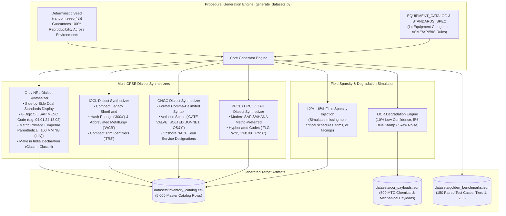

# Procedural Synthetic ERP Dataset & Dialect Generators (`datasets/generators/`)

This directory houses the deterministic procedural generation scripts that generate the master catalog, authentic CPSE dialect variants, golden substitution benchmarks, and synthetic OCR mill test certificate payloads powering **Samanvay-AI**.

---

## 1. Generator Architecture & Design Principles



---

## 2. Technical File Breakdown: [`generate_datasets.py`](file:///C:/Users/mayan/Development/Hackathons/Samanvay-AI/datasets/generators/generate_datasets.py)

At 1,042 lines, [`generate_datasets.py`](file:///C:/Users/mayan/Development/Hackathons/Samanvay-AI/datasets/generators/generate_datasets.py) provides a comprehensive, physically grounded generation engine:

### 1. Equipment Taxonomy & Physical Constraints
Enforces strict mechanical consistency so that generated records mirror real-world industrial supply chains:
- **Flanges:** Mates ASME B16.5 nominal sizes (`1/2IN` to `24IN` / `DN15` to `DN600`) with pressure classes (`150#` to `2500#` / `PN20` to `PN420`) and valid facings (`RF`, `RTJ`, `FF`).
- **Valves:** Gates, globes, checks, balls, and butterflies are assigned valid API trim numbers (e.g. Trim 1, 5, 8, 12, 16) and standard castings (ASTM A216 WCB, ASTM A352 LCB, ASTM A351 CF8M).
- **Line Pipes:** Correlates nominal pipe sizes (NPS) with valid ASME B36.10M schedules (SCH 20, 40, 80, 160, XXS) and API 5L PSL2 line pipe grades (Grade B, X52, X60, X65).
- **Fasteners:** Pairs ASTM A193 alloy stud bolts with their metallurgically compatible ASTM A194 heavy hex nut grades:
  - ASTM A193 B7 stud $\rightarrow$ ASTM A194 2H nut
  - ASTM A193 B16 (high temperature) $\rightarrow$ ASTM A194 7 nut
  - ASTM A320 L7 (low temperature) $\rightarrow$ ASTM A194 7 nut
  - ASTM A193 B7M (sour service) $\rightarrow$ ASTM A194 2HM nut
  - ASTM A193 B8M (stainless 316) $\rightarrow$ ASTM A194 8M nut

### 2. Multi-CPSE Pan-India Allocations (5,000 Rows)
Distributes records across 7 public sector enterprises with OIL as flagship:
- **OIL:** $30\%$ ($1,500$ rows) across Duliajan, Moran, Digboi, Guwahati, Jorhat, Jodhpur, and Kakinada.
- **NRL:** $10\%$ ($500$ rows) at Numaligarh Refinery Yard.
- **IOCL:** $15\%$ ($750$ rows) across Panipat, Mathura, Koyali, Paradip, Barauni, Digboi, Haldia, and Bongaigaon.
- **ONGC:** $15\%$ ($750$ rows) across Hazira, Uran, Ankleshwar, Mumbai High, Rajahmundry, Mehsana, and Karaikal.
- **BPCL:** $10\%$ ($500$ rows) across Mumbai Mahul, Kochi, and Bina.
- **HPCL:** $10\%$ ($500$ rows) across Mumbai, Visakh, and Bathinda.
- **GAIL:** $10\%$ ($500$ rows) across Pata, Vijaipur, Vaghodia, and Usar.

### 3. Golden Benchmark Generator (`generate_golden_benchmarks`)
Generates 150 mathematically verified paired test cases evaluating 21 deterministic safety modules:
- **Tier 1 (50 Cases):** Identical parity and safe over-ratings (e.g. 10" GI pipe rating upgrade from 300 to 350 PSI; Trim 8 Stellite hardfaced upgrade for Trim 1; ASTM A193 B16 high-creep upgrade for B7).
- **Tier 2 (50 Cases):** Functional substitutions requiring engineering review (e.g. schedule upgrades requiring recalculation of internal flow velocities, alloy upgrades from 304 to 316 stainless).
- **Tier 3 (50 Cases):** Hard safety hazard rejections (e.g. pressure class downgrade from 600# to 300#; non-sour trim in sour NACE service; cryogenic low-temperature LF2 replaced with standard A105).

### 4. MTC OCR Payload Generator (`generate_ocr_payloads`)
Generates 500 simulated PaddleOCR payload objects:
- Certified ladle chemistry analyses ($\text{C}, \text{Mn}, \text{Si}, \text{P}, \text{S}, \text{Cr}, \text{Ni}, \text{Mo}, \text{V}, \text{Cu}, \text{N}$).
- Mechanical tensile properties (Yield Strength, Tensile Strength, Elongation, Charpy V-Notch impact Joules at $-46^\circ\text{C}$).
- Injected with $10\%$ low-confidence scores and $5\%$ OCR degradation to test document AI parser resilience.

---

## 3. Usage & CLI Execution

### Running the Generator
To regenerate the full suite of datasets with default parameters:

```bash
# Execute dataset generator from repository root
python datasets/generators/generate_datasets.py
```

### Generated Files Location
Upon completion, the generator updates:
- [`datasets/inventory_catalog.csv`](file:///C:/Users/mayan/Development/Hackathons/Samanvay-AI/datasets/inventory_catalog.csv)
- [`datasets/golden_benchmarks.json`](file:///C:/Users/mayan/Development/Hackathons/Samanvay-AI/datasets/golden_benchmarks.json)
- [`datasets/ocr_payloads.json`](file:///C:/Users/mayan/Development/Hackathons/Samanvay-AI/datasets/ocr_payloads.json)

---

## 4. Verification & Testing

Verify that the generated datasets conform to schema expectations and pass unit testing:

```bash
# Verify catalog loading and dialect parsing
pytest tests/ml/test_ner.py -v

# Verify active learning bootstrap seeding from golden benchmarks
pytest tests/unit/test_active_learning.py -v

# Verify OCR payload extraction and MTC parsing
pytest tests/unit/test_ocr_and_mtc.py -v
```
