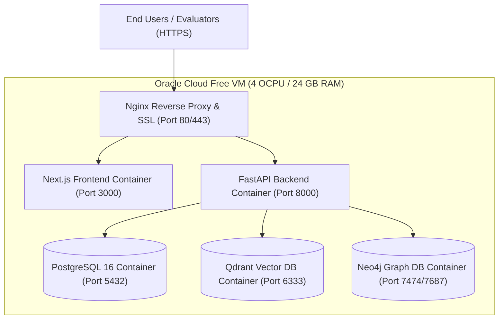
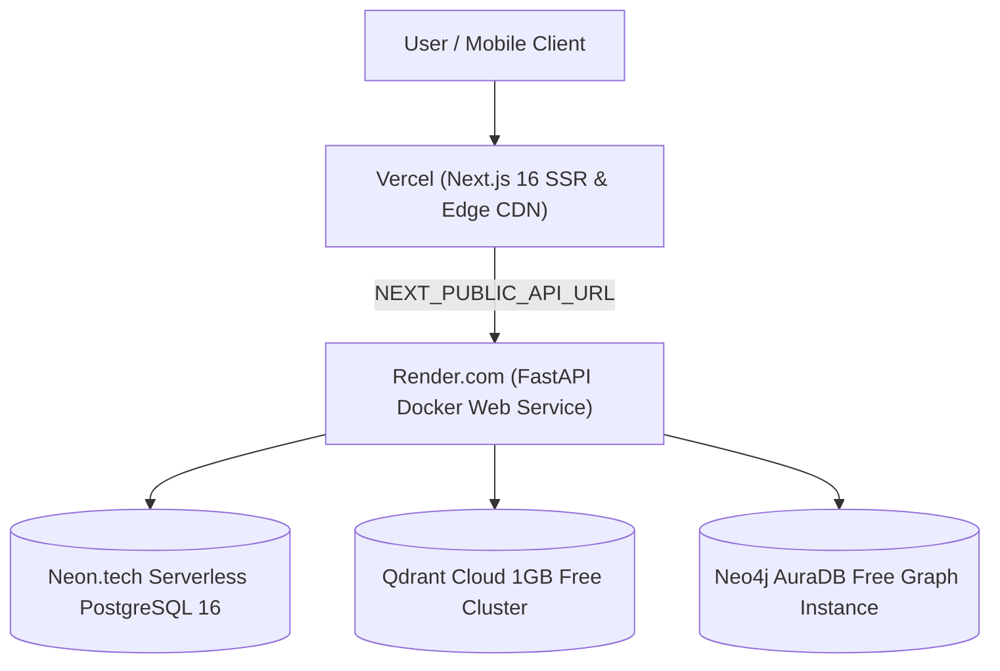

# Samanvay-AI: Master Deployment & Production Guide
## Sovereign Cross-CPSE Spare Parts Interoperability & Mutual Aid Mesh
### Ministry of Petroleum & Natural Gas (MoPNG) | Smart India Hackathon (SIH26099)

---

## 1. Executive Deployment Overview

**Samanvay-AI** is architected to run across both local air-gapped industrial infrastructure and 100% free-tier sovereign cloud production environments:

1. **Local Air-Gapped Industrial Grid**: Multi-container Docker Compose deployment (PostgreSQL 16, Qdrant v1.12, Neo4j 5.20, FastAPI backend with embedded CDC, Next.js 16 frontend) requiring **zero external cloud connectivity**.
2. **Oracle Cloud Infrastructure (OCI) Always Free VM (Recommended 100% Free Forever)**: Single-node sovereign deployment on an **Ampere A1 Compute Instance (4 OCPUs, 24 GB RAM, 200 GB Storage)** running the full Docker Compose stack with zero cold starts, zero downtime, and zero cost.
3. **Distributed Free-Tier Managed Mesh**: Serverless frontend on **Vercel**, container backend on **Render.com**, and managed free cloud databases (**Neon.tech**, **Qdrant Cloud**, **Neo4j AuraDB Free**).

---

## 2. Local Production Deployment (Air-Gapped Docker Grid)

### 2.1 Prerequisites
- **Docker Desktop** (v24.0+) with Docker Compose enabled.
- **System Memory**: Minimum 4 GB RAM allocated to Docker.
- **Operating System**: Windows 10/11 (WSL2), Ubuntu/Debian/RHEL Linux, or macOS.

### 2.2 1-Command Local Launch
From the repository root directory in PowerShell or Bash:

```bash
# 1. Clean launch / Reset all persistent volumes (Recommended for fresh evaluation)
docker compose -f docker/docker-compose.yml down -v

# 2. Build & launch all 5 microservices with automated DB migrations & initial seeding
docker compose -f docker/docker-compose.yml --env-file docker/.env.docker up -d --build
```

### 2.3 Container Grid Health Status
Verify that all 5 microservices have started and passed their health probes:
```bash
docker compose -f docker/docker-compose.yml ps
```

| Container Name | Microservice | Host Port | Internal Health Check Probe |
| :--- | :--- | :--- | :--- |
| `samanvay-ai-postgres` | PostgreSQL 16 Alpine | `5432:5432` | `pg_isready -U samanvay -d samanvay_db` |
| `samanvay-ai-qdrant` | Qdrant Vector Engine | `6333:6333` | TCP port 6333 readiness probe |
| `samanvay-ai-neo4j` | Neo4j 5.20 Community | `7474:7474`, `7687:7687` | HTTP probe on `http://localhost:7474` |
| `samanvay-ai-backend` | FastAPI Gateway Core | `8000:8000` | HTTP probe on `http://localhost:8000/health` |
| `samanvay-ai-frontend` | Next.js 16 Web Portal | `3000:3000` | HTTP probe on `http://localhost:3000/` |
| `samanvay-public-tunnel`| Cloudflare Edge Tunnel| Dynamic Edge | Outbound tunnel to `http://samanvay-ai-frontend:3000` |

### 2.4 Service URLs & Demonstrator Dashboards
- **Web Portal & Command Center**: [http://localhost:3000](http://localhost:3000)
- **FastAPI Interactive Swagger Docs**: [http://localhost:8000/docs](http://localhost:8000/docs)
- **Neo4j Graph Explorer**: [http://localhost:7474](http://localhost:7474) (Auth: `neo4j` / `samanvay_graph`)
- **Qdrant Vector Dashboard**: [http://localhost:6333/dashboard](http://localhost:6333/dashboard)

### 2.5 Pre-Configured Evaluation Personas (Default Password: `Samanvay@2026`)
The database automatically seeds 25+ demo accounts across all 7 CPSEs upon startup. Evaluators can sign in via 1-click on `/login` or enter credentials manually:

| Username | Role | CPSE Domain | Depot / Facility Assignment | Primary Function in Evaluation Journey |
| :--- | :--- | :--- | :--- | :--- |
| `engineer_iocl` | `SITE_ENGINEER` | **IOCL** | Panipat Refinery Stores | Search surplus valves/flanges & submit requisition |
| `stores_ongc` | `MATERIALS_MANAGER` | **ONGC** | Uran Terminal Stores | Approve mutual-aid transfer (Segregation of Duties) |
| `cisf_ongc` | `CISF_SECURITY` | **ONGC** | Uran Perimeter Gate | Generate cryptographic gate pass with SVG QR |
| `engineer_oil` | `SITE_ENGINEER` | **OIL** | Duliajan Central Stores | Plant piping & reliability requisition requester |
| `stores_bpcl` | `MATERIALS_MANAGER` | **BPCL** | Mumbai Mahul Refinery | Senior Materials Executive & stock controller |
| `engineer_gail` | `SITE_ENGINEER` | **GAIL** | Pata Petrochemical Complex | Pipeline & gas grid maintenance specialist |
| `engineer_hpcl` | `SITE_ENGINEER` | **HPCL** | Visakh Refinery Stores | Process plant equipment requester |
| `engineer_nrl` | `SITE_ENGINEER` | **NRL** | Numaligarh Refinery Depot | Expansion project piping lead |
| `auditor` | `VIGILANCE_AUDITOR` | **MoPNG** | Central Oversight | Verify Merkle hash chain in sovereign audit ledger |
| `admin` | `SUPER_ADMIN` | **MoPNG** | Sovereign Headquarters | Dual CPSE/Depot switcher & global requisition access |

### 2.6 Live Subsystem Verification Suite
Run the live integration test suite inside the running backend container:
```bash
docker exec -it samanvay-ai-backend python -m scripts.verify_live_api
```

---

## 3. Global Public Access from Your Laptop (Zero-Cost Cloudflare Tunnel)

You can turn your local laptop into a globally accessible demo server without buying a domain, paying for cloud hosting, or configuring router port forwarding.

### 3.1 Architecture Overview
- **Next.js Single-Origin Proxy**: The Next.js frontend on port `3000` is configured with server-side rewrites that forward all `/api/v1/*` requests internally to the FastAPI backend container (`http://samanvay-ai-backend:8000`).
- **Zero CORS / Mixed Content Issues**: Visitors only connect to a single HTTPS endpoint. The browser makes relative API calls, preventing cross-origin rejection and browser security blocks.
- **Enterprise-Grade Cloudflare Edge**: The tunnel uses outbound QUIC connections (port 7844). Your laptop IP address is hidden, and traffic is routed through Cloudflare's global Anycast edge.

### 3.2 Launching the Global Tunnel (1-Command)

#### Option A: Using the PowerShell Helper Script
```powershell
.\scripts\start_public_tunnel.ps1
```

#### Option B: Using Docker Compose
```powershell
# Start the tunnel service in background
docker compose -f docker/docker-compose.yml --profile tunnel up -d tunnel

# Retrieve your live HTTPS public link
docker logs samanvay-ai-tunnel
```

#### Option C: Direct Docker Run
```powershell
docker run --rm -it --network samanvay-ai-network cloudflare/cloudflared:latest tunnel --url http://samanvay-ai-frontend:3000
```

Cloudflare will output a public URL such as:
```text
+--------------------------------------------------------------------------------------------+
|  Your quick Tunnel has been created! Visit it at:                                          |
|  https://xxxx-xxxx-xxxx.trycloudflare.com                                                  |
+--------------------------------------------------------------------------------------------+
```
Anyone with this URL can open the website from their smartphone, tablet, or external PC and interact with the live stack running on your laptop.

> [!TIP]
> **Mobile Ergonomics & Responsive UI Testing**:
> The public tunnel URL is fully mobile-responsive. Open the link on any iOS/Android smartphone:
> - Navigation collapses into an auto-closing slide-over sheet accessible via the mobile hamburger icon.
> - Consignments, inventory, and audit tables utilize compact 38px/46px touch targets with horizontal swipe support.
> - The single-origin Next.js reverse proxy routes all `/api/v1/*` calls internally to the FastAPI backend container, preventing CORS or mixed-content warnings on mobile browsers.

### 3.3 Stopping the Public Tunnel
- If running interactively, press `Ctrl + C`.
- If running via Docker Compose:
  ```powershell
  docker compose -f docker/docker-compose.yml --profile tunnel stop tunnel
  ```

---

## 4. Alternative: Hybrid Local Development (Hot Reloading)

If modifying code live with instant hot-reloading:

### Step 1: Start Databases in Docker
```bash
docker compose -f docker/docker-compose.yml up -d postgres qdrant neo4j
```

### Step 2: Start Backend (FastAPI)
```powershell
# In PowerShell:
$env:POSTGRES_HOST="localhost"; $env:POSTGRES_PORT="5432"
$env:POSTGRES_USER="samanvay"; $env:POSTGRES_PASSWORD="samanvay_secure"
$env:POSTGRES_DB="samanvay_db"; $env:QDRANT_HOST="localhost"; $env:QDRANT_PORT="6333"
$env:NEO4J_URI="bolt://localhost:7687"; $env:NEO4J_USER="neo4j"; $env:NEO4J_PASSWORD="samanvay_graph"
$env:APP_ENV="development"

# Run Uvicorn server with auto-reload
uvicorn backend.main:app --host 0.0.0.0 --port 8000 --reload
```

### Step 3: Start Frontend (Next.js 16)
```bash
cd frontend
npm install
npm run dev
```

---

## 4. Production Option 1: Oracle Cloud Always Free 24GB VM (Recommended)

Oracle Cloud Infrastructure (OCI) offers an **Always Free Tier** providing **4 OCPU cores (ARM Ampere A1), 24 GB RAM, and 200 GB NVMe Storage** with no expiration date. This easily hosts the complete 5-container Samanvay-AI stack.



### Step 1: Create Free OCI Account & Provision Compute Instance
1. Sign up at [oracle.com/cloud/free](https://www.oracle.com/cloud/free/) (Choose home region, e.g. **Mumbai / Hyderabad / Frankfurt / US-East**).
2. In OCI Console, go to **Compute -> Instances -> Create Instance**.
3. Image: **Canonical Ubuntu 22.04 LTS**.
4. Shape: Click **Change Shape** -> Choose **Ampere (ARM)** -> Select **VM.Standard.A1.Flex** -> Set **4 OCPUs** and **24 GB Memory** (Labeled `Always Free Eligible`).
5. Download Private SSH Key (`ssh-key-*.key`).
6. Click **Create**.

### Step 2: Configure Virtual Cloud Network (VCN) Ingress Ports
1. Go to **Networking -> Virtual Cloud Networks -> Default Security List**.
2. Click **Add Ingress Rules**:
   - Source CIDR: `0.0.0.0/0`
   - Destination Port Range: `80, 443, 3000, 8000`
   - Description: `Samanvay-AI Web & API Ports`

### Step 3: Connect to VM & Install Docker
```bash
# Connect via SSH from PowerShell / Terminal
ssh -i /path/to/ssh-key.key ubuntu@<YOUR_OCI_PUBLIC_IP>

# Update VM packages
sudo apt update && sudo apt upgrade -y

# Install Docker & Docker Compose Plugin
sudo apt install -y docker.io docker-compose-v2 git ufw

# Allow Docker without sudo
sudo usermod -aG docker ubuntu

# Configure local firewall
sudo ufw allow 22/tcp
sudo ufw allow 80/tcp
sudo ufw allow 443/tcp
sudo ufw allow 3000/tcp
sudo ufw allow 8000/tcp
sudo ufw enable
```

### Step 4: Clone & Launch Samanvay-AI
```bash
# Clone the repository
git clone https://github.com/your-username/Samanvay-AI.git
cd Samanvay-AI

# Launch the full multi-container grid
docker compose -f docker/docker-compose.yml --env-file docker/.env.docker up -d --build
```

### Step 5: (Optional) Setup Systemd Auto-Restart on VM Reboot
Create a systemd unit file so the grid restarts automatically if the server reboots:
```bash
sudo tee /etc/systemd/system/samanvay.service > /dev/null <<EOF
[Unit]
Description=Samanvay-AI Sovereign Industrial Grid
Requires=docker.service
After=docker.service

[Service]
Type=oneshot
RemainAfterExit=yes
WorkingDirectory=/home/ubuntu/Samanvay-AI
ExecStart=/usr/bin/docker compose -f docker/docker-compose.yml --env-file docker/.env.docker up -d
ExecStop=/usr/bin/docker compose -f docker/docker-compose.yml down

[Install]
WantedBy=multi-user.target
EOF

sudo systemctl enable samanvay.service
```

---

## 5. Production Option 2: Distributed Free Cloud Mesh

If deploying across serverless cloud providers:



### 5.1 Managed Database Setup (100% Free Accounts)

#### 1. PostgreSQL on Neon.tech (Free Serverless)
1. Register at [neon.tech](https://neon.tech).
2. Create project `samanvay-db`.
3. Save connection details:
   - Host: `ep-xyz.us-east-2.aws.neon.tech`
   - User: `samanvay_owner`
   - Password: `<your-password>`
   - Database: `samanvay_db`

#### 2. Vector DB on Qdrant Cloud (Free 1GB Cluster)
1. Register at [cloud.qdrant.io](https://cloud.qdrant.io).
2. Create a Free 1GB Cluster in your preferred region.
3. Save the Cluster URL (`https://xyz.cloud.qdrant.io:6333`) and API Key.

#### 3. Knowledge Graph on Neo4j AuraDB (Free Forever)
1. Register at [neo4j.com/cloud/aura-free](https://neo4j.com/cloud/aura-free/).
2. Create an **AuraDB Free Instance** (Supports 200,000 nodes & 400,000 relationships).
3. Save the connection URI (`neo4j+s://xyz.databases.neo4j.io`) and Password.

### 5.2 Backend on Render.com (Free Web Service)
1. Link GitHub repository on [render.com](https://render.com).
2. Select **New Web Service** -> Docker runtime (Dockerfile path: `docker/Dockerfile.backend`).
3. Add Environment Variables:
   - `POSTGRES_HOST`: `ep-xyz.us-east-2.aws.neon.tech`
   - `POSTGRES_PORT`: `5432`
   - `POSTGRES_USER`: `samanvay_owner`
   - `POSTGRES_PASSWORD`: `<your-neon-password>`
   - `POSTGRES_DB`: `samanvay_db`
   - `QDRANT_HOST`: `xyz.cloud.qdrant.io`
   - `QDRANT_PORT`: `6333`
   - `QDRANT_API_KEY`: `<your-qdrant-api-key>`
   - `NEO4J_URI`: `neo4j+s://xyz.databases.neo4j.io`
   - `NEO4J_USER`: `neo4j`
   - `NEO4J_PASSWORD`: `<your-auradb-password>`
   - `APP_ENV`: `production`
   - `ENABLE_EMBEDDED_CDC`: `true`
4. Deploy service and copy your public Render URL (e.g. `https://samanvay-api.onrender.com`).

### 5.3 Frontend on Vercel (Free Serverless Next.js)
1. Go to [vercel.com](https://vercel.com) and import the repository.
2. Root Directory: `frontend`
3. Framework Preset: `Next.js`
4. Add Environment Variable:
   - `NEXT_PUBLIC_API_URL`: `https://samanvay-api.onrender.com`
5. Click **Deploy**.

---

## 6. Zero-Cost Cold Start Prevention

Render free-tier instances enter sleep mode after 15 minutes of inactivity. To ensure 100% instant response times:
1. Create a free account on [cron-job.org](https://cron-job.org) or [uptimerobot.com](https://uptimerobot.com).
2. Add a recurring HTTP GET monitor targeting:
   `https://samanvay-api.onrender.com/health`
3. Set schedule: Every **10 minutes**.
4. This ensures your API remains warm 24/7 at zero cost.

---

## 7. Master Environment Variables Reference

| Variable | Docker Compose Default | Free Cloud Value | Description |
| :--- | :--- | :--- | :--- |
| `APP_ENV` | `production` | `production` | Production mode toggle |
| `POSTGRES_HOST` | `samanvay-ai-postgres` | `ep-xyz.aws.neon.tech` | PostgreSQL hostname |
| `POSTGRES_PORT` | `5432` | `5432` | PostgreSQL port |
| `POSTGRES_USER` | `samanvay` | `samanvay_owner` | DB username |
| `POSTGRES_PASSWORD` | `samanvay_secure` | `<secret>` | DB password |
| `POSTGRES_DB` | `samanvay_db` | `samanvay_db` | Database name |
| `QDRANT_HOST` | `samanvay-ai-qdrant` | `xyz.cloud.qdrant.io` | Qdrant host |
| `QDRANT_PORT` | `6333` | `6333` | Qdrant port |
| `NEO4J_URI` | `bolt://samanvay-ai-neo4j:7687` | `neo4j+s://xyz.databases.neo4j.io` | Neo4j Bolt connection URI |
| `NEO4J_USER` | `neo4j` | `neo4j` | Neo4j user |
| `NEO4J_PASSWORD` | `samanvay_graph` | `<secret>` | Neo4j password |
| `NEXT_PUBLIC_API_URL`| `http://localhost:8000` | `https://samanvay-api.onrender.com` | Backend URL for Next.js |
| `ENABLE_EMBEDDED_CDC`| `true` | `true` | Enables real-time graph syncer thread |
