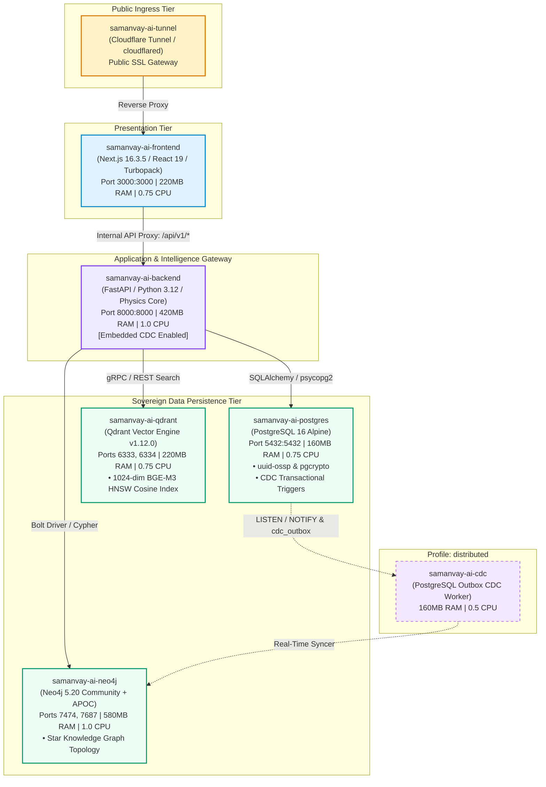
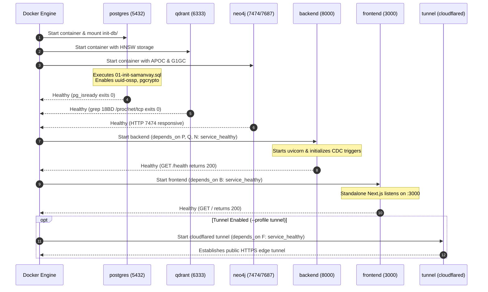

# Samanvay-AI Sovereign Docker Infrastructure (`docker/`)

**Project Name:** `Samanvay-AI`  
**Version:** `2.0.0-PROD`  
**Organization:** Ministry of Petroleum & Natural Gas (MoPNG) / BharatCodex  
**Target Milestone:** 100% Private, Sovereign Air-Gapped Multi-Container Deployment  

This directory contains the production-grade multi-container orchestration manifests, multi-stage Dockerfiles, database initialization hooks, and environment configurations powering **Samanvay-AI**.

---

## 1. Production Architecture Overview

The Samanvay-AI stack is containerized into a **6-container production stack** (with an optional dedicated event streaming profile) interconnected across an isolated bridge network (`samanvay-ai-network`). The orchestration guarantees deterministic boot ordering via strict container healthchecks, hard memory/CPU cgroup bounds, non-root execution privileges, and cryptographic local persistence.



---

## 2. Container Service Matrix

All services are defined in [docker-compose.yml](file:///C:/Users/mayan/Development/Hackathons/Samanvay-AI/docker/docker-compose.yml) with production memory limits, CPU quotas, restart policies, and healthcheck probes:

| Service | Container Name | Base Image / Build Context | Exposed Ports | Resource Limits | Healthcheck Probe | Operational Role |
|---|---|---|---|---|---|---|
| **postgres** | `samanvay-ai-postgres` | `postgres:16-alpine` | `5432:5432` | 160MB RAM<br>0.75 CPU | `pg_isready -U samanvay -d samanvay_db` (interval: 5s, retries: 5) | Relational master ledger, requisitions, inventory locks, `cdc_outbox` table, and cryptographic SHA-256 audit ledger. Pre-loaded with `uuid-ossp` and `pgcrypto`. |
| **qdrant** | `samanvay-ai-qdrant` | `qdrant/qdrant:v1.12.0` | `6333:6333`<br>`6334:6334` | 220MB RAM<br>0.75 CPU | `grep -q '18BD' /proc/net/tcp` (interval: 5s, retries: 10) | Dense vector search engine indexing 1024-dimensional `BAAI/bge-m3` embeddings over HNSW cosine distance. Telemetry disabled for sovereign privacy. Zero-dependency port 6333 (0x18BD) procfs check. |
| **neo4j** | `samanvay-ai-neo4j` | `neo4j:5.20` | `7474:7474`<br>`7687:7687` | 580MB RAM<br>1.0 CPU | `wget -q --spider http://localhost:7474` (interval: 5s, retries: 5) | Property star knowledge graph mapping CPSE catalogs, depots, transit corridors, and logistics topology with APOC extensions and tuned G1GC heap. |
| **backend** | `samanvay-ai-backend` | [Dockerfile.backend](file:///C:/Users/mayan/Development/Hackathons/Samanvay-AI/docker/Dockerfile.backend) (Python 3.12 slim) | `8000:8000` | 420MB RAM<br>1.0 CPU | `curl -f http://localhost:8000/health` (interval: 10s, retries: 3) | FastAPI REST gateway, DeBERTa-v3 token classification, 21-rule deterministic safety core, embedded CDC synchronizer, and cryptographic verification engine. |
| **frontend** | `samanvay-ai-frontend` | [Dockerfile.frontend](file:///C:/Users/mayan/Development/Hackathons/Samanvay-AI/docker/Dockerfile.frontend) (Node 22 Alpine standalone) | `3000:3000` | 220MB RAM<br>0.75 CPU | `wget -q --spider http://localhost:3000/` (interval: 10s, retries: 3) | Next.js 16.3.5 industrial command center, single-origin API proxy (`/api/v1/*`), 1-Click Evaluation Hub, locked tenant badge, and offline air-gapped QR code generator. |
| **tunnel** | `samanvay-ai-tunnel` | `cloudflare/cloudflared:latest` (profile: `tunnel`) | Dynamic Public URL | 128MB RAM<br>0.5 CPU | Docker daemon liveness check | Optional public ingress tunnel proxying to `http://samanvay-ai-frontend:3000` for remote demonstration and field evaluation without port-forwarding. |
| **cdc-worker** | `samanvay-ai-cdc` | [Dockerfile.backend](file:///C:/Users/mayan/Development/Hackathons/Samanvay-AI/docker/Dockerfile.backend) (profile: `distributed`) | Internal Only | 160MB RAM<br>0.5 CPU | Python database driver ping | Optional dedicated microservice running [cdc_worker.py](file:///C:/Users/mayan/Development/Hackathons/Samanvay-AI/scripts/cdc_worker.py) to stream Postgres outbox events to Neo4j. |

---

## 3. Directory Layout

```
docker/
├── .dockerignore                 # Production build context exclusions (node_modules, venvs, caches)
├── .env.docker                   # Containerized runtime environment defaults (single source of truth)
├── docker-compose.yml            # Canonical multi-container orchestration manifest
├── Dockerfile.backend            # Multi-stage hardened Python 3.12 FastAPI container
├── Dockerfile.frontend           # Multi-stage optimized Next.js 16 (Node 22) standalone container
├── Dockerfile.ml                 # Standalone ML inference container (optional)
├── init-db/                      # Database bootstrap scripts
│   ├── 01-init-samanvay.sql      # PostgreSQL extensions (uuid-ossp, pgcrypto) & DB permissions
│   └── README.md                 # Dedicated documentation for database initialization
└── README.md                     # This file
```

---

## 4. Boot Ordering & Healthcheck Cascading

Container initialization adheres to strict health dependencies:



---

## 5. Clean Reset & Deployment Procedures

### A. Clean Reset Procedure (Wipe & Fresh Build)
To completely reset state, wipe all persistent database volumes, rebuild container images, and bring up the healthy stack:

```bash
# 1. Stop all running containers and purge persistent volumes
docker compose -f docker/docker-compose.yml --env-file docker/.env.docker down -v

# 2. Build images from scratch without cache and start in detached mode
docker compose -f docker/docker-compose.yml --env-file docker/.env.docker up -d --build

# 3. Seed the freshly initialized database (5,000 items + 25 personas + Qdrant vectors)
docker exec -it samanvay-ai-backend python scripts/seed_database.py
```

### B. Standard Lifecycle Commands

```bash
# Start all standard services in the background
docker compose -f docker/docker-compose.yml --env-file docker/.env.docker up -d

# Start with Cloudflare Public Ingress Tunnel enabled
docker compose -f docker/docker-compose.yml --env-file docker/.env.docker --profile tunnel up -d

# Start in distributed mode with dedicated CDC worker
docker compose -f docker/docker-compose.yml --env-file docker/.env.docker --profile distributed up -d

# Check live health status across all containers
docker ps --filter "name=samanvay-ai" --format "table {{.Names}}\t{{.Status}}\t{{.Ports}}"

# Inspect live container logs
docker compose -f docker/docker-compose.yml --env-file docker/.env.docker logs -f --tail=100

# Inspect backend logs only
docker logs -f samanvay-ai-backend

# Inspect frontend logs only
docker logs -f samanvay-ai-frontend
```

---

## 6. Persistent Volume Configuration

The stack defines three named persistent volumes to safeguard relational data, vector indices, and graph state:

1. `samanvay-ai-postgres-data` $\rightarrow$ Mounted at `/var/lib/postgresql/data` within `samanvay-ai-postgres`.
2. `samanvay-ai-qdrant-data` $\rightarrow$ Mounted at `/qdrant/storage` within `samanvay-ai-qdrant`.
3. `samanvay-ai-neo4j-data` $\rightarrow$ Mounted at `/data` within `samanvay-ai-neo4j`.

> [!WARNING]
> Running `docker compose down -v` permanently removes these volumes. For production updates without data loss, omit the `-v` flag: `docker compose down && docker compose up -d --build`.

---

## 7. Hardened Sovereign Air-Gapped Guarantees

1. **Zero External Cloud Telemetry:** All inference (DeBERTa-v3 token tagging, BGE-M3 vector generation, OCR text extraction) runs entirely locally on CPU/ONNX Runtime. Qdrant telemetry is strictly disabled (`QDRANT__TELEMETRY_DISABLED=true`).
2. **Unprivileged Non-Root Users:**
   - Backend runs as non-root user `samanvay` (UID `10001`, GID `10001`).
   - Frontend runs as non-root user `nextjs` (UID `1001`, GID `1001`).
3. **Single-Origin Proxy Ingress:** The browser only connects to port 3000 (or the tunnel). All calls to `/api/v1/*` are proxied internally to `backend:8000` via Next.js rewrites, eliminating CORS vulnerabilities.
4. **Hardware Cgroup Bounds:** Fixed memory (`mem_limit`) and CPU quotas (`cpus`) prevent memory leakage and CPU starvation during batch ingestion or graph traversals.
