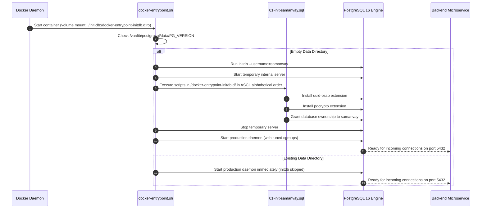

# PostgreSQL Database Initialization Scripts (`docker/init-db/`)

**Target Service:** `samanvay-ai-postgres` (PostgreSQL 16 Alpine)  
**Mount Point:** `/docker-entrypoint-initdb.d/:ro`  
**Database:** `samanvay_db`  
**Application User:** `samanvay`  

This directory contains bootstrap SQL scripts that are automatically executed by the official PostgreSQL container on its very first launch when the data directory `/var/lib/postgresql/data` is empty.

---

## 1. Script Inventory & Technical Specifications

### [01-init-samanvay.sql](file:///C:/Users/mayan/Development/Hackathons/Samanvay-AI/docker/init-db/01-init-samanvay.sql)

```sql
-- ==============================================================================
-- Samanvay-AI: PostgreSQL 16 Initialization Script
-- Project: Samanvay-AI (MoPNG / BharatCodex)
-- ==============================================================================

-- Enable standard cryptographic extensions for SHA-256 audit sealing & UUIDs
CREATE EXTENSION IF NOT EXISTS "uuid-ossp";
CREATE EXTENSION IF NOT EXISTS "pgcrypto";

-- Ensure application user has ownership & privileges
GRANT ALL PRIVILEGES ON DATABASE samanvay_db TO samanvay;

COMMENT ON DATABASE samanvay_db IS 'Samanvay-AI Relational Master Ledger & Inventory Database';
```

### Detailed Functional Breakdown:

| Directive | Purpose & Technical Impact | System Functionality Unlocked |
|---|---|---|
| `CREATE EXTENSION IF NOT EXISTS "uuid-ossp";` | Installs the OSSP UUID generator into the public schema. | Enables native `uuid_generate_v4()` execution for generating cryptographically random IDs across documents, requisition line items, and consignment manifests. |
| `CREATE EXTENSION IF NOT EXISTS "pgcrypto";` | Installs PostgreSQL's native cryptographic hashing and encryption library. | Enables cryptographic SHA-256 (`digest(..., 'sha256')`) and HMAC-SHA256 operations directly inside database triggers and queries, ensuring sovereign audit trail integrity. |
| `GRANT ALL PRIVILEGES ON DATABASE samanvay_db TO samanvay;` | Grants administrative and table creation privileges on the database to the unprivileged application service user `samanvay`. | Allows SQLAlchemy ORM in `samanvay-ai-backend` to run DDL operations, create indexes, and execute triggers under the least-privilege principle without using the superuser `postgres`. |
| `COMMENT ON DATABASE ...` | Attaches a structured metadata comment to the database cluster catalog. | Identifies the database as the Sovereign Master Relational Ledger during administrative inspection or auditing tools. |

---

## 2. Docker Boot Sequence & Initialization Lifecycle

When the PostgreSQL container boots, the official entrypoint script inspects `/var/lib/postgresql/data`. If uninitialized:



---

## 3. Subsequent Table & Trigger Initialization

Once `01-init-samanvay.sql` finishes and the backend microservice connects, the application automates table creation and trigger setup through two routines:

1. **SQLAlchemy DDL Initialization (`backend/app/models/base.py`):**
   - Creates the core schema: `inventory_items`, `requisitions`, `sovereign_audit_ledger`, `users`.
   - Runs automatic non-destructive column migrations for Indian public procurement fields (`indian_standard`, `oil_std_spec`, `gem_category_id`, `cppp_tender_ref`, `make_in_india_class`).

2. **Change Data Capture Trigger Injection (`backend/app/services/cdc_manager.py`):**
   - Installs the `cdc_outbox` table.
   - Installs the PL/pgSQL trigger function `fn_cdc_capture()`.
   - Attaches `AFTER INSERT OR UPDATE OR DELETE` triggers to `inventory_items` and `requisitions`, issuing `pg_notify('samanvay_cdc_channel', ...)` payloads.

---

## 4. Verification & Health Diagnostic Commands

To verify that extensions and privileges are correctly installed inside the live container:

```bash
# Connect to PostgreSQL CLI inside the running container
docker exec -it samanvay-ai-postgres psql -U samanvay -d samanvay_db

# Query installed extensions
SELECT extname, extversion FROM pg_extension;
-- Expected output:
--   extname  | extversion 
-- -----------+------------
--  plpgsql   | 1.0
--  uuid-ossp | 1.4
--  pgcrypto  | 1.3

# Test UUID and SHA-256 cryptographic generation
SELECT uuid_generate_v4() AS test_uuid, encode(digest('Samanvay-AI-Test', 'sha256'), 'hex') AS test_sha256;
```

---

## 5. Clean Resetting Database Initialization

Because `/docker-entrypoint-initdb.d/` only triggers on an empty volume, modifications to `01-init-samanvay.sql` require clearing the persistent Docker volume:

```bash
# Stop containers and wipe the persistent volume
docker compose -f docker/docker-compose.yml down -v

# Re-launch stack to trigger fresh initdb execution
docker compose -f docker/docker-compose.yml up -d --build
```
