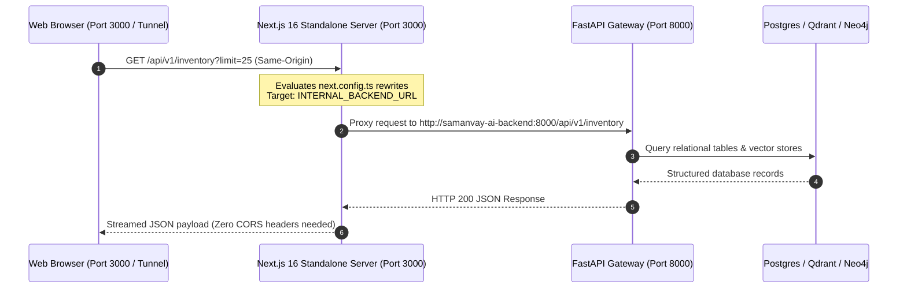
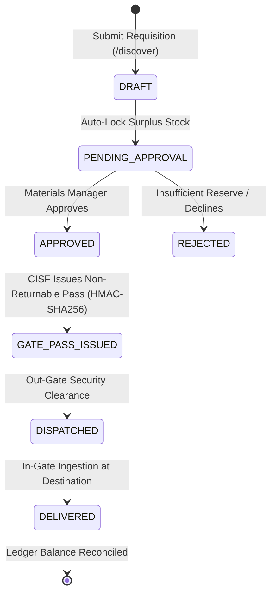

# Samanvay-AI Industrial Frontend Portal (`frontend/`)

**Framework:** Next.js 16.3.5 (App Router, Turbopack)  
**UI Core:** React 19.0.0  
**Styling:** Tailwind CSS v4.0.0  
**Target Organization:** Ministry of Petroleum & Natural Gas (MoPNG) / BharatCodex  
**Role:** Sovereign Inter-CPSE Material Coordination & Mutual Aid Web Interface  

The Samanvay-AI frontend portal delivers an industrial, high-density, utility-focused web console engineered for materials managers, site maintenance engineers, vigilance auditors, and CISF security gate officers across Indian petroleum CPSEs.

---

## 1. Core Architectural Innovations

### A. Single-Origin API Proxy Architecture (`next.config.ts`)

To maintain sovereign air-gapped security and eliminate Cross-Origin Resource Sharing (CORS) surface area, all client-side network traffic communicates strictly through the Next.js runtime origin:



In [next.config.ts](file:///C:/Users/mayan/Development/Hackathons/Samanvay-AI/frontend/next.config.ts), dynamic internal rewrites transparently route incoming `/api/v1/*` requests to the containerized FastAPI backend:

```typescript
import type { NextConfig } from 'next';

const nextConfig: NextConfig = {
  reactStrictMode: true,
  async rewrites() {
    const backendUrl = process.env.INTERNAL_BACKEND_URL || 'http://samanvay-ai-backend:8000';
    return [
      {
        source: '/api/v1/:path*',
        destination: `${backendUrl}/api/v1/:path*`,
      },
    ];
  },
};

export default nextConfig;
```

---

### B. 1-Click Evaluation Hub (25+ Demo Personas)

Located directly on the `/login` portal, the **1-Click Evaluation Hub** allows evaluators and jury members to instantly impersonate operational roles across **7 major CPSEs** plus **Central MoPNG Oversight**:

| Entity / CPSE | Unit / Facility | Available Persona Roles | Sample Seed Username |
|---|---|---|---|
| **OIL** (Oil India Limited) | Duliajan Field Headquarters, Assam | Site Engineer, Materials Manager, CISF Security Officer | `engineer_oil`, `stores_oil`, `cisf_oil` |
| **IOCL** (Indian Oil Corporation) | Panipat Mega-Refinery, Haryana | Site Engineer, Depot Warehouse In-Charge, CISF Gate Inspector | `engineer_iocl`, `stores_iocl`, `cisf_iocl` |
| **ONGC** (Oil & Natural Gas Corp.) | Uran Gas Processing Plant, Maharashtra | Site Engineer, Central Stores Officer, CISF Commander | `engineer_ongc`, `stores_ongc`, `cisf_ongc` |
| **GAIL** (GAIL India Limited) | Pata Petrochemical Complex, Uttar Pradesh | Pipeline Engineer, Materials Superintendent, CISF Inspector | `engineer_gail`, `stores_gail`, `cisf_gail` |
| **BPCL** (Bharat Petroleum Corp.) | Mahul Refinery, Mumbai, Maharashtra | Maintenance Engineer, Senior Materials Executive, CISF Inspector | `engineer_bpcl`, `stores_bpcl`, `cisf_bpcl` |
| **HPCL** (Hindustan Petroleum Corp.) | Visakh Refinery, Andhra Pradesh | Equipment Specialist, Stock Ledger In-Charge, CISF Gate Pass Officer | `engineer_hpcl`, `stores_hpcl`, `cisf_hpcl` |
| **NRL** (Numaligarh Refinery Limited)| Numaligarh Complex, Golaghat, Assam | Piping Project Lead, Warehouse Controller, CISF Gate Inspector | `engineer_nrl`, `stores_nrl`, `cisf_nrl` |
| **MoPNG Central Oversight** | Shastri Bhawan, New Delhi | Technical Authority, Vigilance Auditor (CAG), Super Admin | `tech_authority`, `auditor`, `admin` |

Selecting a persona card only prefills the username; the operator always types the password themselves — no default password exists anywhere in the client bundle, and the persona hub is hidden in production builds. Sign-in is a username/password `POST /auth/login` that establishes an HttpOnly server-side session cookie; the client keeps identity in memory only (no token storage) and restores it on reload through `GET /auth/me`, with the session-bound CSRF token attached to unsafe requests.

---

### C. Locked Tenant Header Badge

To uphold multi-tenant data boundaries and prevent cross-CPSE contamination:
- **Standard Users & Engineers:** The top header badge ([UserHeaderBadge.tsx](file:///C:/Users/mayan/Development/Hackathons/Samanvay-AI/frontend/src/components/UserHeaderBadge.tsx) and [AppShell.tsx](file:///C:/Users/mayan/Development/Hackathons/Samanvay-AI/frontend/src/components/AppShell.tsx)) displays a **read-only, locked tenant badge** with a green pulse dot displaying their assigned CPSE (`OIL`, `IOCL`, etc.) and depot ID (`DEPOT-OIL-DLJ`). Non-superadmins cannot switch tenant contexts.
- **Super Administrators (`admin`):** Access an interactive dual dropdown selector (amber badge) allowing real-time switching across all 7 CPSE tenants and specific operating units.

---

### D. Persona-Scoped Tabs on `/requests`

The Consignments Hub dynamically scopes incoming and outgoing requisitions based on the logged-in user's role and organization:

1. **`OUTGOING` Tab:** Requisitions originated by the user or demanded by their CPSE from external sister depots.
2. **`INCOMING` Tab:** Mutual-aid loan requests directed towards the user's depot or CPSE to release declared surplus.
3. **`ALL` Tab:** Full nationwide requisition ledger (default for `SUPER_ADMIN` and `VIGILANCE_AUDITOR`).



---

### E. Multi-Property Discovery Panel (`/discover`)

The Surplus Discovery interface pairs dense vector search with a multi-property engineering parameter panel:
- **Direct Specifications:** Nominal bore size (`size_nb_mm`), pressure rating (`pressure_class`, `pressure_rating_bar`), metallurgy (`ASTM A105`, `SS316`, `Duplex 2205`), facing end (`RF`, `RTJ`, `BW`).
- **Indian Procurement Compliance:** Bureau of Indian Standards (`IS 1239`, `IS 14846`, `IS 2062`), GeM Category ID, CPPP tender references, and Make In India (MII) preference classes (Class-I $\ge 50\%$, Class-II $20\%-50\%$).
- **Transit & Distance Controls:** Maximum road transit radius filter (`max_distance_km`), dynamic transit duration estimation, and Bureau of Energy Efficiency (BEE) freight carbon footprint reduction calculations ($62\text{ g } CO_2 / \text{tonne-km}$).

---

### F. Mobile-Responsive Navigation & Touch Optimization

- **Slide-Out Sheet:** Built into [AppShell.tsx](file:///C:/Users/mayan/Development/Hackathons/Samanvay-AI/frontend/src/components/AppShell.tsx) and [Sidebar.tsx](file:///C:/Users/mayan/Development/Hackathons/Samanvay-AI/frontend/src/components/Sidebar.tsx). On mobile and rugged tablet displays ($<768$px), the sidebar transitions into an off-canvas drawer with backdrop blur.
- **Touch Target Sizing:** All interactive buttons, tabs, modal dismissals, and quick-login selectors enforce touch target heights and widths $>44$px in compliance with WCAG 2.1 touch target guidelines.
- **Scroll Lock:** Background page scrolling is automatically locked when sheets or modals are open.

---

### G. Server Components, Staged Loading & Role Workspaces

- **Zero-Client Landing Portal:** The root landing page (`/`, [page.tsx](file:///C:/Users/mayan/Development/Hackathons/Samanvay-AI/frontend/src/app/page.tsx)) is compiled as a pure React Server Component (RSC) without client JavaScript overhead. Dynamic authentication state is isolated to the leaf component [LandingAuthCTA.tsx](file:///C:/Users/mayan/Development/Hackathons/Samanvay-AI/frontend/src/components/LandingAuthCTA.tsx).
- **Staged Dashboard Parallel Fetching:** The operational dashboard (`/dashboard`) performs fault-tolerant parallel data loading (`Promise.allSettled`) across inventory statistics, active consignments, audit chains, and CPSE footprints.
- **5-Metric Executive KPI Strip:** [KpiStrip.tsx](file:///C:/Users/mayan/Development/Hackathons/Samanvay-AI/frontend/src/components/dashboard/KpiStrip.tsx) visualizes Cataloged Items, Available Surplus, Locked Reserved, Allocated Value, and an animated pulse indicator for Human-In-The-Loop (HITL) pending reviews.
- **Role-Tailored Operational Workspaces:** The dashboard dynamically switches between six specialized workspaces based on authenticated persona:
  1. `SiteEngineerWorkspace`: Quick radar discovery shortcuts and active outgoing requisitions.
  2. `MaterialsManagerWorkspace`: Prioritized HITL review queue, high-value surplus items, and stock movement actions.
  3. `TechnicalAuthorityWorkspace`: MTC compliance metrics, carbon equivalent analysis ($CE_{\text{IIW}}$), and standard specifications.
  4. `CisfWorkspace`: Non-returnable gate pass management, driver credentials, and in-transit dispatch tracking.
  5. `VigilanceAuditorWorkspace`: Real-time cryptographic SHA-256 chain verification, anomalous allocations, and CSV export.
  6. `SuperAdminWorkspace`: Pan-CPSE allocation distribution, depot balance overview, and user access control.
- **Accessible Interactive Dialogs:** Replaced all browser-native popups (`alert`, `prompt`) with accessible `<Modal>` components for rejection reasons and CISF logistics data entry (vehicle number, driver name, contact info).

---

## 2. Directory Layout

```
frontend/
├── package.json              # Next.js 16.3.5, React 19, Tailwind CSS v4, Lucide icons
├── tsconfig.json             # Strict TypeScript configuration
├── next.config.ts            # Next.js runtime configuration & single-origin /api/v1/* proxy
├── postcss.config.mjs        # Tailwind v4 PostCSS compilation
└── src/
    ├── app/                  # Next.js App Router
    │   ├── globals.css       # Tailwind CSS v4 directives & utility classes
    │   ├── layout.tsx        # Master root layout with ThemeProvider & AppShell
    │   ├── loading.tsx       # Global root loading skeleton boundary
    │   ├── error.tsx         # Global fault-tolerant error boundary
    │   ├── page.tsx          # Public Landing Portal (React Server Component)
    │   ├── dashboard/        # Operational Command Center: KpiStrip, role workspaces
    │   ├── inventory/        # Stock Ledger: 5,000 items, server pagination, filters, HITL review
    │   ├── discover/         # Surplus Discovery: Multi-property radar, 21-rule breakdown, orders
    │   ├── requests/         # Consignments Hub: persona-scoped tabs, interactive modals
    │   │   └── [id]/         # Consignment Detail: milestone stepper, CISF gate pass & QR code
    │   ├── audit/            # Sovereign Audit Trail: SHA-256 chain verification & CSV export
    │   ├── upload/           # Document Intake: PyMuPDF / PaddleOCR intake list
    │   │   └── review/       # MTC Inspection: chemical breakdown, CE_IIW calculation, direct POST
    │   ├── login/            # Seed persona directory (dev builds) + username/password sign-in
    │   ├── signup/           # Informational page — public self-registration is retired
    │   └── admin/            # Multi-Tenant Administration & user approval
    ├── components/           # Reusable UI primitives
    │   ├── AppShell.tsx      # Master layout frame, locked header badge, mobile drawer
    │   ├── Sidebar.tsx       # Navigation bar with role-based routing & theme switcher
    │   ├── CommandPalette.tsx# Global keyboard shortcut palette (⌘K)
    │   ├── ProtectedRoute.tsx# Role-based route guard redirecting unauthenticated sessions
    │   ├── PublicNavbar.tsx  # Minimal top navigation for landing and authentication pages
    │   ├── LandingAuthCTA.tsx# Client auth CTA buttons for RSC landing page
    │   ├── QRCodeSVG.tsx     # Air-gapped SVG QR code renderer for CISF gate passes
    │   ├── UserHeaderBadge.tsx # Locked tenant badge for non-superadmins
    │   ├── ThemeProvider.tsx # Light/Dark theme context (defaults to Light Mode)
    │   ├── dashboard/        # Dashboard modular components
    │   │   ├── KpiStrip.tsx  # 5-card metric strip with HITL review pulse indicator
    │   │   └── workspaces/   # Persona-specific command workspaces
    │   │       ├── SiteEngineerWorkspace.tsx
    │   │       ├── MaterialsManagerWorkspace.tsx
    │   │       ├── TechnicalAuthorityWorkspace.tsx
    │   │       ├── CisfWorkspace.tsx
    │   │       ├── VigilanceAuditorWorkspace.tsx
    │   │       └── SuperAdminWorkspace.tsx
    │   └── ui/               # Modal, Card, KpiCard, StatusBadge, SideDrawer, Skeleton primitives
    ├── context/
    │   └── AuthContext.tsx   # Authentication context: memory-only identity, HttpOnly session-cookie restore via /auth/me, seed persona list
    └── lib/
        ├── api.ts            # Typed REST API client targeting /api/v1/* proxy endpoints
        ├── constants.ts      # CPSE depots, status colors, standard categories
        ├── exportUtils.ts    # RFC 4180 compliant CSV export generator
        ├── formatters.ts     # Currency (INR Lakh/Crore) and physical unit formatters
        └── types.ts          # Core TypeScript type definitions
```

---

## 3. Operational Route Specifications

| Route | View Name | Backend API Endpoints | Functionality |
|---|---|---|---|
| `/` | **Landing Portal** | Static | Pure React Server Component (RSC) landing page with zero client bundle overhead; authentication buttons delegated to client leaf `LandingAuthCTA.tsx`. |
| `/dashboard` | **Command Center** | `GET /inventory/stats`<br>`GET /requisition/`<br>`GET /audit/?limit=5`<br>`GET /audit/verify` | Staged parallel loading (`Promise.allSettled`) with 5-card `KpiStrip` (Cataloged Items, Surplus, Reserved, Value, HITL review pulse) and 6 persona-tailored operational workspace views. |
| `/inventory` | **Stock Ledger** | `GET /inventory?skip=..&limit=25`<br>`GET /inventory/hitl-queue`<br>`PUT /inventory/{sku}/status` | Server-paginated table across 5,000 catalog items. Filters by CPSE, category, status, and dialect text search. Includes technical specification modal (BIS IS standards, OIL MESC codes, GeM IDs, MII %) and status transition actions (`Broadcast`, `Retract`). |
| `/discover` | **Surplus Discovery** | `GET /graph/discover`<br>`POST /match/search`<br>`POST /requisition/` | Multi-property Pre-Purchase Radar querying sister CPSE surplus with 21-rule engineering tolerance, continuous ML score, road transit distance, and inline requisition submission modal. |
| `/requests` | **Consignments Hub** | `GET /requisition/`<br>`PUT /requisition/{id}/approve`<br>`PUT /requisition/{id}/reject`<br>`POST /requisition/{id}/gatepass`<br>`PUT /requisition/{id}/dispatch`<br>`PUT /requisition/{id}/deliver` | Persona-scoped mutual-aid transfer order management with live workflow actions and accessible `<Modal>` dialogs for rejection reason input and CISF gate pass logistics (vehicle, driver). |
| `/requests/[id]` | **Requisition Detail** | `GET /requisition/{id}` | Detailed requisition parameters, 5-stage lifecycle milestone stepper, CISF non-returnable gate pass, and offline air-gapped SVG QR code. |
| `/audit` | **Audit Trail** | `GET /audit/`<br>`GET /audit/verify`<br>`GET /audit/export-csv` | Sovereign SHA-256 Merkle chain verification, CSV export for audit authorities, category/CPSE filters, and block transaction payload inspector. |
| `/upload` | **Document Intake** | `POST /ingest/document`<br>`GET /ingest/documents` | Upload PDF or image Material Test Certificates (MTCs), delivery challans, and invoices for dual-path OCR parsing. Displays recent intake ledger. |
| `/upload/review` | **MTC Inspection** | `sessionStorage`<br>`POST /inventory/` | Visual chemical analysis breakdown ($\%C, \%Mn, \%Si, \%P, \%S$), IIW Carbon Equivalent ($CE_{\text{IIW}}$) calculation, weldability classification, and direct SKU creation into PostgreSQL ledger via `POST /inventory/`. |
| `/login` | **Sign-In Portal** | `GET /auth/seed-users`<br>`POST /auth/login`<br>`GET /auth/me`<br>`GET /auth/csrf` | Username/password sign-in establishing the HttpOnly server-side session cookie (persona directory prefills usernames in non-production builds only). |
| `/signup` | **Registration Notice** | — (retired) | Informational "registration unavailable" page. Public self-registration is disabled; accounts are created only through authenticated administrative provisioning (`POST /auth/users`). |
| `/admin/users` | **User Approvals** | `GET /auth/users`<br>`POST /auth/users/{id}/approve`<br>`POST /auth/users/{id}/reject` | Administrative console for the Super Admin to list accounts and approve or reject pending provisioning requests. |

---

## 4. Local Development & Production Execution

Commands to run from inside the `frontend/` directory:

```bash
# 1. Install dependencies
npm install

# 2. Run local development server with Turbopack (http://localhost:3000)
npm run dev

# 3. Create production standalone build
npm run build

# 4. Start production standalone server
npm run start

# 5. Run ESLint code quality checks
npm run lint
```
