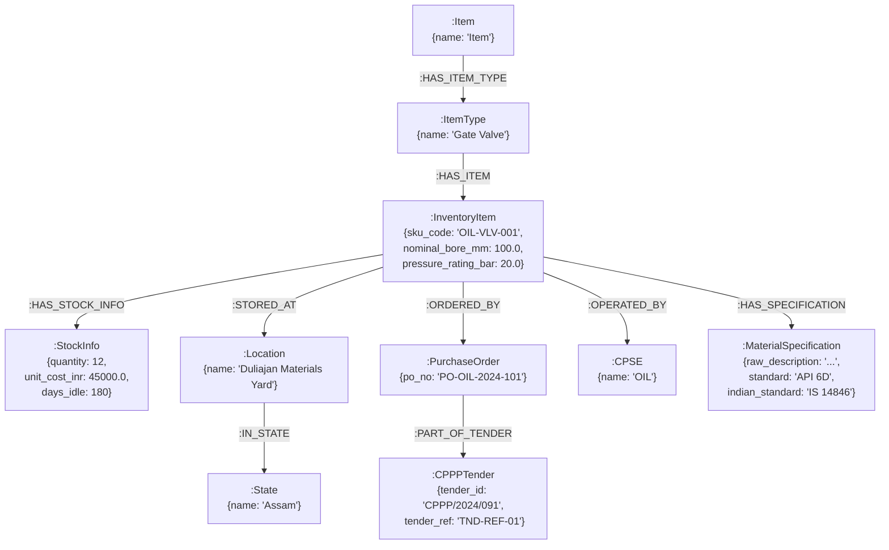

# Knowledge Graph & Logistics Topology (`graph/`)

This directory implements the **Neo4j 5.20 Knowledge Graph**, multi-CPSE asset ownership hierarchy, inter-plant transit logistics engine, and Change Data Capture (CDC) synchronization subsystem for **Samanvay-AI**.

While dense vector retrieval identifies semantic proximity, the knowledge graph provides **topological, physical, and organizational awareness**:
- Models the physical asset hierarchy across 7 public sector enterprises (**OIL**, **NRL**, **IOCL**, **ONGC**, **BPCL**, **HPCL**, and **GAIL**).
- Implements strict **CPSE-scoped data isolation** and **Attribute-Level Privacy** (shielding commercial prices and tender references on cross-enterprise queries).
- Models spatial coordinates across critical refinery and exploration depots spanning India.
- Computes multi-modal road transit logistics, great-circle distances, road tortuosity routing ($1.28\times$), transit durations, freight economics, and green logistics carbon savings ($CO_2$).
- Provides deterministic compatibility search against verified physical properties (`nominal_bore_mm`, `pressure_rating_bar`) with explicit outcomes and zero speculation.
- Synchronizes inventory and requisition transactional state in real time from PostgreSQL outbox tables.

---

## 1. Approved Knowledge Graph Architecture

The knowledge graph strictly adheres to the approved unified architecture as its single source of truth:

```text
(:Item {name})
  -[:HAS_ITEM_TYPE]->
(:ItemType {name})
  -[:HAS_ITEM]->
(:InventoryItem {
    sku_code,
    heat_no,
    nominal_bore_mm,
    pressure_rating_bar,
    make_in_india_class,
    local_content_percentage
})

InventoryItem
  -[:HAS_STOCK_INFO]->
StockInfo {quantity, unit_cost_inr, days_idle}

InventoryItem
  -[:STORED_AT]->
Location {name}
  -[:IN_STATE]->
State {name}

InventoryItem
  -[:ORDERED_BY]->
PurchaseOrder {po_no}
  -[:PART_OF_TENDER]->
CPPPTender {tender_id, tender_ref}

InventoryItem
  -[:OPERATED_BY]->
CPSE {name}

InventoryItem
  -[:HAS_SPECIFICATION]->
MaterialSpecification {
    raw_description,
    standard,
    hsn_code,
    mesc_code,
    gem_category,
    gem_category_id,
    indian_standard,
    oil_std_spec,
    oil_material_code
}
```



> [!IMPORTANT]
> **Strict Schema Boundaries:**
> Separate property nodes (`Depot`, `CanonicalMaterial`, `Heat`, `Size`, `PressureClass`, `MaterialGrade`, generic `Property` nodes, or separate specification/code nodes) are strictly prohibited and excluded from this graph.
> Engineering dimensions and pressure ratings are stored directly on `:InventoryItem` as `nominal_bore_mm` and `pressure_rating_bar`.

---

## 2. File-by-File Technical Breakdown

### [`schema.py`](schema.py) — Graph Ontologies & CPSE Registry
Defines the standard node labels, relationship types, and the single source of truth for valid CPSE organizations.

- **`NodeTypes`**:
  - `ITEM` (`Item`)
  - `ITEM_TYPE` (`ItemType`)
  - `INVENTORY_ITEM` (`InventoryItem`)
  - `STOCK_INFO` (`StockInfo`)
  - `LOCATION` (`Location`)
  - `STATE` (`State`)
  - `PURCHASE_ORDER` (`PurchaseOrder`)
  - `CPPP_TENDER` (`CPPPTender`)
  - `CPSE` (`CPSE`)
  - `MATERIAL_SPECIFICATION` (`MaterialSpecification`)

- **`RelTypes`**:
  - `HAS_ITEM_TYPE`, `HAS_ITEM`, `HAS_STOCK_INFO`, `STORED_AT`, `IN_STATE`, `ORDERED_BY`, `PART_OF_TENDER`, `OPERATED_BY`, `HAS_SPECIFICATION`.

- **`VALID_CPSES`**:
  - Registered sovereign CPSE organizations: `OIL`, `NRL`, `IOCL`, `ONGC`, `BPCL`, `HPCL`, `GAIL`.

---

### [`seed_graph.py`](seed_graph.py) — CSV Ingestion & Validation
Parses the master catalog dataset and seeds the Neo4j database using high-throughput Cypher batches.

- **`validate_cpse_name(cpse_raw, row_number=None) -> str`**:
  - Validates `cpse_name` against `VALID_CPSES`.
  - Rejects missing values, empty strings, and unknown enterprises with detailed exception reporting (including row number and reason).
  - **Never silently defaults an invalid or missing CPSE to `"OIL"`**.
- **`parse_csv_row(row, row_number=None) -> Dict[str, Any]`**:
  - Normalizes and types CSV fields into the approved schema structure.
- **`GraphSeeder`**:
  - `create_constraints()`: Enforces uniqueness on `Item.name`, `ItemType.name`, `InventoryItem.sku_code`, `StockInfo.sku_code`, `Location.name`, `State.name`, `PurchaseOrder.po_no`, `CPPPTender.tender_id`, `CPSE.name`, and `MaterialSpecification.sku_code`.
  - `seed_from_csv(...)`: Batches rows via `UNWIND $rows AS row` and tracks all rejected rows with explicit logging.

---

### [`queries.py`](queries.py) — Cypher Query Engine & Access Scoping
Encapsulates parameterized Cypher queries with strict data-access layer security and attribute-level privacy.

- **Access Policy Enforcement**:
  - **In-Tenant Queries (`item.cpse == requesting_cpse`)**: Full item subgraph returned, including sensitive procurement data (`unit_cost_inr`, `po_no`, `tender_id`).
  - **Cross-Tenant Queries (`item.cpse != requesting_cpse`)**: Requires explicit authorization (`allow_cross_cpse=True`). Commercial prices (`unit_cost_inr`) and procurement IDs (`po_no`, `tender_id`, `tender_ref`) are stripped.
  - **Unauthorized Access**: If an unauthenticated caller or unauthorized CPSE attempts to access another CPSE's item with a SKU alone (`allow_cross_cpse=False`), the query engine raises a `PermissionError`.
- **Query Methods**:
  - `get_item_by_sku(sku_code, requesting_cpse=None, allow_cross_cpse=None)`: Retrieves complete subgraph for a given SKU.
  - `get_items_by_item_type(item_type_name, limit=50, requesting_cpse=None, allow_cross_cpse=None)`: Scoped list of items by ItemType.
  - `get_items_by_state(state_name, limit=50, requesting_cpse=None, allow_cross_cpse=None)`: Scoped list of items stored in a designated State.
  - `get_items_by_location(location_name, limit=50, requesting_cpse=None, allow_cross_cpse=None)`: Scoped list of items at a depot Location.
  - `get_cpse_surplus(cpse_name, min_days_idle=0, limit=50, requesting_cpse=None, allow_cross_cpse=None)`: Lists surplus items for an enterprise.
  - `get_idle_items(min_days_idle=90, limit=50, requesting_cpse=None, allow_cross_cpse=None)`: Discovers dormant items across depots.
  - `get_item_specification(sku_code, requesting_cpse=None, allow_cross_cpse=None)`: Fetches consolidated MaterialSpecification properties.
  - `get_item_hierarchy(sku_code, requesting_cpse=None, allow_cross_cpse=None)`: Returns hierarchical path from root `Item` to branches.
  - `find_compatible_surplus(item_type, nominal_bore_mm, pressure_rating_bar, ...)`: Deterministic physical compatibility search.

---

### [`syncer.py`](syncer.py) — PostgreSQL Outbox to Neo4j CDC Syncer
Real-time Change Data Capture (CDC) synchronization conforming to the approved graph structure.

- **`Neo4jSyncer`**:
  - `update_item(...)`: Updates dynamic stock parameters (`quantity`, `unit_cost_inr`, `days_idle`) and physical properties.
  - `batch_sync_inventory(items, batch_size=500)`: Ingests inventory batches into the approved graph schema with CPSE validation.
  - `sync_event(table_name, operation, payload)`: Dispatches transactional CDC events.

---

### [`logistics.py`](logistics.py) — Inter-Depot Spatial Routing & Green Logistics
Computes interstate transit logistics, road routing, and carbon emissions savings across Indian PSU facilities.

- **`DEPOT_COORDINATES`**: GPS coordinates for major refineries and exploration supply bases across all 7 CPSEs.
- **`haversine_distance(lat1, lon1, lat2, lon2) -> float`**: Great-circle spherical distance ($R = 6,371\text{ km}$).
- **`road_distance(lat1, lon1, lat2, lon2) -> float`**: Applies the $1.28\times$ Indian National Highway tortuosity factor.
- **`estimate_transit_hours(distance_km) -> float`**: Computes transit time assuming $40\text{ km/h}$ heavy commercial haul + $4.0\text{ hr}$ logistics/checkpoint buffer.
- **`estimate_freight_cost_inr(distance_km, weight_kg) -> float`**: Container road freight cost modeling (CONCOR baseline $\approx ₹5.00/\text{ton-km}$).
- **`compute_co2_saved(distance_km) -> float`**: Evaluates carbon reduction of domestic mutual aid versus overseas emergency imports.
- **`compute_route_summary(...)`** & **`get_nearest_depots(...)`**: Inter-depot route summary metrics.

---

## 3. Engineering Compatibility Search (`find_compatible_surplus`)

### Principles and Guardrails
1. **Verified Physical Properties Only**: Matching operates on structured properties stored in `:InventoryItem`:
   - `nominal_bore_mm`: Exact dimensional match ($\pm 0.1\text{ mm}$ tolerance).
   - `pressure_rating_bar`: Safe rating threshold (candidate item's pressure rating must be $\ge$ required pressure rating).
2. **Zero Hallucination / Zero Guessing**:
   - `nominal_bore_mm` and `pressure_rating_bar` must be valid positive values.
   - Missing required engineering properties result in an immediate, explicit `ValueError`.
   - The graph engine never guesses engineering parameters from description strings or claims safety based on text similarity.
3. **Explicit Outcome Classification**:
   - `EXACT_SPECIFICATION_MATCH`: Candidate pressure rating exactly matches required rating.
   - `SAFE_PRESSURE_UPGRADE`: Candidate pressure rating exceeds required rating.
4. **Attribute-Level Commercial Privacy**:
   - On cross-CPSE mutual aid queries, candidate items are surfaced to locate surplus, but `unit_cost_inr` and internal procurement references are strictly stripped.

---

## 4. Cypher Traversal Examples (Approved Unified Schema)

### 1. Retrieve Complete Item Subgraph by SKU
```cypher
MATCH (item:InventoryItem {sku_code: 'OIL-STU-00001'})
OPTIONAL MATCH (root:Item)-[:HAS_ITEM_TYPE]->(it:ItemType)-[:HAS_ITEM]->(item)
OPTIONAL MATCH (item)-[:HAS_STOCK_INFO]->(stock:StockInfo)
OPTIONAL MATCH (item)-[:STORED_AT]->(loc:Location)-[:IN_STATE]->(state:State)
OPTIONAL MATCH (item)-[:ORDERED_BY]->(po:PurchaseOrder)-[:PART_OF_TENDER]->(tender:CPPPTender)
OPTIONAL MATCH (item)-[:OPERATED_BY]->(cpse:CPSE)
OPTIONAL MATCH (item)-[:HAS_SPECIFICATION]->(spec:MaterialSpecification)
RETURN
    root.name AS root_item,
    it.name AS item_type,
    item.sku_code AS sku_code,
    item.nominal_bore_mm AS nominal_bore_mm,
    item.pressure_rating_bar AS pressure_rating_bar,
    stock.quantity AS quantity,
    stock.unit_cost_inr AS unit_cost_inr,
    loc.name AS location,
    state.name AS state,
    cpse.name AS cpse,
    po.po_no AS po_no,
    tender.tender_id AS tender_id,
    spec.raw_description AS raw_description;
```

### 2. Physical Compatibility Traversal with Pressure Upgrade
```cypher
MATCH (root:Item)-[:HAS_ITEM_TYPE]->(it:ItemType {name: 'Gate Valve'})-[:HAS_ITEM]->(item:InventoryItem)
MATCH (item)-[:HAS_STOCK_INFO]->(stock:StockInfo)
MATCH (item)-[:STORED_AT]->(loc:Location)-[:IN_STATE]->(state:State)
MATCH (item)-[:OPERATED_BY]->(cpse:CPSE)
OPTIONAL MATCH (item)-[:HAS_SPECIFICATION]->(spec:MaterialSpecification)
WHERE abs(item.nominal_bore_mm - 100.0) < 0.1
  AND item.pressure_rating_bar >= 20.0
  AND stock.quantity > 0
  AND stock.days_idle >= 90
RETURN
    item.sku_code AS sku_code,
    it.name AS item_type,
    item.nominal_bore_mm AS nominal_bore_mm,
    item.pressure_rating_bar AS pressure_rating_bar,
    stock.quantity AS quantity,
    stock.days_idle AS days_idle,
    loc.name AS location,
    state.name AS state,
    cpse.name AS cpse,
    spec.raw_description AS raw_description
ORDER BY stock.days_idle DESC, item.pressure_rating_bar ASC;
```

---

## 5. Python Usage Examples

```python
from graph.queries import GraphQuerier
from graph.logistics import compute_route_summary

# 1. Inter-Depot Logistics
route = compute_route_summary(
    source_depot_id="OIL Duliajan",
    target_depot_id="Numaligarh",
    weight_kg=1500.0,
)
print(f"Road Distance: {route['road_distance_km']} km")
print(f"Transit Duration: {route['estimated_transit_hours']} hrs")
print(f"Carbon Saved: {route['co2_saved_kg']} kg CO2")

# 2. CPSE-Scoped Querier
querier = GraphQuerier(requesting_cpse="OIL")
try:
    # In-tenant access: returns full item with pricing
    oil_item = querier.get_item_by_sku("OIL-STU-00001")
    print(f"In-Tenant SKU: {oil_item['item']['sku_code']}, Price: {oil_item['stock']['unit_cost_inr']}")

    # Cross-CPSE mutual aid compatibility search
    candidates = querier.find_compatible_surplus(
        item_type="Gate Valve",
        nominal_bore_mm=100.0,
        pressure_rating_bar=20.0,
        allow_cross_cpse=True,
    )
    for c in candidates:
        # Commercial prices for non-OIL items are automatically stripped
        print(f"Found candidate {c['sku_code']} from {c['cpse']} (Status: {c['compatibility_status']})")
finally:
    querier.close()
```

---

## 6. Testing & Verification

Run the test suite for schema validation, CSV parsing, compatibility behavior, and access scoping:

```bash
# Compile check
uv run python -m compileall graph

# Run graph schema, CSV validation, and mock query tests
uv run pytest tests/unit/test_graph_schema_and_queries.py -v

# Run logistics calculations unit tests
uv run pytest tests/unit/test_logistics.py -v
```
