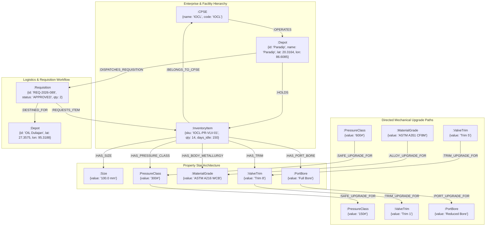

# Knowledge Graph & Logistics Topology (`graph/`)

This directory implements the **Neo4j 5.20 Property Star Knowledge Graph**, multi-CPSE asset ownership hierarchy, inter-plant transit logistics engine, and Change Data Capture (CDC) synchronization subsystem for **Samanvay-AI**.

While dense vector retrieval identifies semantic proximity, the knowledge graph provides **topological and physical awareness**:
- Models the physical asset hierarchy across 7 public sector enterprises (**OIL**, **NRL**, **IOCL**, **ONGC**, **BPCL**, **HPCL**, and **GAIL**).
- Models spatial coordinates across 19 critical refinery and exploration depots spanning India.
- Computes multi-modal road transit logistics, great-circle distances, road tortuosity routing, transit durations, freight economics, and green logistics carbon savings ($CO_2$).
- Represents mechanical compatibility as directed graph edges (`SAFE_UPGRADE_FOR`, `ALLOY_UPGRADE_FOR`, `TRIM_UPGRADE_FOR`, `PORT_UPGRADE_FOR`), enabling Cypher graph traversal of transitive substitution paths.
- Synchronizes inventory and requisition transactional state in real time from PostgreSQL outbox tables.

---

## 1. Knowledge Graph Schema & Star Topology



---

## 2. File-by-File Technical Breakdown

### [`schema.py`](file:///C:/Users/mayan/Development/Hackathons/Samanvay-AI/graph/schema.py) — Graph Ontologies & Enums
Defines standard node labels, property star relationship types, and mechanical compatibility edge taxonomies.

- **[`NodeTypes`](file:///C:/Users/mayan/Development/Hackathons/Samanvay-AI/graph/schema.py#L3-L24)**:
  - Enterprise Nodes: `CPSE`, `DEPOT`, `INVENTORY_ITEM`, `CANONICAL_MATERIAL`.
  - Physical Property Nodes: `SIZE`, `PRESSURE_CLASS`, `PRESSURE_RATING`, `MATERIAL_GRADE`, `PIPE_SCHEDULE`, `FLANGE_FACING`, `END_CONNECTION`, `VALVE_TRIM`, `PORT_BORE`, `FIRE_SAFE_RATING`, `VALVE_OPERATOR`, `PIPE_MFG_METHOD`, `END_PREP`, `PIPE_COATING`.
  - Procurement & Standards Nodes: `GEM_CATEGORY`, `UNSPSC_COMMODITY`.

- **[`RelTypes`](file:///C:/Users/mayan/Development/Hackathons/Samanvay-AI/graph/schema.py#L25-L45)**:
  - Star Graph Connectors: `OPERATES`, `HOLDS`, `HAS_SIZE`, `HAS_PRESSURE_CLASS`, `HAS_BODY_METALLURGY`, `HAS_TRIM`, `HAS_PORT_BORE`, `HAS_FACING`, `HAS_END_CONNECTION`, `HAS_FIRE_SAFE_RATING`, `HAS_OPERATOR`, `HAS_SCHEDULE`, `HAS_PRESSURE_RATING`, `HAS_MANUFACTURING_METHOD`, `HAS_END_PREP`, `HAS_COATING`, `STANDARDIZED_AS`, `CLASSIFIED_UNDER`, `MAPPED_TO`.

- **[`CompatEdges`](file:///C:/Users/mayan/Development/Hackathons/Samanvay-AI/graph/schema.py#L46-L53)**:
  - Directed Mechanical Substitutions: `EXACT_MATCH`, `SAFE_UPGRADE_FOR`, `ALLOY_UPGRADE_FOR`, `TRIM_UPGRADE_FOR`, `PORT_UPGRADE_FOR`, `COMPATIBLE_WITH`.

---

### [`logistics.py`](file:///C:/Users/mayan/Development/Hackathons/Samanvay-AI/graph/logistics.py) — Haversine & Carbon Freight Calculations
Computes inter-depot freight logistics, transit times, and environmental carbon savings.

- **[`DEPOT_COORDINATES`](file:///C:/Users/mayan/Development/Hackathons/Samanvay-AI/graph/logistics.py#L4-L40)**:
  - Registry of 19 critical refinery depots and exploration bases across 7 CPSEs with exact GPS coordinates:
    - **OIL:** Central Materials Warehouse Duliajan `(27.3575, 95.3188)`, Moran Supply Base `(27.1856, 94.9282)`, Digboi `(27.3826, 95.6262)`, Guwahati Pipeline HQ `(26.1855, 91.8214)`, Jorhat Subsurface Base `(26.7509, 94.2037)`, Jodhpur Heavy Oil Base `(26.2389, 73.0243)`, Kakinada Offshore Depot `(16.9891, 82.2475)`.
    - **NRL:** Numaligarh Refinery Yard `(26.5982, 93.7543)`.
    - **ONGC:** Assam Asset Nazira `(26.9183, 94.7342)`, Hazira Gas Processing Plant `(21.1000, 72.6500)`, Ankleshwar `(21.6263, 73.0025)`, Uran Gas Complex `(18.8789, 72.9341)`, Mumbai High Logistics Base `(19.3700, 71.3800)`, Rajahmundry `(17.0005, 81.8040)`.
    - **IOCL:** Panipat `(29.3909, 76.9635)`, Mathura `(27.4924, 77.6737)`, Koyali `(22.3217, 73.1384)`, Paradip `(20.3164, 86.6085)`, Barauni `(25.4714, 85.9990)`, Guwahati `(26.1445, 91.7362)`, Digboi `(27.3834, 95.6228)`.
    - **BPCL:** Mumbai Mahul Refinery `(19.0252, 72.8890)`, Kochi Refinery `(9.9312, 76.2673)`, Bina Refinery `(24.1814, 78.1292)`.
    - **HPCL:** Mumbai Refinery `(19.0176, 72.8562)`, Visakh Refinery `(17.6868, 83.2185)`.
    - **GAIL:** Pata Petrochemicals `(26.4600, 80.5400)`, Vijaipur Gas Processing Complex `(24.1084, 77.2905)`.

- **[`haversine_distance(lat1, lon1, lat2, lon2) -> float`](file:///C:/Users/mayan/Development/Hackathons/Samanvay-AI/graph/logistics.py#L42-L56)**:
  - Great-circle distance over the Earth's spherical surface ($R = 6,371.0\text{ km}$):
    $$d = 2R \arcsin \left( \sqrt{ \sin^2\left(\frac{\Delta \phi}{2}\right) + \cos(\phi_1)\cos(\phi_2)\sin^2\left(\frac{\Delta \lambda}{2}\right) } \right)$$

- **[`road_distance(lat1, lon1, lat2, lon2) -> float`](file:///C:/Users/mayan/Development/Hackathons/Samanvay-AI/graph/logistics.py#L58-L60)**:
  - Applies the **1.28x Indian National Highway Tortuosity Factor** to account for terrain, bypass detours, and road network geometry:
    $$\text{Road Distance (km)} = \text{Haversine Distance} \times 1.28$$

- **[`estimate_transit_hours(distance_km: float) -> float`](file:///C:/Users/mayan/Development/Hackathons/Samanvay-AI/graph/logistics.py#L62-L64)**:
  - Estimates heavy commercial vehicle transit duration assuming an average haul speed of $40\text{ km/h}$ plus a $4.0\text{ hours}$ operational buffer for inter-state commercial checkpoints, toll queues, and loading/unloading:
    $$\text{Transit Hours} = \frac{\text{Distance (km)}}{40.0} + 4.0$$

- **[`estimate_freight_cost_inr(distance_km: float, weight_kg: float) -> float`](file:///C:/Users/mayan/Development/Hackathons/Samanvay-AI/graph/logistics.py#L66-L70)**:
  - Models Indian container road transport economics (CONCOR baseline tariff $\approx 5.0\text{ INR}/\text{km-tonne}$):
    $$\text{Cost (INR)} = \text{Distance (km)} \times \left(\frac{\text{Weight (kg)}}{1000.0}\right) \times 5.0$$

- **[`compute_co2_saved(distance_km: float) -> float`](file:///C:/Users/mayan/Development/Hackathons/Samanvay-AI/graph/logistics.py#L72-L76)**:
  - Evaluates environmental savings of domestic inter-CPSE surplus transfer versus foreign emergency air/sea imports:
    - Overseas shipping: $10,000\text{ km}$ voyage at $10\text{ g } CO_2/\text{tonne-km}$.
    - Domestic road freight: Bureau of Energy Efficiency (BEE) freight emission factor of $0.0612\text{ kg } CO_2/\text{tonne-km}$ ($\sim 60\text{ g } CO_2/\text{tonne-km}$).
    $$\text{CO}_2\text{ Saved (kg)} = \frac{100,000 - (\text{Distance (km)} \times 60)}{1000.0} \times \text{Tonnes}$$

- **[`get_nearest_depots(depot_id, top_n=5)`](file:///C:/Users/mayan/Development/Hackathons/Samanvay-AI/graph/logistics.py#L78-L92)** & **[`compute_route_summary(source, target, weight)`](file:///C:/Users/mayan/Development/Hackathons/Samanvay-AI/graph/logistics.py#L93-L113)**:
  - Returns road distance, transit hours, freight cost, and $CO_2$ impact for inter-depot corridors.

---

### [`queries.py`](file:///C:/Users/mayan/Development/Hackathons/Samanvay-AI/graph/queries.py) — Cypher Query Repository
Encapsulates high-performance, parameterized Cypher statements executed through Bolt driver sessions.

- **[`GraphQuerier`](file:///C:/Users/mayan/Development/Hackathons/Samanvay-AI/graph/queries.py#L11-L107)**:
  - `find_compatible_surplus(item_type, size, pressure_class, metallurgy, facing=None) -> List[Dict[str, Any]]`:
    - Executes zero-tolerance matching on dimension (`:Size`), while traversing multi-hop directed upgrade edges on pressure classes (`[:SAFE_UPGRADE_FOR*]`) and alloy metallurgy (`[:ALLOY_UPGRADE_FOR*]`).
    - Joins sovereign CPSE and depot coordinates to locate candidate surplus items.
  - `get_depot_surplus(depot_id: str)`: Lists all idle items held at a specific warehouse.
  - `get_cpse_surplus(cpse_code: str)`: Returns aggregate surplus line items across all depots owned by an enterprise.
  - `get_item_property_star(sku_code: str)`: Traverses all `HAS_*` outbound edges from an `InventoryItem` node.

---

### [`syncer.py`](file:///C:/Users/mayan/Development/Hackathons/Samanvay-AI/graph/syncer.py) — PostgreSQL Outbox to Neo4j CDC Syncer
Translates transactional change events from PostgreSQL into Cypher property graph mutations in real time.

- **[`Neo4jSyncer`](file:///C:/Users/mayan/Development/Hackathons/Samanvay-AI/graph/syncer.py#L18-L338)**:
  - `ensure_constraints()`: Enforces unique database constraints on `(c:CPSE.name)`, `(d:Depot.id)`, `(i:InventoryItem.sku)`, `(s:Size.value)`, `(p:PressureClass.value)`, `(m:MaterialGrade.value)`, and `(r:Requisition.id)`.
  - `sync_inventory_item(item: Dict[str, Any])`: Merges `CPSE`, `Depot`, and `InventoryItem` nodes; links ownership via `[:OPERATES]` and `[:HOLDS]`; establishes property star edges (`[:HAS_SIZE]`, `[:HAS_PRESSURE_CLASS]`, `[:HAS_BODY_METALLURGY]`).
  - `batch_sync_inventory(items: List[Dict[str, Any]], batch_size: int = 500)`: Uses `UNWIND $batch AS row` Cypher batching for bulk initial ingestion.
  - `sync_requisition(req: Dict[str, Any])`: Merges `Requisition` nodes and attaches `[:REQUESTS_ITEM]`, `[:DISPATCHES_REQUISITION]`, and `[:DESTINED_FOR]` edges.
  - `sync_event(table_name: str, op: str, payload: Dict[str, Any])`: Dispatches transactional `INSERT`, `UPDATE`, and `DELETE` CDC events from PostgreSQL outbox logs.

---

### [`seed_graph.py`](file:///C:/Users/mayan/Development/Hackathons/Samanvay-AI/graph/seed_graph.py) — Graph Topology Initializer
Initializes the sovereign graph structure across India upon fresh deployment.

- **[`GraphSeeder`](file:///C:/Users/mayan/Development/Hackathons/Samanvay-AI/graph/seed_graph.py#L6-L164)**:
  - Clears graph and seeds all 7 CPSE sovereign nodes.
  - Pre-populates all 19 depot nodes with GPS coordinates.
  - Creates the mechanical upgrade paths:
    - Pressure: `1500#` $\rightarrow$ `900#` $\rightarrow$ `600#` $\rightarrow$ `300#` $\rightarrow$ `150#` via `[:SAFE_UPGRADE_FOR]`.
    - Metallurgy: `CF8M (SS316)` $\rightarrow$ `WCB (Carbon Steel)` via `[:ALLOY_UPGRADE_FOR]`.
    - Trim: `Trim 5` $\rightarrow$ `Trim 8` $\rightarrow$ `Trim 1` via `[:TRIM_UPGRADE_FOR]`.
    - Port Bore: `Full Bore` $\rightarrow$ `Reduced Bore` via `[:PORT_UPGRADE_FOR]`.
  - Ingests initial sample inventory items.

---

## 3. Cypher Traversal Examples

### 1. Transitive Compatibility Traversal with Upgrade Paths
```cypher
MATCH (target_size:Size {value: '100.0 mm'})
MATCH (item:InventoryItem {item_type: 'Gate Valve'})-[:HAS_SIZE]->(target_size)
MATCH (item)-[:HAS_PRESSURE_CLASS]->(pc:PressureClass)
MATCH (target_pc:PressureClass {value: '150#'})
WHERE pc = target_pc OR (pc)-[:SAFE_UPGRADE_FOR*]->(target_pc)

MATCH (item)-[:HAS_BODY_METALLURGY]->(mg:MaterialGrade)
MATCH (target_mg:MaterialGrade {value: 'WCB'})
WHERE mg = target_mg OR (mg)-[:ALLOY_UPGRADE_FOR*]->(target_mg)

MATCH (cpse:CPSE)-[:OPERATES]->(d:Depot)-[:HOLDS]->(item)
RETURN item.sku AS sku_code, cpse.name AS cpse, d.name AS depot_name,
       d.lat AS lat, d.lon AS lon, item.qty AS qty, item.days_idle AS days_idle;
```

---

## 4. Usage Example

```python
from graph.logistics import road_distance, compute_route_summary, get_nearest_depots
from graph.queries import GraphQuerier

# 1. Compute Inter-Depot Logistics between OIL Duliajan and IOCL Paradip
summary = compute_route_summary(
    source_depot_id="OIL Duliajan",
    target_depot_id="Paradip",
    weight_kg=2500.0
)

print("--- Inter-Plant Logistics Summary ---")
print(f"Origin Depot:       {summary['source']}")
print(f"Destination Depot:  {summary['target']}")
print(f"Road Distance:      {summary['road_distance_km']} km (1.28x Tortuosity)")
print(f"Estimated Transit:  {summary['estimated_transit_hours']} hrs (@ 40 km/h + 4hr buffer)")
print(f"Freight Cost:       Rs. {summary['estimated_freight_cost_inr']:,.2f}")
print(f"Carbon CO2 Saved:   {summary['co2_saved_kg']} kg CO2 vs Overseas Import")

# 2. Query Transitive Mechanical Substitutions from Neo4j
querier = GraphQuerier()
if querier.driver:
    candidates = querier.find_compatible_surplus(
        item_type="Gate Valve",
        size="4 inch",
        pressure_class="150#",
        metallurgy="WCB"
    )
    print(f"\nFound {len(candidates)} compatible surplus items across CPSE network.")
    for cand in candidates:
        print(f"  -> SKU: {cand['sku_code']} | CPSE: {cand['cpse']} | Depot: {cand['depot_name']} | Qty: {cand['qty']}")
    querier.close()
```

---

## 5. Testing & Verification

Run the test suite verifying logistics formulas, 1.28x tortuosity, BEE emissions, and Cypher query schemas:

```bash
# Run Haversine, road tortuosity, and freight calculation unit tests
pytest tests/unit/test_logistics.py -v

# Run Neo4j graph API and query execution tests
pytest tests/api/test_graph_api.py -v
```
