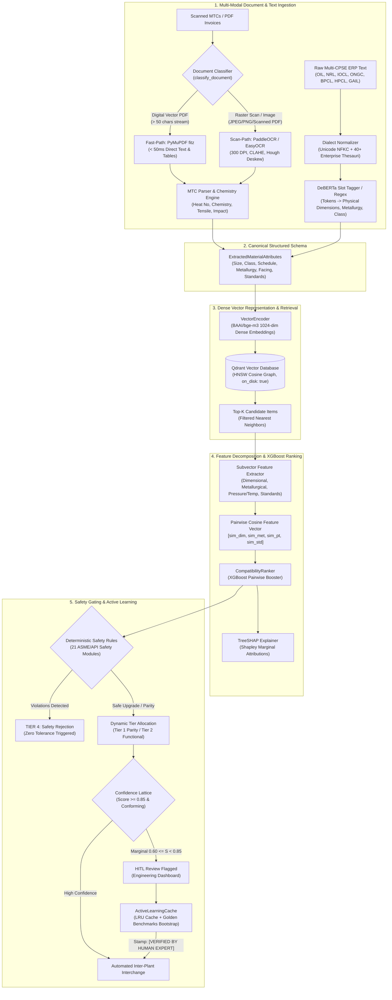

# Samanvay-AI Machine Learning & Vision Pipeline (`ml/`)

The `ml/` directory contains the complete Artificial Intelligence, Natural Language Processing, Computer Vision, and Active Learning subsystems powering **Samanvay-AI**.

Indian Public Sector Enterprises (CPSEs)—including **OIL**, **NRL**, **IOCL**, **ONGC**, **BPCL**, **HPCL**, and **GAIL**—maintain millions of spare parts and inventory line items across disparate, legacy ERP systems (SAP ECC/S4, Oracle eAM, IBM Maximo). Decades of decentralized, manual cataloging have introduced widespread dialect fragmentation: the exact same physical component (such as an API 600 Class 300 cast steel gate valve) is described using divergent legacy abbreviations, mixed metric/imperial engineering units, non-standard punctuation, or scanned paper Material Test Certificates (MTCs).

The `ml/` subsystem resolves this cross-enterprise semantic fragmentation through a multi-stage, high-throughput, air-gapped machine learning pipeline combining fast-path OCR, dialect normalization, dense vector retrieval, 4-domain subvector decomposition, XGBoost pairwise compatibility ranking, and TreeSHAP feature attribution.

---

## 1. End-to-End Pipeline Architecture



---

## 2. Directory Structure & Subsystem Breakdown

```
ml/
├── __init__.py               # Top-level ML module initializer
├── active_learning/          # Human-in-the-loop (HITL) feedback, cache & benchmarking
│   ├── __init__.py           # Subpackage initializer
│   ├── bootstrapper.py       # Seeds active learning cache from 150 golden benchmarks
│   ├── cache.py              # LRU in-memory decision cache with SKU expert stamps
│   └── README.md             # Active learning architecture and calibration docs
├── embeddings/               # Dense representation & vector database indexing
│   ├── __init__.py           # Subpackage initializer
│   ├── qdrant_client.py      # Qdrant client wrapper (HNSW, on_disk: true, payload filters)
│   ├── vector_encoder.py     # BAAI/bge-m3 1024-dimensional dense text encoder
│   └── README.md             # Vector space modeling and HNSW indexing docs
├── ner/                      # Dialect normalization & Named Entity Recognition
│   ├── __init__.py           # Subpackage initializer
│   ├── normalizer.py         # Unicode NFKC cleaning, 40+ CPSE acronym thesaurus, Indian standards
│   ├── slot_tagger.py        # DeBERTa-v3 token classifier with robust regex fallback
│   └── README.md             # Enterprise dialect handling and token tagging docs
├── ranking/                  # Subvector decomposition, ML ranking & explainability
│   ├── __init__.py           # Subpackage initializer
│   ├── explainer.py          # TreeSHAP feature attribution & plain-English rationale
│   ├── feature_extract.py    # 4 domain subvector builders (dimensional, metallurgy, PT, standards)
│   ├── ranker.py             # XGBoost pairwise compatibility ranker (model.xgb)
│   └── README.md             # Subvector mathematics and ranking model docs
└── vision/                   # Document AI, dual-path OCR & metallurgical verification
    ├── __init__.py           # Subpackage initializer
    ├── chemistry.py          # IIW Carbon Equivalent (CE), PREN, ASTM composition limits
    ├── mtc_parser.py         # EN 10204 Type 3.1 / 3.2 mill certificate extraction engine
    ├── ocr_engine.py         # Dual-path intake (PyMuPDF < 50ms fast-path vs PaddleOCR 300 DPI)
    └── README.md             # Document AI, OCR routing, and metallurgical standards docs
```

---

## 3. Subsystem Functionality & File Map

| Subsystem | Key Source Files | Core Classes & Functions | Purpose & Description |
|---|---|---|---|
| **Vision & Document AI** | [`ml/vision/ocr_engine.py`](file:///C:/Users/mayan/Development/Hackathons/Samanvay-AI/ml/vision/ocr_engine.py)<br>[`ml/vision/mtc_parser.py`](file:///C:/Users/mayan/Development/Hackathons/Samanvay-AI/ml/vision/mtc_parser.py)<br>[`ml/vision/chemistry.py`](file:///C:/Users/mayan/Development/Hackathons/Samanvay-AI/ml/vision/chemistry.py) | [`OCREngine`](file:///C:/Users/mayan/Development/Hackathons/Samanvay-AI/ml/vision/ocr_engine.py#L25-L65)<br>[`MTCParser`](file:///C:/Users/mayan/Development/Hackathons/Samanvay-AI/ml/vision/mtc_parser.py#L38-L107)<br>[`compute_carbon_equivalent`](file:///C:/Users/mayan/Development/Hackathons/Samanvay-AI/ml/vision/chemistry.py#L108-L127)<br>[`compute_pren`](file:///C:/Users/mayan/Development/Hackathons/Samanvay-AI/ml/vision/chemistry.py#L142-L155)<br>[`validate_composition`](file:///C:/Users/mayan/Development/Hackathons/Samanvay-AI/ml/vision/chemistry.py#L157-L188) | Direct vector PDF text stream extraction ($< 50\text{ ms}$) with PaddleOCR / EasyOCR raster fallback. Ingests EN 10204 Type 3.1/3.2 certificates, extracts ladle chemistry and mechanical test data, and computes $CE_{\text{IIW}}$ and PREN. |
| **NER & Dialect Normalization** | [`ml/ner/normalizer.py`](file:///C:/Users/mayan/Development/Hackathons/Samanvay-AI/ml/ner/normalizer.py)<br>[`ml/ner/slot_tagger.py`](file:///C:/Users/mayan/Development/Hackathons/Samanvay-AI/ml/ner/slot_tagger.py) | [`DialectNormalizer`](file:///C:/Users/mayan/Development/Hackathons/Samanvay-AI/ml/ner/normalizer.py#L253-L284)<br>[`normalize_description`](file:///C:/Users/mayan/Development/Hackathons/Samanvay-AI/ml/ner/normalizer.py#L64-L75)<br>[`extract_metadata_from_dialect`](file:///C:/Users/mayan/Development/Hackathons/Samanvay-AI/ml/ner/normalizer.py#L77-L251)<br>[`SlotTagger`](file:///C:/Users/mayan/Development/Hackathons/Samanvay-AI/ml/ner/slot_tagger.py#L19-L35) | Preprocesses erratic multi-CPSE ERP descriptions across 7 enterprises, translating 40+ legacy acronyms, metric/imperial dual units, BIS/OISD/EIL specifications, and GeM/CPPP identifiers into structured tokens. |
| **Dense Vector Embeddings** | [`ml/embeddings/vector_encoder.py`](file:///C:/Users/mayan/Development/Hackathons/Samanvay-AI/ml/embeddings/vector_encoder.py)<br>[`ml/embeddings/qdrant_client.py`](file:///C:/Users/mayan/Development/Hackathons/Samanvay-AI/ml/embeddings/qdrant_client.py) | [`VectorEncoder`](file:///C:/Users/mayan/Development/Hackathons/Samanvay-AI/ml/embeddings/vector_encoder.py#L4-L37)<br>[`SamanvayQdrantClient`](file:///C:/Users/mayan/Development/Hackathons/Samanvay-AI/ml/embeddings/qdrant_client.py#L15-L51) | Converts technical descriptions into 1024-dimensional normalized dense vectors via `BAAI/bge-m3`. Manages Qdrant collections with HNSW cosine distance indexing and on-disk payload storage for large catalogs. |
| **Ranking & Explainability** | [`ml/ranking/feature_extract.py`](file:///C:/Users/mayan/Development/Hackathons/Samanvay-AI/ml/ranking/feature_extract.py)<br>[`ml/ranking/ranker.py`](file:///C:/Users/mayan/Development/Hackathons/Samanvay-AI/ml/ranking/ranker.py)<br>[`ml/ranking/explainer.py`](file:///C:/Users/mayan/Development/Hackathons/Samanvay-AI/ml/ranking/explainer.py) | [`build_feature_vector`](file:///C:/Users/mayan/Development/Hackathons/Samanvay-AI/ml/ranking/feature_extract.py#L92-L100)<br>[`compute_subvector_cosines`](file:///C:/Users/mayan/Development/Hackathons/Samanvay-AI/ml/ranking/feature_extract.py#L83-L90)<br>[`CompatibilityRanker`](file:///C:/Users/mayan/Development/Hackathons/Samanvay-AI/ml/ranking/ranker.py#L5-L29)<br>[`ShapExplainer`](file:///C:/Users/mayan/Development/Hackathons/Samanvay-AI/ml/ranking/explainer.py#L4-L32) | Decomposes item attributes into 4 domain subvectors (Dimensional, Metallurgy, Pressure/Temp, Standards). Scores candidate pairs using a trained XGBoost pairwise booster (`model.xgb`) and computes local Shapley values via TreeSHAP. |
| **Active Learning & HITL** | [`ml/active_learning/cache.py`](file:///C:/Users/mayan/Development/Hackathons/Samanvay-AI/ml/active_learning/cache.py)<br>[`ml/active_learning/bootstrapper.py`](file:///C:/Users/mayan/Development/Hackathons/Samanvay-AI/ml/active_learning/bootstrapper.py) | [`ActiveLearningCache`](file:///C:/Users/mayan/Development/Hackathons/Samanvay-AI/ml/active_learning/cache.py#L13-L45)<br>[`CacheEntry`](file:///C:/Users/mayan/Development/Hackathons/Samanvay-AI/ml/active_learning/cache.py#L4-L12)<br>[`seed_from_golden_benchmarks`](file:///C:/Users/mayan/Development/Hackathons/Samanvay-AI/ml/active_learning/bootstrapper.py#L5-L29) | Implements an LRU decision cache capturing human engineering overrides. Seeds verified domain substitutions from 150 golden benchmarks to eliminate cold-start issues. |

---

## 4. Key Mathematical Formulations

### 1. International Institute of Welding Carbon Equivalent ($CE_{\text{IIW}}$)
Determines cold cracking susceptibility and preheat requirements for structural and pressure-retaining steels (ASTM A105, A350 LF2, A106 Gr.B):
$$CE_{\text{IIW}} = \% \text{C} + \frac{\% \text{Mn}}{6} + \frac{\% \text{Cr} + \% \text{Mo} + \% \text{V}}{5} + \frac{\% \text{Ni} + \% \text{Cu}}{15}$$
- **$CE \le 0.43\%$:** Standard weldability; standard fabrication procedures.
- **$CE > 0.43\%$:** Elevated risk of heat-affected zone (HAZ) hydrogen cracking; requires mandatory preheat ($150^\circ\text{C}-250^\circ\text{C}$) and low-hydrogen electrodes per ASME Section IX.

### 2. Pitting Resistance Equivalent Number (PREN)
Quantifies localized pitting corrosion resistance in chloride environments for stainless and duplex alloys (ASTM A182 F316L, F51 Duplex):
$$\text{PREN} = \% \text{Cr} + 3.3(\% \text{Mo}) + 16(\% \text{N})$$
- Standard 316L Stainless: $\text{PREN} \approx 23 - 25$
- UNS S31803 (F51 Duplex): $\text{PREN} \ge 34.0$ (sour crude / offshore rated)

### 3. Four-Domain Subvector Cosine Similarity
Rather than collapsing all attributes into an opaque single score, candidate compatibility is decomposed into four orthogonal engineering subvectors $\mathbf{u}_k, \mathbf{v}_k \in \mathbb{R}^{d_k}$:
$$\text{Sim}_k = \frac{\mathbf{u}_k \cdot \mathbf{v}_k}{\|\mathbf{u}_k\|_2 \|\mathbf{v}_k\|_2} \quad \text{for } k \in \{\text{dimensional}, \text{metallurgy}, \text{pressure\_temp}, \text{standards}\}$$
The resulting 4-dimensional feature vector $\mathbf{x} = [\text{Sim}_{\text{dim}}, \text{Sim}_{\text{met}}, \text{Sim}_{\text{pt}}, \text{Sim}_{\text{std}}]^T$ feeds the XGBoost ranking engine.

### 4. TreeSHAP Feature Attribution (Cooperative Game Theory)
The marginal contribution of each engineering feature $i$ across feature subset coalitions $S \subseteq F \setminus \{i\}$ is computed using the TreeSHAP polynomial-time algorithm:
$$\phi_i(x) = \sum_{S \subseteq F \setminus \{i\}} \frac{|S|!(|F| - |S| - 1)!}{|F|!} \left[ f(S \cup \{i\}) - f(S) \right]$$
This allows procurement officers to see exact percentage point contributions for each physical attribute match or discrepancy.

---

## 5. Technology Stack & Environment Requirements

| Technology / Library | Version | Role in Subsystem | Deployment Architecture |
|---|---|---|---|
| **Python** | `>= 3.11` | Core ML runtime | Native CPython 3.11 / 3.12 / 3.14 |
| **PyMuPDF (`fitz`)** | `^1.24.0` | Digital vector PDF parsing | In-process native C library binding |
| **PaddleOCR** | `PP-OCRv4` | Scanned document OCR | CPU / OpenVINO execution |
| **EasyOCR** | `^1.7.0` | Fallback OCR engine | PyTorch CUDA GPU / CPU fallback |
| **BAAI/bge-m3** | `1024-dim` | Dense semantic text embeddings | Local `sentence-transformers` / ONNX |
| **Qdrant** | `v1.12+` | Production vector database | Docker container (`on_disk: true`) |
| **XGBoost** | `^2.0.0` | Pairwise compatibility ranker | Gradient-boosted decision trees (`model.xgb`) |
| **SHAP** | `^0.44.0` | Feature attribution explainer | `shap.TreeExplainer` on XGBoost model |
| **Pydantic** | `^2.7.0` | Strict data schema validation | `ExtractedMaterialAttributes` container |

---

## 6. End-to-End Code Example

```python
from ml.vision.ocr_engine import OCREngine
from ml.vision.mtc_parser import MTCParser
from ml.ner.normalizer import DialectNormalizer
from ml.embeddings.vector_encoder import VectorEncoder
from ml.embeddings.qdrant_client import SamanvayQdrantClient
from ml.ranking.ranker import CompatibilityRanker
from ml.ranking.explainer import ShapExplainer
from ml.active_learning.cache import ActiveLearningCache

# 1. Ingest Scanned MTC Document
ocr = OCREngine()
with open("test_mtc.pdf", "rb") as f:
    pdf_bytes = f.read()

doc_result = ocr.extract_document(pdf_bytes, filename="test_mtc.pdf")
print(f"Intake Type: {doc_result['doc_type']} | Confidence: {doc_result['confidence_score']}")

# 2. Parse MTC Metallurgy and Conformance
mtc_parser = MTCParser()
parsed_mtc = mtc_parser.parse_full_mtc(doc_result["raw_text"], doc_result["confidence_score"])
print(f"Heat No: {parsed_mtc['header']['heat_no']}")
print(f"Carbon Equivalent (IIW): {parsed_mtc['carbon_equivalent_iiw']} ({parsed_mtc['weldability']})")
print(f"ASTM Conforming: {parsed_mtc['conforms_to_astm']}")

# 3. Normalize Multi-CPSE Requisition Dialect
normalizer = DialectNormalizer()
req_query = "OIL MESC 04.01.24.18.02 FLG WNRF 100 MM NB (4IN) PN 50 (300#) IS 2062 E250 / ASME B16.5"
norm_attrs = normalizer.normalize(req_query)
print("Normalized Description:", norm_attrs["normalized_description"])

# 4. Dense Vector Retrieval
encoder = VectorEncoder()
query_vector = encoder.encode(norm_attrs["normalized_description"])

qdrant = SamanvayQdrantClient()
candidates = qdrant.search(query_vector=query_vector, item_type_filter="FLANGE", top_k=5)

# 5. XGBoost Pairwise Ranking & SHAP Explanation
ranker = CompatibilityRanker()
query_spec = {"size_nb_mm": norm_attrs["size_nb_mm"], "pressure_class": norm_attrs["pressure_class"], "metallurgy": norm_attrs["metallurgy"]}
candidate_spec = {"size_nb_mm": 100.0, "pressure_class": 300, "metallurgy": "ASTM A105"}

score = ranker.predict(query_spec, candidate_spec)
explainer = ShapExplainer()
reasons = explainer.explain(query_spec, candidate_spec, score)
print(f"Compatibility Score: {score:.4f} | Rationale: {reasons}")

# 6. HITL Decision Caching
cache = ActiveLearningCache()
cache.record_decision(
    query_text=req_query,
    source_sku="OIL-FLG-00142",
    decision="APPROVE",
    tier_override="Tier 1",
    officer="CHIEF_MATERIALS_ENGINEER"
)
```

---

## 7. Testing & Verification

Execute the comprehensive test suites validating the ML pipeline:

```bash
# Run NER and dialect normalization unit tests
pytest tests/ml/test_ner.py -v

# Run dual-path OCR engine and MTC parsing unit tests
pytest tests/unit/test_ocr_and_mtc.py -v

# Run metallurgical chemistry, CE, and PREN calculation tests
pytest tests/unit/test_chemistry.py -v

# Run ranking feature extraction and cosine tests
pytest tests/unit/test_feature_extract.py -v
```
