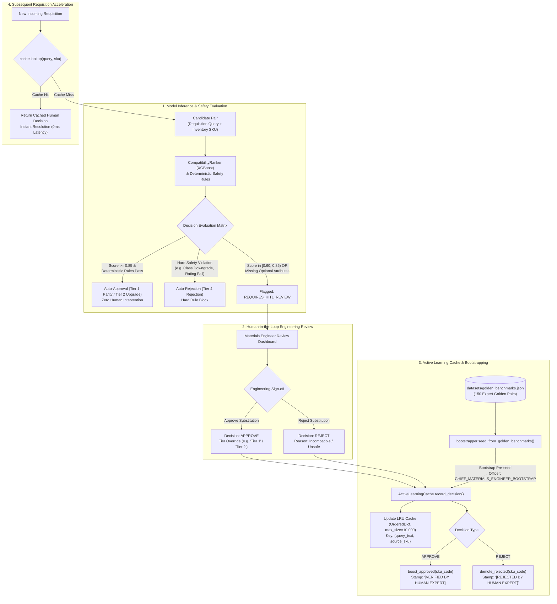

# Active Learning & HITL Feedback Calibration (`ml/active_learning/`)

This directory implements the **Human-in-the-Loop (HITL)** active learning feedback loop, in-memory prediction decision caching, and golden benchmark synthetic bootstrapping for **Samanvay-AI**.

In mission-critical oil, gas, and petrochemical operations, automated AI model decisions cannot operate unchecked when safety-critical tolerances or marginal confidence thresholds are involved. When an automated substitution falls within an ambiguous confidence window ($0.60 \le S < 0.85$) or exhibits incomplete non-critical metadata (e.g. unspecified schedule or missing trim code), Samanvay-AI routes the requisition pair to an authorized procurement officer or Chief Materials Engineer. Once reviewed, the human decision is captured, cached, and applied to accelerate subsequent evaluations across the multi-CPSE network.

---

## 1. Active Learning & HITL Workflow



---

## 2. File-by-File Technical Breakdown

### [`cache.py`](file:///C:/Users/mayan/Development/Hackathons/Samanvay-AI/ml/active_learning/cache.py) — In-Memory Decision Cache & SKU Stamping
Maintains an auditable, high-throughput in-memory LRU cache storing expert human engineering reviews to instantly resolve identical or recurring cross-CPSE requisition queries.

- **[`CacheEntry`](file:///C:/Users/mayan/Development/Hackathons/Samanvay-AI/ml/active_learning/cache.py#L4-L12)**:
  - Container storing the decision record:
    - `query_text: str` — The exact requisition line item or search query.
    - `source_sku: str` — The candidate inventory SKU code being considered for transfer.
    - `decision: str` — Human disposition: `"APPROVE"` or `"REJECT"`.
    - `tier_override: str` — The assigned or overridden dynamic tier (e.g. `"Tier 1"`, `"Tier 2"`).
    - `officer: str` — Authenticated username or title of the reviewing engineer (e.g. `"CHIEF_MATERIALS_ENGINEER"`).
    - `stamp: str` — Verification badge appended to the item during display.

- **[`ActiveLearningCache`](file:///C:/Users/mayan/Development/Hackathons/Samanvay-AI/ml/active_learning/cache.py#L13-L45)**:
  - `__init__(max_size: int = 10000)`: Initializes an `OrderedDict` backing store and an `sku_stamps` lookup table.
  - `lookup(query_text: str, source_sku: str) -> Optional[CacheEntry]`:
    - Checks the composite key `(query_text, source_sku)`.
    - If present, invokes `self.cache.move_to_end(key)` to maintain LRU recency and returns the entry.
  - `record_decision(query_text: str, source_sku: str, decision: str, tier_override: str, officer: str)`:
    - Instantiates a new [`CacheEntry`](file:///C:/Users/mayan/Development/Hackathons/Samanvay-AI/ml/active_learning/cache.py#L4-L12) and moves the key to the most-recent position.
    - Evicts the oldest entry via `self.cache.popitem(last=False)` if the collection size exceeds `max_size`.
    - Calls `boost_approved()` or `demote_rejected()` depending on the decision.
  - `boost_approved(sku_code: str)`:
    - Sets `self.sku_stamps[sku_code] = "[VERIFIED BY HUMAN EXPERT]"`.
  - `demote_rejected(sku_code: str)`:
    - Sets `self.sku_stamps[sku_code] = "[REJECTED BY HUMAN EXPERT]"`.

---

### [`bootstrapper.py`](file:///C:/Users/mayan/Development/Hackathons/Samanvay-AI/ml/active_learning/bootstrapper.py) — Golden Benchmark Preloader
Eliminates system cold-start limitations by pre-populating the active learning cache with mathematically verified inter-enterprise substitution benchmarks upon startup.

- **[`seed_from_golden_benchmarks(cache, benchmarks_path)`](file:///C:/Users/mayan/Development/Hackathons/Samanvay-AI/ml/active_learning/bootstrapper.py#L5-L29)**:
  - Validates the existence of `benchmarks_path` (defaulting to [`datasets/golden_benchmarks.json`](file:///C:/Users/mayan/Development/Hackathons/Samanvay-AI/datasets/golden_benchmarks.json)).
  - Iterates through the verified benchmark cases, extracting `query_text`, `source_sku`, and `tier`.
  - Determines decisions deterministically:
    - Tier 1 and Tier 2 benchmarks are recorded with `decision = "APPROVE"`.
    - Tier 3 (safety hazard) benchmarks are recorded with `decision = "REJECT"`.
  - Applies attribution officer: `'CHIEF_MATERIALS_ENGINEER_BOOTSTRAP'`.

---

## 3. Mathematical & Theoretical Foundations

### 1. The Dynamic Confidence Horizon
In automated material matching, raw model scores $S \in [0.0, 1.0]$ are partitioned into three operational regions:

$$\text{Action}(S) = \begin{cases} 
\text{Auto-Approve} & \text{if } S \ge 0.85 \land \text{Violations} = \emptyset \\
\text{Auto-Reject} & \text{if } \text{Violations} \ne \emptyset \lor S < 0.60 \\
\text{Route to HITL Review} & \text{if } 0.60 \le S < 0.85 \land \text{Violations} = \emptyset 
\end{cases}$$

### 2. Uncertainty Reduction through Active Feedback
Let $P(Y=1 \mid \mathbf{x})$ denote the posterior probability of component compatibility given feature vector $\mathbf{x}$. The entropy of the model's decision is maximized near the decision boundary:

$$H(Y \mid \mathbf{x}) = - \sum_{y \in \{0, 1\}} P(Y=y \mid \mathbf{x}) \log_2 P(Y=y \mid \mathbf{x})$$

When $S \approx 0.70$, entropy $H(Y \mid \mathbf{x})$ is near its peak ($1.0\text{ bit}$). Collecting human verification at high-entropy data points provides maximal information gain to calibrate feature weights during subsequent offline fine-tuning.

---

## 4. Usage Example

```python
from ml.active_learning.cache import ActiveLearningCache
from ml.active_learning.bootstrapper import seed_from_golden_benchmarks

# 1. Initialize Active Learning Cache
cache = ActiveLearningCache(max_size=5000)

# 2. Bootstrap from Golden Benchmarks to eliminate cold start
benchmarks_file = "datasets/golden_benchmarks.json"
seed_from_golden_benchmarks(cache, benchmarks_file)
print(f"Active learning cache initialized with pre-seeded decisions.")

# 3. Simulate an incoming requisition lookup
query = "OIL MESC 04.01.24.18.02 FLG WNRF 100 MM NB (4IN) PN 50 (300#) IS 2062 E250 / ASME B16.5"
sku = "IOCL-PR-FLG-0021"

hit = cache.lookup(query, sku)
if hit:
    print(f"Cache Hit! Decision: {hit.decision} | Tier: {hit.tier_override} | By: {hit.officer}")
else:
    print("Cache Miss. Proceeding to ML ranking and rules verification...")

# 4. Record a new engineering sign-off from the dashboard
cache.record_decision(
    query_text=query,
    source_sku=sku,
    decision="APPROVE",
    tier_override="Tier 1",
    officer="HEAD_OF_PIPING_IOCL"
)

# 5. Verify the expert stamp applied to the SKU
print("SKU Stamp:", cache.sku_stamps.get(sku))
# Output: [VERIFIED BY HUMAN EXPERT]
```

---

## 5. Testing & Verification

Run the test suite verifying active learning cache eviction, lookup consistency, and golden benchmark bootstrap loading:

```bash
# Run unit tests covering active learning and feedback cache
pytest tests/unit/test_active_learning.py -v
```
