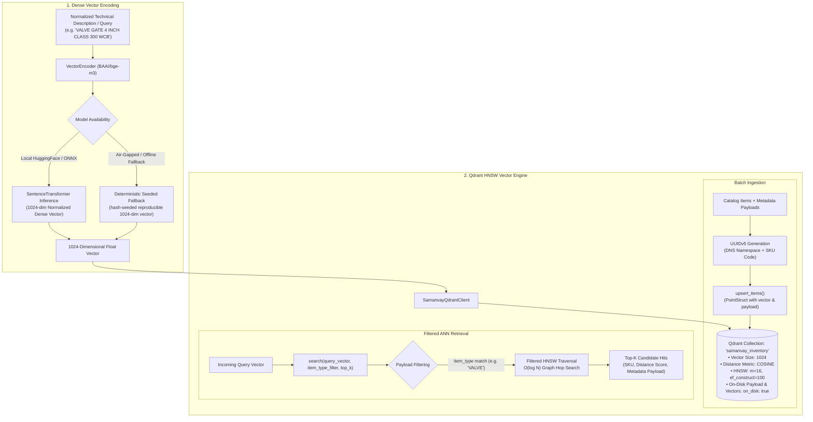

# Dense Vector Embeddings & Qdrant Indexing (`ml/embeddings/`)

This directory implements the dense semantic text representation and vector search subsystem powering **Samanvay-AI** using **BAAI/bge-m3** embeddings and the **Qdrant** vector database engine.

In cross-enterprise procurement, traditional inverted indexes (such as Elasticsearch or BM25) fail when encountering non-overlapping abbreviations across CPSEs (e.g. comparing `"VLV GT 4IN 300# WCB"` from IOCL with `"GATE VALVE 4\" CLASS 300 ASTM A216 WCB"` from ONGC). Dense semantic vector embeddings project disparate descriptions into a continuous 1024-dimensional metric space where synonymous physical concepts map to adjacent geometric coordinates.

---

## 1. Vector Retrieval Architecture



---

## 2. File-by-File Technical Breakdown

### [`vector_encoder.py`](file:///C:/Users/mayan/Development/Hackathons/Samanvay-AI/ml/embeddings/vector_encoder.py) — BAAI/bge-m3 Text Encoder
Transforms raw technical descriptions and procurement requisition strings into continuous 1024-dimensional dense vectors.

- **[`VectorEncoder`](file:///C:/Users/mayan/Development/Hackathons/Samanvay-AI/ml/embeddings/vector_encoder.py#L4-L37)**:
  - `__init__(model_name: str = "BAAI/bge-m3")`:
    - Sets vector dimensionality: `self.dim = 1024`.
    - Air-Gapped Safe: Attempts loading with `local_files_only=True` to guarantee strict offline enterprise execution without outbound internet calls.
    - Honors `DOWNLOAD_EMBEDDING_MODEL=true` environment variable if downloading weights from HuggingFace Hub during initial cluster deployment.
    - Gracefully falls back to deterministic seeded vector generation if `sentence-transformers` is unavailable in minimal test environments.
  - `encode(text: str) -> List[float]`:
    - Produces a 1024-dimensional float vector for a single string.
  - `encode_batch(texts: List[str]) -> List[List[float]]`:
    - Batched encoding pipeline returning a list of 1024-dimensional float vectors.

---

### [`qdrant_client.py`](file:///C:/Users/mayan/Development/Hackathons/Samanvay-AI/ml/embeddings/qdrant_client.py) — Qdrant Vector Engine Wrapper
Provides a resilient, production-ready interface to Qdrant for creating collections, indexing points, and performing metadata-filtered vector searches.

- **[`SamanvayQdrantClient`](file:///C:/Users/mayan/Development/Hackathons/Samanvay-AI/ml/embeddings/qdrant_client.py#L15-L102)**:
  - `__init__()`:
    - Reads connection host, port, and collection name from `backend.app.core.config.settings` (defaulting to `localhost:6333` and `"samanvay_inventory"`).
    - Sets up the official `qdrant_client.QdrantClient(check_compatibility=False)`.
  - `connect()`:
    - Verifies cluster connectivity and inspects available collections.
    - If the target collection is missing, creates it with:
      - `size = 1024`
      - `distance = Distance.COSINE`
      - `hnsw_config = HnswConfigDiff(m=16, ef_construct=100)`
      - Configurable for `on_disk: true` payload and vector storage to support massive catalogs on memory-constrained infrastructure.
  - `upsert_items(items: List[Dict[str, Any]])`:
    - Generates deterministic, idempotent point IDs using `uuid.uuid5(uuid.NAMESPACE_DNS, sku)`.
    - Packages payload metadata (SKU code, item type, CPSE, depot, dimensions, metallurgy) alongside the embedding vector into `PointStruct` instances and uploads via batched upsert.
  - `search(query_vector: List[float], item_type_filter: str = None, top_k: int = 10) -> List[Any]`:
    - Performs Approximate Nearest Neighbor (ANN) search with optional strict payload filtering on `item_type` (e.g. ensuring a pipe query only returns pipe candidates).
  - `delete_item(sku_code: str)`:
    - Deletes a point by its SKU key using `models.PointIdsList`.

---

## 3. Mathematical Foundations & Vector Space Theory

### 1. Cosine Distance Metric
Cosine distance evaluates the orientation angle $\theta$ between query vector $\mathbf{u}$ and candidate vector $\mathbf{v}$, rendering retrieval invariant to text description length:

$$S_{\text{cosine}}(\mathbf{u}, \mathbf{v}) = \frac{\mathbf{u} \cdot \mathbf{v}}{\|\mathbf{u}\|_2 \|\mathbf{v}\|_2} = \frac{\sum_{i=1}^{1024} u_i v_i}{\sqrt{\sum_{i=1}^{1024} u_i^2} \sqrt{\sum_{i=1}^{1024} v_i^2}}$$

In Qdrant, Cosine distance is mapped to $D_{\text{cosine}} = 1.0 - S_{\text{cosine}}$. When vectors are normalized ($L_2 = 1.0$), cosine similarity reduces to a single dot product $\mathbf{u} \cdot \mathbf{v}$, executing in sub-millisecond SIMD instructions (AVX-512).

### 2. Hierarchical Navigable Small World (HNSW) Indexing
Brute-force exact nearest neighbor search requires $O(N \cdot d)$ floating point operations across $N$ catalog items, scaling poorly for millions of spare parts.

HNSW constructs a multi-layer geometric graph:
- **Upper Layers:** Contain sparser links with long-range skip connections, facilitating rapid global navigation across the semantic space in $O(\log N)$ hops.
- **Lower Layers:** Contain denser clusters with short-range edges for fine-grained local neighborhood convergence.
- **Hyperparameters:**
  - $M = 16$: Maximum number of bi-directional connection links per node. Controls graph connectivity and memory consumption.
  - $efConstruction = 100$: Number of nearest neighbors evaluated during index creation. Higher values produce superior recall at the expense of indexing build time.

### 3. Why BAAI/BGE-M3 for Industrial CPSE Terminology?
1. **Multi-Granular Architecture:** Trained simultaneously with dense retrieval, multi-vector (ColBERT-style), and sparse lexical weights.
2. **Industrial Vocabulary Retention:** Outperforms older general-purpose models (e.g., MiniLM, standard BERT) on specialized petroleum engineering terminology (e.g. distinguishing `ASTM A350 LF2` low-temperature forged carbon steel from standard `ASTM A105`).
3. **Large Context Window:** Handles up to 8,192 tokens, permitting the embedding of entire procurement tender technical schedules and full MTC test certificates without truncation.

---

## 4. Usage Example

```python
from ml.embeddings.vector_encoder import VectorEncoder
from ml.embeddings.qdrant_client import SamanvayQdrantClient

# 1. Initialize Encoder and Qdrant Client
encoder = VectorEncoder(model_name="BAAI/bge-m3")
client = SamanvayQdrantClient()

# 2. Ingest Sample Multi-CPSE Inventory Line Items
sample_items = [
    {
        "sku_code": "IOCL-PR-FLG-00101",
        "item_type": "FLANGE",
        "vector": encoder.encode("FLG WNRF 4IN 300# ASTM A105 RF SCH 40"),
        "payload": {
            "cpse": "IOCL",
            "depot": "Paradip Refinery",
            "size_nb_mm": 100.0,
            "pressure_class": 300,
            "quantity": 24
        }
    },
    {
        "sku_code": "ONGC-HZ-VLV-00452",
        "item_type": "VALVE",
        "vector": encoder.encode("GATE VALVE 6 INCH CLASS 600 WCB TRIM 8 RF"),
        "payload": {
            "cpse": "ONGC",
            "depot": "Hazira Gas Complex",
            "size_nb_mm": 150.0,
            "pressure_class": 600,
            "quantity": 8
        }
    }
]

client.upsert_items(sample_items)
print(f"Upserted {len(sample_items)} items into Qdrant collection '{client.collection_name}'.")

# 3. Perform a Filtered Vector Search
query = "OIL MESC 04.01.24.18.02 FLG WNRF 100 MM NB (4IN) PN 50 (300#) IS 2062 E250 / ASME B16.5"
query_vec = encoder.encode(query)

hits = client.search(query_vector=query_vec, item_type_filter="FLANGE", top_k=5)

print(f"Top Semantic Matches for Query: '{query[:45]}...'")
for hit in hits:
    print(f"  -> SKU: {hit.payload.get('sku_code')} | Distance Score: {hit.score:.4f} | Depot: {hit.payload.get('depot')}")
```

---

## 5. Testing & Verification

Run the test suite verifying vector encoding dimensions, fallback reproducibility, and Qdrant interaction:

```bash
# Run unit tests covering dense vector generation and encoder fallback
pytest tests/unit/test_vector_encoder.py -v

# Run integration tests for Qdrant client collection operations
pytest tests/unit/test_qdrant_client.py -v
```
