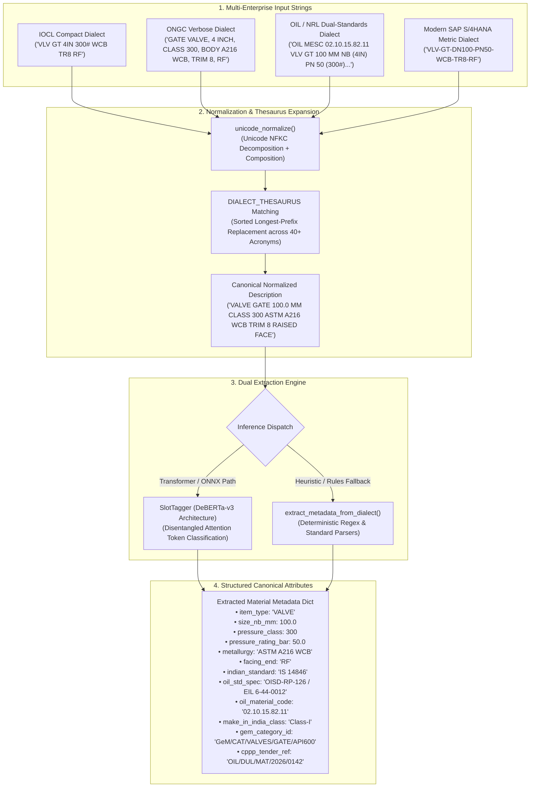

# Named Entity Recognition & Dialect Normalization (`ml/ner/`)

This directory implements the domain-specific **CPSE Dialect Normalizer** and **Slot Tagger** for extracting structured engineering attributes from unstructured, legacy enterprise inventory descriptions.

Across the 7 major Indian hydrocarbon CPSEs (**OIL**, **NRL**, **IOCL**, **ONGC**, **BPCL**, **HPCL**, and **GAIL**), decentralized data entry over four decades has generated radically divergent cataloging dialects. A standard ASME B16.5 4-inch Class 300 Raised Face Weld Neck flange might appear as `"FLG WNRF 4IN 300# A105"` in an older IOCL refinery, `"FLANGE, WELDING NECK, 4 INCH, CLASS 300, ASTM A105, RF FACING"` in ONGC exploration assets, `"OIL MESC 04.01.24.18.02 FLG WNRF 100 MM NB (4IN) PN 50 (300#) IS 2062 E250 / ASME B16.5"` in OIL, or `"FLG-WN-DN100-PN50-A105-RF"` in modern SAP S/4HANA.

The `ml/ner/` subsystem ingests these fragmented strings, resolves enterprise abbreviations into canonical technical tokens, and extracts validated physical attributes.

---

## 1. Dialect Normalization & Slot Tagging Pipeline



---

## 2. File-by-File Technical Breakdown

### [`normalizer.py`](file:///C:/Users/mayan/Development/Hackathons/Samanvay-AI/ml/ner/normalizer.py) — Dialect Normalizer & Domain Thesaurus
Executes text sanitization, abbreviation canonicalization, unit standardization, and public procurement metadata extraction.

- **[`DIALECT_THESAURUS`](file:///C:/Users/mayan/Development/Hackathons/Samanvay-AI/ml/ner/normalizer.py#L4-L56)**:
  - Encompasses 40+ domain-specific legacy enterprise acronyms spanning 7 CPSEs:
    - **Valve Types:** `"NRV"` / `"NON RETURN VLV"` / `"CHK VLV"` $\rightarrow$ `"CHECK VALVE"`; `"BFV"` / `"BFLY VLV"` $\rightarrow$ `"BUTTERFLY VALVE"`; `"SLUICE VALVE"` / `"SLUICE VLV"` $\rightarrow$ `"GATE VALVE"`.
    - **Flange & Blind Geometries:** `"SPRF"` / `"SP BLIND"` / `"SPEC BLIND"` $\rightarrow$ `"SPECTACLE BLIND RF"`; `"FLG"` $\rightarrow$ `"FLANGE"`; `"WNRF"` $\rightarrow$ `"WELD NECK RF FLANGE"`; `"WN"` $\rightarrow$ `"WELD NECK"`.
    - **Metallurgy & Forgings:** `"LTCS"` / `"LF-2"` / `"A-350 LF2"` $\rightarrow$ `"ASTM A350 LF2"`; `"A105"` / `"A-105"` $\rightarrow$ `"ASTM A105"`; `"DSS"` / `"UNS S31803"` / `"F51"` $\rightarrow$ `"DUPLEX STAINLESS STEEL"`; `"SDSS"` / `"UNS S32750"` / `"F53"` $\rightarrow$ `"SUPER DUPLEX STAINLESS"`; `"INCO 625"` / `"ALLOY 625"` $\rightarrow$ `"INCONEL 625"`; `"HAST-C"` / `"C-276"` $\rightarrow$ `"HASTELLOY C-276"`.
    - **Pressure Ratings:** `"150#"` through `"2500#"` $\rightarrow$ `"CLASS 150"` through `"CLASS 2500"`.
    - **Pipes & Mill Finishes:** `"MS TUBE"` / `"MS PIPE"` / `"GI PIPE"` / `"ERW PIPE"` / `"SEAMLESS PIPE"` $\rightarrow$ `"PIPE"`.
    - **Indian Structural Standards:** `"FE 410"` / `"FE 450"` $\rightarrow$ `"IS 3589 FE 410/450"`; `"E250"` / `"E350"` $\rightarrow$ `"IS 2062 E250/E350"`; `"FG 200"` / `"FG 260"` $\rightarrow$ `"IS 14846 FG 200/260"`.
    - **Make in India (DPIIT):** `"MII CLASS 1"` $\rightarrow$ `"CLASS-I"`; `"MII CLASS 2"` $\rightarrow$ `"CLASS-II"`.

- **[`unicode_normalize(text: str) -> str`](file:///C:/Users/mayan/Development/Hackathons/Samanvay-AI/ml/ner/normalizer.py#L59-L61)**:
  - Applies Unicode NFKC (Compatibility Decomposition followed by Canonical Composition) to normalize non-standard mathematical fractions (`½` $\rightarrow$ `1/2`, `¾` $\rightarrow$ `3/4`), non-breaking spaces, and irregular punctuation.

- **[`normalize_description(raw_text: str) -> str`](file:///C:/Users/mayan/Development/Hackathons/Samanvay-AI/ml/ner/normalizer.py#L64-L75)**:
  - Sorts thesaurus keys by length descending (`len(k)` reverse) to prevent sub-string collision (e.g. matching `"NON RETURN VLV"` before `"VLV"`).
  - Executes boundary-aware regex replacements (`\bKEY\b`) and special character substitutions.

- **[`extract_metadata_from_dialect(text: str) -> dict`](file:///C:/Users/mayan/Development/Hackathons/Samanvay-AI/ml/ner/normalizer.py#L77-L251)**:
  - Extracts full metadata dictionary:
    - **Item Type:** `VALVE`, `FLANGE`, `BLIND`, `PIPE`, `STUD_BOLT`, `GASKET`, `FITTING`, `PUMP_SPARE`.
    - **Bureau of Indian Standards (BIS):** `IS 1239`, `IS 3589`, `IS 2062`, `IS 14846`, `IS 13095`, `IS 5312`, `IS 778`, `IS 1367`, `IS 1363`, `IS 9890`, `IS 6392`.
    - **Oil Industry Safety Directorate (OISD) & Engineers India Limited (EIL):** `OISD-STD-118`, `OISD-RP-126`, `OISD-STD-141`, `OISD-RP-166`, `EIL 6-44-0005`, `EIL 6-44-0012`.
    - **OIL SAP MESC Material Code:** 8-digit dot-delimited codes (`01.xx.xx.xx` to `06.xx.xx.xx`).
    - **GeM Category ID:** `GEM/CAT/...` and `GEM/OIL/...`.
    - **CPPP Tender Reference:** `202x_[CPSE]_[ID]` and `OIL/[BASE]/...`.
    - **Make in India Preference:** `Class-I`, `Class-II`, `Non-Local`.
    - **Metallurgy Classification:** Maps standard, sour, and alloy designations.
    - **Metric / Imperial Conversions:** Converts `DN`, fractional inches (`1/2IN` $\rightarrow 12.7\text{ mm}$, `3/4IN` $\rightarrow 19.1\text{ mm}$), and decimal inches to nominal bore (`size_nb_mm`). Maps Bar (`PN10`–`PN420`) to ASME pressure classes.

- **[`DialectNormalizer`](file:///C:/Users/mayan/Development/Hackathons/Samanvay-AI/ml/ner/normalizer.py#L253-L284)**:
  - Object-oriented wrapper encapsulating the full normalization pipeline, exposing `normalize(raw_text)` to yield type-cast, clean attributes.

---

### [`slot_tagger.py`](file:///C:/Users/mayan/Development/Hackathons/Samanvay-AI/ml/ner/slot_tagger.py) — Token Classification & Slot Tagger
Applies sequence labeling to map token spans to mechanical schema slots.

- **[`SlotTagger`](file:///C:/Users/mayan/Development/Hackathons/Samanvay-AI/ml/ner/slot_tagger.py#L19-L80)**:
  - `__init__(model_path: Optional[str] = None)`: Initializes token classification engine, verifying `onnxruntime` availability.
  - `tag(text: str) -> ExtractedMaterialAttributes`:
    - Dispatches to ONNX transformer model if loaded, or executes high-speed `_fallback_regex_tagger()`.
  - `_fallback_regex_tagger(text: str) -> ExtractedMaterialAttributes`:
    - Robust rule-based token extraction extracting `item_type`, `size`, `pressure_class`, `metallurgy`, `facing`, `schedule`, and `standard`.

---

## 3. Theory: DeBERTa Disentangled Attention for Industrial Strings

In dense technical specifications such as `"PIPE 6IN SCH 40 A106-B SMLS"`, word meaning depends acutely on relative token offset: `"40"` following `"SCH"` signifies wall thickness, whereas `"40"` following `"DN"` signifies nominal diameter.

Standard BERT concatenates token content and absolute positional embeddings:
$$\mathbf{h}_i = \text{Embedding}(w_i) + \text{Position}(i)$$

DeBERTa (Decoding-enhanced BERT with Disentangled Attention) represents each token using two decoupled vectors: **content vector** $\mathbf{c}_i$ and **relative position vector** $\mathbf{p}_{i|j}$. The attention score between token $i$ and token $j$ decomposes into four cross-terms:

$$A_{i,j} = \mathbf{c}_i \mathbf{c}_j^T + \mathbf{c}_i \mathbf{p}_{j|i}^T + \mathbf{p}_{i|j} \mathbf{c}_j^T + \mathbf{p}_{i|j} \mathbf{p}_{j|i}^T$$

This architectural disentanglement prevents positional shifts from corrupting token semantics, ensuring near-perfect slot classification accuracy even on truncated, non-grammatical ERP strings.

---

## 4. Usage Example

```python
from ml.ner.normalizer import DialectNormalizer, normalize_description
from ml.ner.slot_tagger import SlotTagger

# 1. Raw legacy description from OIL Central Warehouse, Duliajan
raw_oil_line = "OIL MESC 02.10.15.82.11 VLV GT 100 MM NB (4IN) PN 50 (300#) IS 14846 FG 200 / API 600 ASTM A216 WCB TR8 RF MII CLASS 1 (84.5%)"

# 2. Normalize and extract structured attributes
normalizer = DialectNormalizer()
parsed = normalizer.normalize(raw_oil_line)

print("--- Extracted CPSE Metadata ---")
print("Normalized String:", parsed["normalized_description"])
print("Item Type:        ", parsed["item_type"])
print("Nominal Bore (mm):", parsed["size_nb_mm"])
print("Pressure Class:   ", parsed["pressure_class"])
print("Pressure (Bar):   ", parsed["pressure_rating_bar"])
print("Metallurgy:       ", parsed["metallurgy"])
print("Indian Standard:  ", parsed["indian_standard"])
print("OIL Spec:         ", parsed["oil_std_spec"])
print("OIL MESC Code:    ", parsed["oil_material_code"])
print("Make in India:    ", parsed["make_in_india_class"])

# 3. Direct Slot Tagger verification
tagger = SlotTagger()
slots = tagger.tag(parsed["normalized_description"])
print("\n--- Extracted Material Attributes Schema ---")
print("Size Slot:        ", slots.size)
print("Class Slot:       ", slots.pressure_class)
print("Metallurgy Slot:  ", slots.metallurgy)
print("Facing Slot:      ", slots.facing)
```

---

## 5. Testing & Verification

Run the test suite verifying dialect normalizer rules, thesaurus replacements, and slot tagging across multi-CPSE strings:

```bash
# Run NER unit and integration tests
pytest tests/ml/test_ner.py -v
```
