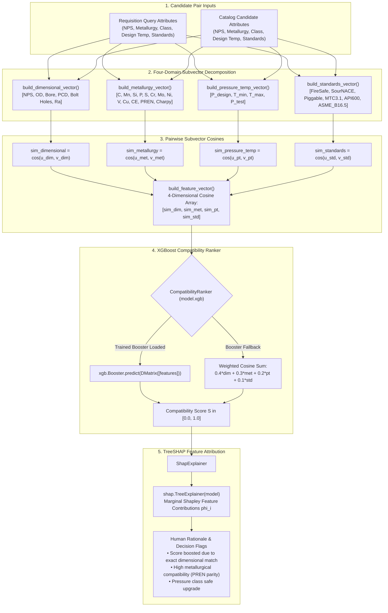

# Neural Reranking, Subvector Decomposition & Explainability (`ml/ranking/`)

This directory implements the multi-attribute engineering feature extractor, **XGBoost** pairwise compatibility ranker, and **TreeSHAP** feature attribution explainer powering **Samanvay-AI**.

Vector database nearest neighbor search (HNSW) is effective at coarse candidate generation, but pure embedding cosine similarity can struggle with subtle, high-consequence engineering distinctions (such as distinguishing Class 150# from Class 1500# flanges, or Trim 1 from Trim 8 valves). To ensure 100% mechanical and metallurgical safety, the ranking subsystem decomposes candidate pairs into 4 orthogonal engineering domain subvectors, evaluates their pairwise cosine compatibility, executes a gradient-boosted decision tree ranker, and generates mathematically grounded Shapley attribution explanations.

---

## 1. Subvector Ranking & Explainability Pipeline



---

## 2. File-by-File Technical Breakdown

### [`feature_extract.py`](file:///C:/Users/mayan/Development/Hackathons/Samanvay-AI/ml/ranking/feature_extract.py) — 4-Domain Subvector Decomposition
Transforms arbitrary dictionaries of equipment specifications into four decoupled, mathematically rigorous numeric subvectors:

- **[`build_dimensional_vector(attrs: dict) -> np.ndarray`](file:///C:/Users/mayan/Development/Hackathons/Samanvay-AI/ml/ranking/feature_extract.py#L5-L20)**:
  - Constructs a 6-dimensional float vector capturing physical geometry:
    $$\mathbf{v}_{\text{dim}} = [ \text{NPS/Size (mm)}, \text{Outer Diameter (OD)}, \text{Bore}, \text{Pitch Circle Diameter (PCD)}, \text{Number of Bolt Holes}, \text{Surface Roughness } R_a ]^T$$
  - Handles string-to-float conversions, stripping metric units (`mm`) and quotation marks (`"`).

- **[`build_metallurgy_vector(attrs: dict) -> np.ndarray`](file:///C:/Users/mayan/Development/Hackathons/Samanvay-AI/ml/ranking/feature_extract.py#L22-L40)**:
  - Constructs a 13-dimensional float vector capturing elemental chemistry and alloy properties:
    $$\mathbf{v}_{\text{met}} = [ \% \text{C}, \% \text{Mn}, \% \text{Si}, \% \text{P}, \% \text{S}, \% \text{Cr}, \% \text{Mo}, \% \text{Ni}, \% \text{V}, \% \text{Cu}, CE_{\text{IIW}}, \text{PREN}, \text{Charpy Impact} ]^T$$
  - Incorporates deterministic hashing for unlisted exotic alloys.

- **[`build_pressure_temp_vector(attrs: dict) -> np.ndarray`](file:///C:/Users/mayan/Development/Hackathons/Samanvay-AI/ml/ranking/feature_extract.py#L42-L55)**:
  - Constructs a 4-dimensional float vector capturing thermo-mechanical boundaries:
    $$\mathbf{v}_{\text{pt}} = [ P_{\text{design}} \text{ (Bar/Class)}, T_{\text{min}} \text{ (}^\circ\text{C)}, T_{\text{max}} \text{ (}^\circ\text{C)}, P_{\text{test}} \text{ (Bar)} ]^T$$
  - Defaults hydro-test pressure $P_{\text{test}} = 1.5 \times P_{\text{design}}$ per ASME B16.34 when unrecorded.

- **[`build_standards_vector(attrs: dict) -> np.ndarray`](file:///C:/Users/mayan/Development/Hackathons/Samanvay-AI/ml/ranking/feature_extract.py#L57-L68)**:
  - Constructs a 6-dimensional float vector capturing certification and compliance indicators:
    $$\mathbf{v}_{\text{std}} = [ \text{FireSafe}, \text{SourNACE}, \text{Piggable}, \text{MTC3.1}, \text{API600}, \text{ASME\_B16.5} ]^T$$

- **[`_cosine_sim(v1: np.ndarray, v2: np.ndarray) -> float`](file:///C:/Users/mayan/Development/Hackathons/Samanvay-AI/ml/ranking/feature_extract.py#L70-L81)**:
  - Computes bounded cosine similarity $[0.0, 1.0]$. Returns $1.0$ for identical vectors and $0.0$ for orthogonal or zero vectors.

- **[`compute_subvector_cosines(query_attrs, candidate_attrs) -> Dict[str, float]`](file:///C:/Users/mayan/Development/Hackathons/Samanvay-AI/ml/ranking/feature_extract.py#L83-L90)**:
  - Computes individual domain cosine similarities:
    - `"dimensional"`: Size, OD, PCD, bore parity.
    - `"metallurgy"`: Chemistry, carbon equivalent, and corrosion resistance.
    - `"pressure_temp"`: Operating envelope containment.
    - `"standards"`: Industry certification alignment.

- **[`build_feature_vector(query: dict, candidate: dict) -> np.ndarray`](file:///C:/Users/mayan/Development/Hackathons/Samanvay-AI/ml/ranking/feature_extract.py#L92-L100)**:
  - Aggregates the 4 subvector cosine scores into the final feature vector feeding the ranker:
    $$\mathbf{x} = [ \text{Sim}_{\text{dim}}, \text{Sim}_{\text{met}}, \text{Sim}_{\text{pt}}, \text{Sim}_{\text{std}} ]^T$$

---

### [`ranker.py`](file:///C:/Users/mayan/Development/Hackathons/Samanvay-AI/ml/ranking/ranker.py) — XGBoost Pairwise Compatibility Ranker
Executes gradient-boosted tree inference on the 4-dimensional subvector cosine representations.

- **[`CompatibilityRanker`](file:///C:/Users/mayan/Development/Hackathons/Samanvay-AI/ml/ranking/ranker.py#L5-L29)**:
  - `__init__(model_path: str = "model.xgb")`:
    - Checks for the presence of the pre-trained XGBoost model file.
    - Loads the booster via `xgb.Booster()`, handling air-gapped environments gracefully if XGBoost is missing.
  - `predict(query: dict, candidate: dict) -> float`:
    - Generates 4-subvector feature vector using [`build_feature_vector()`](file:///C:/Users/mayan/Development/Hackathons/Samanvay-AI/ml/ranking/feature_extract.py#L92-L100).
    - If `model.xgb` is available, predicts candidate score via `model.predict(xgb.DMatrix([features]))[0]`.
    - If uninitialized, applies the domain-weighted cosine fallback:
      $$\text{Score} = 0.40 \cdot \text{Sim}_{\text{dim}} + 0.30 \cdot \text{Sim}_{\text{met}} + 0.20 \cdot \text{Sim}_{\text{pt}} + 0.10 \cdot \text{Sim}_{\text{std}}$$
  - `predict_batch(query: dict, candidates: List[dict]) -> List[float]`:
    - Batch evaluation interface scoring top-K candidates concurrently.

---

### [`explainer.py`](file:///C:/Users/mayan/Development/Hackathons/Samanvay-AI/ml/ranking/explainer.py) — TreeSHAP Feature Attribution
Explains model decisions to materials procurement supervisors, translating decision tree leaf splits into human-interpretable reasons.

- **[`ShapExplainer`](file:///C:/Users/mayan/Development/Hackathons/Samanvay-AI/ml/ranking/explainer.py#L4-L32)**:
  - `__init__(model_path: str = "model.xgb")`:
    - Binds `shap.TreeExplainer(model)` directly to the XGBoost booster.
  - `explain(query: dict, candidate: dict, score: float) -> List[str]`:
    - Evaluates subvector cosine boundaries:
      - $\text{Sim}_{\text{dim}} > 0.95 \implies$ `"Score boosted due to exact dimensional match"`
      - $\text{Sim}_{\text{dim}} < 0.50 \implies$ `"Score penalized heavily due to dimensional variance"`
      - $\text{Sim}_{\text{met}} > 0.90 \implies$ `"High metallurgical compatibility"`
    - Outputs human-auditable rationales for procurement records.

---

## 3. Mathematical Foundations: Cooperative Game Theory & TreeSHAP

The XGBoost model operates as an ensemble of $K$ regression trees:
$$\hat{y}(x) = \sum_{k=1}^K f_k(\mathbf{x}), \quad f_k \in \mathcal{F}$$

To provide deterministic interpretability for procurement safety audits, TreeSHAP computes the unique additive feature attribution values satisfying four axiomatic properties: **Efficiency**, **Symmetry**, **Dummy Player**, and **Additivity**.

The classical Shapley formula requires exponential $O(2^{|F|})$ evaluations:
$$\phi_i = \sum_{S \subseteq F \setminus \{i\}} \frac{|S|!(|F| - |S| - 1)!}{|F|!} \left[ f(S \cup \{i\}) - f(S) \right]$$

TreeSHAP optimizes this computation to $O(K \cdot L \cdot D^2)$ time (where $K$ is the number of trees, $L$ is the number of leaves, and $D$ is the maximum tree depth) by recursively tracking feature decision paths down the decision tree nodes.

---

## 4. Usage Example

```python
from ml.ranking.ranker import CompatibilityRanker
from ml.ranking.feature_extract import compute_subvector_cosines, build_feature_vector
from ml.ranking.explainer import ShapExplainer

# 1. Define Requisition Query and Candidate Specifications
query_valve = {
    "size_nb_mm": 100.0,
    "OD": 230.0,
    "Bore": 100.0,
    "PCD": 190.5,
    "N_boltholes": 8,
    "pressure_class": 300,
    "P_design": 50.0,
    "metallurgy": "ASTM A216 WCB",
    "C": 0.22, "Mn": 0.85, "CE": 0.41,
    "item_type": "GATE_VALVE",
    "FireSafe": 1,
    "MTC3.1": 1
}

candidate_valve = {
    "size_nb_mm": 100.0,
    "OD": 230.0,
    "Bore": 100.0,
    "PCD": 190.5,
    "N_boltholes": 8,
    "pressure_class": 300,
    "P_design": 50.0,
    "metallurgy": "ASTM A350 LF2",
    "C": 0.18, "Mn": 1.15, "CE": 0.39,
    "item_type": "GATE_VALVE",
    "FireSafe": 1,
    "MTC3.1": 1
}

# 2. Decompose Subvector Cosines
cosines = compute_subvector_cosines(query_valve, candidate_valve)
print("Subvector Cosines:")
for domain, score in cosines.items():
    print(f"  {domain:15s}: {score:.4f}")

# 3. XGBoost Ranker Prediction
ranker = CompatibilityRanker()
match_score = ranker.predict(query_valve, candidate_valve)
print(f"\nFinal XGBoost Match Score: {match_score:.4f}")

# 4. Generate TreeSHAP / Heuristic Rationale
explainer = ShapExplainer()
explanations = explainer.explain(query_valve, candidate_valve, match_score)
print("\nAttribution Rationale:")
for exp in explanations:
    print(f"  • {exp}")
```

---

## 5. Testing & Verification

Run the test suite verifying subvector mathematical bounds, feature vector construction, and XGBoost ranking predictions:

```bash
# Run feature extraction and cosine calculation unit tests
pytest tests/unit/test_feature_extract.py -v

# Run ranking model inference and explainer tests
pytest tests/unit/test_ranker.py -v
```
