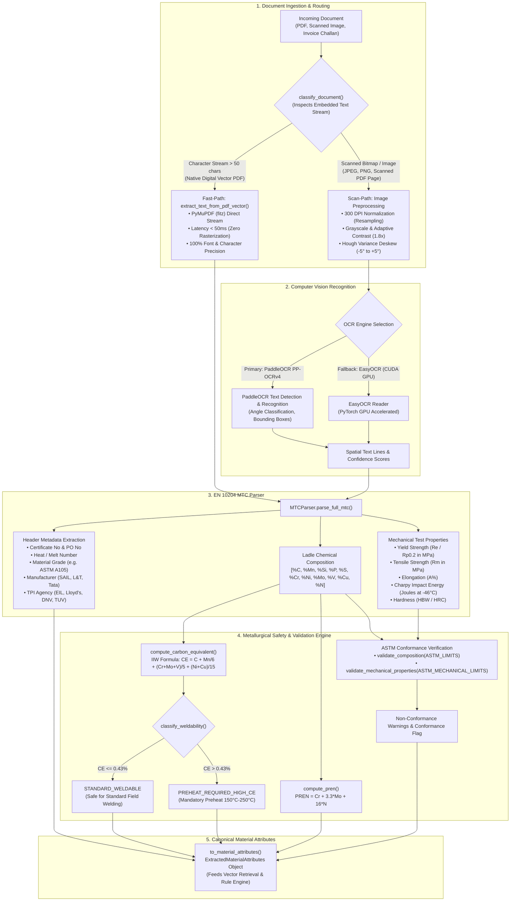

# Document AI, Dual-Path OCR & Metallurgical Verification (`ml/vision/`)

This directory implements the document ingestion, optical character recognition, Material Test Certificate (MTC) parsing, and metallurgical validation pipeline for **Samanvay-AI**.

Public sector oil and gas enterprises procure piping, valves, and rotating equipment supported by physical mill test certificates issued under **EN 10204 Type 3.1** (manufacturer certified) and **Type 3.2** (independently validated by third-party inspection agencies such as EIL, Lloyd's, DNV, or TÜV). These documents frequently exist only as crumpled paper photocopies, multi-generation faxes, or scanned challans bearing ink stamps. The `ml/vision/` subsystem provides an ultra-fast dual-path document intake, extracts certified ladle chemistry and mechanical test data, and mathematically calculates weldability and corrosion resistance indexes.

---

## 1. Dual-Path OCR & MTC Processing Pipeline



---

## 2. File-by-File Technical Breakdown

### [`ocr_engine.py`](file:///C:/Users/mayan/Development/Hackathons/Samanvay-AI/ml/vision/ocr_engine.py) — Dual-Path Document Intake Engine
Dynamically classifies documents to balance sub-50ms latency on vector PDFs with deep computer vision on scanned mill paper.

- **[`OCREngine`](file:///C:/Users/mayan/Development/Hackathons/Samanvay-AI/ml/vision/ocr_engine.py#L25-L65)**:
  - Manages dependency bindings across `PyMuPDF (fitz)`, `PaddleOCR`, and `EasyOCR`.
  - Automatically identifies CUDA hardware availability via `torch.cuda.is_available()`.
  
  - **[`classify_document(file_bytes: bytes, filename: str) -> str`](file:///C:/Users/mayan/Development/Hackathons/Samanvay-AI/ml/vision/ocr_engine.py#L66-L92)**:
    - Inspects font and character streams using PyMuPDF. If total readable characters across pages exceed 50, classifies as `"digital_vector"`. Otherwise classifies as `"raster_scan"`.
  
  - **[`preprocess_image(pil_img: Image.Image) -> Image.Image`](file:///C:/Users/mayan/Development/Hackathons/Samanvay-AI/ml/vision/ocr_engine.py#L94-L120)**:
    - **300 DPI Normalization:** Upscales low-resolution scans to standard A4 resolution ($2480 \times 3508$ pixels, minimum dimension $\ge 1600\text{ px}$) using Lanczos interpolation.
    - **Adaptive Contrast:** Converts image to grayscale and applies an enhancement factor of $1.8 \times$.
    - **Deskew Angle Correction:** Evaluates binary edge horizontal projection variance across tilt angles $[-5^\circ, -3^\circ, -2^\circ, -1^\circ, -0.5^\circ, 0^\circ, 0.5^\circ, 1^\circ, 2^\circ, 3^\circ, 5^\circ]$ and rotates using bicubic interpolation.
  
  - **[`extract_text_from_pdf_vector(file_bytes: bytes)`](file:///C:/Users/mayan/Development/Hackathons/Samanvay-AI/ml/vision/ocr_engine.py#L154-L188)**:
    - **Fast-Path ($< 50\text{ ms}$):** Extracts embedded text blocks, paragraph coordinates, and structural table text directly from vector byte streams with $100\%$ confidence.
  
  - **[`extract_text_from_raster(pil_img: Image.Image)`](file:///C:/Users/mayan/Development/Hackathons/Samanvay-AI/ml/vision/ocr_engine.py#L190-L250)**:
    - **Scan-Path Fallback:** Runs preprocessed raster images through PaddleOCR PP-OCRv4 with directional angle classification (`use_angle_cls=True`), falling back to EasyOCR if text line detection fails.
  
  - **[`extract_document(file_bytes: bytes, filename: str) -> Dict[str, Any]`](file:///C:/Users/mayan/Development/Hackathons/Samanvay-AI/ml/vision/ocr_engine.py#L251-L325)**:
    - Unified ingestion endpoint returning `doc_type` (`"DIGITAL_VECTOR_PDF"`, `"SCANNED_PDF"`, `"RASTER_IMAGE"`), `is_scanned`, `confidence_score`, `raw_text`, and bounding boxes.

---

### [`mtc_parser.py`](file:///C:/Users/mayan/Development/Hackathons/Samanvay-AI/ml/vision/mtc_parser.py) — EN 10204 Type 3.1 / 3.2 Certificate Parser
Extracts structured inspection certificates and maps them to technical schemas.

- **Recognized Public Sector Entities:**
  - **Third-Party Inspection (TPI) Agencies:** `BUREAU VERITAS`, `LLOYD'S REGISTER`, `DNV`, `TUV`, `ENGINEERS INDIA LIMITED (EIL)`, `INDIAN REGISTER OF SHIPPING (IRS)`, `SGS`, `INTERTEK`, `CEIL`, `ABS`.
  - **Approved Mill Manufacturers:** `LARSEN & TOUBRO (L&T)`, `STEEL AUTHORITY OF INDIA (SAIL)`, `JINDAL STEEL`, `TATA STEEL`, `BHEL`, `WELSPUN`, `RATNAMANI`, `MAHARASHTRA SEAMLESS (MSL)`, `ISMT`, `SANDVIK`.

- **[`MTCParser`](file:///C:/Users/mayan/Development/Hackathons/Samanvay-AI/ml/vision/mtc_parser.py#L38-L380)**:
  - `parse_header(text: str) -> Dict[str, Any]`: Extracts certificate number, heat/melt number, purchase order (PO), material grade, standard specification (EN 10204 3.1 vs 3.2), manufacturer, and TPI agency.
  - `parse_chemical_composition(text: str) -> Dict[str, float]`: Extracts ladle analysis elemental percentages ($\text{C}, \text{Mn}, \text{Si}, \text{P}, \text{S}, \text{Cr}, \text{Ni}, \text{Mo}, \text{V}, \text{Cu}, \text{N}, \text{Nb}, \text{Ti}$).
  - `parse_mechanical_properties(text: str) -> Dict[str, float]`: Extracts yield strength ($R_e$), tensile strength ($R_m$), elongation ($A\%$), Charpy V-Notch impact energy (Joules), and Brinell hardness (HBW).
  - `parse_full_mtc(raw_text: str, confidence_score: float = 1.0) -> Dict[str, Any]`: End-to-end extraction orchestrating header, chemistry, mechanicals, IIW Carbon Equivalent calculation, PREN calculation, ASTM conformance checks, missing attribute evaluation, and HITL flags.
  - `to_material_attributes(parsed_mtc: Dict[str, Any]) -> ExtractedMaterialAttributes`: Converts parsed data into the canonical schema.

---

### [`chemistry.py`](file:///C:/Users/mayan/Development/Hackathons/Samanvay-AI/ml/vision/chemistry.py) — Metallurgical Chemistry & Conformance
Calculates metallurgical safety indexes and validates ladle spectral analysis against ASTM chemical and mechanical thresholds.

- **[`compute_carbon_equivalent(composition: Dict[str, float]) -> Optional[float]`](file:///C:/Users/mayan/Development/Hackathons/Samanvay-AI/ml/vision/chemistry.py#L108-L127)**:
  - International Institute of Welding (IIW) formula:
    $$CE_{\text{IIW}} = \% \text{C} + \frac{\% \text{Mn}}{6} + \frac{\% \text{Cr} + \% \text{Mo} + \% \text{V}}{5} + \frac{\% \text{Ni} + \% \text{Cu}}{15}$$

- **[`classify_weldability(ce: Optional[float]) -> Optional[str]`](file:///C:/Users/mayan/Development/Hackathons/Samanvay-AI/ml/vision/chemistry.py#L129-L140)**:
  - $CE \le 0.43\% \implies$ `"STANDARD_WELDABLE"`
  - $CE > 0.43\% \implies$ `"PREHEAT_REQUIRED_HIGH_CE"` (requires preheat per ASME Section IX to avoid delayed hydrogen-induced cracking).

- **[`compute_pren(composition: Dict[str, float]) -> Optional[float]`](file:///C:/Users/mayan/Development/Hackathons/Samanvay-AI/ml/vision/chemistry.py#L142-L155)**:
  - Pitting Resistance Equivalent Number:
    $$\text{PREN} = \% \text{Cr} + 3.3(\% \text{Mo}) + 16(\% \text{N})$$

- **ASTM Standard Tables:**
  - `ASTM_LIMITS`: Explicit compositional min/max limits for `ASTM A105`, `ASTM A350 LF2`, `ASTM A106 GR.B`, `ASTM A182 F304`, `ASTM A182 F316`, `ASTM A182 F316L`, `ASTM A182 F51`, `ASTM A193 B7`.
  - `ASTM_MECHANICAL_LIMITS`: Minimum yield strength, tensile strength, elongation, and Charpy impact energy.

- **[`validate_composition(composition, grade)`](file:///C:/Users/mayan/Development/Hackathons/Samanvay-AI/ml/vision/chemistry.py#L157-L188)** & **[`validate_mechanical_properties(properties, grade)`](file:///C:/Users/mayan/Development/Hackathons/Samanvay-AI/ml/vision/chemistry.py#L190-L232)**:
  - Returns `(is_valid: bool, violations: List[str])` indicating compliance or explicit non-conformance warnings.

---

## 3. Engineering Reference: EN 10204 Types of Inspection Documents

| Type | Definition | Verification Authority | Typical Application in CPSEs |
|---|---|---|---|
| **Type 2.1** | Declaration of compliance with order | Manufacturer | Non-critical hardware (washers, standard nuts) |
| **Type 2.2** | Test report based on non-specific inspection | Manufacturer | Low-pressure utility water piping |
| **Type 3.1** | Inspection certificate validated by manufacturer | Authorized inspection representative independent of production | Process refinery piping, Class 150/300 valves, standard hydrocarbons |
| **Type 3.2** | Inspection certificate validated by manufacturer and independent inspector | Authorized manufacturer representative AND independent Third-Party Inspector (EIL, Lloyd's, DNV) | Critical sour gas service ($H_2S$), Class 900+ offshore risers, high-temperature furnace tubes |

---

## 4. Usage Example

```python
from ml.vision.ocr_engine import OCREngine
from ml.vision.mtc_parser import MTCParser
from ml.vision.chemistry import compute_carbon_equivalent, compute_pren, validate_composition

# 1. Ingest Scanned Mill Certificate
ocr = OCREngine()
with open("test_scan_mtc.pdf", "rb") as f:
    pdf_bytes = f.read()

intake_result = ocr.extract_document(pdf_bytes, filename="test_scan_mtc.pdf")
print("Intake Status:", intake_result["doc_type"], "Confidence:", intake_result["confidence_score"])

# 2. Parse Certificate Data
parser = MTCParser()
mtc_data = parser.parse_full_mtc(intake_result["raw_text"], intake_result["confidence_score"])

print("\n--- Extracted Certificate Intelligence ---")
print("Cert No:         ", mtc_data["header"]["certificate_no"])
print("Heat No:         ", mtc_data["header"]["heat_no"])
print("Material Grade:  ", mtc_data["header"]["material_grade"])
print("Manufacturer:    ", mtc_data["header"]["manufacturer"])
print("TPI Agency:      ", mtc_data["header"]["tpi_agency"])
print("Ladle Chemistry: ", mtc_data["chemical_composition"])
print("Tensile Strength:", mtc_data["mechanical_properties"].get("tensile_strength_mpa"), "MPa")
print("IIW CE:          ", mtc_data["carbon_equivalent_iiw"], f"({mtc_data['weldability']})")
print("PREN:            ", mtc_data["pren"])
print("ASTM Conforming: ", mtc_data["conforms_to_astm"])
if mtc_data["non_conformance_warnings"]:
    print("Warnings:        ", mtc_data["non_conformance_warnings"])

# 3. Convert to Canonical Material Schema
material_schema = parser.to_material_attributes(mtc_data)
print("\nConverted to ExtractedMaterialAttributes with confidence:", material_schema.confidence_score)
```

---

## 5. Testing & Verification

Run the test suite verifying dual-path OCR routing, MTC field extraction, and metallurgical chemistry formulas:

```bash
# Run OCR and MTC certificate intake unit tests
pytest tests/unit/test_ocr_and_mtc.py -v

# Run chemistry, CE, and PREN calculation unit tests
pytest tests/unit/test_chemistry.py -v
```
