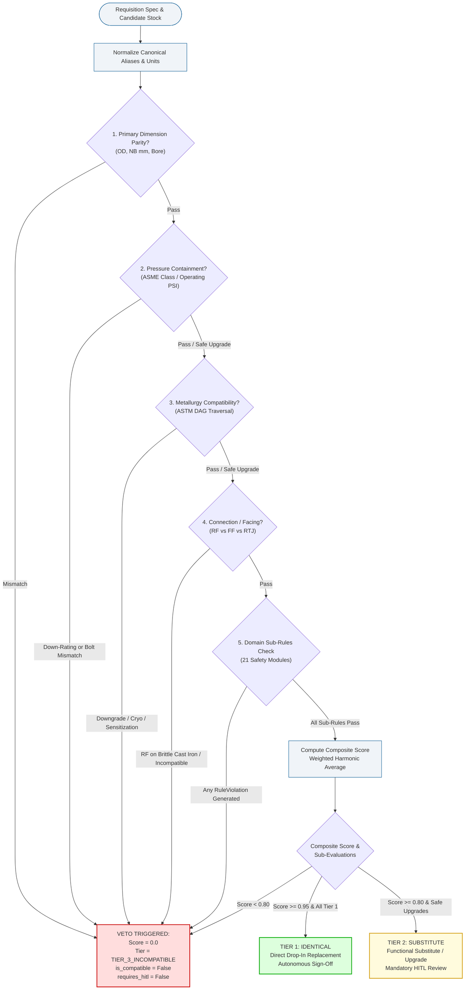
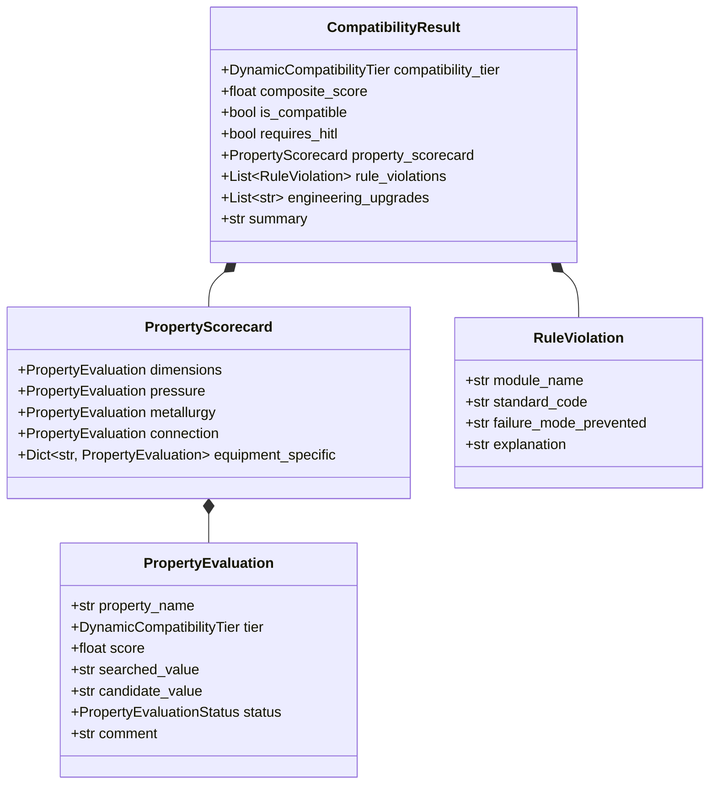
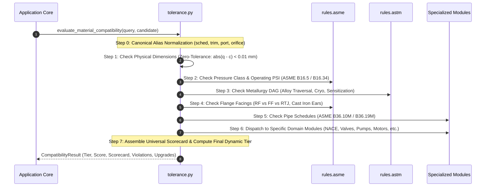

# Samanvay-AI Deterministic Engineering Safety Core (`rules/`)

The **Engineering Safety Core** is the deterministic validation engine of **Samanvay-AI**. While machine learning models (DeBERTa-v3 NER, BGE-M3 Dense Embeddings, and Cross-Encoder Rerankers) excel at semantic discovery across messy, non-standardized CPSE ERP catalogs (ONGC, IOCL, GAIL, HPCL, BPCL, NTPC), **probabilistic AI cannot be trusted alone to sign off on high-pressure hydrocarbon piping, offshore risers, or refinery safety systems**.

A single mismatched flange rating, an incompatible valve trim in sour gas service, or an improper metallurgical substitution can trigger catastrophic piping rupture, toxic $H_2S$ release, or refinery explosions.

The [`rules/`](file:///C:/Users/mayan/Development/Hackathons/Samanvay-AI/rules) module serves as the **Zero-Tolerance Safety Gatekeeper**:
- Evaluates every candidate material match discovered by vector search and reranking against **21 codified mechanical, metallurgical, and process engineering standards**.
- Enforces two non-negotiable architectural safety invariants:
  1. **Invariant #1: Hard Safety Gate** — Safety rules possess unilateral veto authority. If any deterministic safety check fails, the compatibility score is capped at `0.0` and forced to `Tier 3 (Incompatible)`. AI vector similarity is mathematically prohibited from overriding any safety check.
  2. **Invariant #2: Universal Property Scorecard** — Every evaluation produces an auditable, multidimensional engineering scorecard detailing physical dimensions, pressure-temperature containment, metallurgical lineage, end connections, and equipment-specific invariants.
- Categorizes all potential substitutions into a 3-tier dynamic safety taxonomy:
  - **Tier 1: Identical / Direct Drop-In** (`TIER_1_IDENTICAL` — Score $\ge 0.95$, zero caveats, autonomous approval)
  - **Tier 2: Functional Substitute / Safe Upgrade** (`TIER_2_SUBSTITUTE` — Score $\ge 0.80$, safe over-rating, requires Human-in-the-Loop [HITL] review)
  - **Tier 3: Incompatible / Safety Rejection** (`TIER_3_INCOMPATIBLE` — Score $= 0.0$ or $< 0.80$, hard engineering violation, immediate rejection)
- Generates sovereign, human-auditable engineering explanations and immutable SHA-256 audit records.

---

## 1. Architectural Role in Samanvay-AI

```
                                [ Requisition Query ]
                                          │
                                          ▼
                       [ Hybrid Semantic & Vector Search ]
                             (Qdrant 1024-dim BGE-M3)
                                          │
                                          ▼
                             [ Cross-Encoder Reranker ]
                                (Top-K Candidates)
                                          │
                                          ▼
                   ┌──────────────────────────────────────────────┐
                   │       DETERMINISTIC SAFETY ENGINE (rules/)   │
                   │  rules.tolerance.evaluate_material_compat    │
                   └──────────────────────┬───────────────────────┘
                                          │
             ┌────────────────────────────┼────────────────────────────┐
             ▼                            ▼                            ▼
      [ ASME Rules ]               [ ASTM Rules ]              [ Valves / Rotating ]
   • ASME B16.5 / B16.34        • ASTM A105 / A182 / A216     • API 6D (Bore / PIG)
   • ASME B16.9 / B16.11        • ASTM A193 / A194 (Fasteners)• API 607 (Fire Safe)
   • ASME B16.47 (Ser A vs B)   • Metallurgy DAG Traversal    • API 600 (Trim Ladder)
   • ASME B16.20 / B16.48       • Low Temp / Cryogenic Limits • API 610 (Pumps)
   • ASME B31.3 Severe Cyclic   • Liquid Metal Embrittlement  • API 682 (Seals)
             └────────────────────────────┬────────────────────────────┘
                                          │
                                          ▼
                       [ Dynamic Compatibility Tier (1 - 3) ]
                       [ Universal Property Scorecard       ]
                                          │
                                          ▼
                       [ Sovereign SHA-256 Audit Ledger     ]
```

---

## 2. Fundamental Safety Invariants

### Invariant #1: Hard Safety Gate (Unilateral Veto Authority)

In Samanvay-AI, **probabilistic similarity scores have zero authority over deterministic physical laws**. If an AI embedding model computes a 99.8% semantic match between an ASTM A105 carbon steel flange and an ASTM A350 LF2 low-temperature requirement, the deterministic safety engine intercepts the match and vetoes it if the service temperature operates in the cryogenic ductile-to-brittle transition zone.



### Invariant #2: Universal Property Scorecard

Every evaluation decomposes candidate suitability into discrete, auditable dimensions recorded in the [`PropertyScorecard`](file:///C:/Users/mayan/Development/Hackathons/Samanvay-AI/backend/app/schemas/material.py) structure:



---

## 3. Directory Structure & Sub-Rule Taxonomy

The engine is organized into 6 specialized engineering domains orchestrated by [`tolerance.py`](file:///C:/Users/mayan/Development/Hackathons/Samanvay-AI/rules/tolerance.py):

```
rules/
├── __init__.py                       # Exposes evaluate_material_compatibility, evaluate_pair
├── tolerance.py                      # Master Orchestrator integrating all 21 modular sub-rules
│
├── asme/                             # American Society of Mechanical Engineers Standards
│   ├── facings.py                    # Module 7: Flange facings (RF, FF, RTJ) & cast iron ear cracking
│   ├── fittings.py                   # Module 6: Forged (B16.11) & buttweld (B16.9) fittings, SMYS
│   ├── flange_insulation.py          # Module 20: Dielectric insulation kits (NACE SP0286 Type E vs F)
│   ├── gaskets.py                    # Module 8 (Part 1): Gaskets (B16.20/B16.21), SWG inner rings, hardness
│   ├── large_flanges.py              # Module 4 (Part 2): Large diameter flanges (B16.47 Series A vs B)
│   ├── line_blinds.py                # Module 16: ASME B16.48 spectacle blinds, spades, spacers
│   ├── pressure_class.py             # Module 1: ASME B16.5 / B16.34 pressure classes (150# - 2500#) & PSI
│   └── README.md                     # Exhaustive documentation for ASME standards
│
├── astm/                             # American Society for Testing and Materials Standards
│   ├── fasteners.py                  # Module 8 (Part 2): Studs & nuts (A193/A194/A320), LME (>200°C)
│   ├── metallurgy_dag.py             # Module 2: Directed Acyclic Graph of alloys, creep & sensitization
│   └── README.md                     # Exhaustive documentation for ASTM metallurgy DAG & bolting
│
├── equipment/                        # Process & Static Equipment Standards
│   ├── heat_exchangers.py            # Module 12: TEMA classes (R/C/B), seamless vs welded, BWG wall basis
│   ├── strainers_traps.py            # Module 19: Strainer mesh, filter microns, NPT/BSPT threads, traps
│   ├── tank_safety.py                # Module 17: Storage tanks (API 2000 PVRV, ISO 16852 flame arrestors)
│   ├── thermal_insulation.py         # Module 21: Thermal insulation, CUI (ASTM C795 leachable chlorides)
│   └── README.md                     # Exhaustive documentation for static equipment standards
│
├── piping/                           # Process Piping & Pipeline Standards
│   ├── expansion_joints.py           # Module 18: EJMA expansion joints (tied vs unrestrained), hose braids
│   ├── line_pipe.py                  # Module 9: API 5L line pipe (PSL 1 vs 2), Cat M lethal fluid service
│   ├── nace.py                       # Module 4 (Part 1): NACE MR0175 / ISO 15156 sour service hardness ceiling
│   ├── schedules.py                  # Module 3: Pipe wall schedules (ASME B36.10M / B36.19M), 3LPE coatings
│   ├── tubing.py                     # Module 10: Instrumentation tubing (ASTM A269 OD mm vs inch, HRB < 90)
│   └── README.md                     # Exhaustive documentation for process piping standards
│
├── rotating/                         # Rotating Machinery Standards
│   ├── bearings.py                   # Module 11 (Part 3): ISO 15 rolling bearings & radial clearances (C3/CN)
│   ├── compressors.py                # Module 14: API 618 reciprocating cylinder valves, API 617 impellers
│   ├── motors.py                     # Module 11 (Part 1): IEC 60034 / IS 325 motors, Ex d flameproof enclosures
│   ├── pumps.py                      # Module 13: API 610 pumps (OH1 vs OH2), wear ring hardness (delta >= 50 HB)
│   ├── seals.py                      # Module 11 (Part 2): API 682 mechanical seal flush plans & elastomers
│   └── README.md                     # Exhaustive documentation for rotating machinery standards
│
└── valves/                           # Industrial Valve Engineering Standards
    ├── bore.py                       # Module 5 (Part 2): API 6D Full Bore (FB) vs Reduced Bore (RB) piggability
    ├── fire_safe.py                  # Module 5 (Part 3 & 4): API 607 fire-safe, API 609 butterfly Cat A vs B
    ├── psv.py                        # Module 5 (Part 5): API 520 / API 526 PSV orifice letters (D through T)
    ├── rupture_disks.py              # Module 15: Rupture disks (ASME Sec VIII UG-127 non-fragmenting mandate)
    ├── trim.py                       # Module 5 (Part 1): API 600 / 602 gate valve trim ladder (Trim 1 to 16)
    └── README.md                     # Exhaustive documentation for valve standards
```

---

## 4. The 21 Codified Mechanical, Metallurgical & Process Safety Standards

| Module # | Standard Code | Module Name | Primary Physical Failure Mode Prevented |
|:---|:---|:---|:---|
| **Module 1** | ASME B16.5 / B16.34 | [`pressure_class.py`](file:///C:/Users/mayan/Development/Hackathons/Samanvay-AI/rules/asme/pressure_class.py) | Hydrostatic pressure containment rupture; flange bolt-circle mismatch |
| **Module 2** | ASTM Standards / DAG | [`metallurgy_dag.py`](file:///C:/Users/mayan/Development/Hackathons/Samanvay-AI/rules/astm/metallurgy_dag.py) | Accelerated chemical corrosion, high-temp creep voiding, sensitization |
| **Module 3** | ASME B36.10M / B36.19M | [`schedules.py`](file:///C:/Users/mayan/Development/Hackathons/Samanvay-AI/rules/piping/schedules.py) | Pipe hoop-stress burst from thin wall; external coating delamination |
| **Module 4** | NACE MR0175 / ISO 15156 | [`nace.py`](file:///C:/Users/mayan/Development/Hackathons/Samanvay-AI/rules/piping/nace.py) | Brittle Sulfide Stress Cracking (SSC) & Hydrogen-Induced Cracking (HIC) |
| **Module 4b**| ASME B16.47 | [`large_flanges.py`](file:///C:/Users/mayan/Development/Hackathons/Samanvay-AI/rules/asme/large_flanges.py) | Series A vs Series B bolt pitch circle diameter (PCD) bolt hole mismatch |
| **Module 5a**| API 600 / API 602 | [`trim.py`](file:///C:/Users/mayan/Development/Hackathons/Samanvay-AI/rules/valves/trim.py) | Rapid valve seat washout, wire-drawing erosion, slurry seizure |
| **Module 5b**| API 6D | [`bore.py`](file:///C:/Users/mayan/Development/Hackathons/Samanvay-AI/rules/valves/bore.py) | Pipeline scraper / intelligent inspection gauge (PIG) entrapment |
| **Module 5c**| API 607 / API 6FA | [`fire_safe.py`](file:///C:/Users/mayan/Development/Hackathons/Samanvay-AI/rules/valves/fire_safe.py) | Polymer seat combustion feeding high-pressure hydrocarbons into fires |
| **Module 5d**| API 609 / API 594 | [`fire_safe.py`](file:///C:/Users/mayan/Development/Hackathons/Samanvay-AI/rules/valves/fire_safe.py) | Concentric elastomer blowout; pin penetration fugitive toxic gas leak |
| **Module 5e**| API 520 / API 526 | [`psv.py`](file:///C:/Users/mayan/Development/Hackathons/Samanvay-AI/rules/valves/psv.py) | Undersized relief orifice causing pressure vessel overpressure explosion |
| **Module 6** | ASME B16.9 / B16.11 | [`fittings.py`](file:///C:/Users/mayan/Development/Hackathons/Samanvay-AI/rules/asme/fittings.py) | Fitting pressure rating burst; Short Radius (SR) elbow pig blockage |
| **Module 7** | ASME B16.5 / B31.3 | [`facings.py`](file:///C:/Users/mayan/Development/Hackathons/Samanvay-AI/rules/asme/facings.py) | Brittle cast iron flange ear bending moment cracking; RF-RTJ blow-by |
| **Module 8a**| ASME B16.20 / B16.21 | [`gaskets.py`](file:///C:/Users/mayan/Development/Hackathons/Samanvay-AI/rules/asme/gaskets.py) | Radial inward SWG winding collapse; RTJ flange groove galling indent |
| **Module 8b**| ASTM A193/A194/A320 | [`fasteners.py`](file:///C:/Users/mayan/Development/Hackathons/Samanvay-AI/rules/astm/fasteners.py) | Commercial nut thread strip; Liquid Metal Embrittlement (LME > 200°C) |
| **Module 9** | ASME B31.3 / API 5L | [`line_pipe.py`](file:///C:/Users/mayan/Development/Hackathons/Samanvay-AI/rules/piping/line_pipe.py) | PSL 1 brittle pipeline rupture; Category M lethal toxic gas joint escape |
| **Module 10**| ASTM A269 | [`tubing.py`](file:///C:/Users/mayan/Development/Hackathons/Samanvay-AI/rules/piping/tubing.py) | Imperial/Metric OD mismatch ferrule blowout; hard tube ferrule slip |
| **Module 11a**| IS/IEC 60079 | [`motors.py`](file:///C:/Users/mayan/Development/Hackathons/Samanvay-AI/rules/rotating/motors.py) | Electrical spark ignition in explosive atmosphere; pole-count casing surge|
| **Module 11b**| API 682 | [`seals.py`](file:///C:/Users/mayan/Development/Hackathons/Samanvay-AI/rules/rotating/seals.py) | Toxic atmospheric seal blowout due to unpressurized flush plan downgrade |
| **Module 11c**| ISO 15 / ISO 5753-1 | [`bearings.py`](file:///C:/Users/mayan/Development/Hackathons/Samanvay-AI/rules/rotating/bearings.py) | Shaft thermal expansion bearing lockup and catastrophic shaft shearing |
| **Module 12**| TEMA / ASME Sec VIII | [`heat_exchangers.py`](file:///C:/Users/mayan/Development/Hackathons/Samanvay-AI/rules/equipment/heat_exchangers.py) | Tube buckling from average wall; cold-worked U-bend Cl-SCC cracking |
| **Module 13**| API 610 / ISO 13709 | [`pumps.py`](file:///C:/Users/mayan/Development/Hackathons/Samanvay-AI/rules/rotating/pumps.py) | OH1 thermal casing growth shearing couplings; wear ring galling seizure |
| **Module 14**| API 618 / 617 / 692 | [`compressors.py`](file:///C:/Users/mayan/Development/Hackathons/Samanvay-AI/rules/rotating/compressors.py) | Cylinder valve inversion detonation; 17-4PH sour impeller cracking |
| **Module 15**| ASME Sec VIII UG-127 | [`rupture_disks.py`](file:///C:/Users/mayan/Development/Hackathons/Samanvay-AI/rules/valves/rupture_disks.py) | Fragmenting disk metal petals shearing off and plugging PSV nozzle |
| **Module 16**| ASME B16.48 | [`line_blinds.py`](file:///C:/Users/mayan/Development/Hackathons/Samanvay-AI/rules/asme/line_blinds.py) | Shop-cut uncalculated flat plate yielding under line design pressure |
| **Module 17**| API 2000 / ISO 16852 | [`tank_safety.py`](file:///C:/Users/mayan/Development/Hackathons/Samanvay-AI/rules/equipment/tank_safety.py) | Atmospheric tank vacuum shell implosion; supersonic flame penetration |
| **Module 18**| EJMA Standards | [`expansion_joints.py`](file:///C:/Users/mayan/Development/Hackathons/Samanvay-AI/rules/piping/expansion_joints.py) | Hydrostatic pressure thrust anchor shearing; single-braid hose fatigue |
| **Module 19**| ASME B16.34 / ISO 6552 | [`strainers_traps.py`](file:///C:/Users/mayan/Development/Hackathons/Samanvay-AI/rules/equipment/strainers_traps.py) | NPT/BSPT thread jetting; disc trap high-backpressure water hammer slug |
| **Module 20**| NACE SP0286 | [`flange_insulation.py`](file:///C:/Users/mayan/Development/Hackathons/Samanvay-AI/rules/asme/flange_insulation.py) | Type F galvanic mud bridging; phenolic retainer thermal breakdown |
| **Module 21**| ASTM C795 / ASTM C552 | [`thermal_insulation.py`](file:///C:/Users/mayan/Development/Hackathons/Samanvay-AI/rules/equipment/thermal_insulation.py) | Leachable chloride stress cracking (CUI); cryogenic ice-jacking |

---

## 5. Master Orchestrator Architecture: `tolerance.py`

### Primary Entrypoints
The engine exposes two primary functions in [`rules/tolerance.py`](file:///C:/Users/mayan/Development/Hackathons/Samanvay-AI/rules/tolerance.py):
1. `evaluate_material_compatibility(query: ExtractedMaterialAttributes, candidate: ExtractedMaterialAttributes) -> CompatibilityResult`: Fully typed Pydantic evaluation.
2. `evaluate_pair(query: Any, candidate: Any) -> CompatibilityResult`: Flexible convenience entrypoint accepting raw dictionaries or Pydantic instances, performing auto-coercion of sizes, ratings, materials, and facings.

### 7-Step Evaluation Pipeline


### Dynamic Tier Resolution Rules

```python
# From rules/tolerance.py lines 398-455:
has_tier_3 = any(e.tier == DynamicCompatibilityTier.TIER_3_INCOMPATIBLE for e in all_evals) or bool(violations)

if has_tier_3:
    # Hard Safety Gate Veto: Zero Score, No HITL
    return CompatibilityResult(
        compatibility_tier=DynamicCompatibilityTier.TIER_3_INCOMPATIBLE,
        composite_score=0.0,
        is_compatible=False,
        requires_hitl=False,
        ...
    )

# Composite Score: Mean of all valid positive property evaluations
valid_scores = [e.score for e in all_evals if e.score > 0.0]
composite = sum(valid_scores) / len(valid_scores) if valid_scores else 1.0

# Tier 1 Identical: Composite >= 0.95 AND ALL properties are Tier 1 Identical
if composite >= 0.95 and all(e.tier == DynamicCompatibilityTier.TIER_1_IDENTICAL for e in all_evals):
    return CompatibilityResult(
        compatibility_tier=DynamicCompatibilityTier.TIER_1_IDENTICAL,
        composite_score=round(composite, 4),
        is_compatible=True,
        requires_hitl=False,
        ...
    )

# Tier 2 Substitute: Composite >= 0.80 (Functional Substitute / Safe Upgrade)
if composite >= 0.80:
    return CompatibilityResult(
        compatibility_tier=DynamicCompatibilityTier.TIER_2_SUBSTITUTE,
        composite_score=round(composite, 4),
        is_compatible=True,
        requires_hitl=True,  # HITL Review Mandatory
        ...
    )

# Fallback: Sub-80% composite fails to Tier 3
return CompatibilityResult(
    compatibility_tier=DynamicCompatibilityTier.TIER_3_INCOMPATIBLE,
    composite_score=round(composite, 4),
    is_compatible=False,
    requires_hitl=False,
    ...
)
```

---

## 6. Practical Code Usage

### Example 1: Autonomous Tier 1 Drop-In (Direct Parity)
```python
from rules.tolerance import evaluate_pair

# IOCL Requirement: Standard Class 300 RF Gate Valve with Trim 8
query = {
    "item_type": "GATE_VALVE",
    "size_nb_mm": 100.0,
    "pressure_class": 300,
    "metallurgy": "ASTM A216 WCB",
    "facing_end": "RF",
    "properties": {"trim_no": 8, "piggable": False}
}

# ONGC Inventory Candidate: Identical specification
candidate = {
    "item_type": "GATE_VALVE",
    "size_nb_mm": 100.0,
    "pressure_class": 300,
    "metallurgy": "ASTM A216 WCB",
    "facing_end": "RF",
    "properties": {"trim_no": 8, "piggable": False}
}

result = evaluate_pair(query, candidate)
print(f"Tier: {result.compatibility_tier}")       # DynamicCompatibilityTier.TIER_1_IDENTICAL
print(f"Compatible: {result.is_compatible}")     # True
print(f"Score: {result.composite_score}")         # 1.0
print(f"Requires HITL: {result.requires_hitl}")   # False
```

### Example 2: Tier 2 Safe Upgrade (Metallurgical & Schedule Over-Rating)
```python
# Requirement: Standard Carbon Steel Pipe Schedule 40
query_pipe = {
    "item_type": "PIPE",
    "size_nb_mm": 150.0,
    "pressure_class": 150,
    "metallurgy": "ASTM A106 GR.B",
    "schedule": "SCH 40",
}

# Candidate: Low-Temperature Carbon Steel Schedule 80 (Superior toughness & wall)
cand_pipe = {
    "item_type": "PIPE",
    "size_nb_mm": 150.0,
    "pressure_class": 150,
    "metallurgy": "ASTM A350 LF2",
    "schedule": "SCH 80",
}

res_upgrade = evaluate_pair(query_pipe, cand_pipe)
print(f"Tier: {res_upgrade.compatibility_tier}")       # DynamicCompatibilityTier.TIER_2_SUBSTITUTE
print(f"Compatible: {res_upgrade.is_compatible}")     # True
print(f"Requires HITL: {res_upgrade.requires_hitl}")   # True
print(f"Upgrades: {res_upgrade.engineering_upgrades}") # ['METALLURGY UPGRADE: ASTM A106 GR.B -> ASTM A350 LF2', 'SCHEDULE UPGRADE: SCH 40 -> SCH 80']
```

### Example 3: Tier 3 Hard Safety Gate Veto (Cryogenic Brittle Fracture Trap)
```python
# Requirement: LNG Cryogenic Valve (-46°C rated)
query_cryo = {
    "item_type": "GATE_VALVE",
    "size_nb_mm": 50.0,
    "pressure_class": 300,
    "metallurgy": "ASTM A350 LF2",  # Charpy V-notch certified at -46°C
    "facing_end": "RF",
}

# Dangerous Warehouse Candidate: Standard Carbon Steel (fails at -29°C)
cand_standard = {
    "item_type": "GATE_VALVE",
    "size_nb_mm": 50.0,
    "pressure_class": 300,
    "metallurgy": "ASTM A105",      # Uncertified for cryogenic temperatures
    "facing_end": "RF",
}

res_veto = evaluate_pair(query_cryo, cand_standard)
print(f"Tier: {res_veto.compatibility_tier}")       # DynamicCompatibilityTier.TIER_3_INCOMPATIBLE
print(f"Compatible: {res_veto.is_compatible}")     # False
print(f"Score: {res_veto.composite_score}")         # 0.0 (Capped)
print(f"Violation: {res_veto.rule_violations[0].explanation}")
# CRYOGENIC BRITTLE FRACTURE TRAP: Query requires cryogenic-rated 'ASTM A350 LF2'...
```

---

## 7. Test Suite Execution

All 21 deterministic safety modules are verified through exhaustive unit and regression suites:

```bash
# Execute master tolerance engine test suite
pytest tests/unit/test_tolerance.py -v

# Run with full code coverage across all rule submodules
pytest tests/unit/test_tolerance.py --cov=rules --cov-report=term-missing

# Run specialized sub-rule test cases
pytest tests/ -k "test_pressure or test_metallurgy or test_nace" -v
```

---

## 8. Developer Contribution Guide: Codifying a New Rule

To add a new standard or safety rule into the engine:
1. **Locate or Create Domain Module:** Place the rule in the appropriate subdirectory (e.g., [`rules/valves/control_valves.py`](file:///C:/Users/mayan/Development/Hackathons/Samanvay-AI/rules/valves)).
2. **Follow Pure Function Signature:** Ensure functions accept normalized inputs and return `Tuple[DynamicCompatibilityTier, float, Optional[RuleViolation]]`.
3. **Register in Orchestrator:** Import and dispatch the check inside [`rules/tolerance.py`](file:///C:/Users/mayan/Development/Hackathons/Samanvay-AI/rules/tolerance.py).
4. **Preserve Invariant #1:** If the physical safety criterion fails, return `DynamicCompatibilityTier.TIER_3_INCOMPATIBLE`, `0.0`, and a descriptive `RuleViolation` stating the standard and prevented failure mode.
5. **Add Comprehensive Unit Tests:** Include positive parity tests, safe upgrades, and catastrophic failure trap scenarios in `tests/unit/test_tolerance.py`.
