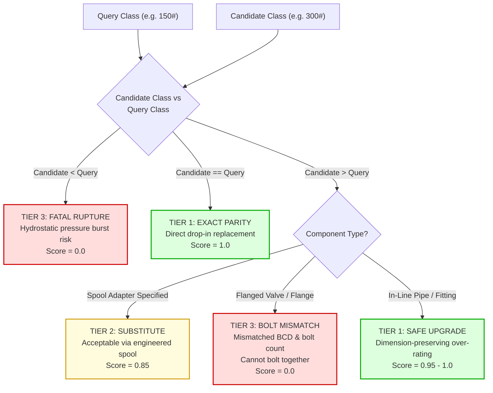
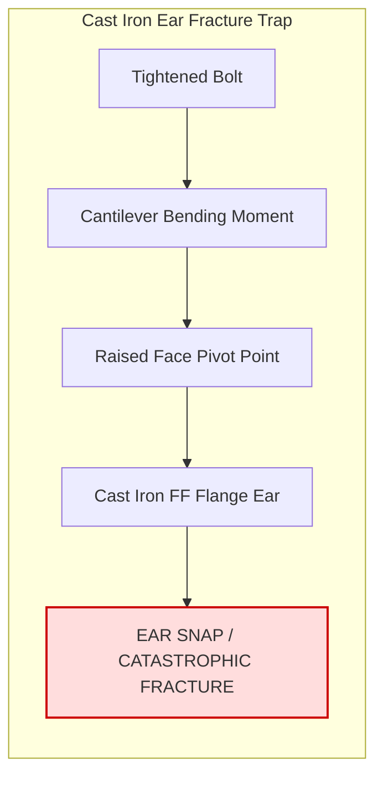

# ASME Standards Codification Module (`rules/asme/`)

This directory codifies the **American Society of Mechanical Engineers (ASME)** piping and flange design standards into deterministic safety checks. These rules govern pressure retention, flange mechanical interfaces, gasket dynamics, and dimensional compatibility across refinery, chemical plant, and offshore pipeline systems.

Probabilistic AI vector similarity is strictly prohibited from overriding any ASME rule. A component that fails any deterministic check here is immediately vetoed under **Invariant #1 (Hard Safety Gate)**, capping its compatibility score at `0.0` and assigning `Tier 3 (Incompatible)`.

---

## 1. Architectural Scope & Standards Codified

```
rules/asme/
├── facings.py            # Module 7: Flange facings (RF, FF, RTJ) & cast iron ear cracking (ASME B16.5 / B31.3)
├── fittings.py           # Module 6: Forged (B16.11) & buttweld (B16.9) fittings, SMYS ratings (MSS SP-75)
├── flange_insulation.py  # Module 20: Cathodic protection dielectric kits (NACE SP0286 Type E vs F)
├── gaskets.py            # Module 8 (Part 1): Gaskets (ASME B16.20/B16.21), SWG inner rings, RTJ hardness
├── large_flanges.py      # Module 4 (Part 2): Large diameter flanges (ASME B16.47 Series A vs B)
├── line_blinds.py        # Module 16: ASME B16.48 spectacle blinds, spades, spacers
├── pressure_class.py     # Module 1: ASME B16.5 / B16.34 pressure classes (150# - 2500#) & PSI ratings
└── README.md             # This comprehensive engineering specification
```

---

## 2. File-by-File Technical Deep Dive

### `pressure_class.py` — ASME B16.5 / B16.34 Pressure Class & P-T Ratings
- **Source File:** [`rules/asme/pressure_class.py`](file:///C:/Users/mayan/Development/Hackathons/Samanvay-AI/rules/asme/pressure_class.py)
- **Codified Standard:** ASME B16.5 Table 2 (Pressure-Temperature Ratings), ASME B16.34, EN 1092-1 / ISO 7005 (PN equivalents).
- **Class Hierarchy:** `150 < 300 < 600 < 900 < 1500 < 2500`
- **Metric PN Equivalents:** `PN16 / PN20 = 150#`, `PN40 / PN50 = 300#`, `PN100 = 600#`, `PN150 = 900#`, `PN250 = 1500#`, `PN420 = 2500#`.
- **Governing Physics & Failure Modes:**
  1. **Pressure Down-Rating Violation:** If candidate pressure class < query requirement, failure is fatal (`Tier 3`, Score `0.0`). Installing a lower-rated component risks immediate hydrostatic rupture under operating design pressure.
  2. **Flanged Component Bolt-Circle Invariant:** Upgrading the pressure class of a flanged component (e.g., Class 150 to Class 300 `FLANGE`, `GATE_VALVE`, `BALL_VALVE`) without an engineered spool adapter is **strictly blocked as Tier 3**. A Class 300 flange has a larger Bolt Circle Diameter (BCD), larger bolt holes, and a different bolt count than a Class 150 flange; they cannot physically bolt together.
  3. **In-Line Component Safe Upgrade:** For in-line components (`PIPE`, `TUBE`, `FITTING`, `ELBOW`), upgrading pressure class preserves outer dimensions while increasing wall thickness, yielding `Tier 1 (Identical Drop-In)` with safe over-rating.
  4. **Operating PSI Check:** Evaluates exact allowable working pressure in PSI. Down-rating yields `Tier 3`; safe over-rating yields `Tier 1`.



---

### `facings.py` — ASME B16.5 / B31.3 Flange Facings & Joint Invariants
- **Source File:** [`rules/asme/facings.py`](file:///C:/Users/mayan/Development/Hackathons/Samanvay-AI/rules/asme/facings.py)
- **Codified Standard:** ASME B16.5 Section 6.4, ASME B31.3 Section 312.2, MSS SP-6.
- **Governing Physics & Failure Modes:**
  1. **Brittle Cast Iron Flange Fracture Trap (ASME B31.3 Section 312.2):** Bolting a Raised Face (RF) steel flange to a Flat Face (FF) cast iron flange (ASTM A126 grey iron) exerts a severe bending moment outside the bolt circle when torquing bolts. Because cast iron possesses near-zero ductility, the cantilever stress shears the brittle flange ears off. This combination is **strictly blocked as Tier 3**.
  2. **RF vs RTJ Geometry Parity:** Raised Face (RF) flanges seal via gasket compression across a raised plane (0.06" or 0.25" serrated face). Ring Type Joint (RTJ) flanges seal via metal ring deformation inside deep trapezoidal grooves. Mating RF to RTJ is physically impossible and results in catastrophic blowout (`Tier 3`).
  3. **ASME B31.3 Severe Cyclic Duty Flange Attachment:** In severe cyclic thermal/pressure shock duty or cryogenic service, Slip-On (SO) flanges are prohibited due to fillet weld fatigue vulnerability. Weld Neck (WN) flanges with full-penetration butt welds are mandatory; proposing SO for WN is blocked as `Tier 3 Fatigue Fracture Trap`.



---

### `large_flanges.py` — ASME B16.47 Series A vs Series B
- **Source File:** [`rules/asme/large_flanges.py`](file:///C:/Users/mayan/Development/Hackathons/Samanvay-AI/rules/asme/large_flanges.py)
- **Codified Standard:** ASME B16.47 (NPS 26 through NPS 60), MSS SP-44 (Series A), API 605 (Series B).
- **Governing Physics & Dimensional Invariant:**
  - **Series A (MSS SP-44):** Designed for heavy piping and pipeline valves. Flanges are thicker, heavier, have a larger Bolt Circle Diameter (BCD), and use fewer, larger-diameter bolts.
  - **Series B (API 605):** Designed for compact process equipment nozzles and heat exchangers. Flanges are thinner, lighter, have a smaller BCD, and use more, smaller-diameter bolts.
  - **Incompatibility Rule:** Series A and Series B flanges **CANNOT bolt together**. Even at identical nominal pipe sizes and pressure classes, bolt hole patterns do not align. Any Series A vs Series B cross-substitution is strictly blocked as `Tier 3 Incompatible`.

| Parameter (NPS 36 Class 300) | ASME B16.47 Series A | ASME B16.47 Series B | Impact of Mismatched Bolting |
|:---|:---|:---|:---|
| **Flange OD** | 49.50 in (1257 mm) | 46.12 in (1171 mm) | Series B flange face slips inside bolt pattern |
| **Bolt Circle Diameter (BCD)** | 46.00 in (1168 mm) | 42.88 in (1089 mm) | **3.12-inch radial offset — bolts cannot pass** |
| **Number of Bolts** | 32 bolts | 44 bolts | Hole quantity mismatch |
| **Bolt Diameter** | 2.00 in | 1.375 in | Bolt size mismatch |

---

### `gaskets.py` — ASME B16.20 & B16.21 Sealing Elements
- **Source File:** [`rules/asme/gaskets.py`](file:///C:/Users/mayan/Development/Hackathons/Samanvay-AI/rules/asme/gaskets.py)
- **Codified Standard:** ASME B16.20 (Metallic/Semi-Metallic), ASME B16.21 (Non-Metallic Sheet), API 6A.
- **Governing Physics & Failure Modes:**
  1. **Spiral Wound Gasket (SWG) Inner Ring Mandate:** In ASME B16.5 Class 900+ flanges, in vacuum service, and with PTFE fillers, high bolt preloads exert extreme radial inward compressive forces. Without a solid metallic inner ring, the sealing windings buckle inwardly into the pipe bore, choking flow and causing joint blowout (`Tier 3 Gasket Collapse Trap`).
  2. **Filler Material Thermal Limit (Graphite vs PTFE):** Flexible graphite is rated to 650°C in non-oxidizing environments. PTFE is strictly limited to 260°C. Proposing PTFE for graphite at temperatures > 260°C results in thermal liquefaction and explosive blowout (`Tier 3 Gasket Melting Trap`).
  3. **RTJ Hardness Invariant (ASME B16.20 Section 3.2):** An RTJ metallic ring gasket must deform plastically into the flange groove to seal. If gasket ring hardness $\ge$ flange face hardness (HRB), tightening bolts coins, indents, and galls the expensive flange face instead of seating the gasket. This triggers `Tier 3 RTJ Galling Trap`.
  4. **BX vs R Groove Incompatibility:** API 6A BX pressure-energized rings (15,000 PSI) cannot fit into standard ASME B16.5 R grooves (`Tier 3`).

---

### `fittings.py` — ASME B16.11 Forged & ASME B16.9 Buttweld Fittings
- **Source File:** [`rules/asme/fittings.py`](file:///C:/Users/mayan/Development/Hackathons/Samanvay-AI/rules/asme/fittings.py)
- **Codified Standard:** ASME B16.11 (Forged SW / Threaded), ASME B16.9 (Factory-Made Buttweld), MSS SP-75 (High-Test Pipeline Fittings).
- **Governing Physics & Failure Modes:**
  1. **ASME B16.11 Rating Correlation:**
     - Threaded fittings ladder: `2000# < 3000# < 6000#`
     - Socket-weld fittings ladder: `3000# < 6000# < 9000#`
     - Class 3000 correlates to Schedule 80/XS pipe; Class 6000 correlates to Schedule 160. Down-rating is strictly `Tier 3`.
  2. **Elbow Bend Radius & Piggability Invariant (ASME B16.9):**
     - Long Radius (LR): Centerline radius $R = 1.5D$
     - Short Radius (SR): Centerline radius $R = 1.0D$
     - Substituting an SR elbow for an LR elbow in a piggable pipeline results in immediate rejection (`Tier 3 Pigging Restriction Trap`). Inspection scrapers and intelligent pigs cannot negotiate the sharp $1.0D$ curvature and will lodge in the bend, shutting down pipeline throughput.
  3. **High-Yield Pipeline Fittings SMYS (MSS SP-75):** Fittings specified with high Specified Minimum Yield Strength (WPHY 42 through WPHY 70) cannot be downgraded to ASTM A234 WPB carbon steel (`Tier 3`).

---

### `line_blinds.py` — ASME B16.48 Line Blinds & Spacers
- **Source File:** [`rules/asme/line_blinds.py`](file:///C:/Users/mayan/Development/Hackathons/Samanvay-AI/rules/asme/line_blinds.py)
- **Codified Standard:** ASME B16.48 (Line Blanks), ASME B31.3.
- **Governing Physics & Failure Modes:**
  1. **Positive Isolation Blowout Trap:** Substituting uncalculated, shop-fabricated flat plate for an engineered, certified ASME B16.48 paddle blind is strictly blocked as `Tier 3`. Unreinforced flat plate yields plastically under full line design pressure, causing catastrophic isolation failure during hot work or vessel entry.
  2. **Handle Marking Parity:** Paddle Spades (solid isolation disc) and Paddle Spacers (open flow ring) must feature distinct, marked handles per ASME B16.48 to provide external visual verification of line status. Unmarked handles require mandatory HITL review (`Tier 2`).

---

### `flange_insulation.py` — Cathodic Protection Flange Insulation Kits
- **Source File:** [`rules/asme/flange_insulation.py`](file:///C:/Users/mayan/Development/Hackathons/Samanvay-AI/rules/asme/flange_insulation.py)
- **Codified Standard:** NACE SP0286, NACE SP0169.
- **Governing Physics & Failure Modes:**
  1. **Accelerated Galvanic Perforation Trap (Type E vs Type F):** In buried, submerged, or offshore seawater piping connecting dissimilar metals (e.g. Carbon Steel to Stainless Steel), dielectric isolation is required. A **Type F** gasket fits only on the raised face, leaving the outer gap open to conductive soil/mud/water bridging, short-circuiting cathodic protection. A **Type E** (Full Face) gasket extends to the outer flange OD with bolt sleeves and insulating washers, eliminating bridging. Substituting Type F for Type E in buried/dissimilar metal service is blocked as `Tier 3`.
  2. **Dielectric Retainer Thermal Breakdown:** Phenolic retainers degrade above 100°C. In high-temperature lines, NEMA G10 (150°C) or NEMA G11 (180°C) glass epoxy retainers are mandatory (`Tier 3 Dielectric Breakdown Trap`).

---

## 3. Practical Code Usage

```python
from rules.asme.pressure_class import check_pressure_class
from rules.asme.facings import check_flange_facing
from rules.asme.gaskets import check_gasket_compatibility
from rules.asme.large_flanges import check_large_flange_series

# 1. Evaluate pressure class upgrade on a flanged valve
tier, score, violation = check_pressure_class(
    query_class=150,
    candidate_class=300,
    item_type="GATE_VALVE"
)
print(tier)       # DynamicCompatibilityTier.TIER_3_INCOMPATIBLE (Bolt circle mismatch)
print(violation)  # PRESSURE UPGRADE FLANGE MISMATCH

# 2. Evaluate Cast Iron Flange Ear Fracture Trap
tier, score, violation = check_flange_facing(
    query_facing="FF",
    candidate_facing="RF",
    body_material="ASTM A126 Cast Iron"
)
print(tier)       # DynamicCompatibilityTier.TIER_3_INCOMPATIBLE
print(violation.failure_mode_prevented) # Brittle cast iron flange ear bending moment cracking

# 3. Evaluate ASME B16.47 Large Flange Series
tier, score, violation = check_large_flange_series(
    query_series="SERIES_A",
    candidate_series="SERIES_B"
)
print(tier)       # DynamicCompatibilityTier.TIER_3_INCOMPATIBLE (PCD mismatch)

# 4. Evaluate High-Temp Gasket Filler
tier, score, violation = check_gasket_compatibility(
    query_props={"filler": "GRAPHITE", "temp_c": 350},
    cand_props={"filler": "PTFE"}
)
print(tier)       # DynamicCompatibilityTier.TIER_3_INCOMPATIBLE (PTFE melting at 350°C)
```

---

## 4. Test Suite Execution

Run all ASME-specific unit tests covering pressure classes, facings, fittings, gaskets, and large flanges:

```bash
# Run all ASME tests
pytest tests/unit/test_tolerance.py -k "asme or pressure or facing or gasket or fitting" -v
```
