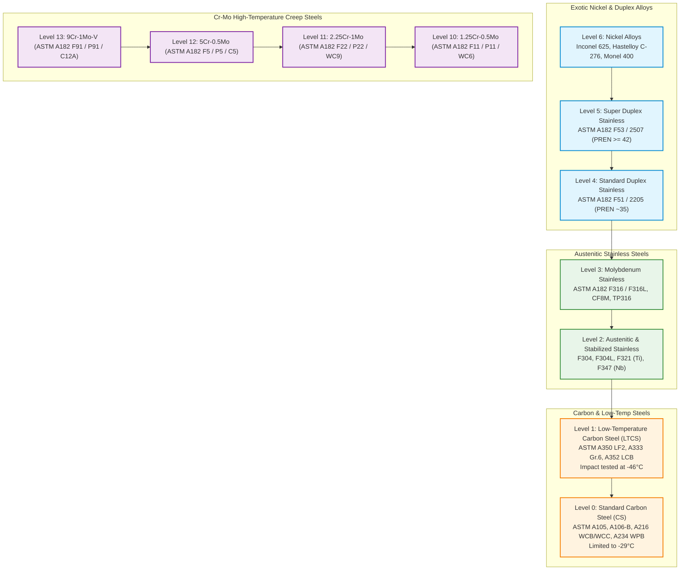
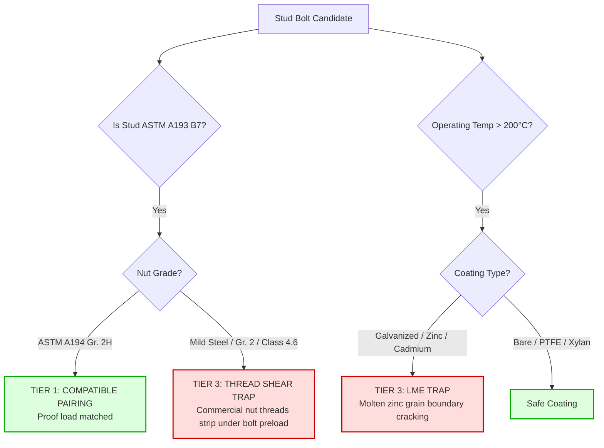

# ASTM Standards & Metallurgy Graph Module (`rules/astm/`)

This directory codifies the **American Society for Testing and Materials (ASTM)** material specifications into deterministic metallurgical verification routines, Directed Acyclic Graph (DAG) traversals, and fastener integrity checks.

Probabilistic machine learning models often classify different metal alloys as similar because their text descriptions overlap significantly. However, in refinery hydrocrackers, sour gas headers, and cryogenic LNG transfer systems, **metallurgical downgrades cause catastrophic chemical corrosion, brittle fracture, or molten metal grain-boundary attack**.

This module enforces **Invariant #1 (Hard Safety Gate)**: any metallurgical downgrade or incompatible fastener pairing immediately results in `Tier 3 (Incompatible)` with a composite score of `0.0`.

---

## 1. Architectural Scope & Standards Codified

```
rules/astm/
├── fasteners.py       # Module 8 (Part 2): Bolting integrity (A193/A194/A320), stud-nut parity, LME (>200°C)
├── metallurgy_dag.py  # Module 2: Directed Acyclic Graph of alloys, creep steels, cryogenic & sensitization rules
└── README.md          # This comprehensive engineering specification
```

---

## 2. File-by-File Technical Deep Dive

### `metallurgy_dag.py` — Metallurgical Directed Acyclic Graph Engine
- **Source File:** [`rules/astm/metallurgy_dag.py`](file:///C:/Users/mayan/Development/Hackathons/Samanvay-AI/rules/astm/metallurgy_dag.py)
- **Codified Standards:** ASTM A105, A106, A216, A350, A333, A182, A312, A351, A815, ASTM A335 (P-grades), ASME B31.3 Section 323.
- **Hierarchy Architecture & Levels:**
  The DAG establishes a mathematical partial ordering where an alloy at Level $N$ can safely substitute for an alloy at Level $\le N$ within compatible fluid regimes, while downward substitutions are unilaterally vetoed:



#### Deterministic Metallurgical Failure Traps:
1. **Cryogenic Brittle Fracture Trap (ASTM A350 LF2 vs A105):**
   - Standard carbon steel (ASTM A105 / A106) has a body-centered cubic (BCC) crystal lattice that undergoes a severe ductile-to-brittle transition at $-29^\circ\text{C}$.
   - Low-temperature carbon steel (ASTM A350 LF2 / A333 Gr. 6) is fine-grained, normalized, and Charpy V-notch impact tested at $-46^\circ\text{C}$ ($\ge 27\text{ Joules}$).
   - **Rule:** Substituting standard A105 for cryogenic LF2 is **blocked as Tier 3**. Under cryogenic thermal shock, uncertified carbon steel shatters catastrophically like glass.

2. **Intergranular Corrosion & Sensitization Trap (Standard vs Low-Carbon "L" Grades):**
   - In austenitic stainless steels (304, 316), exposure to the temperature range of $425^\circ\text{C} - 860^\circ\text{C}$ (during welding or process operation) causes chromium carbides ($Cr_{23}C_6$) to precipitate along grain boundaries. This depletes the adjacent alloy of chromium below the 12% passivation threshold ("sensitization").
   - Low-carbon grades (ASTM A182 F304L, F316L with $C \le 0.03\%$) and stabilized grades (ASTM A182 F321 with Titanium, F347 with Niobium) prevent carbide precipitation.
   - **Rule:** Substituting non-L standard grades (304, 316) for low-carbon or stabilized grades in acidic/welded service triggers **Tier 3 Intergranular Corrosion Trap**.

3. **High-Temperature Creep Rupture Trap (Cr-Mo Alloys vs Carbon Steel):**
   - Above $400^\circ\text{C}$, carbon steel suffers accelerated thermal creep voiding and graphitization (decomposition of iron carbide into graphite nodules, embrittling the steel).
   - Chromium-Molybdenum steels (P11, P22, P5, P91) provide creep-rupture strength up to $650^\circ\text{C}$.
   - **Rule:** Downgrading a Cr-Mo alloy to carbon steel is **strictly blocked as Tier 3**.

4. **Certified Safe Drop-In Upgrades:**
   - **Wrought SS304 $\to$ SS316:** Direct interchangeable drop-in replacement (`Tier 1`, Score `0.98`). SS316 contains 2.0-3.0% Molybdenum, providing superior pitting and crevice corrosion resistance without altering dimensions.
   - **A193 B7 $\to$ B16 Bolting:** Direct drop-in upgrade (`Tier 1`, Score `0.99`) for high-temperature service.

---

### `fasteners.py` — ASTM A193 / A194 / A320 Bolting Integrity
- **Source File:** [`rules/astm/fasteners.py`](file:///C:/Users/mayan/Development/Hackathons/Samanvay-AI/rules/astm/fasteners.py)
- **Codified Standards:** ASTM A193 (High-Temp Alloy Studs), ASTM A194 (Carbon & Alloy Heavy Hex Nuts), ASTM A320 (Cryogenic Bolting), NACE MR0175 / ISO 15156.
- **Governing Physics & Failure Modes:**

#### 1. Mandatory Stud-Nut Pairing Matrix:
Under ASME Section VIII and ASME B31.3, studs and nuts must share matched proof-load capabilities:

| Service Duty | Stud Bolt Grade | Mandatory Heavy Hex Nut Grade | Failure Mode if Mismatched |
|:---|:---|:---|:---|
| **Standard High-Pressure** | ASTM A193 Gr. B7 (Cr-Mo) | **ASTM A194 Gr. 2H** | Low-carbon mild steel nuts strip threads under bolt preload (`Tier 3 Thread Shear Trap`) |
| **High-Temperature Creep** | ASTM A193 Gr. B16 (Cr-Mo-V) | **ASTM A194 Gr. 7** or **Gr. 4** | 2H nuts lose proof load above 450°C, causing joint relaxation |
| **Cryogenic Duty ($-101^\circ\text{C}$)** | ASTM A320 Gr. L7 (Ni-Cr-Mo) | **ASTM A194 Gr. 7** or **Gr. 4** | Standard B7 studs shatter under thermal shock (`Tier 3 Cryogenic Bolting Trap`) |
| **Sour Gas Duty ($H_2S$)** | ASTM A193 Gr. B7M ($\le 22\text{ HRC}$) | **ASTM A194 Gr. 2HM** ($\le 22\text{ HRC}$) | Hard B7 studs suffer explosive Sulfide Stress Cracking (SSC) |
| **Corrosive Marine / Acid** | ASTM A193 Gr. B8M (SS316) | **ASTM A194 Gr. 8M** | Galvanic cell corrosion and thread galling |



#### 2. Liquid Metal Embrittlement (LME) Trap:
- **Physics of LME:** When alloy steels (such as A193 B7 or B16) or austenitic stainless steels are stressed in the presence of molten or near-molten low-melting metals (Zinc melting point: $419.5^\circ\text{C}$, Cadmium: $321^\circ\text{C}$), the liquid metal rapidly wets and penetrates the steel's grain boundaries. This causes instantaneous, catastrophic brittle failure at stresses far below the nominal yield strength.
- **Critical Threshold:** Above $200^\circ\text{C} - 250^\circ\text{C}$ (and extending to $> 400^\circ\text{C}$ on stainless steel piping), galvanized, zinc-electroplated, or cadmium-plated bolts suffer LME cracking.
- **Rule:** Any galvanized or zinc-plated bolt proposed for service temperatures $> 200^\circ\text{C}$ is **vetoed as Tier 3 Liquid Metal Embrittlement Trap**. Bare or fluoropolymer-coated (Xylan/PTFE) bolting is mandatory.

#### 3. Yield Strength Integrity:
- Candidate fastener yield strength (MPa) must meet or exceed required yield strength. Lower yield strength leads to bolt elongation, loss of gasket seating stress, and joint blowout (`Tier 3`).

---

## 3. Practical Code Usage

```python
from rules.astm.metallurgy_dag import check_metallurgy
from rules.astm.fasteners import check_fastener_integrity

# 1. Evaluate Cryogenic LF2 vs Standard A105
tier, score, viol = check_metallurgy(
    query_mat="ASTM A350 LF2",
    candidate_mat="ASTM A105"
)
print(tier)  # DynamicCompatibilityTier.TIER_3_INCOMPATIBLE
print(viol.failure_mode_prevented)  # Cryogenic brittle fracture at -46°C

# 2. Evaluate SS304 to SS316 Safe Drop-In Upgrade
tier, score, viol = check_metallurgy(
    query_mat="ASTM A182 F304",
    candidate_mat="ASTM A182 F316"
)
print(tier)   # DynamicCompatibilityTier.TIER_1_IDENTICAL
print(score)  # 0.98 (Safe Molybdenum upgrade)

# 3. Evaluate Fastener Liquid Metal Embrittlement (LME)
tier, score, viol = check_fastener_integrity(
    query_stud="ASTM A193 B7",
    cand_stud="ASTM A193 B7",
    query_props={"temp_c": 280.0},
    cand_props={"coating": "HOT_DIP_GALVANIZED", "nut_grade": "A194 2H"}
)
print(tier)  # DynamicCompatibilityTier.TIER_3_INCOMPATIBLE
print(viol.explanation) # LIQUID METAL EMBRITTLEMENT TRAP: Service temperature is 280.0°C...

# 4. Evaluate Fastener Nut Mismatch Thread Shear
tier, score, viol = check_fastener_integrity(
    query_stud="ASTM A193 B7",
    cand_stud="ASTM A193 B7",
    query_props={},
    cand_props={"nut_grade": "MILD_STEEL_GR2"}
)
print(tier)  # DynamicCompatibilityTier.TIER_3_INCOMPATIBLE
print(viol.failure_mode_prevented) # Commercial nut thread stripping under high bolt preload
```

---

## 4. Test Suite Execution

Run all ASTM-specific unit tests covering the metallurgy DAG, cryogenic impact certification, creep steels, and fastener integrity:

```bash
# Run all ASTM tests
pytest tests/unit/test_tolerance.py -k "astm or metallurgy or fastener or lme" -v
```
