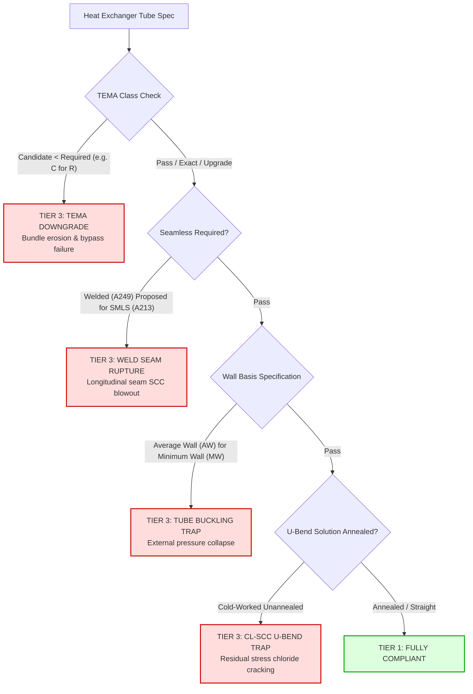
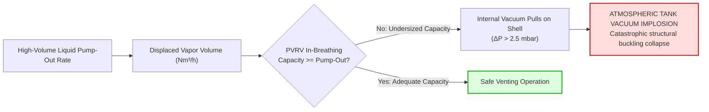
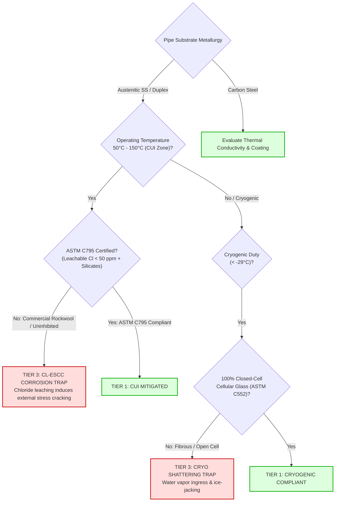

# Static Process Equipment Standards (`rules/equipment/`)

This directory codifies engineering rules for static heat transfer equipment, atmospheric storage tanks, particulate filtration, steam distribution, and thermal insulation systems across downstream hydrocarbon processing units.

In high-pressure refinery operations, **static equipment failures are often catastrophic**: undersized breather valves buckle 50,000-barrel storage tanks under vacuum, improper tube wall gauges cause bundle collapse, and wet insulation containing leachable chlorides creates rapid **Corrosion Under Insulation (CUI)** that slices through stainless steel piping.

This module enforces **Invariant #1 (Hard Safety Gate)**: any violation of these codified physical and metallurgical invariants results in immediate veto (`Tier 3 Incompatible`, Score `0.0`).

---

## 1. Architectural Scope & Standards Codified

```
rules/equipment/
├── heat_exchangers.py    # Module 12: TEMA classes (R/C/B), seamless vs welded tubes, BWG wall basis, U-bends
├── strainers_traps.py    # Module 19: Strainers (mesh/NPSH), filters (microns), NPT/BSPT threads, steam traps
├── tank_safety.py        # Module 17: Storage tanks (API 2000 PVRV vacuum implosion, ISO 16852 flame arrestors)
├── thermal_insulation.py # Module 21: Thermal insulation, ASTM C795 CUI leachable chlorides, ASTM C552 cryo
└── README.md             # This comprehensive engineering specification
```

---

## 2. File-by-File Technical Deep Dive

### `heat_exchangers.py` — TEMA Shell & Tube Heat Exchangers
- **Source File:** [`rules/equipment/heat_exchangers.py`](file:///C:/Users/mayan/Development/Hackathons/Samanvay-AI/rules/equipment/heat_exchangers.py)
- **Codified Standards:** TEMA Standards (10th Edition), ASME Section VIII Division 1 (Part UHX), ASTM A213, ASTM A249, ASTM A688.
- **Hierarchy Architecture:** `TEMA B (Chemical) < TEMA C (Commercial) < TEMA R (Refinery)`
- **Governing Physics & Failure Modes:**
  1. **TEMA Construction Class Downgrade Trap:**
     - **TEMA R:** Mandates heavier shell thicknesses, larger tie-rods, tighter baffle clearances, and rigorous corrosion allowances for severe petroleum refinery service.
     - **TEMA C & B:** Designed for general commercial and mild chemical duties with lighter structural tolerances.
     - **Rule:** Proposing TEMA C or B for a TEMA R specification is **vetoed as Tier 3**. Lighter construction causes premature bundle erosion, baffle clearance bypass, and structural fatigue under hydraulic pulsations.
  2. **Seamless vs. Welded Tubing Invariant:**
     - Welded tubing (ASTM A249) has a longitudinal weld seam subject to residual welding stress and micro-fissuring.
     - In reboilers, high-pressure condensers, and sour service exchangers, seamless tubing (ASTM A213) is mandatory.
     - **Rule:** Substituting welded for seamless is blocked as `Tier 3 Weld Seam Rupture Trap`.
  3. **BWG Wall Basis (Minimum Wall vs Average Wall):**
     - Birmingham Wire Gauge (BWG) specifies tube wall thickness.
     - **Minimum Wall (MW):** Guarantees the wall thickness never falls below the nominal value (tolerance $+20\% / -0\%$).
     - **Average Wall (AW):** Permits a $\pm 10\%$ tolerance band, resulting in local thin spots up to $10\%$ below nominal.
     - **Rule:** Under external shell-side pressure, substituting AW for MW creates local under-gauge flat spots that buckle under buckling hoop stress (`Tier 3 Tube Buckling Trap` per TEMA RCB-2.21).
  4. **U-Bend Solution Annealing (TEMA R RCB-2.31):**
     - Bending austenitic stainless steel tubes cold-works the U-bend apex, generating high residual tensile stresses.
     - **Rule:** In hot water or chloride-bearing hydrocarbon streams, un-annealed U-bends suffer rapid stress corrosion cracking (`Tier 3 Cl-SCC U-Bend Trap`). Solution heat treatment is mandatory.



---

### `tank_safety.py` — Storage Tank Safety & Venting
- **Source File:** [`rules/equipment/tank_safety.py`](file:///C:/Users/mayan/Development/Hackathons/Samanvay-AI/rules/equipment/tank_safety.py)
- **Codified Standards:** API Standard 2000 (7th Edition), API 650, ISO 16852 / EN 12874 (Flame Arresters), ISO 12944 (Corrosivity).
- **Governing Physics & Failure Modes:**
  1. **API 2000 Tank Vacuum Implosion Trap:**
     - Atmospheric storage tanks have huge surface areas but extremely thin steel shell walls ($5 - 12\text{ mm}$), designed for minimal internal pressure ($+20\text{ mbar}$) and near-zero vacuum ($-2.5\text{ mbar}$).
     - When large transfer pumps pump liquid out of the tank at high rates, air/gas must be in-breathed through the Pressure/Vacuum Relief Valve (PVRV).
     - **Rule:** If candidate PVRV in-breathing capacity ($\text{Nm}^3/\text{hr}$ or $\text{SCFH}$) is less than the required liquid pump-out displacement rate, a partial vacuum develops inside the tank. The atmospheric pressure outside crushes the entire tank shell like an aluminum can (`Tier 3 Tank Vacuum Implosion Trap`).
  2. **ISO 16852 Flame & Detonation Arrestors:**
     - **Deflagration Arrestors:** Designed to quench subsonic flame fronts in low-pressure open atmospheric vents (End-of-Line).
     - **Detonation Arrestors:** Designed to quench supersonic shock waves ($> 2,000\text{ m/s}$) with massive overpressure spikes ($> 50\text{ bar}$) inside closed piping headers (In-Line flare headers, vapor recovery lines).
     - **Rule:** Substituting an end-of-line deflagration arrestor in a closed header is **strictly blocked as Tier 3**. Supersonic flame shock waves blow straight through deflagration crimped ribbons, igniting the storage tank vapor space.
  3. **Tank Painting System Mismatch:**
     - Tank coatings protect structural steel from atmospheric C5M marine corrosivity and acidic chemical attack.
     - **Rule:** Substituting commercial alkyd primer in place of chemical-grade epoxy-phenolic lining is **blocked as Tier 3**. Alkyds dissolve in hydrocarbon vapors, leading to severe wall thinning and pinhole perforation.



---

### `strainers_traps.py` — Strainers, Filters & Steam Traps
- **Source File:** [`rules/equipment/strainers_traps.py`](file:///C:/Users/mayan/Development/Hackathons/Samanvay-AI/rules/equipment/strainers_traps.py)
- **Codified Standards:** ASME B16.34, ISO 16889, ISO 2942, ISO 6552, ASME PTC 39, ASME B1.20.1, ISO 7-1.
- **Governing Physics & Failure Modes:**
  1. **Filter Micron Rating Downgrade:**
     - Filters protect delicate mechanical seals, servo valves, and instrumentation from particulate damage.
     - **Rule:** If candidate micron rating > required micron rating (e.g. $25\ \mu\text{m}$ supplied for $10\ \mu\text{m}$ required), larger abrasive particles pass into downstream equipment, scoring seal faces and seizing valves (`Tier 3 Incompatible`). Candidate micron < required is a safe upgrade (`Tier 2`).
     - **Pump Suction Fine Mesh Cavitation:** Overly fine mesh ($< 40\text{ mesh}$) on pump suction lines increases pressure drop, starving $\text{NPSH}_a$ and triggering impeller cavitation (`Tier 3 Pump Cavitation Trap`).
  2. **Thread System Invariance (NPT vs BSPT):**
     - **NPT (National Pipe Taper):** $60^\circ$ thread flank angle, flat crests and roots per ASME B1.20.1.
     - **BSPT (British Standard Pipe Taper):** $55^\circ$ thread flank angle, rounded crests and roots per ISO 7-1.
     - **Rule:** Attempting to screw an NPT fitting into a BSPT port cross-threads, galls, and creates spiral leak paths. Under high pressure, the mismatched joint blows off violently (`Tier 3 Thread Mismatch Trap`).
  3. **Steam Trap Operating Mechanism (Water Hammer Trap):**
     - **Thermodynamic Disc Traps:** Rely on Bernoulli dynamics under high-velocity flash steam. If downstream condensate backpressure exceeds $80\%$ of inlet pressure, disc traps cannot open, locking shut.
     - **Inverted Bucket / Float Traps:** Operate purely by buoyancy, functioning reliably even against $90\%$ backpressure.
     - **Rule:** Proposing a thermodynamic disc trap for a high-backpressure closed condensate return header causes condensate backup into high-pressure steam mains. Cold condensate slugs propelled by supersonic steam trigger catastrophic pipe rupture (`Tier 3 Water Hammer Trap`).

---

### `thermal_insulation.py` — Thermal Insulation & CUI Mitigation
- **Source File:** [`rules/equipment/thermal_insulation.py`](file:///C:/Users/mayan/Development/Hackathons/Samanvay-AI/rules/equipment/thermal_insulation.py)
- **Codified Standards:** ASTM C795, ASTM C552, NACE SP0198, API 583.
- **Governing Physics & Failure Modes:**
  1. **ASTM C795 Leachable Chlorides Invariance (CUI Prevention):**
     - In chemical plants and offshore platforms operating between $50^\circ\text{C}$ and $150^\circ\text{C}$, moisture ingress into insulation creates the ideal incubation zone for **Corrosion Under Insulation (CUI)**.
     - Over austenitic stainless steel (304, 316) and duplex alloys, insulation materials containing leachable chloride ($Cl^-$) and fluoride ($F^-$) ions leach halogens onto the hot pipe surface. The chlorides concentrate under thermal evaporation, triggering rapid, catastrophic **Chloride External Stress Corrosion Cracking (Cl-ESCC)**.
     - **Rule:** Insulation installed over stainless steel or duplex substrates must be certified to **ASTM C795** (leachable chlorides $< 50\text{ ppm}$ and formulated with sodium silicate chemical corrosion inhibitors). Proposing standard non-inhibited mineral wool or calcium silicate is **vetoed as Tier 3 Cl-ESCC Corrosion Trap**.
  2. **ASTM C552 Cellular Glass for Cryogenic Service:**
     - Cryogenic lines ($-162^\circ\text{C}$ LNG, $-104^\circ\text{C}$ Ethylene, $-42^\circ\text{C}$ Propane) operate below the dew point of ambient air.
     - **Rule:** Cryogenic insulation must be $100\%$ closed-cell, completely non-absorbent Cellular Glass (Foamglas per ASTM C552). Permeable fibrous insulation (mineral wool, fiberglass) allows water vapor to breathe in, condensing and freezing into ice inside the insulation. The expanding ice shatters the insulation jackets ("ice-jacking"), leading to thermal boil-off runaway and cryogenic steel embrittlement (`Tier 3 Cryogenic Insulation Shattering Trap`).



---

## 3. Practical Code Usage

```python
from rules.equipment.heat_exchangers import check_heat_exchanger_tubes
from rules.equipment.tank_safety import check_tank_safety_and_paint
from rules.equipment.strainers_traps import check_strainer_filter_and_steam_trap
from rules.equipment.thermal_insulation import check_thermal_insulation_cui

# 1. Evaluate TEMA R Exchanger Tube BWG Wall Basis
tier, score, viol = check_heat_exchanger_tubes(
    query_props={"tema_class": "TEMA R", "wall_basis": "MINIMUM_WALL"},
    cand_props={"tema_class": "TEMA R", "wall_basis": "AVERAGE_WALL"}
)
print(tier)  # DynamicCompatibilityTier.TIER_3_INCOMPATIBLE
print(viol.failure_mode_prevented)  # External tube buckling collapse from under-gauge wall

# 2. Evaluate Tank PVRV In-Breathing Vacuum Collapse
tier, score, viol = check_tank_safety_and_paint(
    query_props={"required_scfh": 50000.0},
    cand_props={"required_scfh": 25000.0}
)
print(tier)  # DynamicCompatibilityTier.TIER_3_INCOMPATIBLE
print(viol.explanation)  # TANK VACUUM IMPLOSION TRAP: Candidate in-breathing capacity...

# 3. Evaluate Thread Mismatch on High-Pressure Filter (NPT vs BSPT)
tier, score, viol = check_strainer_filter_and_steam_trap(
    query_props={"thread": "NPT"},
    cand_props={"thread": "BSPT"}
)
print(tier)  # DynamicCompatibilityTier.TIER_3_INCOMPATIBLE
print(viol.failure_mode_prevented)  # Thread galling and high-pressure fluid jetting leakage

# 4. Evaluate CUI Leachable Chlorides over Stainless Steel
tier, score, viol = check_thermal_insulation_cui(
    query_props={"ss_piping": True, "temp_c": 110},
    cand_props={"astm_c795_compliant": False, "chloride_ppm_max": 180.0},
    substrate_material="ASTM A312 TP316L"
)
print(tier)  # DynamicCompatibilityTier.TIER_3_INCOMPATIBLE
print(viol.failure_mode_prevented)  # CUI and chloride stress cracking of stainless steel
```

---

## 4. Test Suite Execution

Run all equipment, heat exchanger, storage tank, and thermal insulation unit tests:

```bash
# Run all equipment tests
pytest tests/unit/test_tolerance.py -k "equipment or exchanger or tank or trap or insulation or cui" -v
```
