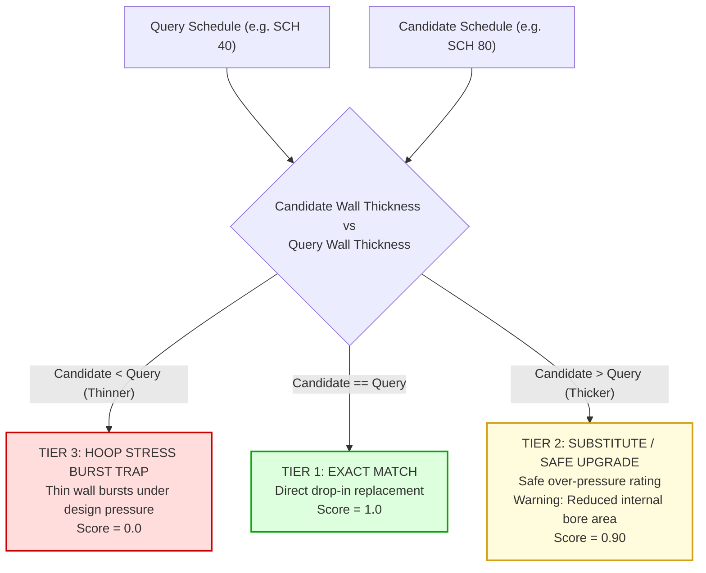
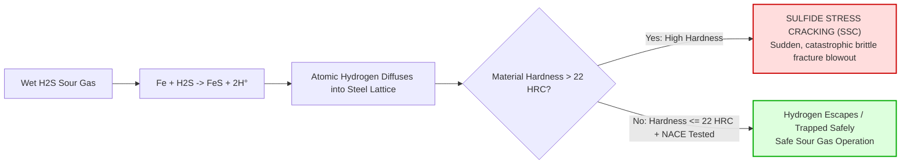

# Process Piping & Pipeline Standards (`rules/piping/`)

This directory codifies engineering standards for process piping, cross-country pipelines, pipe schedules, API 5L line pipes, high-pressure instrumentation tubing, sour gas metallurgy, and expansion joints.

In chemical plants, gas transmission grids, and offshore production platforms, piping components bear extreme pressure, mechanical vibration, and corrosive chemicals. A single under-gauge pipe wall schedule, a non-NACE carbon steel valve in wet $H_2S$ service, or a mismatched imperial/metric compression ferrule will trigger **catastrophic explosive decompression, toxic sulfide gas clouds, or pipeline rupture**.

This module enforces **Invariant #1 (Hard Safety Gate)**: any deterministic piping violation immediately vetoes the candidate item (`Tier 3 Incompatible`, Score `0.0`).

---

## 1. Architectural Scope & Standards Codified

```
rules/piping/
├── expansion_joints.py  # Module 18: EJMA expansion joints (tied vs unrestrained), ISO 10380 braided hoses
├── line_pipe.py         # Module 9: API 5L line pipe (PSL 1 vs 2), ASME B31.3 Category M lethal fluid service
├── nace.py              # Module 4 (Part 1): NACE MR0175 / ISO 15156 sour hydrocarbon hardness ceiling (<= 22 HRC)
├── schedules.py         # Module 3: Pipe wall schedules (ASME B36.10M / B36.19M), ISO 21809 3LPE coatings
├── tubing.py            # Module 10: Instrumentation tubing (ASTM A269 OD mm vs inch, hardness <= 90 HRB)
└── README.md            # This comprehensive engineering specification
```

---

## 2. File-by-File Technical Deep Dive

### `schedules.py` — ASME B36.10M / B36.19M Pipe Schedules
- **Source File:** [`rules/piping/schedules.py`](file:///C:/Users/mayan/Development/Hackathons/Samanvay-AI/rules/piping/schedules.py)
- **Codified Standards:** ASME B36.10M (Carbon & Alloy Steel), ASME B36.19M (Stainless Steel), ISO 21809 / NACE SP0188 (External Coatings).
- **Schedule Ladder:**
  ```
  SCH 5/5S < SCH 10/10S < SCH 20 < SCH 30 < STD / SCH 40 / 40S < SCH 60 < XS / SCH 80 / 80S < SCH 100 < SCH 120 < SCH 140 < SCH 160 < XXS
  ```
- **Governing Physics & Failure Modes:**
  1. **Down-Scheduling Burst Hazard:** Pipe hoop stress ($\sigma_h = \frac{P \cdot D}{2t}$) is inversely proportional to wall thickness $t$. If a thinner schedule is installed than required by design (e.g. Schedule 40 supplied when Schedule 80 is required), the hoop stress exceeds the material's yield strength under internal design pressure, resulting in violent ductile longitudinal rupture. **Down-scheduling is strictly blocked as Tier 3**.
  2. **Schedule Upgrades (Safe Over-Rating):** Upgrading from Schedule 40 to Schedule 80 increases wall thickness and pressure capability. However, because Outside Diameter (OD) is fixed per ASME B36.10M, increasing wall thickness reduces Internal Diameter (ID), increasing flow velocity and pressure drop. Therefore, schedule upgrades are categorized as `Tier 2 (Substitute)` requiring HITL verification of hydraulic flow capacity.
  3. **Anti-Corrosion Coating Thickness (3LPE / FBE):** Evaluates 3-Layer Polyethylene (3LPE) and Fusion Bonded Epoxy (FBE) thickness. Coating thickness below required specification leads to pinhole corrosion and external soil corrosion (`Tier 3 Incompatible`). Upgrades are classified as `Tier 2`.



---

### `nace.py` — NACE MR0175 / ISO 15156 Sour Hydrocarbon Service
- **Source File:** [`rules/piping/nace.py`](file:///C:/Users/mayan/Development/Hackathons/Samanvay-AI/rules/piping/nace.py)
- **Codified Standard:** NACE MR0175 / ISO 15156 (Parts 1, 2, and 3), NACE TM0177, NACE TM0284.
- **Governing Physics & Failure Modes:**
  1. **Sulfide Stress Cracking (SSC) & Hydrogen Embrittlement:**
     - In oil and gas streams containing water and dissolved Hydrogen Sulfide ($H_2S$), electrochemical corrosion produces atomic hydrogen ($H^+$).
     - The presence of sulfur poisons the hydrogen recombination reaction, forcing atomic hydrogen to diffuse directly into the steel crystal lattice.
     - In hard microstructures (untempered martensite or high-carbon pearlite), hydrogen collects at dislocations and inclusions, initiating rapid, catastrophic **brittle cracking at stresses well below normal design limits**.
  2. **The 22 HRC Hardness Ceiling:**
     - NACE MR0175 Clause A.2.1.2 mandates that carbon and low-alloy steels in sour service must have a **maximum hardness of $\le 22\text{ HRC}$** (approx. $237\text{ HBW}$ or $248\text{ HV}$) and must undergo post-weld heat treatment (PWHT) or stress-relief annealing.
     - **Rule:** If candidate hardness exceeds $22\text{ HRC}$, it is **vetoed as Tier 3 NACE Hardness Violation**.
  3. **Unconditional Non-NACE Rejection:**
     - If the requisition specifies sour service, supplying commercial non-NACE certified material is strictly blocked as `Tier 3 Incompatible`.
     - Supplying NACE-certified material for non-sour duty is a safe upgrade (`Tier 2`, Score `0.90`).



---

### `line_pipe.py` — API 5L Line Pipe & ASME B31.3 Fluid Services
- **Source File:** [`rules/piping/line_pipe.py`](file:///C:/Users/mayan/Development/Hackathons/Samanvay-AI/rules/piping/line_pipe.py)
- **Codified Standards:** API 5L (46th Edition), ASME B31.3 Chapter VIII (Category M Fluid Service), ASME B31.8.
- **Governing Physics & Failure Modes:**
  1. **API 5L Product Specification Levels (PSL 1 vs PSL 2):**
     - **PSL 1:** Basic quality level for utility lines. Does not mandate fracture toughness testing, has loose chemical limits, and lacks full non-destructive traceability.
     - **PSL 2:** Standard for high-pressure cross-country hydrocarbon transmission. Mandates Charpy V-notch fracture toughness testing at $-20^\circ\text{C}$ / $0^\circ\text{C}$, maximum Carbon Equivalent ($CE_{IIW} \le 0.43$), restricted Sulfur ($S \le 0.015\%$) and Phosphorus ($P \le 0.025\%$), and 100% weld seam ultrasonic/radiographic testing.
     - **Rule:** Substituting PSL 1 pipe where PSL 2 is specified in gas transmission lines is **vetoed as Tier 3 Brittle Pipeline Rupture Trap**. Under gas expansion cooling (Joule-Thomson effect), PSL 1 pipe will suffer brittle running shear fractures propagating for miles. Upgrading from PSL 1 to PSL 2 is a safe upgrade (`Tier 2`).
  2. **ASME B31.3 Category M Fluid Service (Lethal / Toxic Service):**
     - Category M applies to fluids where a single small leak to the atmosphere causes irreversible health damage or death (e.g. anhydrous $HF$, phosgene, hydrogen cyanide, concentrated $H_2S$).
     - **Threaded Joint Prohibition:** Threaded NPT joints are **strictly prohibited** in Category M service per ASME B31.3 Section M300. Full-penetration butt-welded joints with 100% radiographic examination (RT) are mandatory. Proposing threaded joints or non-Category M components is blocked as `Tier 3 Lethal Toxic Escape Trap`.
  3. **Seamless vs. Welded Pipe Invariant:**
     - High-pressure hydrogen lines (subject to High-Temperature Hydrogen Attack [HTHA]) and Category M toxic lines mandate Seamless (SMLS) pipe.
     - Welded pipe (Electric Resistance Welded [ERW] or Longitudinal Submerged Arc Welded [LSAW]) has a longitudinal weld heat-affected zone (HAZ) prone to preferential corrosion and seam cracking. Substituting welded for seamless in critical service is **blocked as Tier 3**.

---

### `tubing.py` — Small-Bore Instrumentation Tubing
- **Source File:** [`rules/piping/tubing.py`](file:///C:/Users/mayan/Development/Hackathons/Samanvay-AI/rules/piping/tubing.py)
- **Codified Standards:** ASTM A269 / ASTM A213, Swagelok / Parker Hannifin Tube Fitting Standards.
- **Governing Physics & Failure Modes:**
  1. **Dimensional System Invariance (Fractional Imperial vs Metric OD):**
     - Instrumentation compression tube fittings (twin-ferrule design) rely on precise radial swaging of the front and back ferrules into the tube outer diameter.
     - A $1/2\text{ inch}$ tube has an exact Outside Diameter of $12.70\text{ mm}$.
     - A $12\text{ mm}$ metric tube has an OD of $12.00\text{ mm}$ ($0.70\text{ mm}$ smaller).
     - **Rule:** Installing a $12\text{ mm}$ tube fitting on a $1/2"$ tube cannot assemble; installing a $1/2"$ fitting on a $12\text{ mm}$ tube fails to coin and swage the ferrules. Under high impulse pressures (up to $6,000\text{ PSI}$), the tube blows out violently from the fitting body (`Tier 3 Tube Blow-Off Disaster Trap`).
  2. **Metallurgical Hardness Ceiling ($\le 90\text{ HRB}$):**
     - For twin ferrules to bite into the tube and coin a metal-to-metal seal, the tubing metal must be measurably softer than the ferrules.
     - ASTM A269 austenitic stainless steel tubing must be fully solution annealed with maximum hardness $\le 90\text{ HRB}$ (ideally $\le 80\text{ HRB}$).
     - **Rule:** If candidate tubing hardness $> 90\text{ HRB}$, the ferrules cannot bite. Under line vibration or pressure shock, the tubing pulls out of the fitting (`Tier 3 Tube Hardness Trap`).

---

### `expansion_joints.py` — Expansion Joints & Flexible Hoses
- **Source File:** [`rules/piping/expansion_joints.py`](file:///C:/Users/mayan/Development/Hackathons/Samanvay-AI/rules/piping/expansion_joints.py)
- **Codified Standards:** EJMA Standards (Expansion Joint Manufacturers Association, 10th Edition), ISO 10380, BS 6501.
- **Governing Physics & Failure Modes:**
  1. **EJMA Restraint Invariance (Tied vs. Unrestrained Bellows):**
     - Internal fluid pressure generates an axial **pressure thrust force** proportional to the bellows convolution cross-sectional area:
       $$F_{thrust} = P_{design} \times A_{bellows}$$
       For a 12-inch line at 20 bar, $F_{thrust}$ exceeds $25,000\text{ kgf}$ (25 tonnes of force).
     - **Tied Expansion Joints:** Fitted with heavy tie rods that absorb the pressure thrust internally, allowing only lateral deflection.
     - **Unrestrained Bellows:** Require massive external civil foundation anchors to hold the pipe from pulling apart.
     - **Rule:** Substituting an unrestrained bellows where a tied joint is specified is **blocked as Tier 3 Bellows Rupture Trap**. The 25-tonne pressure thrust will shear structural pipe guides, extend the bellows past its elastic limit, and rupture the thin convolutions.
  2. **ISO 10380 Corrugated Metal Hose Braid Integrity:**
     - Metallic flexible hoses rely on woven outer wire braids to resist longitudinal pressure elongation.
     - In high-pressure pulsating duty (compressor discharge, pump vibration isolation), single-braided hoses suffer braid wire fatigue and tensile rupture.
     - **Rule:** Double-braided construction cannot be substituted with single-braided hoses (`Tier 3 Hose Braid Rupture Trap`).

---

## 3. Engineering Formulas for Juniors

### 1. Barlow's Formula for Pipe Wall Thickness & Design Pressure:
$$P = \frac{2 \cdot S \cdot t}{D} \cdot F \cdot E \cdot T$$
Where:
- $P$ = Internal design pressure ($\text{psig}$ or $\text{bar}$)
- $S$ = Specified Minimum Yield Strength (SMYS) of material ($\text{psi}$ or $\text{MPa}$)
- $t$ = Nominal pipe wall thickness ($\text{in}$ or $\text{mm}$)
- $D$ = Outside diameter of pipe ($\text{in}$ or $\text{mm}$)
- $F$ = Design construction factor ($0.72$ for rural cross-country, $0.40$ for refinery boundaries per ASME B31.8)
- $E$ = Longitudinal joint quality factor ($1.00$ for seamless, $0.85$ for ERW, $0.60$ for furnace butt-welded per ASME B31.3 Table 302.3.4)
- $T$ = Temperature derating factor ($1.00$ up to $121^\circ\text{C}$)

### 2. International Institute of Welding (IIW) Carbon Equivalent Formula:
$$CE_{IIW} = \text{C} + \frac{\text{Mn}}{6} + \frac{\text{Cr} + \text{Mo} + \text{V}}{5} + \frac{\text{Ni} + \text{Cu}}{15}$$
- **Weldability Threshold:** If $CE_{IIW} \le 0.43$, the steel is readily weldable without preheating. If $CE_{IIW} > 0.43$, preheating and controlled interpass temperatures are mandatory to avoid hydrogen-assisted cold cracking in the heat-affected zone (HAZ). API 5L PSL 2 strictly caps $CE_{IIW} \le 0.43$.

---

## 4. Practical Code Usage

```python
from rules.piping.schedules import check_pipe_schedule
from rules.piping.nace import check_nace_sour_service
from rules.piping.line_pipe import check_line_pipe_quality
from rules.piping.tubing import check_instrumentation_tubing
from rules.piping.expansion_joints import check_expansion_joint_and_hose

# 1. Evaluate Pipe Schedule Downgrade (Burst Hazard)
tier, score, viol = check_pipe_schedule(
    query_sch="SCH 80",
    cand_sch="SCH 40"
)
print(tier)  # DynamicCompatibilityTier.TIER_3_INCOMPATIBLE
print(viol.failure_mode_prevented)  # Thin-wall pipe burst under hoop stress

# 2. Evaluate NACE MR0175 Sour Service Hardness Ceiling
tier, score, viol = check_nace_sour_service(
    query_props={"sour_service": True},
    cand_props={"nace_mr0175": True, "hardness_max_hrc": 24.5}
)
print(tier)  # DynamicCompatibilityTier.TIER_3_INCOMPATIBLE
print(viol.explanation)  # NACE HARDNESS VIOLATION: Candidate hardness is 24.5 HRC, exceeding NACE ceiling of 22 HRC.

# 3. Evaluate API 5L PSL 1 vs PSL 2 in Gas Transmission
tier, score, viol = check_line_pipe_quality(
    query_props={"psl": "PSL 2"},
    cand_props={"psl": "PSL 1"}
)
print(tier)  # DynamicCompatibilityTier.TIER_3_INCOMPATIBLE
print(viol.failure_mode_prevented)  # Brittle pipeline fracture in high-pressure gas grid

# 4. Evaluate Instrumentation Tubing Fractional vs Metric OD Mismatch
tier, score, viol = check_instrumentation_tubing(
    query_props={"od_mm": 12.7}, # 1/2" imperial
    cand_props={"od_mm": 12.0}   # 12 mm metric
)
print(tier)  # DynamicCompatibilityTier.TIER_3_INCOMPATIBLE
print(viol.failure_mode_prevented)  # Tubing compression ferrule blowout under impulse pressure

# 5. Evaluate EJMA Tied vs Unrestrained Expansion Joint
tier, score, viol = check_expansion_joint_and_hose(
    query_props={"restraint": "TIED"},
    cand_props={"restraint": "UNRESTRAINED"}
)
print(tier)  # DynamicCompatibilityTier.TIER_3_INCOMPATIBLE
print(viol.failure_mode_prevented)  # Hydrostatic pressure thrust anchor shearing and bellows tensile rupture
```

---

## 5. Test Suite Execution

Run all piping, pipeline, NACE, tubing, and expansion joint unit tests:

```bash
# Run all piping tests
pytest tests/unit/test_tolerance.py -k "pipe or schedule or nace or tubing or expansion or psl" -v
```
