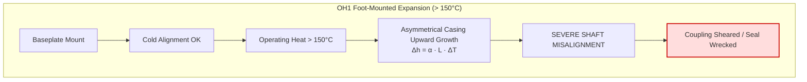
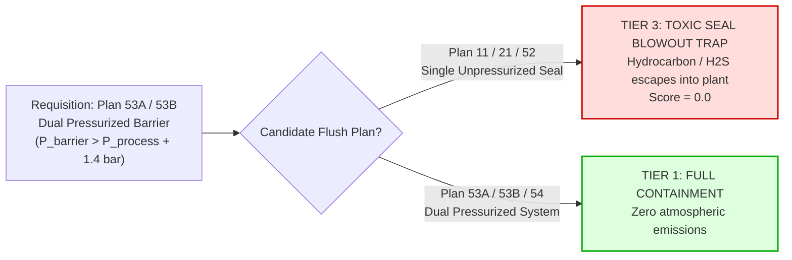

# Rotating Machinery Standards (`rules/rotating/`)

This directory codifies engineering standards for process pumps, gas compressors, induction motors, hydrodynamic and rolling element bearings, and mechanical shaft sealing systems per American Petroleum Institute (API), International Electrotechnical Commission (IEC), and International Organization for Standardization (ISO) standards.

Rotating equipment operates continuously under extreme kinetic energy, high rotational speeds ($1,500 - 15,000\text{ RPM}$), cyclic fatigue stresses, and hazardous hydrocarbon fluids. In these machines, **minor specification mismatches trigger catastrophic disasters**:
- A 2-pole motor substituted for a 4-pole motor quadruples centrifugal pump discharge head, blowing apart pump casings.
- A foot-mounted pump in hot service thermally expands, misaligning shafts and snapping flexible couplings.
- An unpressurized mechanical seal in toxic $H_2S$ duty blows high-pressure vapor straight into the plant atmosphere.
- Installing a compressor discharge valve in a suction port detonates the cylinder head under extreme re-compression heat.

This module enforces **Invariant #1 (Hard Safety Gate)**: any rotating equipment rule failure immediately vetoes the candidate item (`Tier 3 Incompatible`, Score `0.0`).

---

## 1. Architectural Scope & Standards Codified

```
rules/rotating/
├── bearings.py     # Module 11 (Part 3): ISO 15 rolling bearings & radial clearances (C2, CN, C3, C4)
├── compressors.py  # Module 14: API 618 reciprocating cylinder valves, API 617 impellers, API 692 DGS
├── motors.py       # Module 11 (Part 1): IEC 60034 / IS 325 motors, Ex d flameproof enclosures, poles
├── pumps.py        # Module 13: API 610 centrifugal pumps (OH1 vs OH2), wear ring hardness differential
├── seals.py        # Module 11 (Part 2): API 682 mechanical seal piping flush plans & elastomer O-rings
└── README.md       # This comprehensive engineering specification
```

---

## 2. File-by-File Technical Deep Dive

### `pumps.py` — API 610 Centrifugal Process Pumps
- **Source File:** [`rules/rotating/pumps.py`](file:///C:/Users/mayan/Development/Hackathons/Samanvay-AI/rules/rotating/pumps.py)
- **Codified Standards:** API Standard 610 (12th Edition) / ISO 13709, API 671 (Couplings).
- **API 610 Pump Configurations:**
  - **Overhung (OH):**
    - `OH1`: Foot-mounted, single-stage overhung (utility/low temp only).
    - `OH2`: Centerline-mounted, single-stage overhung (refinery standard).
    - `OH3`: Vertical in-line with separate bearing bracket.
    - `OH4` / `OH5`: Rigidly coupled / close-coupled vertical in-line.
  - **Between Bearings (BB):**
    - `BB1` / `BB2`: 1- and 2-stage axially / radially split.
    - `BB3`: Multistage axially split (pipeline pumps).
    - `BB4` / `BB5`: Radially split ring-section / double-casing barrel (high-pressure boiler feed).
  - **Vertically Suspended (VS):**
    - `VS1` through `VS7`: Wet pit, sump, and double-casing canned pumps.
- **Governing Physics & Failure Modes:**
  1. **OH1 vs. OH2 Mounting Invariant (Thermal Shaft Misalignment Trap):**
     - In foot-mounted pumps (`OH1`), the casing support feet sit below the centerline at baseplate level. As process temperature rises, thermal expansion vectors upward from the baseplate, raising the pump shaft centerline relative to the motor.
     - Centerline-mounted pumps (`OH2`) feature support feet positioned exactly along the horizontal centerline plane. Thermal expansion radiates outward symmetrically, preserving perfect shaft alignment with the motor.
     - **Rule:** For operating temperatures $> 150^\circ\text{C}$, substituting an `OH1` pump for an `OH2` pump is **vetoed as Tier 3 Thermal Misalignment Trap**. Severe casing rise destroys flexible couplings, overheats bearings, and causes catastrophic mechanical seal blowout.
  2. **API 610 Material Class Hierarchy:**
     - Classes: `S-1 (Cast Iron) < S-3 (Carbon Steel) < S-5 (CS / 12% Cr) < S-6 (CS / 12% Cr Sour) < C-6 (12% Cr) < A-8 (SS316) < D-1 (Duplex 2205) < D-2 (Super Duplex 2507)`.
     - Downgrading material class in corrosive/sour hydrocarbons is blocked as `Tier 3`.
  3. **Wear Ring Hardness Differential Invariant (API 610 Clause 6.7.2):**
     - Stationary casing wear rings and rotating impeller wear rings operate with microscopic radial clearances ($0.25 - 0.35\text{ mm}$).
     - In the event of minor shaft deflection, rubbing contact will occur. If both wear rings have identical metallurgy and hardness, galling and frictional micro-welding occur immediately, seizing the rotor.
     - **Rule:** API 610 mandates a **minimum $50\text{ HB}$ hardness differential** between mating wear rings (or Stellite hardfacing on one ring). Hardness delta $< 50\text{ HB}$ is **vetoed as Tier 3 Wear Ring Galling Trap**.
  4. **Hydraulic Parameters & Coupling Parity:**
     - Flow rate down-rating ($Q_{cand} < Q_{req}$) is blocked as `Tier 3` process starvation.
     - Flexible vs Rigid coupling mismatch is blocked as `Tier 3`.
     - $\text{NPSH}$ Margin ($\text{NPSH}_a - \text{NPSH}_r \ge 1.0\text{ m}$): Higher candidate $\text{NPSH}_r$ increases cavitation destruction risk.



---

### `seals.py` — API 682 Mechanical Shaft Seals & Piping Flush Plans
- **Source File:** [`rules/rotating/seals.py`](file:///C:/Users/mayan/Development/Hackathons/Samanvay-AI/rules/rotating/seals.py)
- **Codified Standards:** API Standard 682 (4th Edition) / ISO 21049, API 692 (Dry Gas Seals).
- **Governing Physics & Failure Modes:**
  1. **API 682 Flush Plan Downgrade Trap (Dual Pressurized vs Single Unpressurized):**
     - **Dual Pressurized Barrier Plans (Plan 53A, 53B, 53C, 54):** Maintain an external, clean barrier fluid at a pressure **strictly higher** than the process seal chamber ($P_{barrier} \ge P_{chamber} + 1.4\text{ bar}$). Any microscopic face leakage flows clean barrier fluid *into* the pump, guaranteeing zero atmospheric emissions.
     - **Single / Unpressurized Buffer Plans (Plan 11, 21, 31, 32, 52):** Rely on a single seal interface or unpressurized buffer fluid. Any face separation releases process hydrocarbon into the atmosphere or flare.
     - **Rule:** In toxic, carcinogenic ($H_2S$, Benzene), or flashing hydrocarbon services, downgrading from a dual pressurized system (Plan 53A/B/C) to a single/unpressurized system is **vetoed as Tier 3 Toxic Atmosphere Seal Blowout Trap**.
  2. **Elastomer O-Ring Hierarchy:**
     - Thermal and chemical compatibility ranking:
       ```
       Nitrile / NBR (100°C max) < EPDM (140°C steam) < Viton / FKM (200°C) < Kalrez / FFKM (320°C perfluoroelastomer)
       ```
     - **Rule:** Downgrading an O-ring (e.g. Viton to NBR) causes rapid elastomer thermal hardening, chemical swelling, and extrusion blowout (`Tier 3 Incompatible`). Upgrading is a safe substitute (`Tier 2`).



---

### `motors.py` — Electric Motors & Hazardous Area Enclosures
- **Source File:** [`rules/rotating/motors.py`](file:///C:/Users/mayan/Development/Hackathons/Samanvay-AI/rules/rotating/motors.py)
- **Codified Standards:** IEC 60079-0 / IEC 60079-1 (Flameproof Ex d), IEC 60034-1, IS 325, IEEE 841.
- **Governing Physics & Failure Modes:**
  1. **Hazardous Area Enclosure Invariant (Fatal Explosion Trap):**
     - Refinery and offshore process units contain classified explosive hydrocarbon vapor clouds (Zone 1 / Zone 2, Gas Groups IIA, IIB, IIC [Hydrogen]).
     - Standard industrial motors generate internal electrical arcs at stator coils and terminals.
     - In hazardous zones, motors must carry certified flameproof protection (**Ex d IIC T4 Gb** per IEC 60079-1) with heavy cast enclosures capable of containing internal gas explosions without igniting the outside atmosphere.
     - **Rule:** Proposing a non-Ex standard motor in a classified hazardous zone is **vetoed as Tier 3 Fatal Explosion Trap**.
  2. **Synchronous Speed / Pole Count Parity (Hydraulic Shock Trap):**
     - Centrifugal pump discharge head follows the affinity laws:
       $$H \propto N^2 \quad \text{and} \quad P_{shaft} \propto N^3$$
     - A 4-pole motor runs at synchronous speed $1,500\text{ RPM}$ (at $50\text{ Hz}$). A 2-pole motor runs at $3,000\text{ RPM}$ (double the speed).
     - Running a $1,500\text{ RPM}$ pump at $3,000\text{ RPM}$ quadruples ($4\times$) the hydraulic discharge head and multiplies power demand by eight ($8\times$).
     - **Rule:** Substituting a 2-pole motor for a 4-pole motor is **blocked as Tier 3 Hydraulic Shock Trap**. The resulting pressure surge violently ruptures the pump casing, while the motor burns out under instantaneous overload.
  3. **Electrical Invariants:**
     - Power down-rating ($kW_{cand} < kW_{req}$) triggers `Tier 3 Motor Overload Trap`.
     - Voltage mismatch ($415\text{V}$ vs $230\text{V}$) or frequency mismatch ($50\text{ Hz}$ vs $60\text{ Hz}$) is `Tier 3 Incompatible`.
     - Ingress Protection downgrade (e.g. IP65 outdoor hose-proof to IP54 indoor) is `Tier 3 Incompatible`.

---

### `bearings.py` — ISO 15 Rolling Element Bearings & Radial Clearances
- **Source File:** [`rules/rotating/bearings.py`](file:///C:/Users/mayan/Development/Hackathons/Samanvay-AI/rules/rotating/bearings.py)
- **Codified Standards:** ISO 15, ISO 5753-1 (Internal Clearances), ISO 281 ($L_{10h}$ Rating Life).
- **Clearance Ladder:** `C2 (Tight) < CN (Normal) < C3 (Increased) < C4 (Extra Increased) < C5`
- **Governing Physics & Failure Modes:**
  1. **High-Temperature Radial Internal Clearance Invariant (C3 vs CN):**
     - In hot process pumps and electric motors, operating heat conducted from the process fluid through the shaft causes the inner bearing ring to expand significantly more than the cooler outer ring in the housing.
     - Bearings specified with **C3 clearance** have extra initial radial space ($15 - 30\ \mu\text{m}$) specifically calibrated to be absorbed by thermal expansion during normal operation.
     - **Rule:** Substituting a normal `CN` clearance bearing where `C3` is specified is **vetoed as Tier 3 Bearing Seizure Trap**. Operating heat expands the shaft, completely eliminating radial running clearance. The rolling elements crush against the raceways, leading to instantaneous bearing seizure, raceway spalling, and catastrophic shaft shearing.
  2. **Bearing Construction Type Parity:**
     - Substituting deep-groove ball bearings for cylindrical or spherical roller bearings under heavy radial or thrust loads is strictly `Tier 3 Incompatible`.

---

### `compressors.py` — Process Gas Compressors
- **Source File:** [`rules/rotating/compressors.py`](file:///C:/Users/mayan/Development/Hackathons/Samanvay-AI/rules/rotating/compressors.py)
- **Codified Standards:** API Standard 618 (Reciprocating), API Standard 617 (Centrifugal/Axial), API Standard 692 (Dry Gas Seals).
- **Governing Physics & Failure Modes:**
  1. **API 618 Cylinder Valve Inversion Trap (Suction vs. Discharge):**
     - Reciprocating compressor cylinder valves are one-way automatic spring-loaded pressure-actuated valves.
     - Suction valves open inward into the cylinder; discharge valves open outward into the manifold.
     - **Rule:** Installing a discharge valve in a suction port or vice versa prevents incoming gas entry. As the piston strokes, the trapped residual gas undergoes extreme cyclic re-compression. Gas temperatures exceed auto-ignition limits ($> 250^\circ\text{C}$), detonating the cylinder head and blasting shrapnel into the compressor bay (`Tier 3 Cylinder Valve Inversion Trap`).
  2. **API 617 Impeller Sour Service Metallurgy (17-4PH H1150M Invariant):**
     - Centrifugal compressor impellers run at peripheral tip speeds exceeding $300\text{ m/s}$, experiencing massive centrifugal stresses.
     - When compressing wet $H_2S$ sour gas, precipitation-hardened stainless steels (e.g. 17-4PH / AISI 630) in standard peak-aged condition (H900) suffer rapid Sulfide Stress Cracking (SSC).
     - **Rule:** 17-4PH impellers in sour gas mandate **H1150M double-age heat treatment** (yielding hardness $\le 22\text{ HRC}$ and yield strength $\le 620\text{ MPa}$). Un-aged 17-4PH is **blocked as Tier 3 Impeller Burst Trap**.
  3. **API 692 Dry Gas Seals (DGS):**
     - Tandem dry gas seals with intermediate Nitrogen ($N_2$) buffer gas provide secondary containment.
     - Downgrading tandem seals to single dry gas seals in flammable or toxic gas duty is `Tier 3 Incompatible`.

---

## 3. Practical Code Usage

```python
from rules.rotating.pumps import check_centrifugal_pump
from rules.rotating.motors import check_motor_compatibility
from rules.rotating.seals import check_mechanical_seal_and_elastomer
from rules.rotating.bearings import check_bearing_compatibility
from rules.rotating.compressors import check_compressor_compatibility

# 1. Evaluate Hot Hydrocarbon Pump OH1 vs OH2 Mounting
tier, score, viol = check_centrifugal_pump(
    query_props={"api610_type": "OH2", "temp_c": 190.0},
    cand_props={"api610_type": "OH1"}
)
print(tier)  # DynamicCompatibilityTier.TIER_3_INCOMPATIBLE
print(viol.failure_mode_prevented)  # Thermal shaft misalignment and mechanical seal destruction

# 2. Evaluate Motor Synchronous Speed / Pole Count Surge
tier, score, viol = check_motor_compatibility(
    query_props={"rpm": 1500, "poles": 4},
    cand_props={"rpm": 3000, "poles": 2}
)
print(tier)  # DynamicCompatibilityTier.TIER_3_INCOMPATIBLE
print(viol.explanation)  # HYDRAULIC SHOCK TRAP: Motor pole count or synchronous speed mismatch...

# 3. Evaluate API 682 Mechanical Seal Flush Plan Downgrade
tier, score, viol = check_mechanical_seal_and_elastomer(
    query_props={"plan": "PLAN 53A", "toxic_service": True},
    cand_props={"plan": "PLAN 11"}
)
print(tier)  # DynamicCompatibilityTier.TIER_3_INCOMPATIBLE
print(viol.failure_mode_prevented)  # Toxic or volatile atmospheric seal blowout

# 4. Evaluate High-Temperature Bearing Radial Clearance (C3 vs CN)
tier, score, viol = check_bearing_compatibility(
    query_props={"clearance": "C3"},
    cand_props={"clearance": "CN"}
)
print(tier)  # DynamicCompatibilityTier.TIER_3_INCOMPATIBLE
print(viol.failure_mode_prevented)  # Shaft thermal expansion bearing seizure and shaft snap

# 5. Evaluate API 618 Compressor Cylinder Valve Inversion
tier, score, viol = check_compressor_compatibility(
    query_props={"valve_function": "SUCTION"},
    cand_props={"valve_function": "DISCHARGE"}
)
print(tier)  # DynamicCompatibilityTier.TIER_3_INCOMPATIBLE
print(viol.failure_mode_prevented)  # Inverted valve cylinder re-compression heating and cylinder head detonation
```

---

## 4. Test Suite Execution

Run all rotating machinery, pump, compressor, motor, seal, and bearing unit tests:

```bash
# Run all rotating machinery tests
pytest tests/unit/test_tolerance.py -k "pump or motor or seal or bearing or compressor or rotating" -v
```
