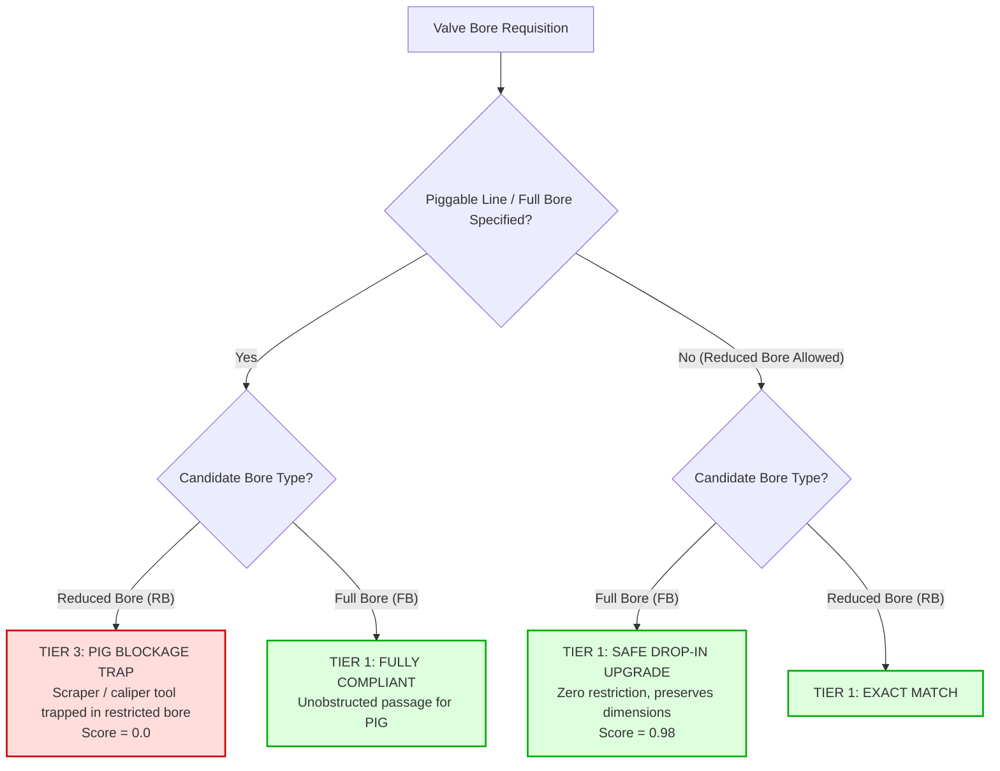

# Industrial Valve Engineering Standards (`rules/valves/`)

This directory codifies engineering standards for industrial pipeline and refinery valves, emergency pressure relief systems, fire-safe certifications, and API standard trim metallurgies.

Valves are the primary mechanical barriers controlling high-pressure, flammable, and toxic hydrocarbons across refineries and pipeline networks. While semantic search can identify two valves with matching nominal diameters, **subtle internal differences dictate operational survival versus catastrophic failure**:
- A Reduced Bore valve installed on a piggable gas trunkline traps an intelligent PIG, causing multi-million-dollar extraction downtime.
- A non-fire-safe soft-seated valve burns out during a localized fire, dumping 100-bar fuel directly into the blaze.
- A fragmenting rupture disk bursts upstream of a safety relief valve, shearing metal petals that lodge in the PSV nozzle and causing a distillation column detonation.

This module enforces **Invariant #1 (Hard Safety Gate)**: any valve standard violation immediately vetoes the candidate item (`Tier 3 Incompatible`, Score `0.0`).

---

## 1. Architectural Scope & Standards Codified

```
rules/valves/
├── bore.py           # Module 5 (Part 2): API 6D Full Bore (FB) vs Reduced Bore (RB) piggability
├── fire_safe.py      # Module 5 (Part 3 & 4): API 607 fire-safe, API 609 butterfly Cat A/B, API 594 check valves
├── psv.py            # Module 5 (Part 5): API 520 / API 526 PSV orifice letters (D through T) & CDTP
├── rupture_disks.py  # Module 15: Rupture disks (ASME Sec VIII UG-127 non-fragmenting mandate, cyclic fatigue)
├── trim.py           # Module 5 (Part 1): API 600 / API 602 gate valve trim ladder (Trim 1 through 16)
└── README.md         # This comprehensive engineering specification
```

---

## 2. File-by-File Technical Deep Dive

### `bore.py` — API 6D Pipeline Valve Bore & Piggability
- **Source File:** [`rules/valves/bore.py`](file:///C:/Users/mayan/Development/Hackathons/Samanvay-AI/rules/valves/bore.py)
- **Codified Standard:** API Specification 6D (24th Edition) / ISO 14313 Section 5.1.
- **Governing Physics & Failure Modes:**
  1. **API 6D Full Bore (FB) vs Reduced Bore (RB):**
     - **Full Bore (FB) / Full Port:** The internal diameter of the valve closure element (ball, gate, or plug) has an unobstructed circular passage equal to or greater than the mating pipe internal diameter. Mandatory for all pipeline transmission mains subject to intelligent pipeline inspection gauges (PIGs) or scraper cleaning.
     - **Reduced Bore (RB):** The throat bore is constricted, typically one nominal size smaller (e.g. an NPS 6 valve has an NPS 4 throat bore).
     - **Rule (PIG Blockage Trap):** Installing an RB valve in a line designated for pigging is **vetoed as Tier 3**. When a high-speed metal scraper or electronic intelligent caliper PIG travels down the pipeline, it lodges in the constricted throat. The trapped PIG blocks flow, causing pressure shock and requiring emergency pipeline blowdown and excavation.
  2. **Safe Drop-In Upgrade (Full Bore for Reduced Bore):**
     - Substituting a Full Bore valve for a Reduced Bore requirement preserves the face-to-face dimensions (ASME B16.10) and bolt circle while eliminating flow restriction.
     - Classified as **`Tier 1 (Identical Drop-In)`** with a composite score of `0.98`.



---

### `fire_safe.py` — Fire Safety, Butterfly Categories & Check Valves
- **Source File:** [`rules/valves/fire_safe.py`](file:///C:/Users/mayan/Development/Hackathons/Samanvay-AI/rules/valves/fire_safe.py)
- **Codified Standards:** API 607 (7th Edition) / ISO 10497, API 6FA, API 609, API 594, API 608 / ASME B16.34.
- **Governing Physics & Failure Modes:**
  1. **API 607 / API 6FA Fire-Safe Certification Invariant:**
     - Soft-seated quarter-turn valves (ball, butterfly, plug) rely on primary polymer seals (PTFE, RPTFE, PEEK). In a refinery hydrocarbon fire, ambient temperatures reach $750^\circ\text{C} - 1,000^\circ\text{C}$, vaporizing polymer seats in seconds.
     - **Fire-Safe Construction:** Features secondary metal-to-metal backup sealing lips. As the soft seal burns away, line pressure forces the floating ball or disc tightly against the metal backup seat, preventing fuel from escaping into the fire.
     - **Rule:** If the service contains flammable hydrocarbons, proposing a non-fire-safe soft-seated valve is **vetoed as Tier 3 Hydrocarbon Fire Disaster Trap**.
  2. **API 609 Butterfly Valve Categories (Category A vs Category B):**
     - **Category A:** Concentric, resilient-seated rubber-lined butterfly valves (EPDM, NBR, Viton liner). Limited to low-pressure utility water/air duty ($< 16\text{ bar}$, $< 120^\circ\text{C}$).
     - **Category B:** High-performance double-offset or triple-offset metal-seated butterfly valves designed for hydrocarbon process duty.
     - **Rule:** Proposing a Category A concentric rubber-lined valve for Category B process duty is **vetoed as Tier 3 Elastomer Blowout Trap**. Hydrocarbons attack the rubber sleeve, causing liner tear-out and complete shutoff loss.
  3. **High-Temperature Soft Seat Liquefaction (PTFE $> 200^\circ\text{C}$):**
     - PTFE and RPTFE seats undergo plastic creep and liquefaction above $200^\circ\text{C}$.
     - **Rule:** Proposing PTFE seats in operating lines $> 200^\circ\text{C}$ is **blocked as Tier 3**. Metal-to-metal or Stellite-faced seats are mandatory.
  4. **API 594 Retainerless Check Valves in Toxic Service:**
     - Conventional dual-plate check valves feature external body penetrations plugged with retaining pins. Under cyclic flow chattering, the pins fretting-wear, causing fugitive emissions.
     - **Rule:** Toxic fluid service (Category M / $H_2S$) mandates **retainerless body construction** with zero external leak paths (`Tier 3 Fugitive Emission Trap`).

---

### `trim.py` — API 600 / 602 Standard Valve Trim Ladders
- **Source File:** [`rules/valves/trim.py`](file:///C:/Users/mayan/Development/Hackathons/Samanvay-AI/rules/valves/trim.py)
- **Codified Standard:** API Standard 600 Table 3, API 602, ISO 10434.
- **The Trim Metallurgy Ladder:**
  ```
  Trim 1 (410 SS) < Trim 8 (410 + Stellite) < Trim 5 (Full Stellite) < Trim 12 (316 + Stellite) < Trim 16 (Monel)
  ```
- **Governing Physics & Failure Modes:**
  1. **Trim Downgrade Trap (Rapid Seat Washout):**
     - **Trim 1 (13% Cr / AISI 410):** Basic stainless trim suitable only for non-corrosive steam, water, and mild oil.
     - **Trim 8 (Universal Refinery Trim):** Features Stellite 6 (Co-Cr-W alloy) hardfacing on the seating surfaces with a 410 SS stem. Resists erosive particulate throttling, high velocity, and galling.
     - **Trim 5 (Full Stellite Hardface):** Co-Cr-W hardfaced disc and seat faces for severe high-pressure erosive slurries.
     - **Rule:** Demoting a Trim 8 or Trim 5 valve to Trim 1 in abrasive/erosive process duty is **vetoed as Tier 3**. High-velocity fluid creates wire-drawing erosion across the soft 410 seats, destroying shutoff capability within days.
  2. **Safe Trim Upgrades (Drop-In Parity):**
     - Upgrading from Trim 1 to Trim 8, or from Trim 8 to Trim 5, preserves all external dimensions, face-to-face lengths, and bolting while dramatically improving wear life.
     - Categorized as **`Tier 1 (Identical Drop-In)`** with a composite score of `0.98`.

```mermaid
graph LR
    T1["Trim 1<br/>13% Cr (410 SS)<br/>Standard Utility"] -->|Upgrade| T8["Trim 8 (Universal)<br/>410 Stem + Stellite Seats<br/>Refinery Standard"]
    T8 -->|Upgrade| T5["Trim 5<br/>Full Stellite Hardface<br/>Severe Erosive Slurry"]
    T5 -->|Corrosive Sour| T12["Trim 12<br/>316 SS + Stellite Seats<br/>Acid / Sour Duty"]
    T12 -->|HF Acid| T16["Trim 16<br/>Monel / Alloy 400<br/>Alkylation Units"]

    T8 -.->|DOWNGRADE BLOCKED (Tier 3)| T1
    T5 -.->|DOWNGRADE BLOCKED (Tier 3)| T8

    classDef std fill:#f0f4f8,stroke:#00558f,stroke-width:1px;
    classDef hard fill:#e8f5e9,stroke:#388e3c,stroke-width:2px;
    classDef exotic fill:#e1f5fe,stroke:#0288d1,stroke-width:2px;

    class T1 std;
    class T8,T5 hard;
    class T12,T16 exotic;
```

---

### `psv.py` — API 520 / API 526 Pressure Safety Relief Valves (PSV)
- **Source File:** [`rules/valves/psv.py`](file:///C:/Users/mayan/Development/Hackathons/Samanvay-AI/rules/valves/psv.py)
- **Codified Standards:** API Standard 526 (Standard Flanged Steel Pressure-Relief Valves), API Recommended Practice 520 Parts I & II, ASME Section VIII Division 1 (UG-125 to UG-136).
- **API 526 Standard Orifice Area Hierarchy:**
  ```
  D < E < F < G < H < J < K < L < M < N < P < Q < R < T
  ```

| Orifice Letter | Effective Discharge Area ($\text{in}^2$) | Effective Discharge Area ($\text{mm}^2$) | Relative Capacity Scale |
|:---:|:---:|:---:|:---|
| **D** | $0.110$ | $71$ | $1.0\times$ (Smallest standard API orifice) |
| **E** | $0.196$ | $126$ | $1.78\times$ |
| **F** | $0.307$ | $198$ | $2.79\times$ |
| **G** | $0.503$ | $325$ | $4.57\times$ |
| **H** | $0.785$ | $506$ | $7.14\times$ |
| **J** | $1.287$ | $830$ | $11.7\times$ |
| **K** | $1.838$ | $1,186$ | $16.7\times$ |
| **L** | $2.853$ | $1,841$ | $25.9\times$ |
| **M** | $3.600$ | $2,323$ | $32.7\times$ |
| **N** | $4.340$ | $2,800$ | $39.5\times$ |
| **P** | $6.380$ | $4,116$ | $58.0\times$ |
| **Q** | $11.05$ | $7,129$ | $100.5\times$ |
| **R** | $16.00$ | $10,323$ | $145.5\times$ |
| **T** | $26.00$ | $16,774$ | $236.4\times$ (Largest standard API orifice) |

- **Governing Physics & Failure Modes:**
  1. **Undersized Orifice Invariant (Overpressure Vessel Detonation Trap):**
     - Relief capacity is directly proportional to orifice area:
       $$W = C \cdot K_d \cdot P_1 \cdot A \cdot \sqrt{\frac{M}{T \cdot Z}}$$
     - If an undersized orifice is installed (e.g., Orifice D supplied when Orifice F is required), the discharge flow area is reduced by $64\%$.
     - **Rule:** Under an emergency overpressure event (external fire, runaway reaction, cooling failure), the valve cannot vent the mass generation rate. Internal vessel pressure continues to rise past hydrostatic burst limits, resulting in catastrophic BLEVE (Boiling Liquid Expanding Vapor Explosion) or vessel shell fragmentation (`Tier 3 Overpressure Vessel Detonation Trap`).
  2. **Cold Differential Test Pressure (CDTP) Tolerance:**
     - The CDTP represents the bench test pressure adjusted for backpressure and temperature.
     - A CDTP lower than specified causes premature valve weeping; higher prevents opening at the design setpoint. A deviation $> 0.1\text{ bar}$ triggers `Tier 3 Incompatible`.

---

### `rupture_disks.py` — Rupture Disks & Overpressure Protection
- **Source File:** [`rules/valves/rupture_disks.py`](file:///C:/Users/mayan/Development/Hackathons/Samanvay-AI/rules/valves/rupture_disks.py)
- **Codified Standards:** ASME Section VIII Division 1 UG-127, ISO 4126-2, API 520 Part I.
- **Governing Physics & Failure Modes:**
  1. **Non-Fragmenting Mandate Upstream of PSVs (ASME Sec VIII UG-127):**
     - Rupture disks are frequently installed in series directly upstream of pressure safety valves to isolate toxic/corrosive fluids from the PSV internals.
     - **Fragmenting Disks:** When a forward-acting tension-loaded disk bursts, the cross-scored petals or thin metal dome fragments tear loose.
     - **Rule:** If a fragmenting rupture disk bursts upstream of a PSV, the sheared metal petals shoot into the valve nozzle, wedging beneath the disc or plugging the nozzle bore. When the system requires relief, the PSV is mechanically blocked (`Tier 3 PSV Nozzle Clogging Trap`). **Non-fragmenting reverse-buckling disks are mandatory**.
  2. **Reverse Buckling vs. Forward Acting in Cyclic Duty:**
     - **Forward-Acting (Tension-Loaded):** Operates under tensile stress; limited to operating pressures $\le 70\%$ of stamped burst pressure. Subject to metal fatigue and pinhole pinholing under cyclic pressure.
     - **Reverse-Buckling:** Operates under compression; permits operating pressures up to $90\% - 95\%$ of burst pressure without cyclic fatigue.
     - **Rule:** Proposing a forward-acting disk where a reverse-buckling disk is specified in cyclic/pulsating service triggers `Tier 3 Premature Fatigue Rupture Trap`.

---

## 3. Practical Code Usage

```python
from rules.valves.bore import check_valve_bore
from rules.valves.fire_safe import check_fire_safe_and_categories
from rules.valves.trim import check_valve_trim
from rules.valves.psv import check_psv_orifice_and_pressure
from rules.valves.rupture_disks import check_rupture_disk

# 1. Evaluate Pipeline Valve Piggability (RB vs FB)
tier, score, viol = check_valve_bore(
    query_bore="FULL_BORE",
    cand_bore="REDUCED_BORE",
    is_piggable=True
)
print(tier)  # DynamicCompatibilityTier.TIER_3_INCOMPATIBLE
print(viol.failure_mode_prevented)  # Pipeline scraper (PIG) tool trapped in restricted valve bore

# 2. Evaluate Fire-Safe Certification in Hydrocarbon Service
tier, score, viol = check_fire_safe_and_categories(
    query_props={"fire_safe": True},
    cand_props={"fire_safe": False}
)
print(tier)  # DynamicCompatibilityTier.TIER_3_INCOMPATIBLE
print(viol.explanation)  # HYDROCARBON FIRE DISASTER TRAP: Flammable hydrocarbon service mandates fire-safe...

# 3. Evaluate API 600 Valve Trim Safe Upgrade (Trim 1 -> Trim 8)
tier, score, viol = check_valve_trim(
    query_trim=1,
    cand_trim=8
)
print(tier)   # DynamicCompatibilityTier.TIER_1_IDENTICAL (Direct Drop-In)
print(score)  # 0.98 (Stellite hardfaced seats safe upgrade)

# 4. Evaluate PSV Relief Orifice Sizing
tier, score, viol = check_psv_orifice_and_pressure(
    query_orifice="F",
    cand_orifice="D"
)
print(tier)  # DynamicCompatibilityTier.TIER_3_INCOMPATIBLE
print(viol.failure_mode_prevented)  # Vessel overpressure detonation from undersized relief orifice

# 5. Evaluate Rupture Disk Upstream of PSV
tier, score, viol = check_rupture_disk(
    query_props={"upstream_of_psv": True},
    cand_props={"disk_type": "FRAGMENTING", "upstream_of_psv": True}
)
print(tier)  # DynamicCompatibilityTier.TIER_3_INCOMPATIBLE
print(viol.failure_mode_prevented)  # Metal petals shearing off and clogging downstream PSV nozzle
```

---

## 4. Test Suite Execution

Run all valve, piggability, fire-safe, trim, PSV, and rupture disk unit tests:

```bash
# Run all valve tests
pytest tests/unit/test_tolerance.py -k "valve or bore or fire_safe or trim or psv or rupture" -v
```
