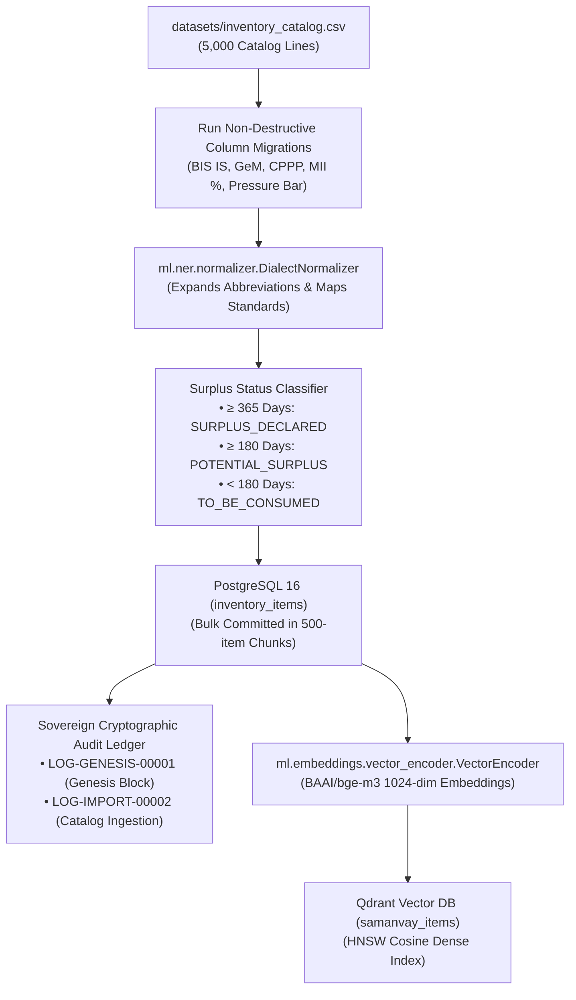
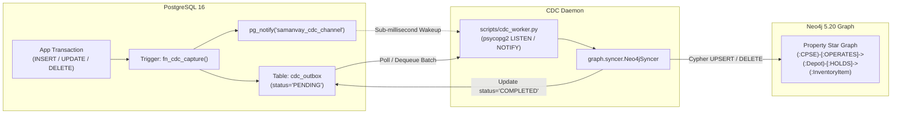

# Operational & Automation Scripts (`scripts/`)

**Target Services:** `backend`, `postgres`, `qdrant`, `neo4j`  
**Runtime:** Python 3.11+ / PowerShell Core  

This directory contains master database seeders, real-time Change Data Capture (CDC) daemons, comprehensive live smoke tests, and synthetic dataset generators powering **Samanvay-AI**.

---

## 1. Architectural Workflows

### A. Database Seeding & Genesis Pipeline (`seed_database.py`)



### B. Real-Time Outbox CDC Synchronizer (`cdc_worker.py`)



---

## 2. Script Inventory & Specifications

### 1. [seed_database.py](file:///C:/Users/mayan/Development/Hackathons/Samanvay-AI/scripts/seed_database.py) — Master Seeder
- **Core Operations:**
  1. **Schema Evolution:** Connects to PostgreSQL and applies non-destructive `ALTER TABLE` migrations for Indian public procurement fields (`indian_standard`, `oil_std_spec`, `oil_material_code`, `gem_category_id`, `gem_product_id`, `cppp_tender_ref`, `make_in_india_class`, `local_content_percentage`, `pressure_rating_bar`, `location_state`).
  2. **Catalog Ingestion:** Reads [datasets/inventory_catalog.csv](file:///C:/Users/mayan/Development/Hackathons/Samanvay-AI/datasets/inventory_catalog.csv) (5,000 distinct items), derives normalized depot IDs, and resolves technical properties using [DialectNormalizer](file:///C:/Users/mayan/Development/Hackathons/Samanvay-AI/ml/ner/normalizer.py).
  3. **Surplus Aging Rules:** Automatically assigns surplus broadcast eligibility based on idle age ($\ge 365\text{ days} \rightarrow \text{SURPLUS\_DECLARED}$, $\ge 180\text{ days} \rightarrow \text{POTENTIAL\_SURPLUS}$, $< 180\text{ days} \rightarrow \text{TO\_BE\_CONSUMED}$).
  4. **Multi-Tenant User Ecosystem:** Establishes seed personas across 7 CPSEs (`OIL`, `IOCL`, `ONGC`, `GAIL`, `BPCL`, `HPCL`, `NRL`) plus Central Ministry oversight (`tech_authority`, `auditor`, `admin`).
  5. **Genesis Audit Sealing:** Creates initial genesis audit blocks with SHA-256 Merkle chaining:
     - `LOG-GENESIS-00001`: Sovereign Air-Gapped Master Ledger Initialized.
     - `LOG-IMPORT-00002`: Catalog Ingestion Block recording 5,000 item import.
  6. **Vector Store Ingestion:** Encodes item descriptions using `BAAI/bge-m3` vector encoders and indexes embeddings into Qdrant HNSW collections.
- **Execution:**
  ```bash
  # Standard seed (skips if records already exist)
  python scripts/seed_database.py

  # Force clean re-seed (truncates existing items and re-imports freshly)
  python scripts/seed_database.py --force
  ```

---

### 2. [cdc_worker.py](file:///C:/Users/mayan/Development/Hackathons/Samanvay-AI/scripts/cdc_worker.py) — Standalone CDC Daemon
- **Core Operations:**
  - Connects to PostgreSQL with native `psycopg2` extensions and registers `LISTEN samanvay_cdc_channel`.
  - Captures asynchronous notifications from transactional triggers when any row in `inventory_items` or `requisitions` is created, updated, or removed.
  - Queries `cdc_outbox` for rows with `status='PENDING'`.
  - Propagates changes into Neo4j graph nodes (`:InventoryItem`, `:Depot`, `:CPSE`, `:MaterialGrade`, `:PressureClass`) via [Neo4jSyncer](file:///C:/Users/mayan/Development/Hackathons/Samanvay-AI/graph/syncer.py).
  - Flags processed outbox records with `status='COMPLETED'` and timestamp `processed_at`.
- **Execution:**
  ```bash
  python scripts/cdc_worker.py
  ```

---

### 3. [verify_live_api.py](file:///C:/Users/mayan/Development/Hackathons/Samanvay-AI/scripts/verify_live_api.py) — Live Stack Smoke Test
- **Core Operations:**
  Executes an end-to-end 8-stage automated test verifying all live container subsystems:
  1. `POST /api/v1/match/search`: Semantic query matching, NER token extraction, and 21-rule engineering compatibility ranking.
  2. `POST /api/v1/audit/verify`: Sovereign cryptographic audit ledger SHA-256 Merkle chain verification.
  3. `GET /api/v1/graph/discover`: Inter-CPSE cross-depot surplus discovery with distance filters.
  4. `GET /api/v1/graph/topology`: Topology metrics, total depot counts, and cumulative unlocked capital value.
  5. `GET /api/v1/match/benchmark`: Automated execution against golden benchmarks verifying accuracy.
  6. `GET /api/v1/inventory?limit=1`: Catalog query fetching real spare parts.
  7. `POST /api/v1/requisition`: Creation of inter-CPSE requisition order with `Idempotency-Key` headers.
  8. `PUT /requisition/{id}/approve` & `POST /requisition/{id}/gatepass`: Executive approval and CISF non-returnable digital gate pass generation with cryptographic HMAC-SHA256 seal.
- **Execution:**
  ```bash
  python scripts/verify_live_api.py
  ```

---

### 4. [test_live_cdc.py](file:///C:/Users/mayan/Development/Hackathons/Samanvay-AI/scripts/test_live_cdc.py) — Real-Time CDC Integration Test
- **Core Operations:**
  - Programmatically inserts a new high-pressure valve into PostgreSQL `inventory_items`.
  - Asserts that `cdc_outbox` captured the event and notified the listener.
  - Queries Neo4j Bolt driver to verify that the corresponding graph node and relationships (`:CPSE`, `:Depot`, `:HAS_PRESSURE_CLASS`, `:HAS_BODY_METALLURGY`) were created in real time.
  - Modifies the inventory record in PostgreSQL to `SURPLUS_DECLARED` with quantity 25, verifying immediate reflection in Neo4j.
  - Deletes the test record and asserts graph cleanup.
- **Execution:**
  ```bash
  python scripts/test_live_cdc.py
  ```

---

### 5. [generate_datasets.py](file:///C:/Users/mayan/Development/Hackathons/Samanvay-AI/scripts/generate_datasets.py) — Dataset Generator
- **Core Operations:**
  - Generates realistic synthetic petroleum catalogs (`inventory_catalog.csv`) and golden test suites (`golden_benchmarks.json`).
  - Ensures accurate engineering distributions covering pipes, gate/globe/ball/check valves, ANSI/ASME flanges, and gaskets conforming to ASTM, API 6D, and BIS IS standards.
- **Execution:**
  ```bash
  python scripts/generate_datasets.py
  ```

---

### 6. [start_public_tunnel.ps1](file:///C:/Users/mayan/Development/Hackathons/Samanvay-AI/scripts/start_public_tunnel.ps1) — Cloudflare Tunnel Ingress
- **Core Operations:**
  - PowerShell utility checking for `cloudflared.exe`.
  - Spawns a zero-configuration public HTTPS tunnel pointing to `http://localhost:3000` (or `http://samanvay-ai-frontend:3000`).
  - Emits the temporary public URL for sovereign mobile testing and stakeholder review.
- **Execution:**
  ```powershell
  pwsh scripts/start_public_tunnel.ps1
  ```
