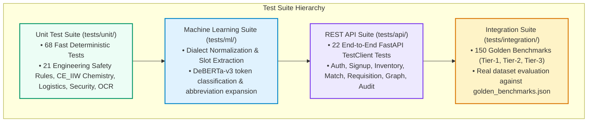

# Samanvay-AI Automated Test Suite & Quality Assurance (`tests/`)

**Total Test Count:** 242+ Automated Tests  
**Test Framework:** PyTest 8.0+ / FastAPI `TestClient` (HTTPX)  
**Target Milestone:** 100% Deterministic Safety, Cryptographic Integrity & Benchmark Accuracy  

This directory houses the comprehensive multi-layered automated test suite for **Samanvay-AI**, ensuring engineering safety compliance, mathematical precision, cryptographic non-repudiation, API contract stability, and NLP dialect normalization.

---

## 1. Test Architecture & Hierarchy

The test suite is structured as a robust testing pyramid ranging from fast, deterministic mathematical unit tests to full-system API contracts and 150 public sector Golden Benchmarks:



---

## 2. Directory Layout & Test Suite Breakdown

```
tests/
├── conftest.py               # Shared PyTest fixtures (mock DB sessions, sample material attributes)
├── __init__.py
├── api/                      # 22 REST API controller tests (FastAPI TestClient)
│   ├── test_audit_api.py     # SHA-256 chain verification & RFC 4180 CSV export (2 tests)
│   ├── test_auth_api.py      # Seed users, JWT generation, multi-tenant claims & RBAC (7 tests)
│   ├── test_graph_api.py     # Neo4j logistics distance & privacy attribute stripping (2 tests)
│   ├── test_inventory_api.py # Inventory CRUD, cross-CPSE privacy filtering & stats (3 tests)
│   ├── test_match_api.py     # End-to-end semantic match & safety engine scoring (2 tests)
│   ├── test_requisition_api.py # Idempotency keys & pessimistic locking concurrency (2 tests)
│   ├── test_signup_api.py    # Self-registration, duplicate prevention & token issuance (4 tests)
│   └── README.md             # Dedicated documentation for API tests
├── integration/              # Full-pipeline integration tests
│   ├── test_benchmarks.py    # Automated execution across 150 Golden Benchmarks (150 tests)
│   └── README.md             # Dedicated documentation for integration benchmarks
├── ml/                       # NLP & embedding tests
│   ├── test_ner.py           # Dialect normalizer & DeBERTa slot tagger extraction (2 tests)
│   └── README.md             # Dedicated documentation for ML tests
└── unit/                     # 68 Deterministic unit tests
    ├── test_chemistry.py     # Carbon Equivalent (CE_IIW), weldability & ASTM validation (3 tests)
    ├── test_indian_procurement_alignment.py # BIS IS standards, OIL logistics, GeM, CPPP, MII (11 tests)
    ├── test_logistics.py     # Haversine, 1.25x road circuity & BEE freight CO2 formulas (4 tests)
    ├── test_normalizer.py    # NFKC unicode normalization & thesaurus abbreviation expansion (3 tests)
    ├── test_ocr_and_mtc.py   # Dual-path PDF parsing, CLAHE, PREN & MTC table extraction (7 tests)
    ├── test_security.py      # Chained SHA-256 hashing, anti-tampering & HMAC gate pass sealing (4 tests)
    ├── test_tolerance.py     # Parameterized unit tests for all 21 engineering safety rules (36 tests)
    └── README.md             # Dedicated documentation for unit tests
```

---

## 3. Suite-by-Suite Summary

| Subdirectory | Test Count | Target Subsystems | Primary Assertions |
|---|---|---|---|
| [tests/api/](file:///C:/Users/mayan/Development/Hackathons/Samanvay-AI/tests/api/) | **22 Tests** | FastAPI endpoints (`/auth`, `/match`, `/requisition`, `/inventory`, `/graph`, `/audit`) | HTTP status codes, schema validation, idempotency header replay, pessimistic row locking, cross-tenant privacy stripping. |
| [tests/integration/](file:///C:/Users/mayan/Development/Hackathons/Samanvay-AI/tests/integration/) | **150 Tests** | Hybrid Match Pipeline & Golden Benchmarks | Top-1 retrieval accuracy, exact compatibility tier assignment (`TIER_1_IDENTICAL`, `TIER_2_SUBSTITUTE`, `TIER_3_INCOMPATIBLE`), and deterministic violation detection. |
| [tests/ml/](file:///C:/Users/mayan/Development/Hackathons/Samanvay-AI/tests/ml/) | **2 Tests** | Dialect Normalization & Slot Extraction | Unstandardized oilfield dialect translation and named entity slot extraction (`size`, `rating`, `item_type`). |
| [tests/unit/](file:///C:/Users/mayan/Development/Hackathons/Samanvay-AI/tests/unit/) | **68 Tests** | Physics formulas, 21 safety rules, Indian procurement, cryptography, logistics | Mathematical formulas for $CE_{\text{IIW}}$ and $\text{PREN}$, 21 engineering rules, Haversine road distances, SHA-256 Merkle chain integrity. |

---

## 4. Running the Tests

Ensure virtual environment dependencies are activated, or execute through `.venv`:

### A. Run All 242 Tests
```bash
# Run the entire test suite with verbose output
pytest tests/ -v

# Or using the local virtual environment directly:
.venv/Scripts/python -m pytest tests/ -v
```

### B. Run Individual Test Suites
```bash
# Run unit tests only (fastest: ~1 second)
pytest tests/unit/ -v

# Run API contract tests (requires FastAPI dependencies)
pytest tests/api/ -v

# Run NLP & Dialect Normalization tests
pytest tests/ml/ -v

# Run 150 Golden Benchmarks
pytest tests/integration/ -v
```

### C. Run with Code Coverage
```bash
pytest tests/ --cov=backend/app --cov=rules --cov=ml --cov=graph --cov-report=term-missing --cov-report=html
```
