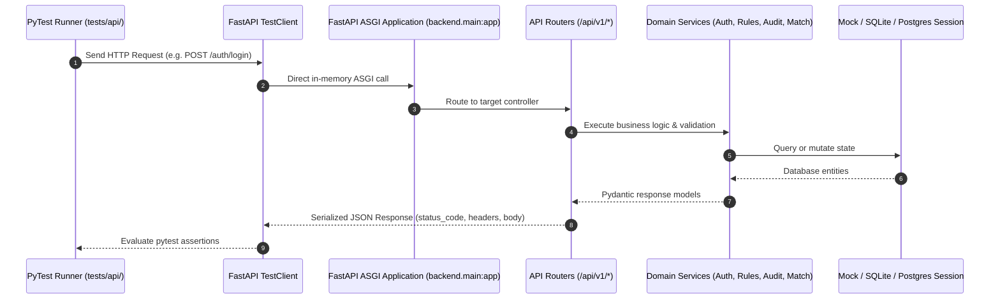

# REST API Controller Test Suite (`tests/api/`)

**Total Test Count:** 22 Automated Tests  
**Test Client:** FastAPI `TestClient` (HTTPX in-memory ASGI transport)  
**Target Gateway:** FastAPI REST API (`backend/main.py`, `/api/v1/*`)  

This directory contains automated integration tests for all REST API endpoints of **Samanvay-AI**, verifying authentication, multi-tenant authorization, inventory management, semantic search, requisition concurrency, graph discovery, and cryptographic audit sealing.

---

## 1. API Test Architecture

Tests execute against an in-memory ASGI application instance using FastAPI's `TestClient`. No external HTTP network ports need to be opened:



---

## 2. File-by-File Breakdown & Test Specifications

### 1. [test_auth_api.py](file:///C:/Users/mayan/Development/Hackathons/Samanvay-AI/tests/api/test_auth_api.py) — Authentication & RBAC (7 Tests)
- **`test_get_seed_users()`:** Verifies `GET /api/v1/auth/seed-users` returns all seed personas across CPSEs with default password `Samanvay@2026`.
- **`test_login_successful_oil_engineer()`:** Verifies `POST /api/v1/auth/login` successfully authenticates `engineer_oil`, issuing a signed JWT Bearer token containing user claims (`sub`, `role`, `cpse`, `depot_id`).
- **`test_login_invalid_password()`:** Asserts HTTP 401 Unauthorized when an incorrect password is supplied.
- **`test_login_nonexistent_user()`:** Asserts HTTP 401 Unauthorized for unknown usernames.
- **`test_get_current_user_me()`:** Asserts `GET /api/v1/auth/me` with `Authorization: Bearer <token>` resolves current session claims.
- **`test_get_me_unauthorized()`:** Asserts HTTP 401 Unauthorized when invoking `/auth/me` without a Bearer token.
- **`test_seed_endpoint_idempotency()`:** Verifies that repeated seeding calls do not create duplicate accounts or corrupt existing records.

---

### 2. [test_signup_api.py](file:///C:/Users/mayan/Development/Hackathons/Samanvay-AI/tests/api/test_signup_api.py) — Registration & Account Provisioning (4 Tests)
- **`test_signup_successful_new_engineer()`:** Submits `POST /api/v1/auth/signup` for a new engineer persona; asserts HTTP 201 Created, immediate JWT Bearer token issuance, and verified session via `/auth/me`.
- **`test_signup_duplicate_username()`:** Asserts HTTP 409 Conflict when attempting to register an existing username (e.g. `engineer_oil`).
- **`test_signup_duplicate_email()`:** Asserts HTTP 409 Conflict when attempting to register an already registered official email address.
- **`test_signup_invalid_role()`:** Asserts HTTP 422 Unprocessable Entity when an unapproved role string is supplied.

---

### 3. [test_inventory_api.py](file:///C:/Users/mayan/Development/Hackathons/Samanvay-AI/tests/api/test_inventory_api.py) — Stock Ledger & Privacy Filtering (3 Tests)
- **`test_inventory_crud_operations()`:** Validates catalog item insertion, retrieval, and status mutation (`SURPLUS_DECLARED`, `TO_BE_CONSUMED`).
- **`test_privacy_filtering()`:** Proves that when CPSE A queries inventory owned by CPSE B, sensitive commercial fields (`unit_cost_inr`, `po_no`) are stripped from the payload.
- **`test_inventory_stats_structure()`:** Validates `GET /api/v1/inventory/stats` schema, checking total SKU counts, declared surplus metrics, and unlocked capital calculations.

---

### 4. [test_match_api.py](file:///C:/Users/mayan/Development/Hackathons/Samanvay-AI/tests/api/test_match_api.py) — Semantic Matching & Safety Ranking (2 Tests)
- **`test_normalizer_and_matching_pipeline()`:** Sends raw, unstandardized queries (e.g. `"VLV GT 4IN 300# WCB"`) to `POST /api/v1/match/search`; verifies dialect normalization, slot extraction, candidate ranking, and Dynamic Compatibility Tier calculation.
- **`test_compatibility_ranker_scoring()`:** Validates subvector score weighting across physical dimensions, metallurgy, pressure class, and standard specifications.

---

### 5. [test_requisition_api.py](file:///C:/Users/mayan/Development/Hackathons/Samanvay-AI/tests/api/test_requisition_api.py) — Order Concurrency & Idempotency (2 Tests)
- **`test_idempotency_key_behavior()`:** Transmits duplicate requisition requests containing the exact same `Idempotency-Key` header; verifies the second request returns the cached 200/201 response without reserving duplicate inventory stock.
- **`test_concurrent_lock_safety()`:** Simulates racing requests attempting to claim the same stock lines; asserts that pessimistic row locking (`with_for_update`) prevents over-allocation.

---

### 6. [test_graph_api.py](file:///C:/Users/mayan/Development/Hackathons/Samanvay-AI/tests/api/test_graph_api.py) — Knowledge Graph & Logistics (2 Tests)
- **`test_logistics_calculation_accuracy()`:** Tests `GET /api/v1/graph/discover`, validating road transit distance, estimated travel hours, and freight $CO_2$ savings calculations.
- **`test_attribute_level_privacy_stripping()`:** Confirms that graph surplus discovery hides proprietary purchase terms from sister CPSE viewers.

---

### 7. [test_audit_api.py](file:///C:/Users/mayan/Development/Hackathons/Samanvay-AI/tests/api/test_audit_api.py) — Cryptographic Audit Trail (2 Tests)
- **`test_audit_hash_chain_verification()`:** Calls `GET /api/v1/audit/verify` (or `POST /api/v1/audit/verify`), asserting that an un-tampered SHA-256 Merkle chain returns `is_valid=True` and `is_tamper_free=True`.
- **`test_rfc_4180_csv_generation()`:** Calls `GET /api/v1/audit/export-csv`, validating RFC 4180 CSV compliance, proper MIME headers (`text/csv`), and statutory audit column alignment.

---

## 3. Running API Tests

Execute all 22 REST API tests with verbose output:

```bash
# Run all API tests
pytest tests/api/ -v

# Run authentication and signup tests only
pytest tests/api/test_auth_api.py tests/api/test_signup_api.py -v

# Run match and requisition concurrency tests only
pytest tests/api/test_match_api.py tests/api/test_requisition_api.py -v
```
