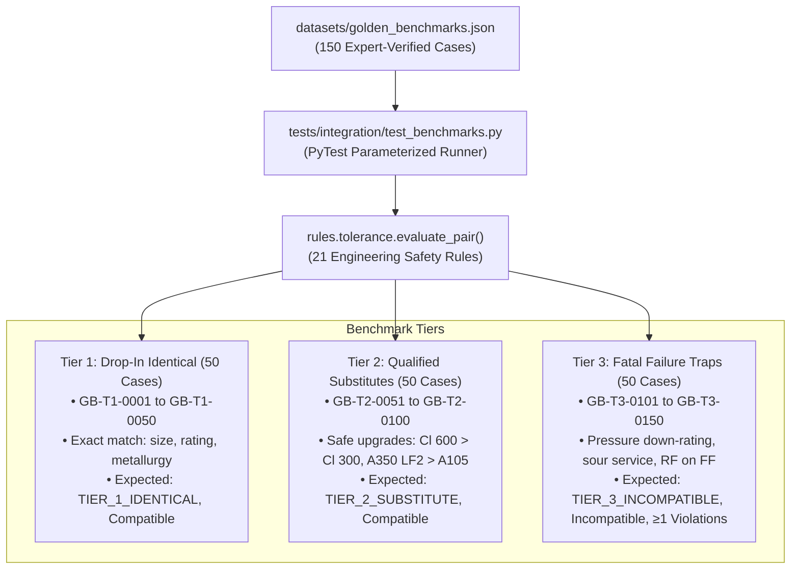

# Golden Benchmark Integration Test Suite (`tests/integration/`)

**Total Test Count:** 150 Automated Benchmark Tests  
**Dataset:** `datasets/golden_benchmarks.json`  
**Core Engine:** `rules.tolerance.evaluate_pair`  
**Target Milestone:** 100% Deterministic Safety & Zero False Tolerances  

This directory houses the comprehensive integration test suite that evaluates the deterministic 21-rule engineering safety engine against **150 verified public sector Golden Benchmarks**.

---

## 1. Golden Benchmark Architecture

The 150 Golden Benchmarks are curated from operational refinery and pipeline scenarios across IOCL, ONGC, and OIL, structured into three equal tiers of 50 test cases each:



---

## 2. Benchmark Case Tier Breakdown

### A. Tier 1: Drop-In Identical Matches (Cases 1–50)
- **ID Range:** `GB-T1-0001` through `GB-T1-0050`
- **Criteria:** Exact match across all primary and secondary engineering dimensions (Nominal Bore mm, ANSI Pressure Class, ASTM Metallurgy Grade, Flange Facing Type, and Manufacturing Standard).
- **Assertions:**
  1. `compatibility_tier == "TIER_1_IDENTICAL"`
  2. `is_compatible == True`
  3. `len(rule_violations) == 0`

### B. Tier 2: Qualified Safe Substitutes (Cases 51–100)
- **ID Range:** `GB-T2-0051` through `GB-T2-0100`
- **Criteria:** Safe engineering upgrades adhering to ASME B16.5 and API 6D over-specification principles:
  - **Pressure Upgrade:** Supplying ANSI Class 600 when Class 300 is demanded (safe higher wall thickness and bolt rating).
  - **Low-Temperature Metallurgy:** Supplying ASTM A350 LF2 normalized forged carbon steel (impact tested at $-46^\circ\text{C}$) in place of standard ambient ASTM A105.
  - **Higher Schedule Pipe:** Supplying Schedule 80 or Schedule 160 when Schedule 40 was specified (provided fluid velocity drop is acceptable).
  - **Stainless Upgrade:** Supplying Grade 316L in place of Grade 304 in non-critical utility lines.
- **Assertions:**
  1. `compatibility_tier == "TIER_2_SUBSTITUTE"`
  2. `is_compatible == True`
  3. `len(rule_violations) == 0`

### C. Tier 3: Incompatible Fatal Failure Traps (Cases 101–150)
- **ID Range:** `GB-T3-0101` through `GB-T3-0150`
- **Criteria:** Catastrophic failure scenarios designed to catch subtle errors that naive semantic search engines fail to detect:
  - **Pressure Down-Rating:** Supplying Class 150 for a Class 300 line (burst hazard).
  - **Sour Service Non-Compliance:** Supplying standard carbon steel without NACE MR0175 / ISO 15156 hardness limits ($<22\text{ HRC}$) in wet sour gas environments (Sulfide Stress Cracking catastrophe).
  - **Flange Facing Mismatch:** Mating Raised Face (RF) flanges to brittle Flat Face (FF) cast iron pump casings (bending moment flange cracking).
  - **Piggable Line Obstruction:** Supplying reduced bore ball valves on piggable cross-country transmission pipelines (jamming intelligent pipeline inspection gauges).
  - **Galvanic & Liquid Metal Traps:** Zinc/cadmium plated fasteners on austenitic stainless lines operating above $400^\circ\text{C}$ (liquid metal embrittlement).
- **Assertions:**
  1. `compatibility_tier == "TIER_3_INCOMPATIBLE"`
  2. `is_compatible == False`
  3. `len(rule_violations) > 0` (Must catch and identify the exact prevented failure mode).

---

## 3. Test Runner Implementation

In [test_benchmarks.py](file:///C:/Users/mayan/Development/Hackathons/Samanvay-AI/tests/integration/test_benchmarks.py):

```python
@pytest.mark.parametrize("case", benchmarks, ids=lambda c: f"{c['test_id']}-{c['expected_tier']}")
def test_golden_benchmark_case(case):
    result = evaluate_pair(case["query_part"], case["candidate_part"])

    # 1. Compatibility Tier
    assert result.compatibility_tier.name == case["expected_tier"]

    # 2. Boolean Compatibility Flag
    assert result.is_compatible == case["expected_is_compatible"]

    # 3. For Tier 3 Incompatible, must catch at least one deterministic rule violation
    if case["expected_tier"] == "TIER_3_INCOMPATIBLE":
        assert len(result.rule_violations) > 0
```

---

## 4. Running the Golden Benchmark Suite

Execute the 150 benchmark test cases:

```bash
# Run all 150 integration benchmarks
pytest tests/integration/test_benchmarks.py -v

# Run only Tier 3 failure trap tests
pytest tests/integration/test_benchmarks.py -k "GB-T3" -v

# Run only Tier 1 exact match tests
pytest tests/integration/test_benchmarks.py -k "GB-T1" -v
```
