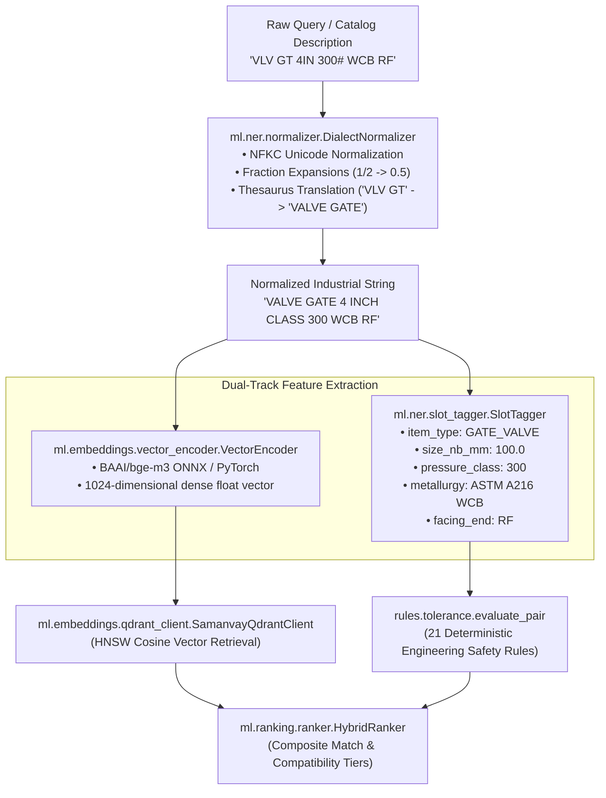

# Machine Learning & NLP Test Suite (`tests/ml/`)

**Target Subsystems:** Dialect Normalization, Named Entity Recognition (NER), Slot Tagging, Dense Vector Embeddings  
**Models:** `BAAI/bge-m3` (1024-dim dense embeddings), DeBERTa-v3 Slot Tagger, Rule-Based Industrial Normalizer  
**Role:** Sovereign Natural Language Ingestion for Unstandardized Oilfield Dialects  

This directory contains test suites that validate the machine learning and natural language processing components of **Samanvay-AI**, ensuring accurate parsing and embedding of non-standardized industrial spare parts descriptions.

---

## 1. Machine Learning Ingestion Pipeline

Petroleum public sector enterprises (OIL, IOCL, ONGC, GAIL) have accumulated catalog lines across four decades using disparate abbreviations, legacy SAP material codes, and mixed imperial/metric notations. The ML pipeline normalizes and structures these raw strings into physical engineering entities:



---

## 2. Test Breakdown & Coverage

### [test_ner.py](file:///C:/Users/mayan/Development/Hackathons/Samanvay-AI/tests/ml/test_ner.py)

1. **`test_dialect_normalization()`:**
   - **Target:** [DialectNormalizer](file:///C:/Users/mayan/Development/Hackathons/Samanvay-AI/ml/ner/normalizer.py)
   - **Operation:** Verifies the regex and dictionary expansion of legacy oilfield abbreviations:
     - `"S.S."` $\rightarrow$ `"STAINLESS STEEL"`
     - `"C.S."` $\rightarrow$ `"CARBON STEEL"`
     - `"VLV"` $\rightarrow$ `"VALVE"`
     - `"300#"` $\rightarrow$ `"CLASS 300"`
     - `"NB"` / `'"'` $\rightarrow$ standard millimeter and inch equivalents.
   - **Assertion:** Proves unstandardized shorthand is expanded into unambiguous technical terminology.

2. **`test_slot_extraction()`:**
   - **Target:** [SlotTagger](file:///C:/Users/mayan/Development/Hackathons/Samanvay-AI/ml/ner/slot_tagger.py)
   - **Operation:** Evaluates slot extraction from raw component descriptions (e.g. `"100mm Flange 300#"`).
   - **Assertions:**
     - `extracted_slots["size"] == "100mm"`
     - `extracted_slots["item_type"] == "Flange"`
     - `extracted_slots["rating"] == "300#"`

---

## 3. Related Machine Learning Components

While `test_ner.py` focuses on fast unit verification of NLP tokenization, the underlying `ml/` sub-packages provide end-to-end functionality:

| Sub-Package | Core Class / Module | Role in Samanvay-AI |
|---|---|---|
| [ml/ner/](file:///C:/Users/mayan/Development/Hackathons/Samanvay-AI/ml/ner/) | `DialectNormalizer`, `SlotTagger` | Cleans unstandardized CPSE dialect text and extracts physical engineering slots. |
| [ml/embeddings/](file:///C:/Users/mayan/Development/Hackathons/Samanvay-AI/ml/embeddings/) | `VectorEncoder`, `SamanvayQdrantClient` | Generates 1024-dim dense vectors using `BAAI/bge-m3` and interfaces with Qdrant vector database. |
| [ml/ranking/](file:///C:/Users/mayan/Development/Hackathons/Samanvay-AI/ml/ranking/) | `HybridRanker`, `FeatureExtractor` | Blends vector cosine similarity, slot-level overlap, and 21-rule engineering safety tier outputs into a unified score. |
| [ml/vision/](file:///C:/Users/mayan/Development/Hackathons/Samanvay-AI/ml/vision/) | `DocumentClassifier`, `MTCExtractor`, `ChemistryEngine` | Dual-path PDF text extraction (PyMuPDF vector + PaddleOCR raster) and EN 10204 Type 3.1 MTC chemistry parsing. |
| [ml/active_learning/](file:///C:/Users/mayan/Development/Hackathons/Samanvay-AI/ml/active_learning/) | `ActiveLearningBootstrapper`, `HITLCache` | Captures Human-In-The-Loop feedback from Chief Metallurgists to continuously tune dialect embeddings. |

---

## 4. Running ML Tests

```bash
# Run ML tests
pytest tests/ml/ -v

# Run with stdout printing for inspection
pytest tests/ml/ -v -s
```
