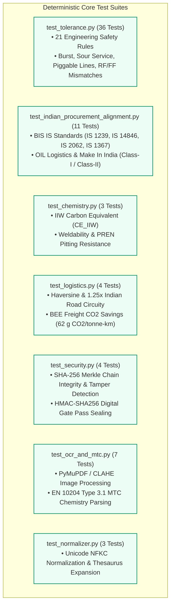

# Deterministic Unit Test Suite (`tests/unit/`)

**Total Test Count:** 68 Automated Unit Tests  
**Execution Speed:** ~0.85 Seconds (Fast, In-Memory, Deterministic)  
**Target Milestone:** 100% Mathematical Precision, Mechanical Safety Compliance & Cryptographic Non-Repudiation  

This directory contains focused unit tests that validate deterministic mathematical equations, metallurgical chemistry formulas, 21 engineering safety rules, Indian public procurement rules, and cryptographic security primitives of **Samanvay-AI**.

---

## 1. Unit Testing Architecture & Domains



---

## 2. File-by-File Technical Breakdown

### 1. [test_tolerance.py](file:///C:/Users/mayan/Development/Hackathons/Samanvay-AI/tests/unit/test_tolerance.py) — 21 Engineering Safety Rules (36 Tests)
- **Engine Under Test:** [rules/tolerance.py](file:///C:/Users/mayan/Development/Hackathons/Samanvay-AI/rules/tolerance.py) (`evaluate_pair()`)
- **Key Safety Enforcements:**
  1. **Pressure Down-Rating:** Flags immediate `TIER_3_INCOMPATIBLE` if candidate pressure class is lower than demanded (prevents pipe rupture).
  2. **Cryogenic Service:** Blocks carbon steel lacking Charpy V-notch impact testing at $-46^\circ\text{C}$ (prevents brittle fracture).
  3. **Liquid Metal Embrittlement:** Disallows cadmium/zinc fasteners on stainless lines operating above $400^\circ\text{C}$.
  4. **Safe Over-Specification:** Permits ANSI Class 600 substituting Class 300, and ASTM A350 LF2 substituting A105 (`TIER_2_SUBSTITUTE`).
  5. **Flange Facing Mismatches:** Prohibits Raised Face (RF) flanges from mating with Flat Face (FF) cast iron casings.
  6. **Sour Gas ($H_2S$) Service:** Mandates NACE MR0175 / ISO 15156 compliance with hardness $<22\text{ HRC}$.
  7. **Piggable Line Safety:** Forbids reduced bore valves on piggable trunk pipelines to prevent trapping pipeline inspection gauges.
  8. **Rotating Equipment Rules:** Evaluates pump flow rate, API 682 seal flush plans, motor voltage/frequency (415V 50Hz vs 480V 60Hz), and bearing types.

---

### 2. [test_chemistry.py](file:///C:/Users/mayan/Development/Hackathons/Samanvay-AI/tests/unit/test_chemistry.py) — Metallurgical Chemistry Formulas (3 Tests)
- **Formulas Verified:**
  - **International Institute of Welding (IIW) Carbon Equivalent:**
    $$CE_{\text{IIW}} = \%C + \frac{\%Mn}{6} + \frac{\%Cr + \%Mo + \%V}{5} + \frac{\%Ni + \%Cu}{15}$$
  - **Weldability Classification Matrix:**
    - $CE_{\text{IIW}} \le 0.40 \implies \text{GOOD (No preheating required)}$
    - $0.41 \le CE_{\text{IIW}} \le 0.45 \implies \text{FAIR (Preheat to } 100^\circ\text{C}-150^\circ\text{C})$
    - $CE_{\text{IIW}} > 0.45 \implies \text{POOR (Mandatory strict preheat and PWHT)}$
  - **Pitting Resistance Equivalent Number (PREN):**
    $$\text{PREN} = \%Cr + 3.3\%Mo + 16\%N$$
    Validates PREN $\ge 40$ for Super Duplex 2507 in marine and offshore service.

---

### 3. [test_indian_procurement_alignment.py](file:///C:/Users/mayan/Development/Hackathons/Samanvay-AI/tests/unit/test_indian_procurement_alignment.py) — Indian Standards & Public Procurement (11 Tests)
- **Bureau of Indian Standards (BIS):**
  - `IS 1239 (Part 1)`: Heavy mild steel piping extraction.
  - `IS 14846`: Sluice/gate valves rating and nominal bore mapping.
  - `IS 2062 Grade E250`: Structural steel flange parsing.
  - `IS 1367 (Part 3) Class 8.8`: High-tensile carbon steel stud bolts.
  - `PN / Bar` to ANSI Class equivalence.
- **OIL Logistics Network:**
  - Verifies exact depot coordinates across Assam (Duliajan, Moran, Digboi) and pan-India connectivity to Numaligarh, Panipat, Uran, and Visakh.
- **Make In India (MII) Compliance:**
  - Class-I Local Supplier ($\ge 50\%$ local content): Full preference granted.
  - Class-II Local Supplier ($20\%-50\%$): Audit warning emitted for high-value tenders.
  - Non-Local Supplier ($<20\%$): Purchase preference denied.

---

### 4. [test_logistics.py](file:///C:/Users/mayan/Development/Hackathons/Samanvay-AI/tests/unit/test_logistics.py) — Transit Distance & Emissions (4 Tests)
- **Formulas Verified:**
  - **Haversine Great-Circle Distance:** Spherical trigonometric arc calculation.
  - **Indian Road Circuity Factor:** Applies $1.25\times$ highway circuity multiplier to great-circle distance.
  - **Transit Duration:** Calculates truck travel time based on $45\text{ km/h}$ average freight velocity.
  - **BEE Carbon Footprint Savings:**
    $$\text{Emission} = \text{Tonnage} \times \text{Distance (km)} \times 0.062\text{ kg } CO_2 / \text{tonne-km}$$

---

### 5. [test_security.py](file:///C:/Users/mayan/Development/Hackathons/Samanvay-AI/tests/unit/test_security.py) — Cryptographic Non-Repudiation (4 Tests)
- **Verifications:**
  - **SHA-256 Merkle Chain Integrity:** Verifies each block hash incorporates the preceding row's digest:
    $$H_i = \text{SHA-256}(H_{i-1} \parallel \text{Timestamp} \parallel \text{Payload})$$
  - **Tamper Detection:** Modifies historical audit row data and asserts that `verify_audit_chain()` immediately flags the index as invalid.
  - **CISF Digital Gate Pass Seal:** Verifies HMAC-SHA256 generation using sovereign secret keys to generate offline-verifiable gate passes.

---

### 6. [test_ocr_and_mtc.py](file:///C:/Users/mayan/Development/Hackathons/Samanvay-AI/tests/unit/test_ocr_and_mtc.py) — Document Vision & MTC Parsing (7 Tests)
- **Verifications:**
  - Fast-path vector PDF parsing with PyMuPDF.
  - Raster preprocessing: CLAHE contrast enhancement and Otsu binarization.
  - EN 10204 Type 3.1 inspection certificate table extraction for heat chemical composition ($\%C, \%Mn, \%Si, \%P, \%S, \%Cr, \%Ni, \%Mo$).
  - Graceful degradation and fallback confidence scoring on sparse or degraded document scans.

---

### 7. [test_normalizer.py](file:///C:/Users/mayan/Development/Hackathons/Samanvay-AI/tests/unit/test_normalizer.py) — Unicode & Dialect Normalization (3 Tests)
- **Verifications:**
  - Unicode NFKC normalization and fractional ligature replacement.
  - Standardized expansion of oilfield colloquialisms and abbreviations.
  - Extraction of structured engineering dictionary objects from normalized text.

---

## 3. Running Unit Tests

Execute the 68 unit tests:

```bash
# Run all 68 unit tests (runtime: < 1 second)
pytest tests/unit/ -v

# Run 21 engineering safety tolerance rules
pytest tests/unit/test_tolerance.py -v

# Run Indian procurement and BIS standards tests
pytest tests/unit/test_indian_procurement_alignment.py -v

# Run metallurgical chemistry tests
pytest tests/unit/test_chemistry.py -v
```
